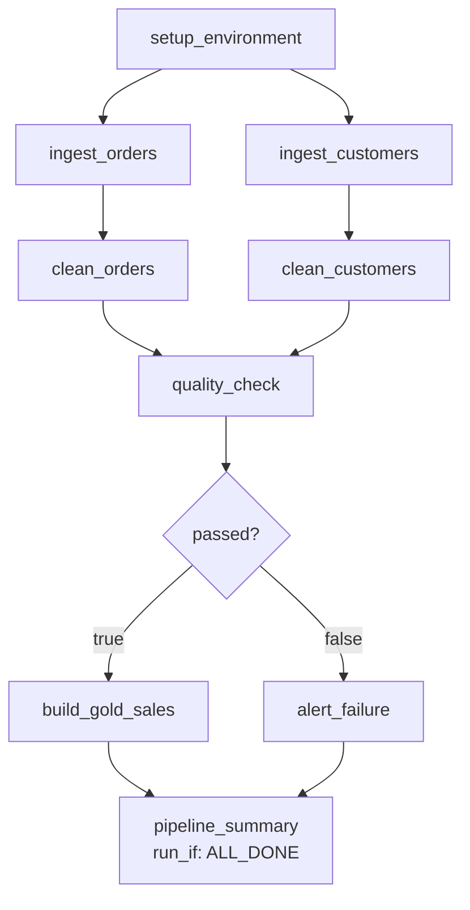
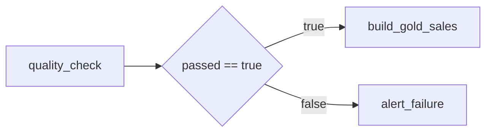

# Hands-On Project: Build a Production Workflow

Build a complete daily retail pipeline that ingests orders, cleans them,
validates quality, publishes gold aggregates, and alerts on failure.

```text
Time needed: 60 to 90 minutes
Prerequisites: a workspace, a catalog you can write to, any compute
```

---

## Target Architecture



---

## Step 0: Create the Catalog and Schemas

```sql
CREATE CATALOG IF NOT EXISTS retail_demo;
USE CATALOG retail_demo;

CREATE SCHEMA IF NOT EXISTS bronze;
CREATE SCHEMA IF NOT EXISTS silver;
CREATE SCHEMA IF NOT EXISTS gold;
CREATE SCHEMA IF NOT EXISTS control;
CREATE SCHEMA IF NOT EXISTS quarantine;
```

---

## Step 1: Notebook `00_setup_environment`

Creates the control table and generates sample data so the project is
self-contained.

```python
dbutils.widgets.text("run_date", "2026-09-18")
dbutils.widgets.text("catalog", "retail_demo")

run_date = dbutils.widgets.get("run_date")
catalog  = dbutils.widgets.get("catalog")

spark.sql(f"USE CATALOG {catalog}")

spark.sql("""
CREATE TABLE IF NOT EXISTS control.load_state (
    table_name  STRING,
    last_run    DATE,
    row_count   BIGINT,
    updated_at  TIMESTAMP
) USING DELTA
""")

# --- generate sample source data for the given run_date ---
from pyspark.sql import functions as F

orders = (spark.range(1, 1001)
    .withColumn("order_id",    F.col("id"))
    .withColumn("customer_id", (F.rand(seed=1) * 100).cast("int") + 1)
    .withColumn("amount",      F.round(F.rand(seed=2) * 500, 2))
    .withColumn("order_date",  F.lit(run_date).cast("date"))
    .withColumn("status",      F.when(F.rand(seed=3) > 0.1, "COMPLETED").otherwise("CANCELLED"))
    .drop("id"))

# deliberately inject a few bad rows so the quality gate has something to catch
bad = (spark.range(1, 6)
    .withColumn("order_id",    F.lit(None).cast("long"))
    .withColumn("customer_id", F.lit(1))
    .withColumn("amount",      F.lit(-10.0))
    .withColumn("order_date",  F.lit(run_date).cast("date"))
    .withColumn("status",      F.lit("COMPLETED"))
    .drop("id"))

orders.unionByName(bad).write.mode("overwrite").saveAsTable("bronze.orders_raw")

customers = (spark.range(1, 101)
    .withColumn("customer_id", F.col("id"))
    .withColumn("name",        F.concat(F.lit("Customer_"), F.col("id")))
    .withColumn("segment",     F.when(F.col("id") % 3 == 0, "PREMIUM").otherwise("STANDARD"))
    .withColumn("country",     F.when(F.col("id") % 2 == 0, "IN").otherwise("US"))
    .drop("id"))

customers.write.mode("overwrite").saveAsTable("bronze.customers_raw")

dbutils.jobs.taskValues.set(key="setup_complete", value=True)
print(f"Setup complete for {run_date}")
```

---

## Step 2: Notebook `01_ingest_orders`

```python
dbutils.widgets.text("run_date", "2026-09-18")
dbutils.widgets.text("catalog", "retail_demo")

run_date = dbutils.widgets.get("run_date")
spark.sql(f"USE CATALOG {dbutils.widgets.get('catalog')}")

from pyspark.sql import functions as F

df = (spark.table("bronze.orders_raw")
        .filter(F.col("order_date") == run_date)
        .withColumn("ingested_at", F.current_timestamp())
        .withColumn("source_file", F.lit("orders_raw"))
        .withColumn("batch_id",    F.lit(run_date)))

# Idempotent write: replace only this date partition
(df.write
   .format("delta")
   .mode("overwrite")
   .option("replaceWhere", f"order_date = '{run_date}'")
   .option("mergeSchema", "true")
   .saveAsTable("bronze.orders"))

count = df.count()
dbutils.jobs.taskValues.set(key="bronze_order_count", value=count)
print(f"Ingested {count} orders for {run_date}")
```

Note the `replaceWhere`: re-running this task twice gives the same result, so
retries are safe.

---

## Step 3: Notebook `02_ingest_customers`

```python
dbutils.widgets.text("catalog", "retail_demo")
spark.sql(f"USE CATALOG {dbutils.widgets.get('catalog')}")

from pyspark.sql import functions as F

df = (spark.table("bronze.customers_raw")
        .withColumn("ingested_at", F.current_timestamp()))

df.write.format("delta").mode("overwrite").saveAsTable("bronze.customers")

dbutils.jobs.taskValues.set(key="bronze_customer_count", value=df.count())
```

This task has no dependency on orders, so it runs **in parallel** with step 2.

---

## Step 4: Notebook `03_clean_orders`

```python
dbutils.widgets.text("run_date", "2026-09-18")
dbutils.widgets.text("catalog", "retail_demo")

run_date = dbutils.widgets.get("run_date")
spark.sql(f"USE CATALOG {dbutils.widgets.get('catalog')}")

from pyspark.sql import functions as F

raw = spark.table("bronze.orders").filter(F.col("order_date") == run_date)

valid   = raw.filter("order_id IS NOT NULL AND amount >= 0")
invalid = raw.filter("order_id IS NULL OR amount < 0")

# quarantine the bad rows instead of failing the whole pipeline
if invalid.count() > 0:
    (invalid
       .withColumn("quarantined_at", F.current_timestamp())
       .withColumn("reason", F.lit("null_order_id_or_negative_amount"))
       .write.format("delta").mode("append").saveAsTable("quarantine.orders"))

clean = (valid
    .dropDuplicates(["order_id"])
    .withColumn("amount",     F.round("amount", 2))
    .withColumn("status",     F.upper("status"))
    .withColumn("cleaned_at", F.current_timestamp()))

spark.sql("""
CREATE TABLE IF NOT EXISTS silver.orders (
    order_id     BIGINT,
    customer_id  INT,
    amount       DOUBLE,
    order_date   DATE,
    status       STRING,
    ingested_at  TIMESTAMP,
    source_file  STRING,
    batch_id     STRING,
    cleaned_at   TIMESTAMP
) USING DELTA
""")

clean.createOrReplaceTempView("clean_orders")

# Idempotent upsert
spark.sql("""
MERGE INTO silver.orders t
USING clean_orders s
ON t.order_id = s.order_id
WHEN MATCHED THEN UPDATE SET *
WHEN NOT MATCHED THEN INSERT *
""")

dbutils.jobs.taskValues.set(key="silver_order_count", value=clean.count())
dbutils.jobs.taskValues.set(key="quarantined_count", value=invalid.count())
print(f"Silver: {clean.count()} clean, {invalid.count()} quarantined")
```

---

## Step 5: Notebook `04_clean_customers`

```python
dbutils.widgets.text("catalog", "retail_demo")
spark.sql(f"USE CATALOG {dbutils.widgets.get('catalog')}")

from pyspark.sql import functions as F

clean = (spark.table("bronze.customers")
    .filter("customer_id IS NOT NULL")
    .dropDuplicates(["customer_id"])
    .withColumn("country", F.upper("country")))

clean.write.format("delta").mode("overwrite").saveAsTable("silver.customers")
dbutils.jobs.taskValues.set(key="silver_customer_count", value=clean.count())
```

---

## Step 6: Notebook `05_quality_check`

The gate that decides whether gold gets published.

```python
dbutils.widgets.text("run_date", "2026-09-18")
dbutils.widgets.text("catalog", "retail_demo")

run_date = dbutils.widgets.get("run_date")
spark.sql(f"USE CATALOG {dbutils.widgets.get('catalog')}")

orders    = spark.table("silver.orders").filter(f"order_date = '{run_date}'")
customers = spark.table("silver.customers")

orphans = (orders.join(customers, "customer_id", "left_anti")).count()

checks = {
    "orders_present":     orders.count() > 0,
    "no_null_order_ids":  orders.filter("order_id IS NULL").count() == 0,
    "no_negative_amount": orders.filter("amount < 0").count() == 0,
    "no_orphan_orders":   orphans == 0,
    "customers_present":  customers.count() > 0,
}

failed = [name for name, ok in checks.items() if not ok]
passed = len(failed) == 0

for name, ok in checks.items():
    print(f"{'PASS' if ok else 'FAIL'}  {name}")

dbutils.jobs.taskValues.set(key="passed", value=passed)
dbutils.jobs.taskValues.set(key="failed_checks", value=failed)

if not passed:
    print(f"Quality gate failed: {failed}")
```

Notice this task does **not** raise. It records a verdict and lets the
If/else task decide the route.

---

## Step 7: If/Else Condition Task

```text
Task type: If/else condition
Left:      {{tasks.quality_check.values.passed}}
Operator:  ==
Right:     true
```



---

## Step 8: Notebook `06_build_gold_sales`

```python
dbutils.widgets.text("run_date", "2026-09-18")
dbutils.widgets.text("catalog", "retail_demo")

run_date = dbutils.widgets.get("run_date")
spark.sql(f"USE CATALOG {dbutils.widgets.get('catalog')}")

spark.sql(f"""
CREATE OR REPLACE TABLE gold.daily_sales_summary AS
SELECT
    o.order_date,
    c.country,
    c.segment,
    count(*)                                        AS order_count,
    count(DISTINCT o.customer_id)                   AS customer_count,
    round(sum(o.amount), 2)                         AS total_revenue,
    round(avg(o.amount), 2)                         AS avg_order_value,
    sum(CASE WHEN o.status = 'CANCELLED' THEN 1 ELSE 0 END) AS cancelled_orders
FROM silver.orders o
JOIN silver.customers c ON o.customer_id = c.customer_id
WHERE o.order_date = '{run_date}'
GROUP BY o.order_date, c.country, c.segment
""")

result = spark.table("gold.daily_sales_summary")
result.show()
dbutils.jobs.taskValues.set(key="gold_row_count", value=result.count())
```

---

## Step 9: Notebook `07_alert_failure`

```python
dbutils.widgets.text("run_date", "2026-09-18")

failed = dbutils.jobs.taskValues.get(
    taskKey="quality_check", key="failed_checks", default=[], debugValue=[]
)

message = (
    f"QUALITY GATE FAILED for {dbutils.widgets.get('run_date')}\n"
    f"Failed checks: {', '.join(failed)}\n"
    f"Gold was NOT refreshed. Previous version retained."
)
print(message)

# In a real setup, post to Slack via a webhook secret:
# import requests
# requests.post(dbutils.secrets.get("alerts", "slack_webhook"), json={"text": message})

raise Exception(message)   # mark the task failed so the job status reflects reality
```

---

## Step 10: Notebook `08_pipeline_summary`

Runs with `run_if: ALL_DONE`, so it reports on both good and bad runs.

```python
dbutils.widgets.text("run_date", "2026-09-18")
dbutils.widgets.text("catalog", "retail_demo")
spark.sql(f"USE CATALOG {dbutils.widgets.get('catalog')}")

def tv(task, key, default=0):
    return dbutils.jobs.taskValues.get(taskKey=task, key=key, default=default, debugValue=default)

summary = {
    "run_date":     dbutils.widgets.get("run_date"),
    "bronze_orders": tv("ingest_orders", "bronze_order_count"),
    "silver_orders": tv("clean_orders", "silver_order_count"),
    "quarantined":   tv("clean_orders", "quarantined_count"),
    "quality_passed": tv("quality_check", "passed", False),
    "gold_rows":     tv("build_gold_sales", "gold_row_count"),
}

print(summary)

from pyspark.sql import functions as F
(spark.createDataFrame([summary])
   .withColumn("logged_at", F.current_timestamp())
   .write.format("delta").mode("append")
   .option("mergeSchema", "true")
   .saveAsTable("control.pipeline_runs"))
```

---

## Step 11: The Job Definition

```yaml
# databricks.yml
bundle:
  name: retail_demo_pipeline

resources:
  jobs:
    retail_daily_pipeline:
      name: retail_daily_pipeline
      max_concurrent_runs: 1

      parameters:
        - name: run_date
          default: "{{job.start_time.[iso_date]}}"
        - name: catalog
          default: "retail_demo"

      schedule:
        quartz_cron_expression: "0 0 6 * * ?"
        timezone_id: "UTC"
        pause_status: PAUSED

      email_notifications:
        on_failure:
          - data-team@company.com
        no_alert_for_skipped_runs: true

      health:
        rules:
          - metric: RUN_DURATION_SECONDS
            op: GREATER_THAN
            value: 1800

      job_clusters:
        - job_cluster_key: main
          new_cluster:
            spark_version: "14.3.x-scala2.12"
            node_type_id: "Standard_DS3_v2"
            num_workers: 2
            data_security_mode: SINGLE_USER

      tasks:
        - task_key: setup_environment
          job_cluster_key: main
          notebook_task:
            notebook_path: ./notebooks/00_setup_environment

        - task_key: ingest_orders
          depends_on: [{ task_key: setup_environment }]
          job_cluster_key: main
          max_retries: 2
          min_retry_interval_millis: 60000
          timeout_seconds: 900
          notebook_task:
            notebook_path: ./notebooks/01_ingest_orders

        - task_key: ingest_customers
          depends_on: [{ task_key: setup_environment }]
          job_cluster_key: main
          max_retries: 2
          notebook_task:
            notebook_path: ./notebooks/02_ingest_customers

        - task_key: clean_orders
          depends_on: [{ task_key: ingest_orders }]
          job_cluster_key: main
          notebook_task:
            notebook_path: ./notebooks/03_clean_orders

        - task_key: clean_customers
          depends_on: [{ task_key: ingest_customers }]
          job_cluster_key: main
          notebook_task:
            notebook_path: ./notebooks/04_clean_customers

        - task_key: quality_check
          depends_on:
            - { task_key: clean_orders }
            - { task_key: clean_customers }
          job_cluster_key: main
          notebook_task:
            notebook_path: ./notebooks/05_quality_check

        - task_key: quality_gate
          depends_on: [{ task_key: quality_check }]
          condition_task:
            op: EQUAL_TO
            left: "{{tasks.quality_check.values.passed}}"
            right: "true"

        - task_key: build_gold_sales
          depends_on: [{ task_key: quality_gate, outcome: "true" }]
          job_cluster_key: main
          notebook_task:
            notebook_path: ./notebooks/06_build_gold_sales

        - task_key: alert_failure
          depends_on: [{ task_key: quality_gate, outcome: "false" }]
          job_cluster_key: main
          notebook_task:
            notebook_path: ./notebooks/07_alert_failure

        - task_key: pipeline_summary
          depends_on:
            - { task_key: build_gold_sales }
            - { task_key: alert_failure }
          run_if: ALL_DONE
          job_cluster_key: main
          notebook_task:
            notebook_path: ./notebooks/08_pipeline_summary
```

Deploy and run:

```bash
databricks bundle validate
databricks bundle deploy --target dev
databricks bundle run retail_daily_pipeline
```

---

## Step 12: Test the Failure Path

Break something on purpose and watch the gate work.

```sql
-- Insert an order for a customer that does not exist
INSERT INTO retail_demo.silver.orders
VALUES (999999, 9999, 100.0, current_date(), 'COMPLETED',
        current_timestamp(), 'manual', 'test', current_timestamp());
```

Re-run the job. Expected behaviour:

```text
quality_check     → no_orphan_orders FAILS, passed = false
quality_gate      → false branch
build_gold_sales  → SKIPPED (gold keeps yesterday's correct data)
alert_failure     → FAILED with the message
pipeline_summary  → still runs (run_if ALL_DONE)
job status        → FAILED, notification sent
```

Then clean up and use **Repair run** to re-run only the failed tasks:

```sql
DELETE FROM retail_demo.silver.orders WHERE order_id = 999999;
```

---

## What You Practised

```text
✔ Fan-out and fan-in dependencies
✔ Parallel ingestion tasks
✔ Shared job cluster (one startup, many tasks)
✔ Parameters with dynamic defaults
✔ Task values passed across tasks
✔ Conditional branching on a quality verdict
✔ Idempotent writes (replaceWhere + MERGE)
✔ Quarantine instead of hard failure for bad rows
✔ run_if ALL_DONE for a summary task
✔ Retries, timeouts, health rules, notifications
✔ Job defined as code with Asset Bundles
✔ Repair run after a deliberate failure
```

---

## Extensions to Try

| Extension | What it teaches |
|-----------|-----------------|
| Convert ingestion to a **For Each** over a control table | Metadata-driven design |
| Add a **file arrival trigger** on a volume | Event-driven pipelines |
| Split into parent and child jobs with **Run Job** | Modular orchestration |
| Replace bronze ingestion with **Auto Loader** | Topic 12 |
| Rebuild silver and gold as a **DLT pipeline** | Topic 13 |
| Add a **Databricks SQL dashboard** on `control.pipeline_runs` | Topic 09 |
| Add **Z-ORDER and OPTIMIZE** maintenance tasks | Topic 14 |
