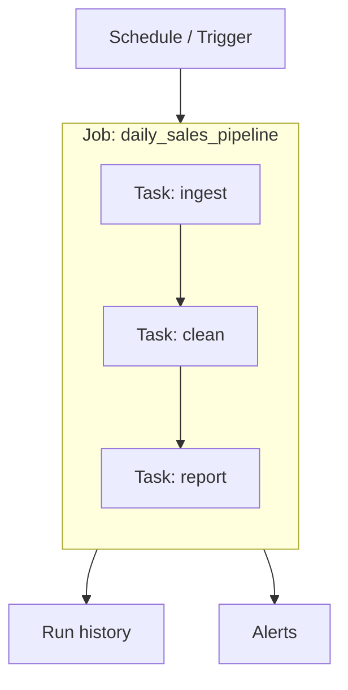
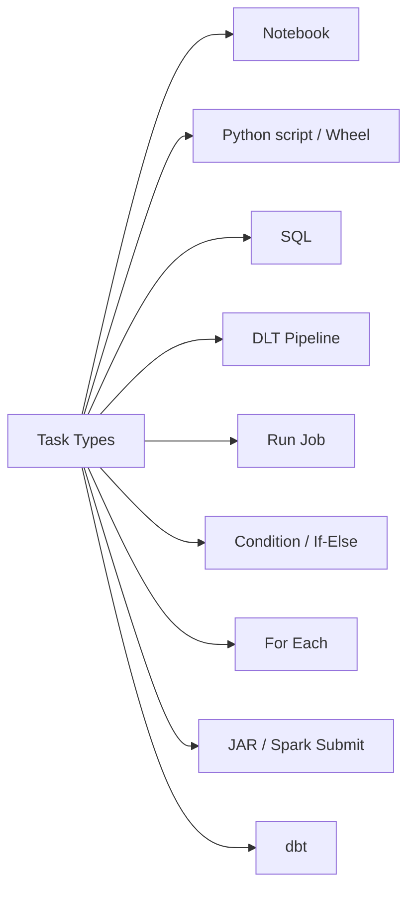
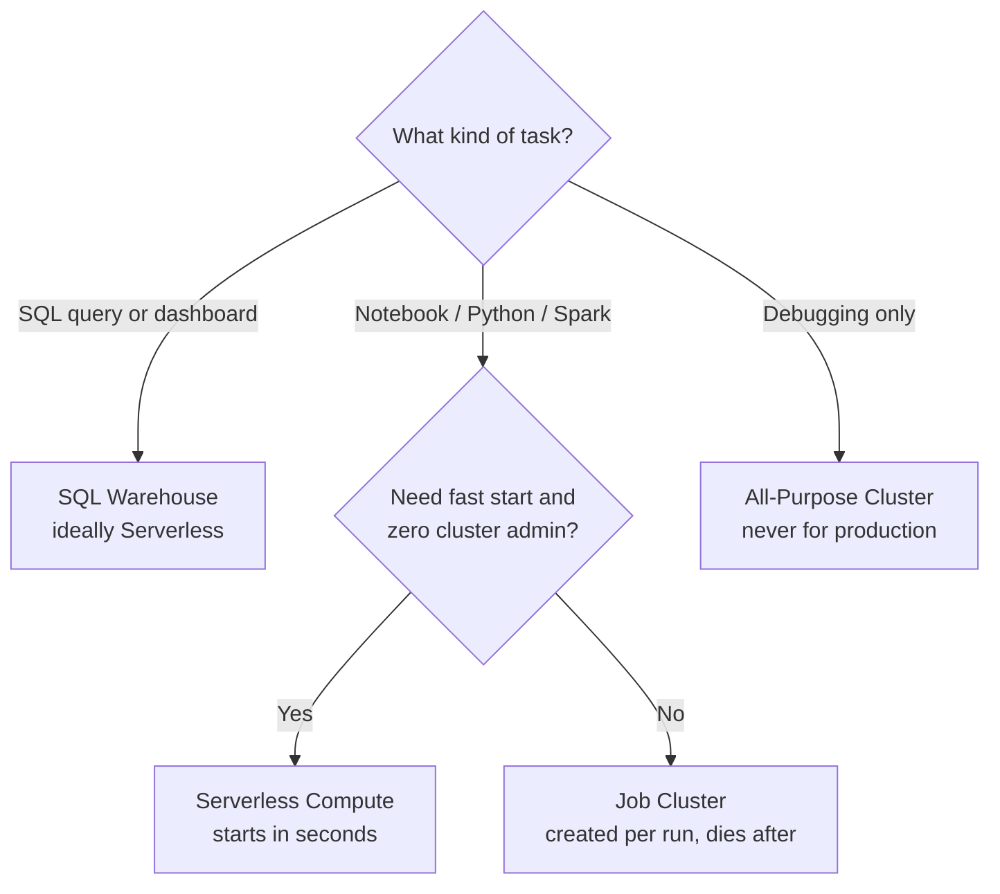
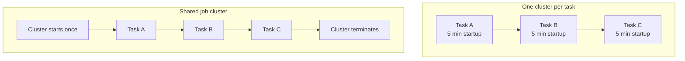
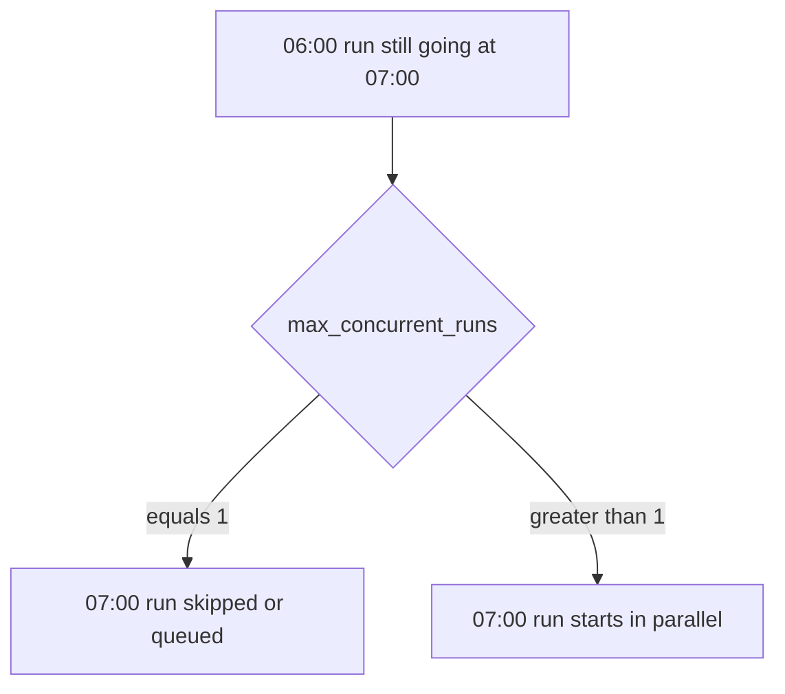
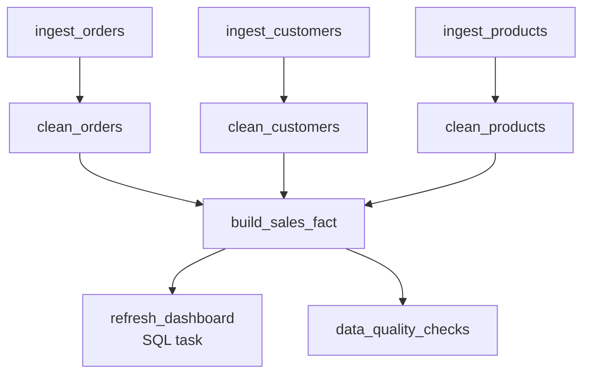

# Jobs and Tasks

## The Building Block

Everything in Databricks Workflows reduces to one sentence:

```text
A Job is a container of Tasks, plus the rules for running them.
```



---

## Anatomy of a Job

A job definition contains exactly these parts:

| Part | Question it answers | Example |
|------|---------------------|---------|
| **Name** | What is this pipeline? | `daily_sales_pipeline` |
| **Tasks** | What work happens? | 3 notebook tasks |
| **Dependencies** | In what order? | clean after ingest |
| **Compute** | Where does it run? | job cluster, 2 workers |
| **Trigger** | When does it start? | cron `0 0 6 * * ?` |
| **Parameters** | What inputs does it take? | `run_date = 2026-09-18` |
| **Retries / timeout** | What if it misbehaves? | 2 retries, 60 min timeout |
| **Notifications** | Who do we tell? | email on failure |
| **Permissions** | Who can run or edit it? | data-engineers group |
| **Max concurrent runs** | Can it overlap itself? | usually `1` |

---

## Anatomy of a Task

A task is one unit of work. Every task has:

```text
Task
├── Task name        (unique inside the job)
├── Type             (notebook, SQL, Python, DLT, job, ...)
├── Source           (path in workspace / Git / volume)
├── Compute          (job cluster, serverless, SQL warehouse)
├── Parameters       (key-value inputs)
├── Depends on       (list of upstream task names)
├── Run if           (condition evaluated before running)
└── Retry / timeout  (task-level overrides)
```

---

## Task Types



| Type | Use it when |
|------|-------------|
| **Notebook** | Most common. Your logic lives in a notebook. |
| **Python script** | A plain `.py` file in Workspace, Git, or a Volume. |
| **Python wheel** | Packaged, tested, versioned production code. |
| **SQL** | Run a saved query, file, alert, or refresh a dashboard. Uses a SQL warehouse. |
| **DLT pipeline** | Trigger a Delta Live Tables pipeline as one step. |
| **Run Job** | Call another job, so small jobs compose into big ones. |
| **If/else condition** | Branch the DAG based on a value. |
| **For each** | Loop the same task over a list of inputs. |
| **JAR / Spark Submit** | Legacy or Scala/Java workloads. |
| **dbt** | Run dbt Core transformations against a warehouse. |

---

## Choosing Compute for a Task

This is the decision that most affects **cost**.



| Compute | Starts in | Cost | Use for |
|---------|-----------|------|---------|
| **Job cluster** | 3 to 7 min | Cheapest DBU rate | Scheduled production work |
| **Serverless** | seconds | Higher rate, no idle time | Short tasks, frequent runs |
| **All-purpose** | already running | Most expensive rate | Interactive development only |
| **SQL warehouse** | seconds when serverless | Per warehouse | SQL tasks, dashboards |

> **Rule of thumb:** production jobs use **job clusters or serverless**.
> An all-purpose cluster inside a job is a cost and reliability anti-pattern.

---

## Shared Job Clusters

By default each task can get its own cluster, which means paying for several
cluster startups in one run.



Define the cluster once at job level and point multiple tasks at it. You pay one
startup instead of three.

Use **separate** clusters only when tasks genuinely need different sizes, for
example a small ingest task and a very large aggregation task.

---

## A Job in the UI vs a Job as Code

The UI is fine for learning. Production jobs should live in Git as YAML
(Databricks Asset Bundles) or JSON.

```yaml
# databricks.yml  (Asset Bundle style)
resources:
  jobs:
    daily_sales_pipeline:
      name: daily_sales_pipeline
      schedule:
        quartz_cron_expression: "0 0 6 * * ?"
        timezone_id: "Asia/Kolkata"
      email_notifications:
        on_failure:
          - data-team@company.com
      job_clusters:
        - job_cluster_key: main
          new_cluster:
            spark_version: "14.3.x-scala2.12"
            node_type_id: "Standard_DS3_v2"
            num_workers: 2
      tasks:
        - task_key: ingest_orders
          job_cluster_key: main
          notebook_task:
            notebook_path: /Repos/prod/etl/ingest_orders

        - task_key: clean_orders
          depends_on:
            - task_key: ingest_orders
          job_cluster_key: main
          notebook_task:
            notebook_path: /Repos/prod/etl/clean_orders

        - task_key: daily_sales_report
          depends_on:
            - task_key: clean_orders
          sql_task:
            warehouse_id: "abc123"
            query:
              query_id: "xyz789"
```

Reading that YAML top to bottom is exactly the anatomy table from earlier.

---

## Creating a Job with the SDK

```python
from databricks.sdk import WorkspaceClient
from databricks.sdk.service.jobs import Task, NotebookTask, TaskDependency

w = WorkspaceClient()

w.jobs.create(
    name="daily_sales_pipeline",
    tasks=[
        Task(
            task_key="ingest_orders",
            notebook_task=NotebookTask(notebook_path="/Repos/prod/etl/ingest_orders"),
        ),
        Task(
            task_key="clean_orders",
            depends_on=[TaskDependency(task_key="ingest_orders")],
            notebook_task=NotebookTask(notebook_path="/Repos/prod/etl/clean_orders"),
        ),
    ],
)
```

---

## Task Granularity: How Small Should a Task Be?

```text
Too big:    one task that ingests, cleans, and aggregates
            → a failure in aggregation re-runs the ingestion

Too small:  one task per table across 200 tables
            → unreadable DAG, heavy scheduling overhead

Just right: one task per logical stage or per data domain
```

A practical rule:

> **A task should be the smallest piece of work you would ever want to re-run alone.**

---

## Max Concurrent Runs

```text
max_concurrent_runs = 1   → a new run is skipped or queued while one is running
max_concurrent_runs = 5   → up to 5 overlapping runs allowed
```



For pipelines writing to the same table, keep it at **1**. Two runs writing the
same partition at once is a classic source of duplicated data.

---

## Real-World Example: E-commerce Daily Pipeline



Notice:

- The three ingests run **in parallel** because nothing connects them.
- `build_sales_fact` waits for **all three** cleaning tasks.
- Dashboard refresh and quality checks run in parallel at the end.

Total runtime is the **longest path**, not the sum of all tasks.

---

## Quick Revision

```text
Job  = tasks + compute + trigger + retries + alerts + permissions
Task = type + source + compute + params + depends_on + run_if

Task types:
Notebook | Python | Wheel | SQL | DLT | Run Job | Condition | For Each | JAR | dbt

Compute choice:
Production  → job cluster or serverless
SQL task    → SQL warehouse
Development → all-purpose (never in production)

Cost tips:
✔ Share one job cluster across tasks
✔ Right-size the workers
✔ Keep max_concurrent_runs = 1 for table writers

Task size rule:
"The smallest piece you would ever re-run alone"
```
