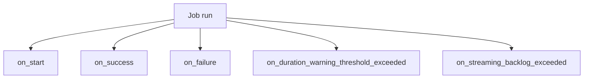
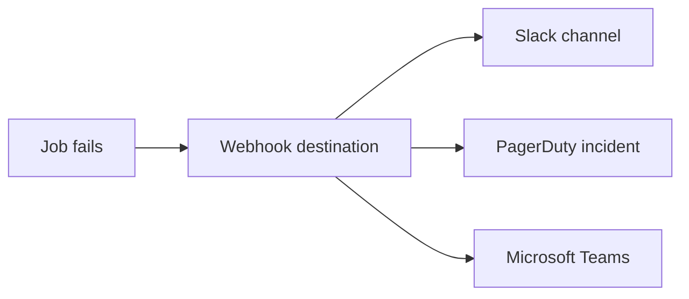
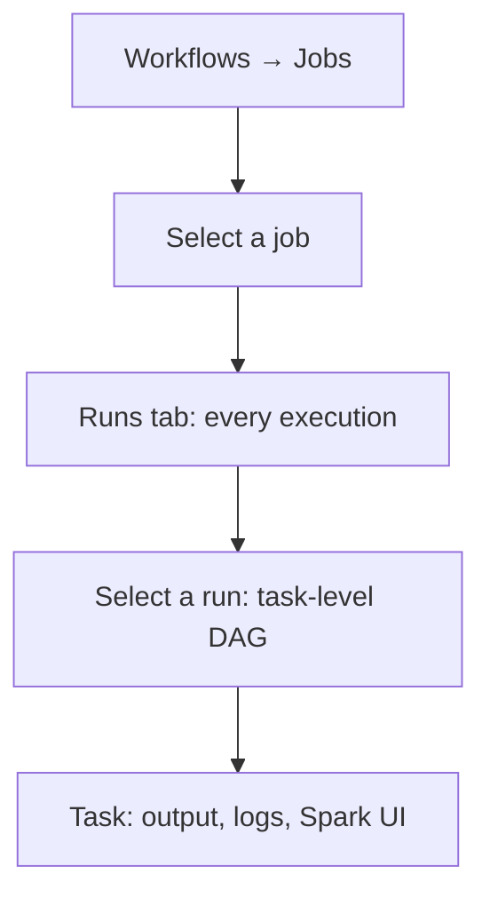
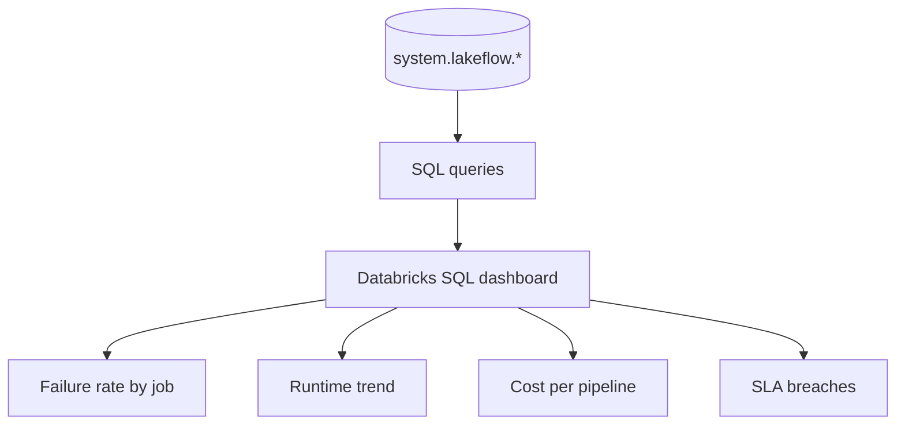
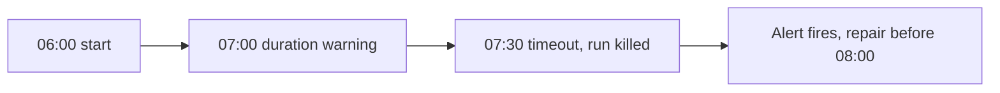
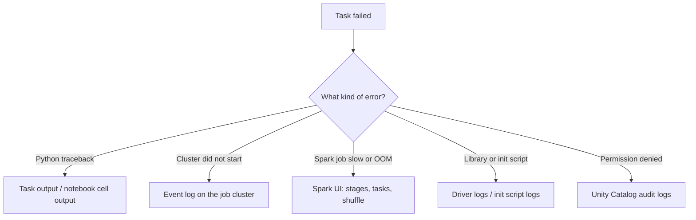

# Notifications and Monitoring

## First Principle

```text
A pipeline that fails silently is worse than no pipeline,
because people keep trusting the stale numbers.
```

Monitoring answers three questions:

```text
Did it run?
Did it succeed?
Did it finish in time?
```

---

## Notification Events



| Event | Fires when | Send it to |
|-------|------------|------------|
| `on_start` | The run begins | Usually nobody — it is noise |
| `on_success` | The run succeeds | Only for critical or rare jobs |
| `on_failure` | The run fails | The on-call team, always |
| `on_duration_warning_threshold_exceeded` | The run is taking too long | The owning team |
| `on_streaming_backlog_exceeded` | A stream is falling behind | The streaming owner |

---

## Configuring Notifications

```yaml
email_notifications:
  on_failure:
    - data-oncall@company.com
  on_duration_warning_threshold_exceeded:
    - data-team@company.com
  no_alert_for_skipped_runs: true

health:
  rules:
    - metric: RUN_DURATION_SECONDS
      op: GREATER_THAN
      value: 3600      # warn if the run exceeds 60 minutes

webhook_notifications:
  on_failure:
    - id: "slack-destination-id"
```

`no_alert_for_skipped_runs: true` prevents a flood of alerts when runs are
skipped because a previous run is still going.

---

## Webhooks: Slack, PagerDuty, Teams

Webhook destinations are created once at workspace level, then referenced by id
from any job.



```text
Admin Settings → Notifications → Notification destinations
  → create destination (Slack / webhook / PagerDuty / Teams / email)
  → reference the destination id inside jobs
```

A sensible routing policy:

| Severity | Route |
|----------|-------|
| Critical pipeline (revenue, regulatory) | PagerDuty + Slack |
| Standard production pipeline | Slack channel |
| Dev or experimental job | Email to the owner only |

---

## Alert Fatigue Is a Real Failure Mode

```text
❌ Alerting on every run start and success
   → the channel becomes noise, real failures get ignored

✔ Alert on failure
✔ Alert on duration breach
✔ Suppress alerts for skipped runs
✔ Route by severity, not everything to one channel
```

---

## Reading the Run History UI



For each run you can see:

```text
Run id | Trigger type | Start time | Duration | Status | Parameters used
```

For each task inside the run:

```text
Status | Duration | Cluster | Notebook output | Driver logs | Spark UI
```

### Run statuses

| Status | Meaning |
|--------|---------|
| `PENDING` | Waiting for compute to start |
| `RUNNING` | Executing |
| `SUCCESS` | Everything finished successfully |
| `FAILED` | At least one task failed after retries |
| `TIMEDOUT` | Exceeded the configured timeout |
| `CANCELED` | Stopped by a user or by the API |
| `SKIPPED` | Never ran (upstream failure, or concurrency limit) |

---

## Monitoring with System Tables

The UI is for one job. **System tables** are for the whole platform, and are
where real operational reporting happens.

```sql
-- Failed runs in the last 7 days
SELECT
    job_id,
    run_id,
    result_state,
    period_start_time,
    period_end_time
FROM system.lakeflow.job_run_timeline
WHERE period_start_time >= current_date() - INTERVAL 7 DAYS
  AND result_state = 'FAILED'
ORDER BY period_start_time DESC;
```

```sql
-- Which jobs are getting slower, week over week
SELECT
    job_id,
    date_trunc('week', period_start_time) AS wk,
    avg(unix_timestamp(period_end_time) - unix_timestamp(period_start_time)) / 60 AS avg_minutes
FROM system.lakeflow.job_run_timeline
WHERE period_start_time >= current_date() - INTERVAL 60 DAYS
GROUP BY job_id, wk
ORDER BY job_id, wk;
```

```sql
-- Cost attribution: DBUs by job
SELECT
    u.usage_metadata.job_id,
    sum(u.usage_quantity) AS dbus
FROM system.billing.usage u
WHERE u.usage_date >= current_date() - INTERVAL 30 DAYS
  AND u.usage_metadata.job_id IS NOT NULL
GROUP BY 1
ORDER BY dbus DESC
LIMIT 20;
```

Useful system tables:

```text
system.lakeflow.jobs               → job definitions
system.lakeflow.job_tasks          → task definitions
system.lakeflow.job_run_timeline   → every run and its result
system.lakeflow.job_task_run_timeline → every task run
system.billing.usage               → DBU consumption, attributable to a job
```

> System tables must be enabled on the metastore. See topic 07 for the Unity
> Catalog side of this.

---

## Building an Operations Dashboard



A practical starting set of tiles:

| Tile | Query idea |
|------|------------|
| Runs today by status | Count grouped by `result_state` |
| Top 10 failing jobs (30 days) | Count of `FAILED` per `job_id` |
| Longest running jobs | Average duration descending |
| Jobs that have not run in 7 days | Max `period_start_time` per job |
| Most expensive jobs | DBUs from `system.billing.usage` |

---

## SLAs and Duration Thresholds

```text
Business SLA: "the sales dashboard must be fresh by 08:00"

Translate to:
  schedule       = 06:00
  timeout        = 90 minutes
  duration warn  = 60 minutes
  alert          = Slack + PagerDuty on failure
```



The warning exists so a human can act **before** the SLA is missed, not after.

---

## Querying Runs Programmatically

```python
from databricks.sdk import WorkspaceClient

w = WorkspaceClient()

for run in w.jobs.list_runs(job_id=620745, limit=10):
    print(run.run_id, run.state.result_state, run.start_time)
```

```bash
databricks jobs list-runs --job-id 620745 --limit 10
```

Use this to build custom checks, for example "fail my morning readiness script
if yesterday's load did not succeed".

---

## Logs: Where to Look When Something Breaks



Configure **cluster log delivery** to a volume or DBFS path so logs survive after
the job cluster terminates. Without it, the logs disappear with the cluster.

---

## Monitoring Checklist for a New Production Job

```text
✔ on_failure notification to a real, monitored channel
✔ no_alert_for_skipped_runs = true
✔ timeout set (shorter than the schedule interval)
✔ duration warning threshold set below the SLA
✔ retries configured with a sensible interval
✔ cluster log delivery enabled
✔ job appears in the team operations dashboard
✔ owner and permissions set (not a personal account)
```

That last point matters: jobs owned by an individual break when that person
leaves. Use a **service principal** as the run-as identity.

---

## Common Interview Questions

### How do you get alerted when a job fails?

Configure `on_failure` email or webhook notifications, routed to Slack,
PagerDuty, or Teams via a notification destination.

### How do you detect a job that is running but far too slow?

Set a health rule on `RUN_DURATION_SECONDS` with
`on_duration_warning_threshold_exceeded` notifications, plus a hard timeout.

### How would you report on all job failures across the workspace?

Query `system.lakeflow.job_run_timeline` and build a Databricks SQL dashboard on
top of it.

### How do you attribute cost to a specific pipeline?

Use `system.billing.usage` filtered on `usage_metadata.job_id`, and tag clusters
consistently.

### Where do logs go after a job cluster terminates?

Nowhere, unless cluster log delivery is configured to a volume, DBFS, or cloud
storage path.

---

## Quick Revision

```text
Events:
on_start | on_success | on_failure
on_duration_warning_threshold_exceeded
on_streaming_backlog_exceeded

Destinations:
Email | Slack | Teams | PagerDuty | generic webhook

Statuses:
PENDING | RUNNING | SUCCESS | FAILED | TIMEDOUT | CANCELED | SKIPPED

System tables:
system.lakeflow.job_run_timeline       → run outcomes
system.lakeflow.job_task_run_timeline  → task outcomes
system.billing.usage                   → cost per job

Golden rules:
✔ Alert on failure, not on success
✔ Suppress skipped-run alerts
✔ Warning threshold < SLA < timeout
✔ Enable cluster log delivery
✔ Run as a service principal, not a person
```
