# Orchestration Patterns

Patterns are reusable answers to problems that come up in almost every data
platform. Recognising the pattern saves you from designing from scratch.

---

## Pattern 1: Medallion Pipeline

The default shape of a Databricks data platform.

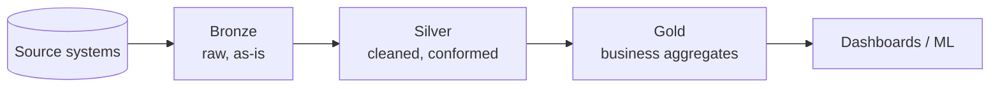

As a job:

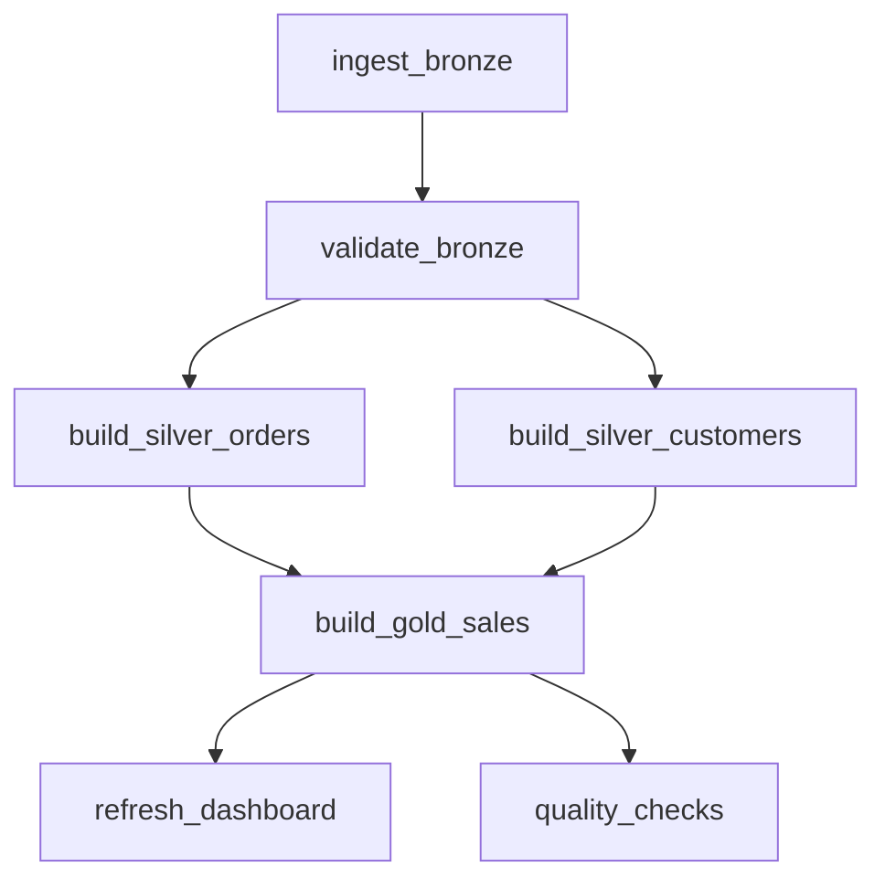

```text
When to use: nearly every batch platform
Why it works: each layer has one job, and failures are isolated to a layer
```

---

## Pattern 2: Ingest, Transform, Publish Separation

Split the medallion job into three jobs when different teams or schedules own
different layers.

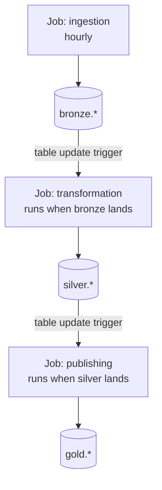

```text
Benefit: teams deploy independently, coupled only by the table contract
Cost:    harder to see the end-to-end picture in one screen
```

---

## Pattern 3: Parent and Child Jobs

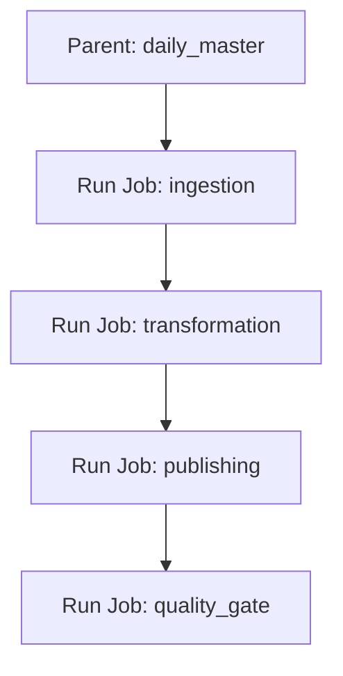

Same layering as pattern 2, but with a single parent job that owns the order.
Use this when you want one place to see the whole run, while keeping each child
job independently runnable.

| | Pattern 2 (triggers) | Pattern 3 (parent job) |
|---|---|---|
| Coupling | Loose | Tight |
| End-to-end visibility | Low | High |
| Ownership | Per team | Central |
| Re-run the whole flow | Awkward | One click |

---

## Pattern 4: Fan-Out Ingestion with For Each

Fifty source tables, one piece of logic.

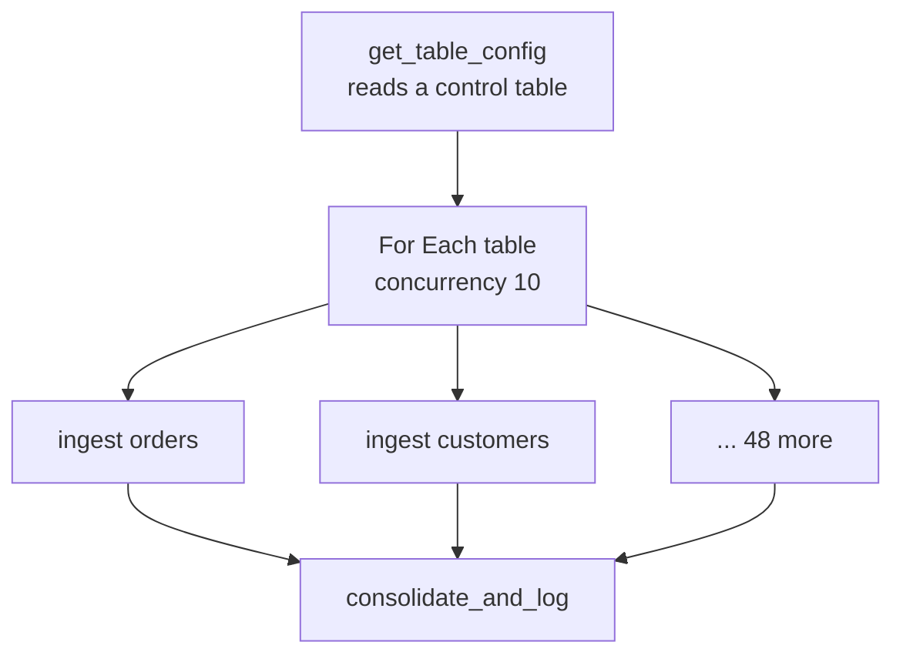

The control table drives everything:

```sql
CREATE TABLE control.ingestion_config (
    table_name    STRING,
    source_path   STRING,
    load_type     STRING,   -- full | incremental
    watermark_col STRING,
    is_active     BOOLEAN
);
```

```python
# Task: get_table_config
rows = spark.table("control.ingestion_config").filter("is_active").collect()
tables = [r.table_name for r in rows]
dbutils.jobs.taskValues.set(key="tables", value=tables)
```

Adding a 51st table becomes an `INSERT`, not a code change. This is called
**metadata-driven ingestion** and it is how most mature platforms work.

---

## Pattern 5: Quality Gate

Stop bad data before it reaches consumers.

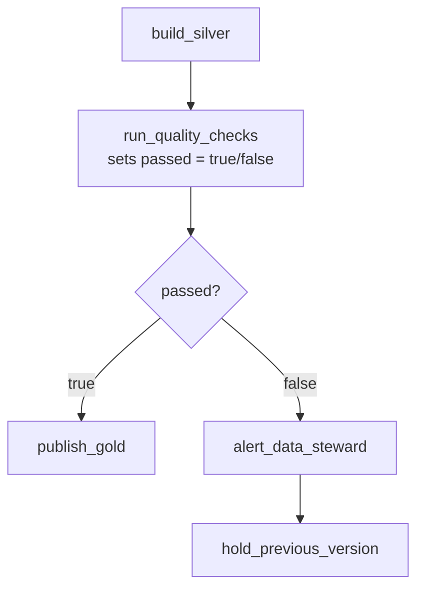

```python
checks = {
    "row_count_positive": df.count() > 0,
    "no_null_keys":       df.filter("order_id IS NULL").count() == 0,
    "amounts_sane":       df.filter("amount < 0").count() == 0,
    "freshness":          df.agg({"order_date": "max"}).collect()[0][0] is not None,
}

passed = all(checks.values())
dbutils.jobs.taskValues.set(key="passed", value=passed)
dbutils.jobs.taskValues.set(key="failed_checks", value=[k for k, v in checks.items() if not v])
```

The key idea: **gold stays stale rather than becoming wrong.** Stale data with a
known timestamp is recoverable; wrong data that people already acted on is not.

---

## Pattern 6: Incremental Load with a Watermark

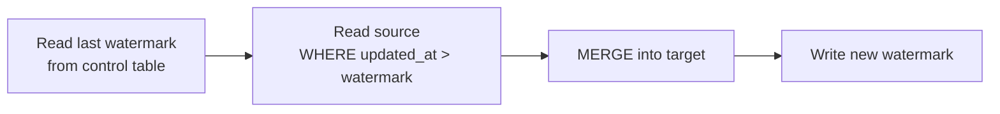

```python
last = spark.sql(
    "SELECT max(watermark) w FROM control.load_state WHERE table_name = 'orders'"
).collect()[0].w

new_data = spark.table("bronze.orders").filter(f"updated_at > '{last}'")

new_data.createOrReplaceTempView("updates")
spark.sql("""
    MERGE INTO silver.orders t
    USING updates s ON t.order_id = s.order_id
    WHEN MATCHED THEN UPDATE SET *
    WHEN NOT MATCHED THEN INSERT *
""")

new_watermark = new_data.agg({"updated_at": "max"}).collect()[0][0]
```

Write the new watermark **only after** the merge succeeds, so a failure means the
next run reprocesses the same window rather than skipping it.

```text
Fail before watermark update → reprocess (safe, because MERGE is idempotent)
Fail after watermark update  → data loss (never do this)
```

---

## Pattern 7: Backfill Job

Keep the backfill separate from the daily job.

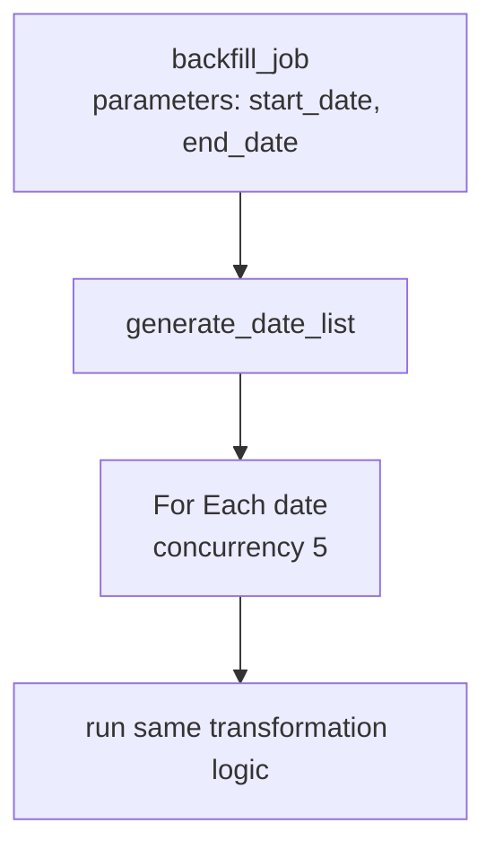

```text
✔ Same notebooks as production, different parameters
✔ Lower concurrency so it does not starve the daily pipeline
✔ Separate job so backfills do not pollute the daily run history
✔ Only possible if the pipeline is date-parameterised and idempotent
```

---

## Pattern 8: Multi-Environment Promotion

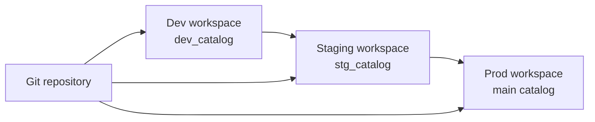

With Databricks Asset Bundles the same definition deploys everywhere:

```yaml
bundle:
  name: sales_platform

targets:
  dev:
    default: true
    variables:
      catalog: dev_catalog
    resources:
      jobs:
        daily_sales_pipeline:
          schedule:
            pause_status: PAUSED      # never auto-run in dev

  prod:
    variables:
      catalog: main
    run_as:
      service_principal_name: "sp-data-platform"
      resources:
        jobs:
          daily_sales_pipeline:
            schedule:
              pause_status: UNPAUSED
```

```bash
databricks bundle deploy --target dev
databricks bundle deploy --target prod
```

Topic 15 covers bundles and CI/CD in depth.

---

## Pattern 9: External Orchestrator Calls Databricks

In many enterprises the master schedule lives in Airflow, Azure Data Factory, or
Control-M, because the flow spans more than Databricks.

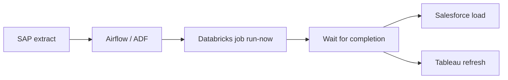

```python
# Airflow
from airflow.providers.databricks.operators.databricks import DatabricksRunNowOperator

run_etl = DatabricksRunNowOperator(
    task_id="run_databricks_etl",
    databricks_conn_id="databricks_default",
    job_id=620745,
    job_parameters={"run_date": "{{ ds }}"},
)
```

| Approach | Choose when |
|----------|-------------|
| **Databricks Workflows only** | The pipeline lives entirely in Databricks |
| **External orchestrator** | The flow spans many systems, or the company standardised on one scheduler |
| **Hybrid** | External tool triggers coarse Databricks jobs that own their internal DAG |

The hybrid is usually best: keep Databricks-internal dependencies inside
Databricks, and let the external tool coordinate across systems.

---

## Pattern 10: Streaming plus Batch (Lambda-style)

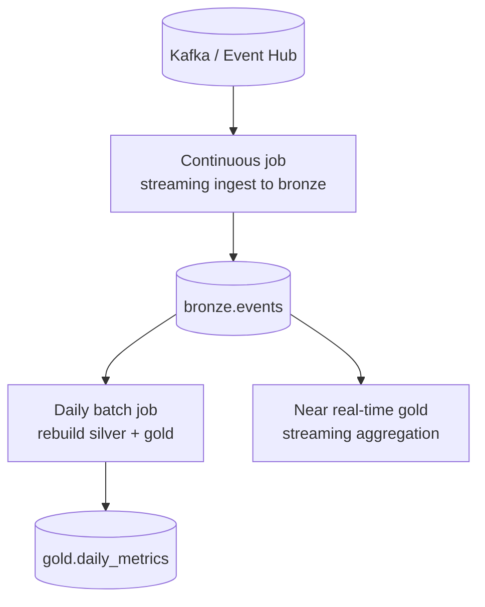

```text
Streaming path → low latency, approximate, rolling metrics
Batch path     → correct, complete, reconciled daily
```

Topics 11, 12, and 13 cover the streaming side in detail.

---

## Anti-Patterns

```text
❌ One notebook, 3000 lines, one task
   → cannot retry a part, cannot parallelise, impossible to debug

❌ Chaining tasks that have no data dependency
   → serial runtime for no reason

❌ Jobs pointing at notebooks in a personal user folder
   → breaks when that person leaves or moves the file

❌ Job owned and run as an individual user
   → use a service principal

❌ Sleep loops to wait for another job
   → use a table update trigger or a Run Job task

❌ Hard-coded dates, paths, and catalogs
   → no backfills, no promotion between environments

❌ Every job scheduled at exactly midnight
   → compute spike, queueing, and noisy failures
```

---

## Choosing a Pattern

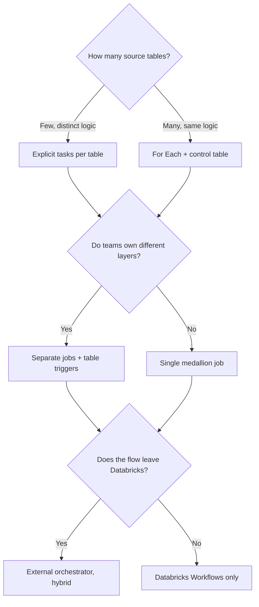

---

## Quick Revision

```text
Patterns:
1  Medallion pipeline
2  Ingest / transform / publish split via table triggers
3  Parent job with Run Job children
4  Metadata-driven fan-out with For Each
5  Quality gate before publishing
6  Incremental load with a watermark
7  Separate backfill job
8  Multi-environment promotion with bundles
9  External orchestrator, hybrid ownership
10 Streaming plus batch

Principles:
✔ One task = one re-runnable unit
✔ Control tables beat copy-pasted tasks
✔ Stale gold beats wrong gold
✔ Update the watermark only after a successful write
✔ Parameterise everything that differs between runs or environments
```
