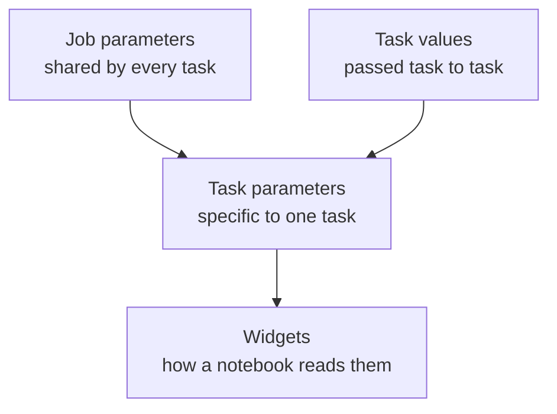
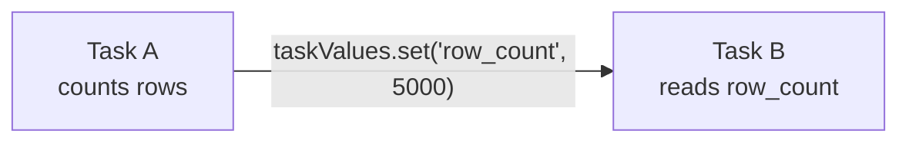
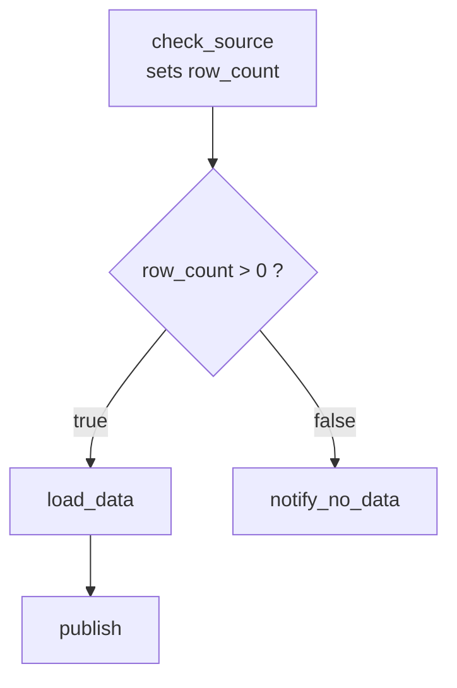

# Parameters and Task Values

## The Problem

A notebook with this line can never be re-run for an old day:

```python
run_date = "2026-09-18"   # hard-coded
```

When yesterday's load fails, you must edit the code, run it, then remember to
edit it back. Parameters remove that whole class of pain.

```text
Hard-coded value → code change to re-run
Parameter        → same code, different input
```

---

## Three Levels of Input



| Mechanism | Scope | Set by |
|-----------|-------|--------|
| **Job parameters** | Whole job, all tasks | Job definition or run-now |
| **Task parameters** | One task | Task definition |
| **Widgets** | Inside a notebook | The notebook code reads them |
| **Task values** | One task to another | Code at runtime |

---

## Job Parameters

Defined once, visible to every task.

```yaml
parameters:
  - name: run_date
    default: "{{job.start_time.[iso_date]}}"
  - name: env
    default: "dev"
```

Override at run time:

```bash
databricks jobs run-now 620745 \
  --json '{"job_parameters": {"run_date": "2026-09-01", "env": "prod"}}'
```

Reference in a task:

```text
{{job.parameters.run_date}}
```

---

## Reading Parameters in a Notebook: Widgets

Widgets are the notebook's way of declaring "I accept this input".

```python
# Declare with a default, so the notebook also runs interactively
dbutils.widgets.text("run_date", "2026-09-18")
dbutils.widgets.dropdown("env", "dev", ["dev", "staging", "prod"])

run_date = dbutils.widgets.get("run_date")
env      = dbutils.widgets.get("env")

print(f"Loading data for {run_date} into {env}")
```

```python
df = spark.read.table(f"{env}.bronze.orders").filter(f"order_date = '{run_date}'")
```

In SQL notebooks:

```sql
CREATE WIDGET TEXT run_date DEFAULT '2026-09-18';

SELECT * FROM bronze.orders
WHERE order_date = :run_date;
```

> The default value is what makes the notebook usable both **inside** a job and
> **by hand** during development.

---

## Dynamic Value References

Databricks injects runtime information through `{{ }}` placeholders. These save
you from computing dates and ids yourself.

| Reference | Gives you |
|-----------|-----------|
| `{{job.id}}` | Job id |
| `{{job.name}}` | Job name |
| `{{job.run_id}}` | Id of this job run |
| `{{job.start_time.[iso_date]}}` | `2026-09-18` |
| `{{job.start_time.[iso_datetime]}}` | Full timestamp |
| `{{job.start_time.[year]}}` / `[month]` / `[day]` | Date parts |
| `{{job.trigger.type}}` | `CRON`, `FILE_ARRIVAL`, `MANUAL`, ... |
| `{{job.repair_count}}` | How many repairs this run has had |
| `{{task.name}}` | Current task name |
| `{{task.run_id}}` | Current task run id |
| `{{tasks.<task_key>.values.<key>}}` | A task value from an upstream task |
| `{{job.parameters.<name>}}` | A job parameter |

Example task parameter using them:

```yaml
- task_key: ingest_orders
  notebook_task:
    notebook_path: /Repos/prod/etl/ingest_orders
    base_parameters:
      run_date: "{{job.start_time.[iso_date]}}"
      output_path: "/mnt/bronze/orders/{{job.start_time.[year]}}/{{job.start_time.[month]}}"
      triggered_by: "{{job.trigger.type}}"
```

---

## Task Values: Passing Data Between Tasks

Parameters flow **in**. Task values flow **across**.



### Setting a value

```python
# in task: load_bronze
row_count = df.count()
dbutils.jobs.taskValues.set(key="row_count", value=row_count)
dbutils.jobs.taskValues.set(key="status", value="ok")
```

### Reading it downstream

```python
# in task: validate_bronze
row_count = dbutils.jobs.taskValues.get(
    taskKey="load_bronze",
    key="row_count",
    default=0,
    debugValue=0,      # used when running the notebook interactively
)

if row_count == 0:
    raise Exception("No rows loaded, stopping the pipeline")
```

Or reference it in a task parameter without any code:

```text
{{tasks.load_bronze.values.row_count}}
```

### Rules and limits

```text
✔ Values must be JSON-serialisable (numbers, strings, lists, dicts)
✔ Keep them small — they are metadata, not a data transport
✘ Never pass a DataFrame or a large payload; write a table instead
✔ Always set debugValue so the notebook still runs interactively
```

---

## Putting It Together: a Conditional Pipeline



```python
# Task 1: check_source
dbutils.widgets.text("run_date", "")
run_date = dbutils.widgets.get("run_date")

count = spark.read.table("bronze.orders").filter(f"ingest_date = '{run_date}'").count()
dbutils.jobs.taskValues.set(key="row_count", value=count)
```

```text
# Task 2: If/else condition task
Left:     {{tasks.check_source.values.row_count}}
Operator: >
Right:    0
```

The `load_data` task depends on the **true** branch, `notify_no_data` on the
**false** branch.

---

## Parameterising for Backfills

A well-parameterised job makes backfilling trivial.

```bash
for d in 2026-09-01 2026-09-02 2026-09-03; do
  databricks jobs run-now 620745 \
    --json "{\"job_parameters\": {\"run_date\": \"$d\"}}"
done
```

If `run_date` had been hard-coded, this would be three code edits and three
deployments.

---

## Environment Parameterisation

One job definition, three environments:

```yaml
parameters:
  - name: env
    default: "dev"
```

```python
env = dbutils.widgets.get("env")
catalog = {"dev": "dev_catalog", "staging": "stg_catalog", "prod": "main"}[env]

spark.sql(f"USE CATALOG {catalog}")
```

This pairs naturally with Unity Catalog three-level namespaces
(`catalog.schema.table`) covered in topic 07.

---

## Notebook Workflows: Calling a Notebook from a Notebook

Different from job tasks, but often confused with them.

```python
result = dbutils.notebook.run(
    "/Repos/prod/etl/child_notebook",
    timeout_seconds=600,
    arguments={"run_date": "2026-09-18"},
)
print(result)
```

The child notebook returns a value with:

```python
dbutils.notebook.exit("SUCCESS: 5000 rows")
```

| | `dbutils.notebook.run` | Job tasks |
|---|---|---|
| Visibility | One box in the run UI | Every step visible in the DAG |
| Retry | Whole parent re-runs | Per-task retries |
| Repair | Not possible | Repair only the failed task |
| Compute | Same cluster | Per task if needed |

> **Guidance:** prefer job tasks for production pipelines. Use
> `dbutils.notebook.run` for small helper calls or dynamic fan-out that the DAG
> cannot express.

---

## Common Mistakes

```text
❌ Widget without a default → the notebook breaks in interactive mode
❌ Passing large data through task values → use a Delta table
❌ Building SQL by string concatenation from untrusted input → injection risk
❌ Reading a task value from a task that is not an upstream dependency
❌ Assuming a parameter is an int — widget values are always strings
```

That last one bites often:

```python
limit = int(dbutils.widgets.get("limit"))   # cast explicitly
```

---

## Common Interview Questions

### How do you pass parameters to a notebook in a job?

Define job or task parameters, and read them in the notebook with
`dbutils.widgets.get()`.

### How do you pass a value from one task to another?

`dbutils.jobs.taskValues.set()` in the upstream task and
`dbutils.jobs.taskValues.get()` (or `{{tasks.<key>.values.<key>}}`) downstream.

### How do you get the current run date without hard-coding it?

Use the dynamic reference `{{job.start_time.[iso_date]}}` as a parameter default.

### Difference between `dbutils.notebook.run` and a job task?

`notebook.run` executes a notebook from inside another notebook on the same
cluster with no separate visibility or retry. A job task is a first-class DAG
node with its own status, retries, and repair support.

### Why must widgets have defaults?

So the notebook still runs interactively during development, when the job is not
supplying values.

---

## Quick Revision

```text
Job parameter  → all tasks
Task parameter → one task
Widget         → how a notebook reads a parameter
Task value     → task-to-task communication

Read:   dbutils.widgets.get("name")
Set:    dbutils.jobs.taskValues.set(key=, value=)
Get:    dbutils.jobs.taskValues.get(taskKey=, key=, debugValue=)

Dynamic refs:
{{job.start_time.[iso_date]}}
{{job.run_id}}
{{job.parameters.env}}
{{tasks.<task>.values.<key>}}

Rules:
✔ Always give widgets a default
✔ Cast widget values (they are strings)
✔ Task values = small metadata only
✔ Parameterise the date → backfills become one loop
```
