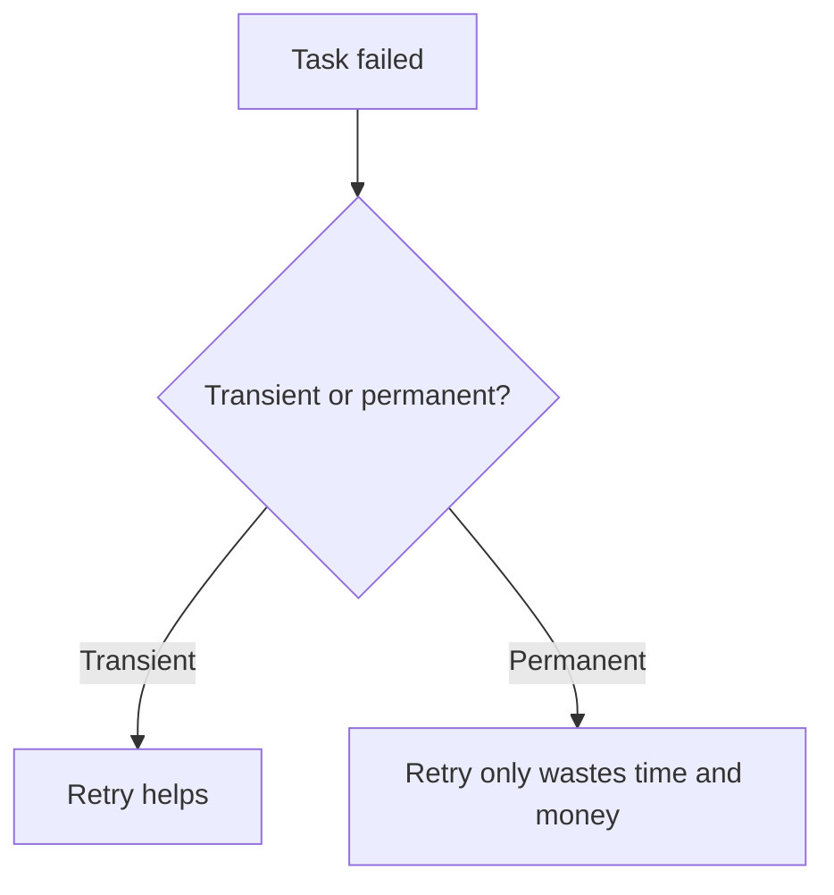
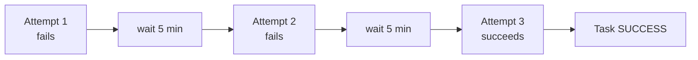
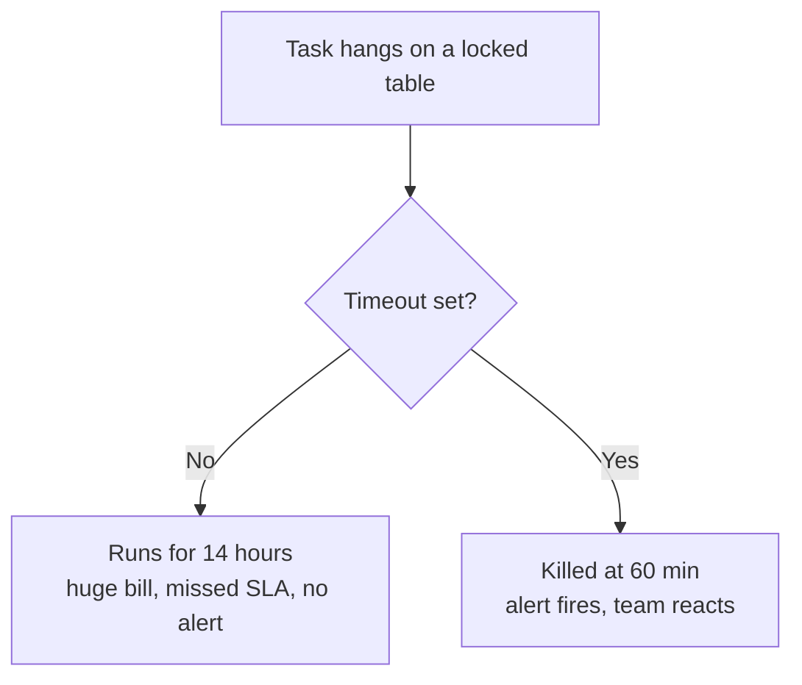
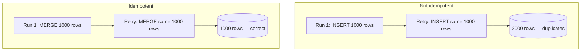
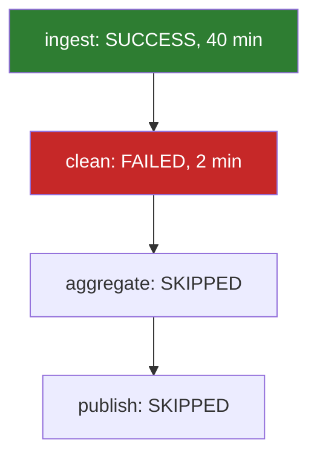
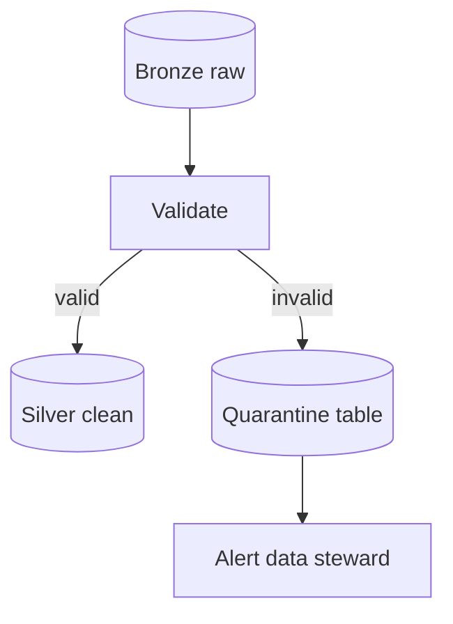
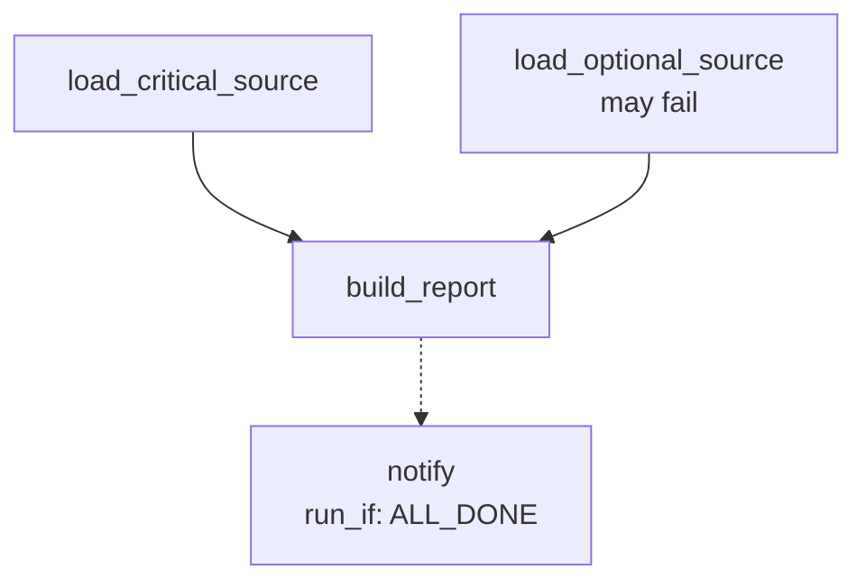
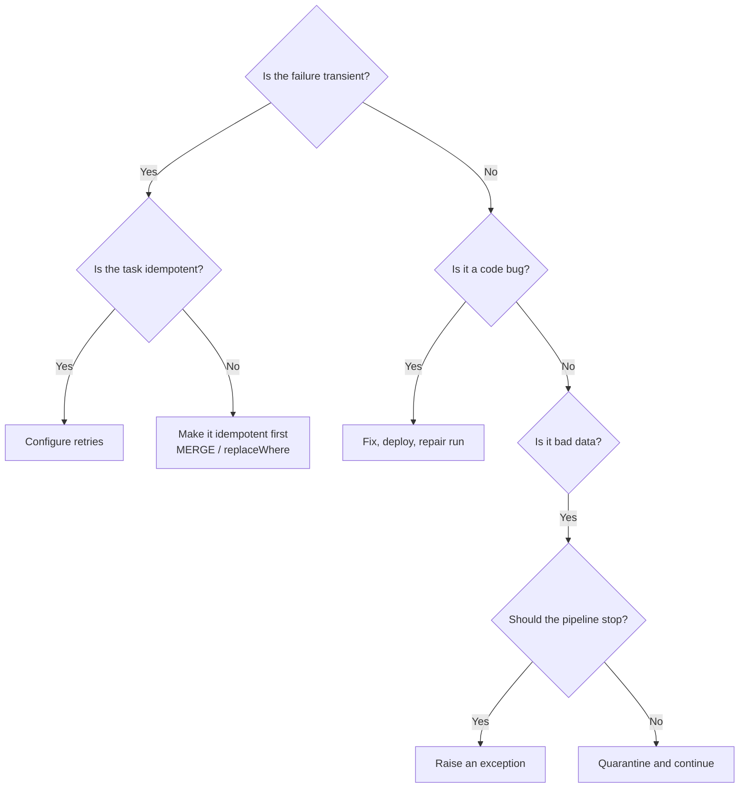

# Retries and Failure Handling

## Two Kinds of Failure

This distinction drives every decision in this file.

```text
TRANSIENT  → will probably work if you just try again
           cloud API throttling, node preemption, brief network blip,
           a locked table, a warehouse still waking up

PERMANENT  → will fail identically forever
           syntax error, missing column, wrong permission, bad logic
```



Retries are a cure for the first kind only. Retrying a `NameError` three times
just costs you three cluster-minutes and delays the alert.

---

## Configuring Retries

```yaml
tasks:
  - task_key: ingest_orders
    max_retries: 3
    min_retry_interval_millis: 300000     # 5 minutes between attempts
    retry_on_timeout: true
    timeout_seconds: 3600                 # 60 minutes per attempt
    notebook_task:
      notebook_path: /Repos/prod/etl/ingest_orders
```

| Setting | Meaning |
|---------|---------|
| `max_retries` | Extra attempts after the first failure (`-1` = unlimited) |
| `min_retry_interval_millis` | Wait between attempts |
| `retry_on_timeout` | Whether a timeout counts as retryable |
| `timeout_seconds` | Kill the attempt after this long |

```text
max_retries = 3  →  up to 4 total attempts (1 original + 3 retries)
```

---

## Retry Timeline



The job is only marked failed once retries are exhausted. Notifications fire at
the end, not on each attempt, which keeps alerts meaningful.

---

## Choosing Retry Settings

| Workload | Suggested |
|----------|-----------|
| API ingestion (rate limits are common) | 3 to 5 retries, 2 to 5 min apart |
| Heavy Spark transformation | 1 to 2 retries, 5 to 10 min apart |
| Anything writing without idempotency | **0 retries** until it is made idempotent |
| Continuous streaming job | Platform handles restart with backoff |

> If you cannot answer "what happens if this task runs twice?", set
> `max_retries: 0` until you can.

---

## Timeouts

A task with no timeout can hang forever, holding a cluster and blocking the next
scheduled run.



Rules of thumb:

```text
task timeout   ≈ 2 to 3 × normal runtime
job timeout    <  schedule interval
duration warn  <  job timeout
```

---

## Idempotency: the Concept That Makes Retries Safe

**Idempotent** means: running it twice produces the same result as running it
once.



### Patterns that make a task idempotent

**1. MERGE instead of INSERT**

```sql
MERGE INTO silver.orders t
USING staging.orders s
ON t.order_id = s.order_id
WHEN MATCHED THEN UPDATE SET *
WHEN NOT MATCHED THEN INSERT *;
```

**2. Overwrite a partition instead of appending**

```python
(df.write
   .format("delta")
   .mode("overwrite")
   .option("replaceWhere", f"order_date = '{run_date}'")
   .saveAsTable("silver.orders"))
```

**3. Delete-then-insert inside one transaction**

```sql
DELETE FROM silver.orders WHERE order_date = :run_date;
INSERT INTO silver.orders SELECT * FROM staging.orders WHERE order_date = :run_date;
```

**4. Let Structured Streaming checkpoints do it**

Checkpoints track exactly which files or offsets were processed, so a restart
resumes rather than reprocesses. Covered in topic 11.

---

## Repair Run: Re-run Only What Failed

This is one of the most valuable features of Databricks Workflows.



Without repair: fix the bug, re-run everything, wait 40 minutes again.
With repair: fix the bug, click **Repair run**, only `clean`, `aggregate`, and
`publish` execute.

```bash
databricks jobs repair-run --json '{
  "run_id": 987654,
  "rerun_tasks": ["clean_orders", "aggregate_sales", "publish_gold"]
}'
```

```text
Repair keeps:
✔ the same run id and history entry
✔ the original parameter values
✔ the outputs of tasks that already succeeded

Repair options:
- rerun failed tasks only
- rerun selected tasks
- rerun with different parameters
```

Repair works only when successful tasks really left their output behind, which
is another reason each task should write its results to a table rather than
holding them in memory.

---

## Handling Failure Inside Your Code

The platform handles infrastructure failures. Your code must handle data
failures.

```python
from pyspark.sql.utils import AnalysisException

try:
    df = spark.read.table("bronze.orders")
except AnalysisException:
    dbutils.jobs.taskValues.set(key="status", value="source_missing")
    raise Exception("bronze.orders does not exist — check the ingestion job")
```

### Fail fast on bad data

```python
row_count = df.count()
null_ids  = df.filter("order_id IS NULL").count()

if row_count == 0:
    raise Exception("Zero rows for the run date — upstream likely did not land")

if null_ids > 0:
    raise Exception(f"{null_ids} rows have a null order_id — refusing to publish")
```

> Raising an exception is a **feature**. A task that silently writes bad data is
> far more expensive than a task that stops the pipeline at 06:10.

---

## Quarantine Pattern for Bad Records

Stopping the whole pipeline is not always right. Sometimes you want the good
records to flow and the bad ones set aside.



```python
valid   = df.filter("order_id IS NOT NULL AND amount >= 0")
invalid = df.filter("order_id IS NULL OR amount < 0")

valid.write.mode("append").saveAsTable("silver.orders")

(invalid.withColumn("quarantined_at", current_timestamp())
        .withColumn("reason", lit("null_id_or_negative_amount"))
        .write.mode("append").saveAsTable("quarantine.orders"))

if invalid.count() > 0:
    dbutils.jobs.taskValues.set(key="quarantined", value=invalid.count())
```

DLT expectations (topic 13) formalise exactly this pattern.

---

## Graceful Degradation with run_if



Set `build_report` to `run_if: NONE_FAILED` if the optional source being skipped
is acceptable, or `AT_LEAST_ONE_SUCCESS` when any one source is enough.

---

## Partial Failure and Data Consistency

The dangerous scenario is not a failure — it is a failure **halfway through a
multi-table write**.

```text
Task writes table A  ✔
Task writes table B  ✘ crash
Result: A and B disagree
```

Mitigations:

```text
✔ Write to staging tables, then promote in one final step
✔ Use a single MERGE per table, and make the task re-runnable
✔ Keep a run_id / batch_id column so a bad batch can be deleted cleanly
✔ Use Delta time travel to restore a table to the pre-run version
```

```sql
-- Recover a table after a bad run
RESTORE TABLE silver.orders TO VERSION AS OF 42;
```

---

## Failure Handling Decision Tree



---

## Common Interview Questions

### How do retries work in Databricks jobs?

`max_retries` sets the number of extra attempts per task, with
`min_retry_interval_millis` between them. Notifications fire only after retries
are exhausted.

### When should you not use retries?

When the task is not idempotent, or when the failure is a deterministic code or
permission error that will fail identically every time.

### What is a repair run?

Re-running only the failed and skipped tasks of an existing run, keeping the
same run id, parameters, and the outputs of tasks that already succeeded.

### How do you make a Spark write idempotent?

Use `MERGE`, or an overwrite with `replaceWhere` scoped to the batch partition,
or rely on Structured Streaming checkpoints.

### How would you recover a table corrupted by a bad run?

Delta time travel: `RESTORE TABLE ... TO VERSION AS OF <n>`, after identifying
the version with `DESCRIBE HISTORY`.

### Why set a task timeout?

To stop a hung task from holding compute indefinitely, blocking the next run,
and delaying the failure alert.

---

## Quick Revision

```text
Transient failure → retry
Permanent failure → fix and repair

Retry settings:
max_retries | min_retry_interval_millis | retry_on_timeout | timeout_seconds

Idempotency patterns:
MERGE | replaceWhere | delete + insert | streaming checkpoints

Repair run:
re-runs only failed + skipped tasks, same run id, same parameters

Bad data:
stop the pipeline (raise) OR quarantine and continue

Recovery:
DESCRIBE HISTORY → RESTORE TABLE ... TO VERSION AS OF n

Golden rule:
Never enable retries on a task that is not idempotent
```
