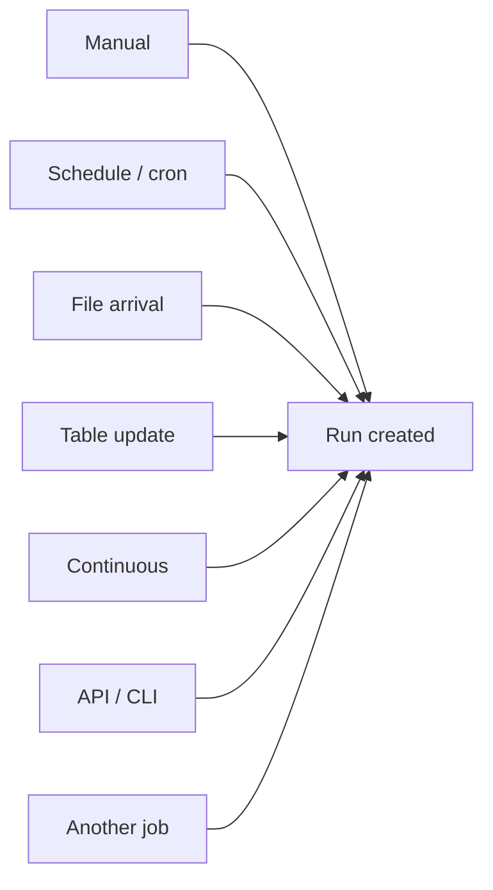
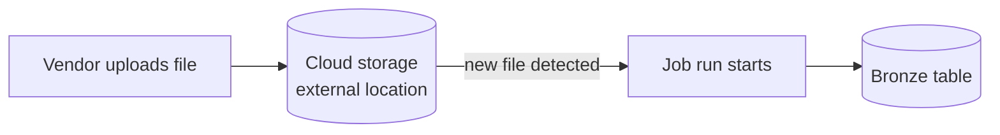
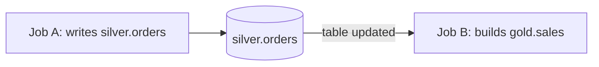
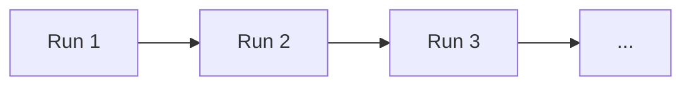
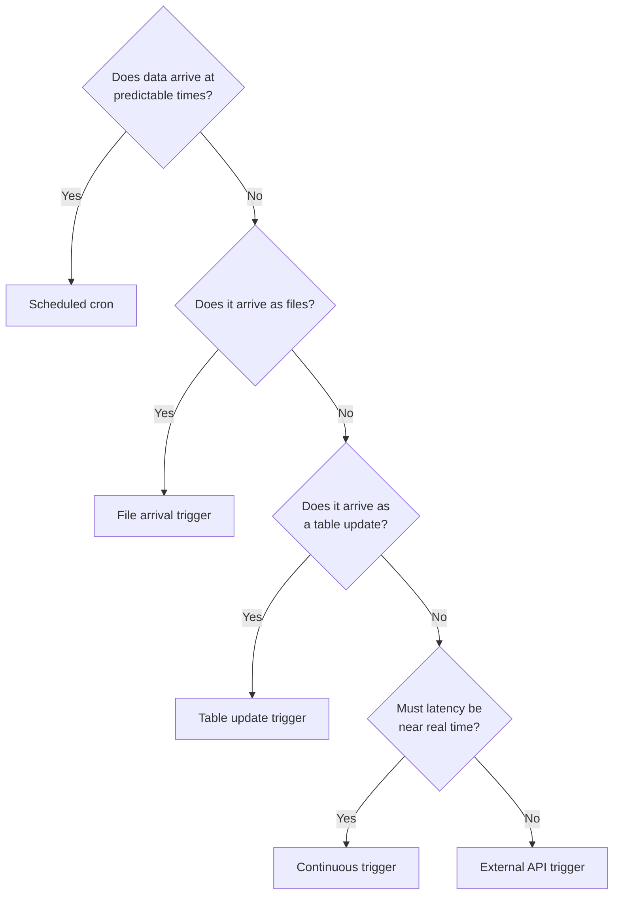

# Scheduling and Triggers

## First Principle: Something Must Press Start

A job definition does nothing on its own. A **trigger** is whatever causes a run
to be created.



---

## Trigger Types at a Glance

| Trigger | Starts when | Typical use |
|---------|-------------|-------------|
| **Manual** | A person clicks Run now | Development, backfills |
| **Scheduled (cron)** | The clock matches | Daily/hourly batch ETL |
| **File arrival** | New files appear in a location | Vendor drops a file at random times |
| **Table update** | A Delta table gets new commits | Decoupled downstream pipelines |
| **Continuous** | Always; restarts itself | Near real-time pipelines |
| **API / CLI** | An external system calls Databricks | ADF, Airflow, an app |

---

## Scheduled Triggers (Cron)

Databricks uses **Quartz cron**, which has **6 or 7 fields**, not the 5 fields of
Linux cron. This trips up nearly everyone once.

```text
Quartz format:

┌───────────── seconds        (0-59)
│ ┌─────────── minutes        (0-59)
│ │ ┌───────── hours          (0-23)
│ │ │ ┌─────── day of month   (1-31)
│ │ │ │ ┌───── month          (1-12)
│ │ │ │ │ ┌─── day of week    (1-7, 1 = Sunday)
│ │ │ │ │ │
0 0 6 * * ?
```

The `?` means "no specific value" and is required in either day-of-month or
day-of-week, because the two would otherwise conflict.

### Common expressions

| Schedule | Expression |
|----------|------------|
| Every day at 06:00 | `0 0 6 * * ?` |
| Every hour on the hour | `0 0 * * * ?` |
| Every 15 minutes | `0 0/15 * * * ?` |
| Every weekday at 07:30 | `0 30 7 ? * MON-FRI` |
| Every Sunday at 02:00 | `0 0 2 ? * SUN` |
| First day of month, 01:00 | `0 0 1 1 * ?` |
| Every 5 minutes, 9am to 6pm | `0 0/5 9-18 * * ?` |

### Timezones and DST

```text
timezone_id: "Asia/Kolkata"   → schedule follows that zone
timezone_id: "UTC"            → immune to daylight saving changes
```

With a DST-observing zone, a 02:30 schedule can **run twice or not at all** on
switch days. For financial or regulatory pipelines, schedule in **UTC**.

### Pausing

Every schedule has a pause status. Pausing is the safe way to stop a job during
an incident or a migration, instead of deleting the schedule and losing it.

```yaml
schedule:
  quartz_cron_expression: "0 0 6 * * ?"
  timezone_id: "UTC"
  pause_status: UNPAUSED   # or PAUSED
```

---

## File Arrival Trigger

Instead of polling on a schedule, run the job when new files show up in an
external location or Unity Catalog volume.



```yaml
trigger:
  file_arrival:
    url: "s3://landing-zone/vendor-a/"
    min_time_between_triggers_seconds: 300
    wait_after_last_change_seconds: 60
```

| Setting | Why it exists |
|---------|---------------|
| `min_time_between_triggers_seconds` | Stops a storm of runs when many files land |
| `wait_after_last_change_seconds` | Waits for a multi-file upload to finish before starting |

**Use when:** a partner or upstream system delivers files at unpredictable
times and you want low latency without running an empty job every 10 minutes.

**Requirement:** the location must be a Unity Catalog external location or
volume that the job has read access to.

---

## Table Update Trigger

Start a job when one or more Delta tables receive new data.



```yaml
trigger:
  table_update:
    table_names:
      - main.silver.orders
      - main.silver.customers
    condition: ALL_UPDATED       # or ANY_UPDATED
    min_time_between_triggers_seconds: 600
```

This is the cleanest way to decouple teams: the gold team does not need to know
when the silver team runs, only which table they consume.

| Condition | Fires when |
|-----------|------------|
| `ANY_UPDATED` | Any listed table changes |
| `ALL_UPDATED` | Every listed table has changed since the last run |

---

## Continuous Trigger

A continuous job runs all the time. When a run finishes or fails, Databricks
immediately starts a new one.



```yaml
continuous:
  pause_status: UNPAUSED
```

```text
Use for:  streaming pipelines that must always be on
Not for:  batch work — it will burn compute all day
Note:     max_concurrent_runs must be 1
Backoff:  repeated failures are retried with increasing delay
```

For streaming, compare with Structured Streaming triggers (covered in topic 11)
and with DLT continuous pipelines (topic 13). A continuous **job** keeps a
**stream** alive; they are different layers.

---

## Triggering from Outside Databricks

### REST API

```bash
curl -X POST https://<workspace>.cloud.databricks.com/api/2.2/jobs/run-now \
  -H "Authorization: Bearer $DATABRICKS_TOKEN" \
  -H "Content-Type: application/json" \
  -d '{
        "job_id": 620745,
        "job_parameters": { "run_date": "2026-09-18" }
      }'
```

### CLI

```bash
databricks jobs run-now 620745 --json '{"job_parameters":{"run_date":"2026-09-18"}}'
```

### Python SDK

```python
from databricks.sdk import WorkspaceClient

w = WorkspaceClient()
run = w.jobs.run_now(job_id=620745, job_parameters={"run_date": "2026-09-18"})
print(run.run_id)
```

**Use when:** an enterprise orchestrator (Azure Data Factory, Airflow, Control-M)
owns the master schedule and Databricks is one step inside a larger flow.

---

## Choosing the Right Trigger



---

## Queueing and Overlapping Runs

```text
Queue enabled + max_concurrent_runs = 1
  → a run that fires while another is active waits in a queue

Queue disabled + max_concurrent_runs = 1
  → the new run is skipped entirely
```

Choose based on the data:

| Data | Preference |
|------|------------|
| Every batch must be processed | Enable the queue |
| Only the latest state matters | Skip the overlapping run |

---

## Practical Scheduling Advice

```text
✔ Schedule in UTC for anything regulatory or cross-region
✔ Do not schedule everything at exactly 00:00 — stagger to avoid a compute spike
✔ Leave headroom: a 50-minute job should not be scheduled hourly
✔ Give the job a timeout shorter than the schedule interval
✔ Pause instead of delete when stopping a job temporarily
✔ For unpredictable arrivals, prefer file/table triggers over 5-minute polling
```

---

## Common Interview Questions

### Which cron format does Databricks use?

Quartz cron, with 6 or 7 fields including a seconds field, unlike Linux cron
which has 5.

### What does the `?` mean in a Quartz expression?

"No specific value." It is required in either day-of-month or day-of-week
because setting both would be contradictory.

### How do you run a job when a file lands in S3 or ADLS?

Use a **file arrival trigger** pointing at a Unity Catalog external location or
volume.

### How do you make one job start after another team's job?

Use a **table update trigger** on the table the other job writes. This avoids
coupling the two job definitions.

### What is a continuous job and when is it wrong?

A job that immediately restarts after each run. It suits always-on streaming
and is wrong for batch work, because it consumes compute continuously.

---

## Quick Revision

```text
Triggers:
Manual | Cron | File arrival | Table update | Continuous | API

Cron = Quartz, 6-7 fields, ? in day-of-month or day-of-week
Daily 6 AM = 0 0 6 * * ?

File arrival  → unpredictable file drops
Table update  → decouple teams via the table contract
Continuous    → always-on streaming, max_concurrent_runs = 1
API / CLI     → external orchestrator owns the schedule

Overlap control:
queue on  → run waits
queue off → run skipped

Schedule in UTC to avoid DST surprises
```
