# Task Dependencies and DAGs

## First Principle: Order Matters

You cannot clean data that has not been ingested. You cannot aggregate data that
has not been cleaned. Dependencies are how you tell Databricks these facts.

```text
depends_on = "do not start me until these tasks have finished"
```

---

## What is a DAG?

A Databricks job is a **DAG**: a Directed Acyclic Graph.

```text
Directed  → arrows point one way (A → B, never both)
Acyclic   → no loops back to a previous task
Graph     → tasks connected by arrows
```

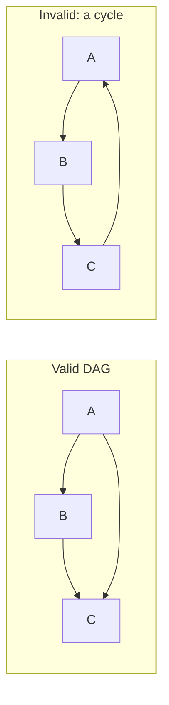

A cycle would mean "A waits for C, and C waits for A" which can never start.
Databricks rejects such a job.

---

## The Four Dependency Shapes

Almost every pipeline is a combination of four shapes.

### 1. Sequential (chain)

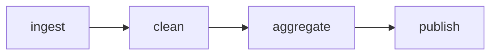

Simple, safe, slow. Runtime = sum of all tasks.

### 2. Fan-out (one to many)

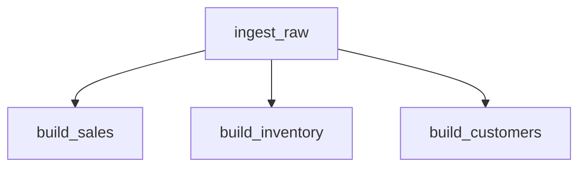

One source feeds several independent outputs that run **in parallel**.

### 3. Fan-in (many to one)

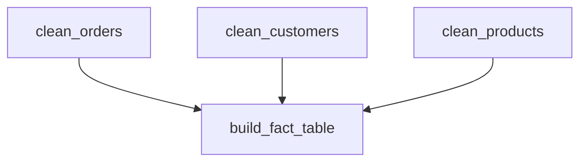

`build_fact_table` starts only when **all three** are successful.

### 4. Diamond (fan-out then fan-in)

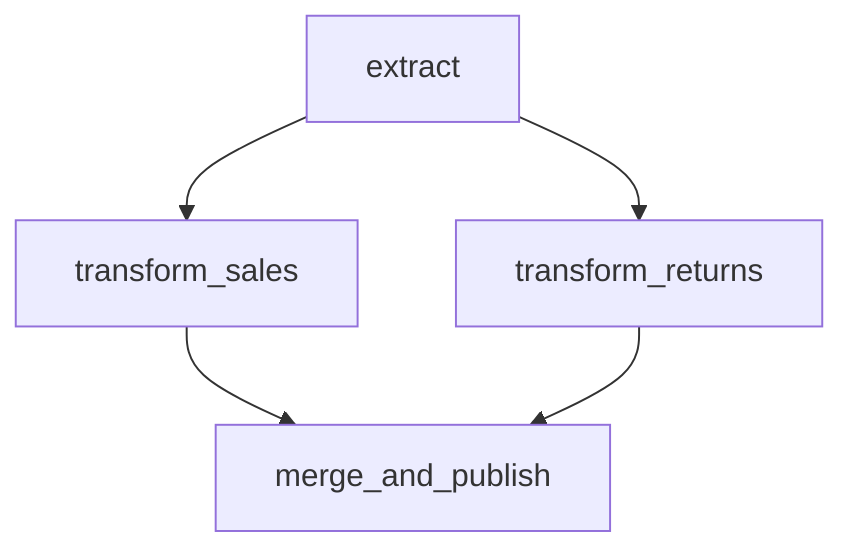

The most common real pipeline shape.

---

## Parallelism Is Free

Tasks with no dependency between them run at the same time automatically.

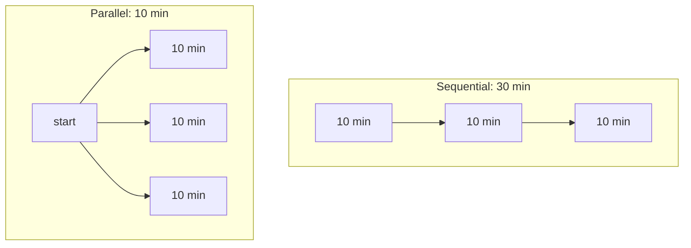

> **Optimisation tip:** if a job feels slow, look for tasks you chained out of
> habit that have no real data dependency. Removing one arrow can cut runtime
> by two thirds.

---

## Run If Conditions

By default a task runs only when **all** upstream tasks succeed. `run_if` changes
that rule.

| `run_if` value | Task runs when |
|----------------|----------------|
| `ALL_SUCCESS` *(default)* | Every dependency succeeded |
| `AT_LEAST_ONE_SUCCESS` | At least one dependency succeeded |
| `NONE_FAILED` | Nothing failed (skipped is OK) |
| `ALL_DONE` | All dependencies finished, success or not |
| `AT_LEAST_ONE_FAILED` | At least one dependency failed |
| `ALL_FAILED` | Every dependency failed |

### Classic use: a cleanup or alert task that always runs

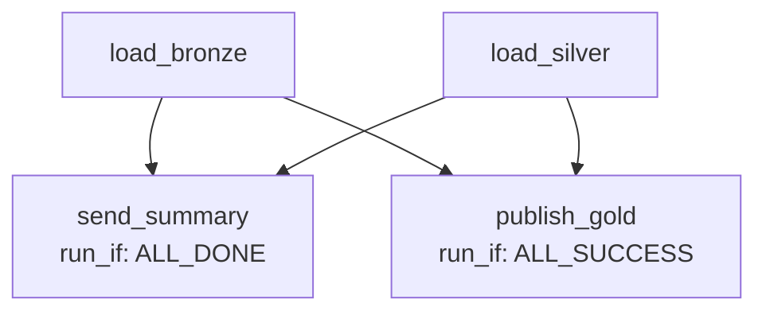

`send_summary` reports the outcome whether the pipeline succeeded or not.
`publish_gold` publishes only on a clean run.

---

## Conditional Branching (If/Else Task)

An **If/else condition** task compares two values and sends the DAG down one of
two paths.

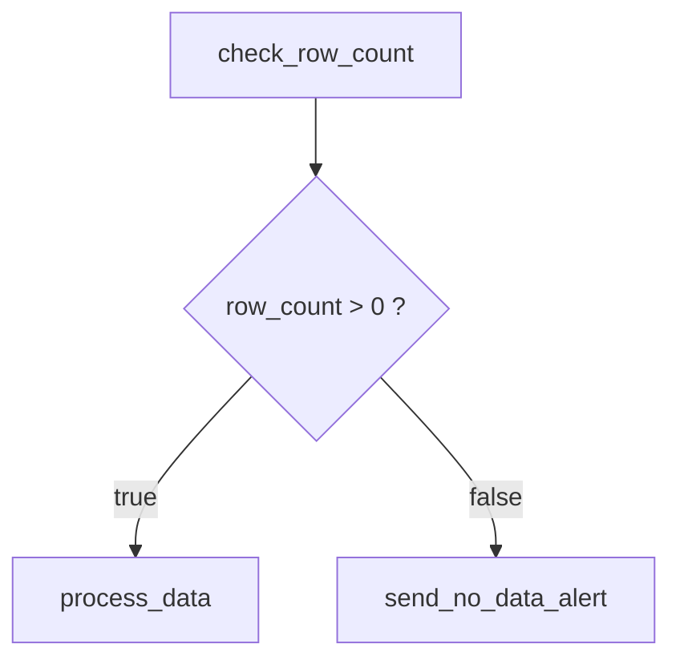

The condition compares a left and right operand using `==`, `!=`, `>`, `>=`,
`<`, `<=`. Operands are usually parameter or task-value references:

```text
Left operand:  {{tasks.check_row_count.values.row_count}}
Operator:      >
Right operand: 0
```

### Real-world uses

| Scenario | Condition |
|----------|-----------|
| Skip work when source is empty | `row_count > 0` |
| Only run full reload on Sundays | `{{job.start_time.[iso_weekday]}} == 7` |
| Deploy model only if it improved | `new_auc > current_auc` |
| Branch by environment | `{{job.parameters.env}} == prod` |

---

## For Each Task (Looping)

A **For each** task repeats a nested task once per item in a list.

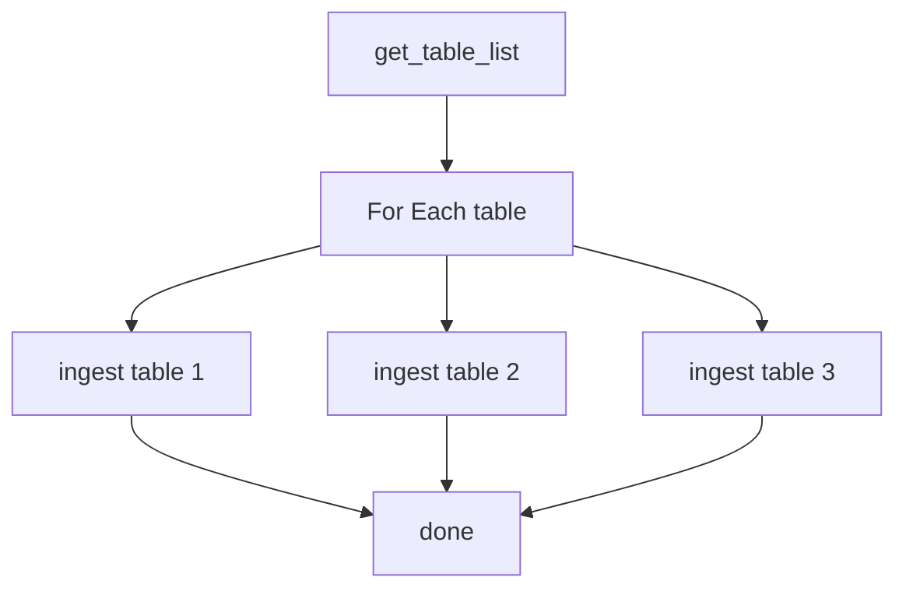

```text
Inputs:      ["orders", "customers", "products"]
Concurrency: 3   (how many iterations run at once)
Nested task: ingest_table  with parameter table = {{input}}
```

This replaces the anti-pattern of copy-pasting the same task 40 times for
40 source tables.

**Use for-each when:** the same logic applies to many similar inputs
(tables, regions, files, dates).

---

## Depends On Multiple Tasks

```yaml
tasks:
  - task_key: build_fact_sales
    depends_on:
      - task_key: clean_orders
      - task_key: clean_customers
      - task_key: clean_products
    notebook_task:
      notebook_path: /Repos/prod/gold/build_fact_sales
```

A task can list as many dependencies as it needs. The job graph is built from
all `depends_on` entries.

---

## What Happens When a Task Fails

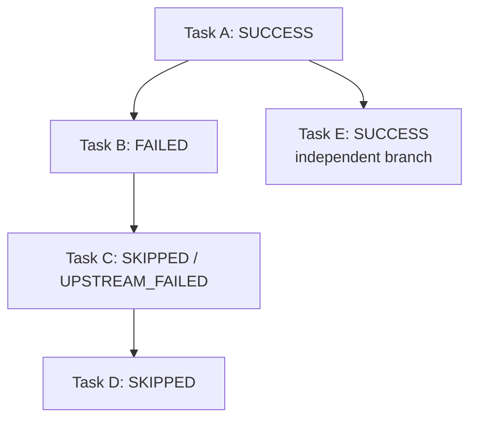

Key behaviours:

- Downstream tasks are **skipped**, not failed. Their status is `UPSTREAM_FAILED`.
- **Independent branches keep running.** Task E finishes normally.
- The **job** is marked failed if any task failed.
- A **repair run** re-runs only the failed and skipped tasks.

---

## Modular Jobs with the Run Job Task

Large pipelines become unreadable as one 40-task DAG. Split them into child jobs.

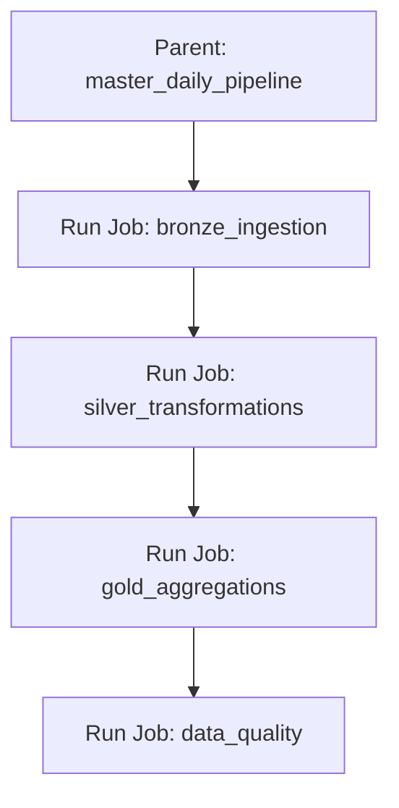

Benefits:

```text
✔ Each child job can be run, tested, and owned separately
✔ Different teams own different jobs
✔ The parent DAG stays readable
✔ Child jobs are reusable across several parents
```

Trade-off: an extra layer to look through when debugging.

---

## Cross-Job Coordination Patterns

| Need | Pattern |
|------|---------|
| Job B always follows Job A | Put both in one parent job using Run Job tasks |
| Job B should start when a table updates | Use a **table update trigger** on Job B |
| Job B is owned by another team | Table trigger or file arrival trigger, so teams stay decoupled |
| External system must start the job | Trigger via REST API or the CLI |

---

## Designing a Good DAG: Checklist

```text
✔ Do two tasks really depend on each other, or did I chain them by habit?
✔ Can independent ingests run in parallel?
✔ Is there a cleanup/alert task with run_if = ALL_DONE?
✔ Are repeated tasks replaced by a For Each?
✔ Is the DAG small enough to read on one screen?
✔ Could a failure halfway leave data in a half-written state?
```

---

## Common Interview Questions

### What is a DAG in Databricks Workflows?

A directed acyclic graph of tasks, where arrows are `depends_on` relationships
and no cycles are allowed.

### If a task fails, what happens to downstream tasks?

They are skipped with status `UPSTREAM_FAILED`. Independent branches continue,
and the overall job is marked as failed.

### How do you run a task even when an upstream task fails?

Set `run_if` to `ALL_DONE` (or `AT_LEAST_ONE_FAILED` for failure-only handlers).

### How do you loop over a list of tables in a job?

Use a **For Each** task with the list as input and a nested task that receives
`{{input}}` as a parameter.

### How do you split a very large pipeline?

Use **Run Job** tasks so a parent job orchestrates smaller child jobs.

---

## Quick Revision

```text
DAG = Directed + Acyclic + Graph

Shapes:
Sequential | Fan-out | Fan-in | Diamond

No dependency = automatic parallelism

run_if:
ALL_SUCCESS (default) | ALL_DONE | NONE_FAILED
AT_LEAST_ONE_SUCCESS | AT_LEAST_ONE_FAILED | ALL_FAILED

Control-flow tasks:
If/Else  → branch
For Each → loop
Run Job  → call another job

On failure:
downstream = SKIPPED, independent branches = still run
```
