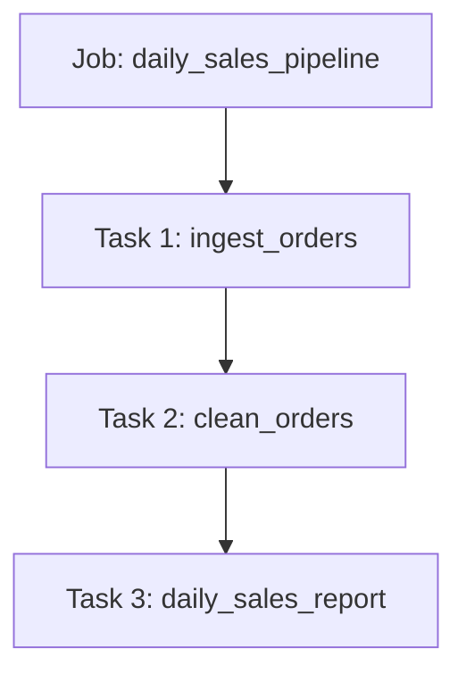
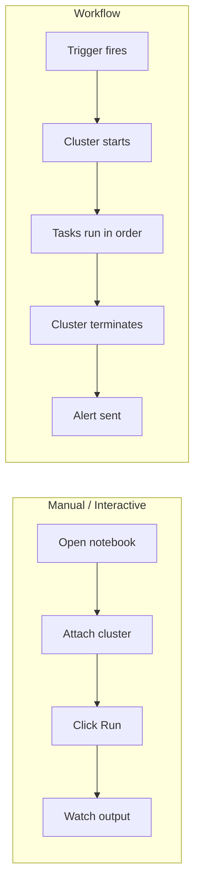
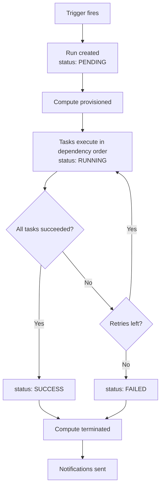
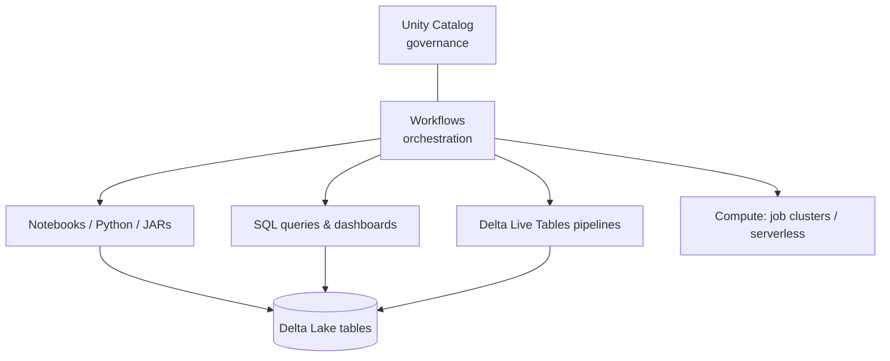

# Workflow Basics

## The Problem First

Imagine you have written three notebooks:

```text
1. ingest_orders      → pull raw files into a Bronze table
2. clean_orders       → clean and deduplicate into Silver
3. daily_sales_report → aggregate into Gold
```

They must run **every morning at 6 AM**, **in that exact order**, and if step 2
fails, step 3 must **not** run with stale data.

Doing this manually means:

```text
❌ Someone must wake up and click Run
❌ Someone must remember the order
❌ Someone must notice failures
❌ Someone must re-run the failed part
```

This is the problem **orchestration** solves.

---

## What is Orchestration?

Orchestration answers four questions about your pipeline:

```text
WHAT runs?     → the tasks
WHEN runs?     → the trigger / schedule
IN WHAT ORDER? → the dependencies
WHAT IF IT FAILS? → retries, alerts, repair
```

An orchestrator is simply a reliable robot that answers these four questions
for you, forever.

---

## What is a Databricks Workflow?

**Databricks Workflows** is the built-in orchestrator of the Databricks platform.

A Workflow is made of **Jobs**, and a Job is made of **Tasks**.



If Task 1 fails, Task 2 and Task 3 never start. That single guarantee is most
of the value of a workflow.

---

## Key Vocabulary

| Term | Meaning | Analogy |
|------|---------|---------|
| **Job** | The whole pipeline definition | A recipe |
| **Task** | One step inside the job | One step of the recipe |
| **Dependency** | "Run B only after A" | "Boil water before adding pasta" |
| **Trigger** | What starts the job | The kitchen timer |
| **Run** | One execution of the job | Cooking the dish today |
| **Run ID** | Unique number for that execution | Today's ticket number |

> A **Job** is the *definition*. A **Run** is one *execution* of that definition.
> A job you never trigger has zero runs.

---

## Why Not Just Use a Scheduler / Cron?

A plain cron job can start something at 6 AM. It cannot:

```text
❌ Understand that step 3 depends on step 2
❌ Retry only the failed step
❌ Pass values between steps
❌ Spin up and shut down a cluster automatically
❌ Show you a visual history of every run
```

Workflows do all of this.

---

## Workflows vs Notebook-Driven Execution



| Aspect | Interactive Notebook | Workflow |
|--------|---------------------|----------|
| Started by | A human | A trigger |
| Cluster | All-Purpose (stays on) | Job cluster (starts and dies) |
| Cost | Higher (idle cluster) | Lower (pay only while running) |
| Repeatable | Depends on the human | Always identical |
| History | Lost on detach | Stored run history |
| Failure handling | Manual | Retries + alerts |

---

## Anatomy of a Simple Job

```text
Job: daily_sales_pipeline
├── Trigger:  cron "every day at 06:00"
├── Compute:  job cluster, 2 workers, DBR 14.3 LTS
├── Tasks:
│   ├── ingest_orders          (notebook)
│   ├── clean_orders           (notebook, depends on ingest_orders)
│   └── daily_sales_report     (SQL,      depends on clean_orders)
├── Retries:  2 attempts, 5 min apart
└── Notify:   email data-team@company.com on failure
```

That text block is essentially the entire mental model of a Databricks job.

---

## The Lifecycle of a Run



Understanding this single diagram explains almost every question a beginner has
about "why is my job pending" or "why did my cluster disappear".

---

## Where Workflows Fit in the Platform



Workflows sit **above** your code and **below** your business schedule. They do
not transform data themselves — they decide *when* and *in what order* your
code transforms data.

---

## Real-World Use Cases

| Use case | What the workflow does |
|----------|------------------------|
| **Daily ETL** | 6 AM: ingest → clean → aggregate → refresh dashboard |
| **Hourly ingestion** | Every hour: pull API data into Bronze |
| **File-driven load** | A file lands in the lake → job starts within minutes |
| **ML retraining** | Every Sunday: retrain model, evaluate, register if better |
| **Data quality gate** | Run checks; if they fail, stop downstream tasks and alert |
| **Month-end close** | 1st of month: heavy reconciliation across many tables |

---

## Common Beginner Mistakes

```text
❌ Running production code on an All-Purpose cluster
   → expensive, and someone can restart it under you

❌ Putting the entire pipeline in one giant notebook task
   → a failure at the end re-runs everything from the start

❌ No notifications configured
   → the pipeline is broken for three days before anyone notices

❌ Hard-coding dates inside the notebook
   → you can never re-run yesterday's load

❌ Tasks that are not idempotent
   → a retry double-inserts the data
```

Each of these is fixed by a concept in the next files.

---

## Quick Revision

```text
Orchestration = WHAT + WHEN + ORDER + WHAT IF IT FAILS

Job   = pipeline definition
Task  = one step
Run   = one execution

Interactive notebook → a human runs it
Workflow             → the platform runs it

Biggest wins:
✔ Correct order guaranteed
✔ Cheap job clusters
✔ Automatic retries
✔ Failure alerts
✔ Full run history
```
