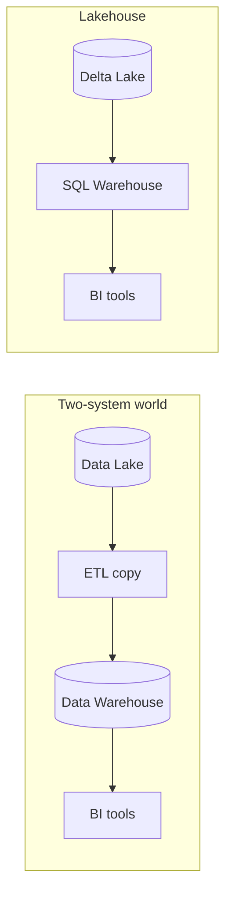
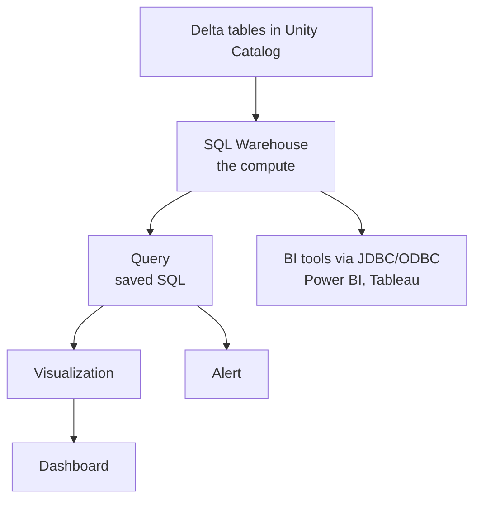

# 09 – Databricks SQL

Databricks SQL is the **analytics front door** of the Lakehouse. Data engineers
build the tables; Databricks SQL is how analysts, dashboards, and BI tools query
them without ever touching a notebook or a Spark cluster.

```text
Notebooks        → for engineers writing pipelines
Databricks SQL   → for analysts asking questions
Same Delta tables, same governance, different interface
```

---

## Why It Exists

Before the Lakehouse, analytics meant copying data out of the lake into a
separate data warehouse.



```text
Two systems = two copies, two security models, stale data, double cost
Lakehouse   = one copy, one governance layer, fresh data
```

---

## Reading Order

| # | File | What you learn |
|---|------|----------------|
| 1 | [sql_warehouses.md](sql_warehouses.md) | The compute behind Databricks SQL |
| 2 | [queries_and_editor.md](queries_and_editor.md) | Writing, saving, parameterising queries |
| 3 | [dashboards_and_visualizations.md](dashboards_and_visualizations.md) | Turning queries into dashboards |
| 4 | [alerts_and_automation.md](alerts_and_automation.md) | Alerts, scheduled refreshes, jobs |
| 5 | [performance_and_cost.md](performance_and_cost.md) | Making queries fast and cheap |
| 6 | [interview_questions.md](interview_questions.md) | Questions asked in interviews |

---

## The Mental Model



---

## Quick Revision

```text
SQL Warehouse = compute for SQL workloads (not a Spark cluster you configure)
Query         = saved SQL, optionally parameterised
Visualization = a chart built on a query result
Dashboard     = a layout of visualizations, refreshable and schedulable
Alert         = a query plus a condition plus a notification
Governance    = Unity Catalog, same as everywhere else
```
