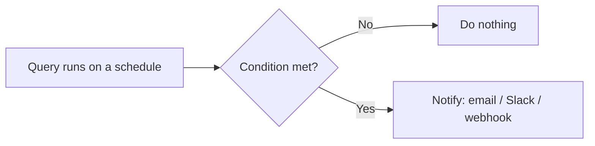
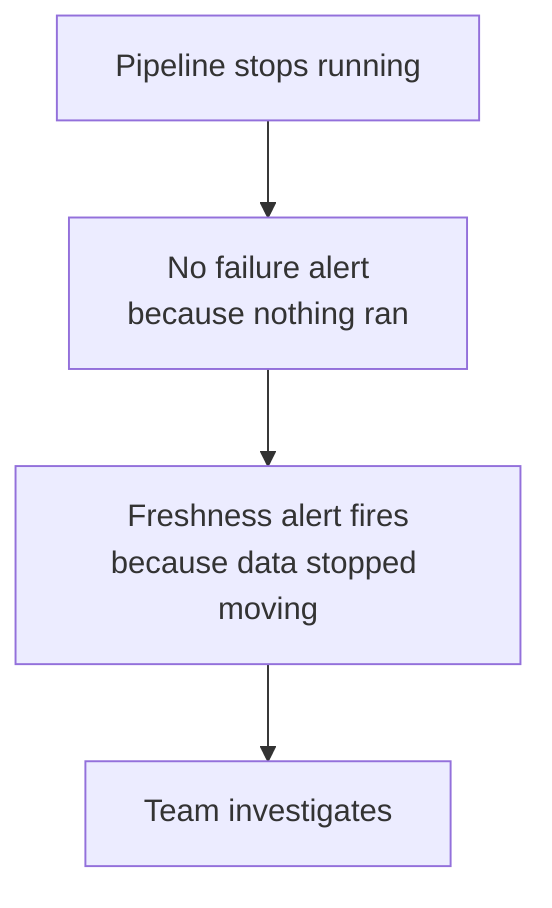
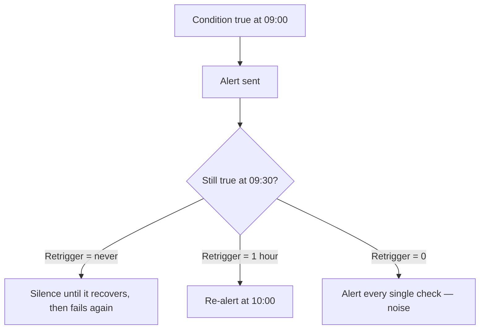
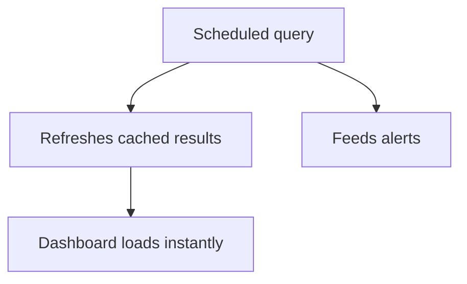
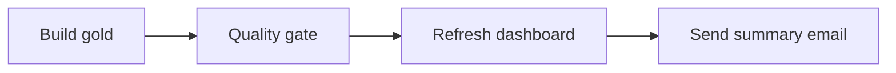
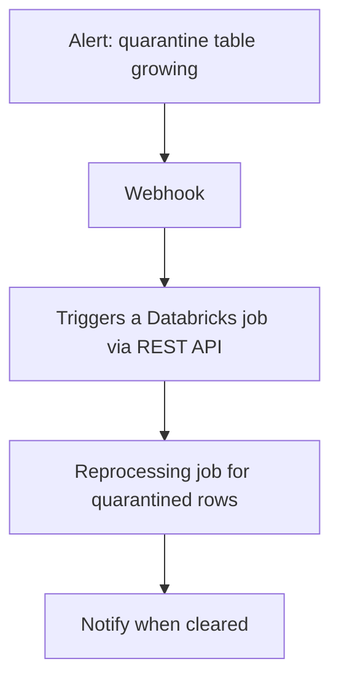
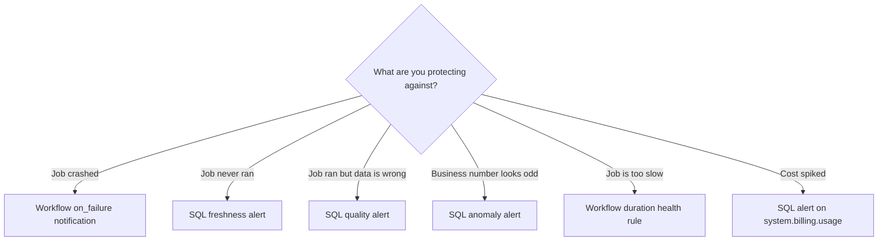

# Alerts and Automation

## Why Alerts Exist

A dashboard tells you something **when you look at it**. An alert tells you
something **when it happens**.

```text
Dashboard → pull model → you must remember to check
Alert     → push model → the data contacts you
```



---

## Anatomy of an Alert

```text
Alert
├── Query        the SQL that produces a value
├── Column       which column to evaluate
├── Condition    > < = != on a threshold
├── Schedule     how often to check
├── Destinations who to notify
├── Template     the message body
└── Retrigger    how often it may re-alert while still failing
```

---

## Building a Data Quality Alert

```sql
-- Alert query: rows failing validation today
SELECT count(*) AS bad_rows
FROM main.silver.orders
WHERE order_date = current_date()
  AND (order_id IS NULL OR amount < 0);
```

```text
Column:    bad_rows
Condition: > 0
Schedule:  every 30 minutes
Notify:    #data-quality Slack channel
```

---

## Building a Freshness Alert

The most valuable alert in most platforms. It catches the silent failure where a
pipeline stops running and nobody notices.

```sql
SELECT
    datediff(current_timestamp(), max(ingested_at)) AS hours_stale
FROM main.bronze.orders;
```

```text
Column:    hours_stale
Condition: > 26          -- a daily pipeline should never be 26 hours stale
Schedule:  hourly
Notify:    on-call
```



> Job failure alerts catch jobs that **ran and failed**. Freshness alerts catch
> jobs that **never ran at all** — a paused schedule, a deleted trigger, a
> deleted job. You need both.

---

## Building a Business Anomaly Alert

```sql
WITH daily AS (
    SELECT order_date, sum(total_revenue) AS revenue
    FROM main.gold.daily_sales_summary
    WHERE order_date >= current_date() - INTERVAL 30 DAYS
    GROUP BY order_date
),
baseline AS (
    SELECT avg(revenue) AS avg_rev, stddev(revenue) AS sd_rev
    FROM daily WHERE order_date < current_date()
)
SELECT
    round(100.0 * (d.revenue - b.avg_rev) / nullif(b.avg_rev, 0), 1) AS pct_deviation
FROM daily d CROSS JOIN baseline b
WHERE d.order_date = current_date() - INTERVAL 1 DAY;
```

```text
Column:    pct_deviation
Condition: < -30        -- yesterday was 30% below the 30-day average
Notify:    analytics team + business owner
```

This is where data engineering earns trust: catching a broken upstream feed
before the business reports a bad number in a meeting.

---

## Alert Message Templates

Generic alerts get ignored. Specific alerts get acted on.

```text
❌ "Alert triggered: Data Quality Check"

✅ "DATA QUALITY: {{QUERY_RESULT_VALUE}} invalid rows in silver.orders
    for {{QUERY_RESULT_ROWS}}.
    Runbook: https://wiki/runbooks/silver-orders
    Owner: @data-platform-oncall
    Dashboard: {{QUERY_URL}}"
```

Available template variables include `{{ALERT_NAME}}`, `{{ALERT_STATUS}}`,
`{{QUERY_NAME}}`, `{{QUERY_URL}}`, `{{QUERY_RESULT_VALUE}}`,
`{{QUERY_RESULT_TABLE}}`.

```text
A good alert answers three questions in the message itself:
1. What is wrong?
2. How bad is it?
3. What do I do about it?
```

---

## Retrigger and Alert Fatigue



```text
✔ Set retrigger to a sensible interval (1 to 24 hours)
✔ Route by severity: paging for critical, Slack for informational
✔ Every alert has a named owner and a runbook link
✔ Delete alerts that nobody has acted on in three months
```

An alert nobody acts on is worse than no alert, because it trains people to
ignore the channel.

---

## Alerts as Code

```yaml
resources:
  sql_alerts:
    freshness_bronze_orders:
      display_name: "Bronze orders stale"
      query_id: "q-abc123"
      condition:
        op: GREATER_THAN
        operand:
          column:
            name: hours_stale
        threshold:
          value:
            double_value: 26
      schedule:
        quartz_cron_schedule: "0 0 * * * ?"
        timezone_id: "UTC"
      notify_on_ok: true
```

```bash
databricks alerts create --json @alert.json
databricks alerts list
```

Keeping alerts in Git means a new environment gets the same guardrails on day
one, instead of being discovered unmonitored six months later.

---

## Scheduled Queries and Refreshes



```text
Schedule a query when:
✔ A dashboard should be pre-warmed before a daily meeting
✔ An alert needs a regular evaluation
✔ A materialized view needs refreshing

Do not schedule a query when:
✘ The underlying pipeline already refreshes the dashboard
✘ Nobody looks at the result — it is pure cost
```

---

## Automation Patterns

### Pattern 1: Pipeline-driven refresh



Everything in one job, so the dashboard can never show half-built data.

### Pattern 2: Alert-driven remediation



### Pattern 3: SLA monitoring loop

```sql
-- Which pipelines missed their SLA yesterday?
SELECT
    j.name AS job_name,
    r.period_start_time,
    r.result_state,
    (unix_timestamp(r.period_end_time) - unix_timestamp(r.period_start_time)) / 60 AS minutes
FROM system.lakeflow.job_run_timeline r
JOIN system.lakeflow.jobs j USING (job_id)
WHERE r.period_start_time >= current_date() - INTERVAL 1 DAY
  AND (r.result_state != 'SUCCEEDED'
       OR (unix_timestamp(r.period_end_time) - unix_timestamp(r.period_start_time)) > 3600);
```

Wire this query to an alert and you have platform-wide SLA monitoring in about
fifteen lines.

---

## Choosing Between Alert Types



A mature platform has all six. Most teams start with only the first and wonder
why bad data still reaches production.

---

## Cost Alert Example

```sql
SELECT
    round(sum(usage_quantity), 1) AS dbus_yesterday
FROM system.billing.usage
WHERE usage_date = current_date() - INTERVAL 1 DAY;
```

```text
Condition: > 500      -- tune to your normal baseline
Notify:    platform owner
```

Catching a runaway 4X-Large warehouse the next morning is far better than
finding it on the monthly invoice.

---

## Common Interview Questions

### What is a Databricks SQL alert?

A scheduled query plus a condition on one of its result columns, which sends
notifications to configured destinations when the condition is met.

### How do you detect a pipeline that silently stopped running?

A freshness alert on `max(ingested_at)`, because a job that never runs produces
no failure notification.

### How do you avoid alert fatigue?

Set retrigger intervals, route by severity, give every alert an owner and a
runbook, and delete alerts nobody acts on.

### How do you keep a dashboard in sync with the pipeline?

Refresh it as the final task of the job that builds the underlying tables, rather
than scheduling it independently.

### How would you build platform-wide SLA monitoring?

Query `system.lakeflow.job_run_timeline` for failures and overruns, and attach an
alert to that query.

---

## Quick Revision

```text
Alert = query + column + condition + schedule + destination + template

Essential alerts:
1. Job failure        → Workflow on_failure
2. Job never ran      → SQL freshness alert
3. Bad data           → SQL quality alert
4. Odd business value → SQL anomaly alert
5. Slow job           → Workflow duration health rule
6. Cost spike         → SQL alert on system.billing.usage

Message must answer: what is wrong, how bad, what to do

Anti-fatigue: retrigger interval + severity routing + owner + runbook

Refresh dashboards from the pipeline, not from a separate clock
```
