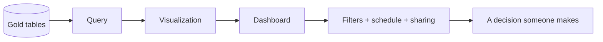
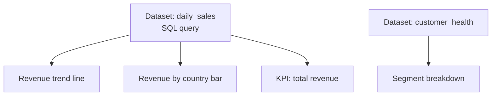
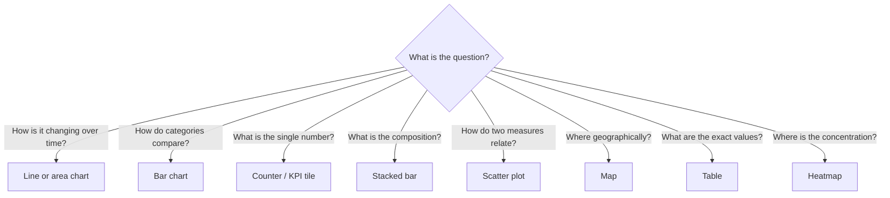
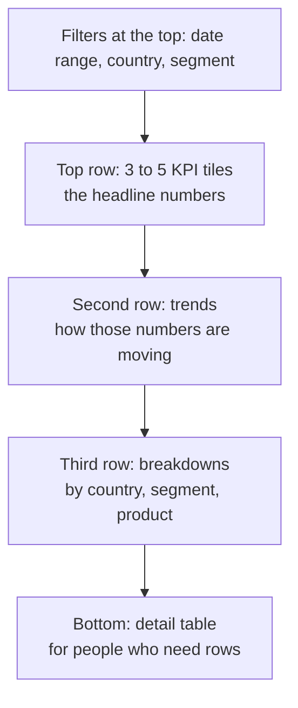
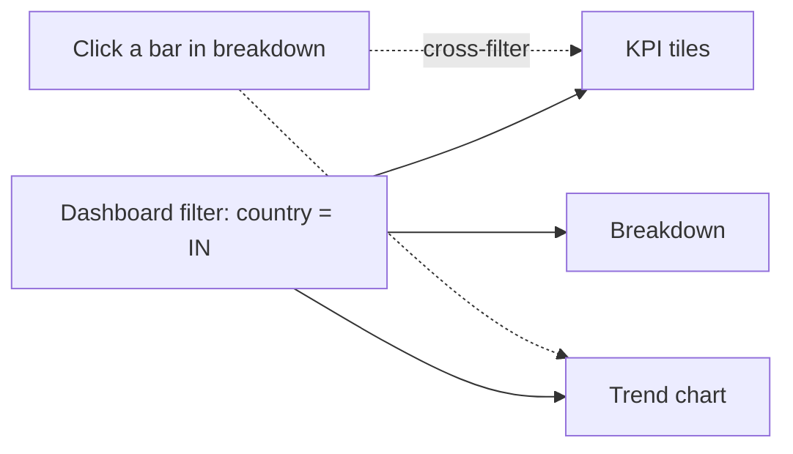
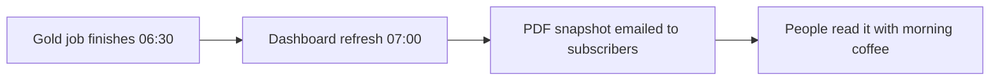
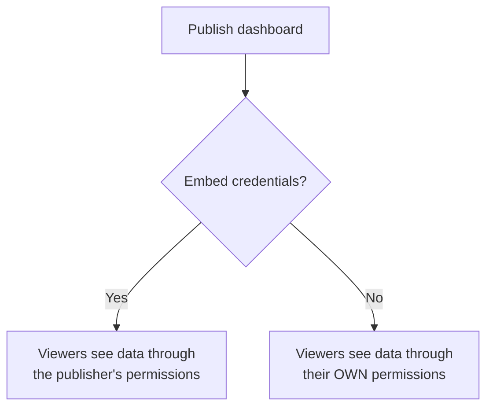
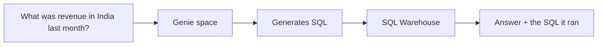
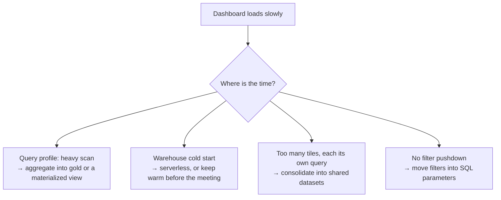

# Dashboards and Visualizations

## From Query to Decision



A dashboard is not the goal. A decision is. Every tile should answer a question
someone actually asks.

---

## AI/BI Dashboards vs Legacy Dashboards

Databricks has two generations. Know both, build with the new one.

| | AI/BI Dashboards (current) | Legacy SQL Dashboards |
|---|---|---|
| Layout | Free-form canvas | Grid of query widgets |
| Data source | Datasets defined in the dashboard | One saved query per widget |
| Cross-filtering | Yes, click a chart to filter others | No |
| Natural language | Genie conversational queries | No |
| Publishing | Publish with embedded credentials | Share with run-as options |
| Recommendation | Use this | Migrate away |

---

## The Dataset Model

In AI/BI dashboards, you define **datasets** once and build many visualizations
on them.



```sql
-- Dataset: daily_sales
SELECT
    order_date,
    country,
    segment,
    order_count,
    total_revenue,
    avg_order_value
FROM main.gold.daily_sales_summary
WHERE order_date >= current_date() - INTERVAL 90 DAYS
```

```text
One dataset, many charts → one query execution, consistent numbers
Separate query per chart → N executions, and charts that disagree with each other
```

That second failure mode is why executives stop trusting dashboards.

---

## Choosing the Right Chart



| Question shape | Chart | Avoid |
|----------------|-------|-------|
| Trend over time | Line | Pie |
| Compare categories | Horizontal bar | 3D anything |
| Part of a whole | Stacked bar (or pie with 2 to 4 slices) | Pie with 12 slices |
| Single metric vs target | Counter with comparison | A bar with one bar |
| Distribution | Histogram / box plot | Average alone |
| Correlation | Scatter | Dual-axis line |

```text
Rule: if a pie chart has more than four slices, it should be a bar chart.
Rule: an average without a distribution hides the story.
```

---

## Building a Dashboard That People Use



Layout principles:

```text
✔ Most important number top-left — that is where eyes land first
✔ Answer "is it good or bad?" not just "what is it?" (add comparisons)
✔ Every chart needs a title that states the takeaway, not the column name
   "Revenue down 12% week over week"  >  "sum_total_revenue by week"
✔ Consistent units and date grain across all tiles
✔ Fewer than about 10 tiles per page; split into tabs beyond that
✔ Add a "data as of" timestamp tile so staleness is visible
```

```sql
-- Freshness tile
SELECT max(order_date) AS data_through,
       datediff(current_date(), max(order_date)) AS days_behind
FROM main.gold.daily_sales_summary;
```

---

## Filters and Cross-Filtering



Two ways to filter:

| Mechanism | Runs | Use when |
|-----------|------|----------|
| **Dashboard filter widget** | Filters the dataset result client-side, or re-runs the query | Small to medium datasets |
| **Query parameter** | Pushes the filter into the SQL `WHERE` clause | Large tables — lets Delta prune files |

For big tables always push the date filter into SQL. Filtering 2 billion rows in
the browser is not a plan.

```sql
WHERE order_date BETWEEN :start_date AND :end_date
  AND (:country = 'ALL' OR country = :country)
```

---

## Scheduling and Distribution

```yaml
schedule:
  cron: "0 0 7 * * ?"
  timezone: "Asia/Kolkata"
  warehouse: analytics_serverless
subscribers:
  - leadership@company.com
```



Better than a clock-based refresh: make the **pipeline** refresh the dashboard as
its final task, so the dashboard is never refreshed against half-built data.

```yaml
- task_key: refresh_dashboard
  depends_on: [{ task_key: build_gold_sales }]
  sql_task:
    warehouse_id: "abc123"
    dashboard:
      dashboard_id: "dash456"
```

---

## Sharing and Permissions



| Mode | Result | Use when |
|------|--------|----------|
| **Embedded credentials** | Everyone sees the same numbers | Executive dashboards on aggregated gold data |
| **Viewer credentials** | Each person sees only their permitted rows | Dashboards over sensitive or row-filtered data |

> Publishing with embedded credentials over a table with row-level security
> **bypasses** that security for viewers. This is a real audit finding, not a
> hypothetical. Match the publish mode to the sensitivity of the data.

Permission levels: `CAN VIEW`, `CAN RUN`, `CAN EDIT`, `CAN MANAGE`.

---

## Genie: Natural Language Over Your Data

A Genie space lets business users ask questions in plain language against a
curated set of tables.



Genie works well only when the underlying data is prepared for it:

```text
✔ Curate a small set of clean gold tables — not the whole catalog
✔ Add table and column comments; Genie reads them as context
✔ Provide example question/SQL pairs as instructions
✔ Define metrics once (a metric view) so "revenue" means one thing
✔ Review generated SQL — it is an assistant, not an oracle
```

```sql
COMMENT ON TABLE main.gold.daily_sales_summary IS
  'Daily revenue aggregates by country and customer segment. One row per date/country/segment. Revenue excludes cancelled orders.';

ALTER TABLE main.gold.daily_sales_summary
  ALTER COLUMN total_revenue COMMENT 'Sum of completed order amounts in USD';
```

Good comments are the cheapest investment in making both Genie and humans
understand your tables.

---

## Dashboard Performance



```text
Golden rule: a dashboard should query a small, pre-aggregated gold table.
If a dashboard joins silver tables at query time, the pipeline is incomplete.
```

---

## Common Mistakes

```text
❌ 25 tiles, each with its own near-duplicate query
❌ Charts with column names as titles, so nobody knows what "good" looks like
❌ No date filter, so every load scans all history
❌ No freshness indicator, so stale data looks current
❌ Embedded credentials on a row-filtered table
❌ Dashboards built directly on silver or bronze tables
```

---

## Common Interview Questions

### How do you make a dashboard fast?

Query small pre-aggregated gold tables or materialized views, push filters into
SQL so Delta can prune files, share datasets across tiles, and use a serverless
warehouse to avoid cold starts.

### Difference between embedded and viewer credentials when publishing?

Embedded runs queries as the publisher, so all viewers see identical data.
Viewer credentials run as each viewer, respecting their Unity Catalog grants and
row filters.

### How do you keep a dashboard consistent with the pipeline?

Refresh it as the final task of the job that builds the gold tables, rather than
on an independent clock schedule.

### What is Genie?

A natural language interface over a curated set of tables that generates SQL from
business questions, relying on table comments, instructions, and example queries
for accuracy.

### When would you use a materialized view for a dashboard?

When several dashboards repeatedly compute the same expensive aggregation, and a
scheduled refresh latency is acceptable.

---

## Quick Revision

```text
Dataset → many visualizations → one dashboard

Chart choice:
trend → line | compare → bar | single number → counter
composition → stacked bar | relationship → scatter | exact values → table

Layout: KPIs top → trends → breakdowns → detail table

Filters: push big filters into SQL parameters, not the browser

Refresh: as the last task of the gold job, not on an independent cron

Publishing:
embedded credentials → everyone sees the same
viewer credentials   → respects each user's UC grants

Genie needs: curated gold tables + comments + example SQL

Performance rule: dashboards read gold, never raw silver joins
```
