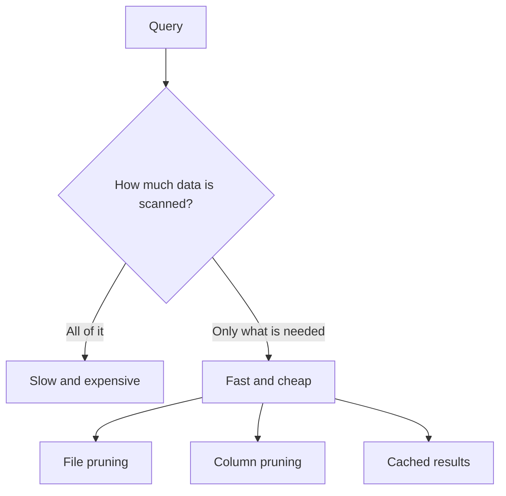
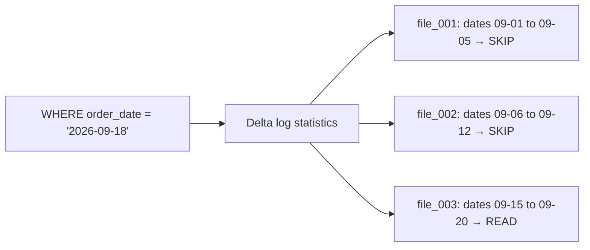
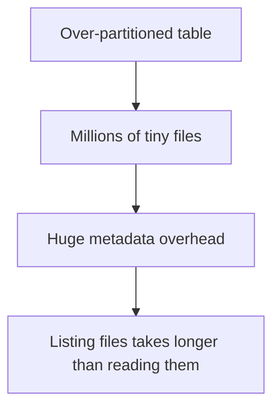
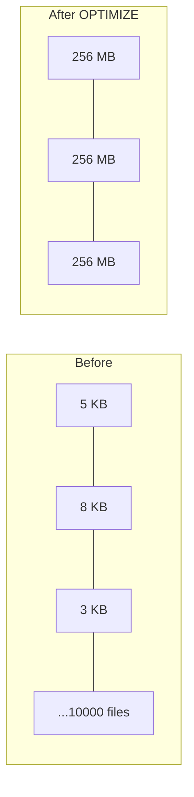
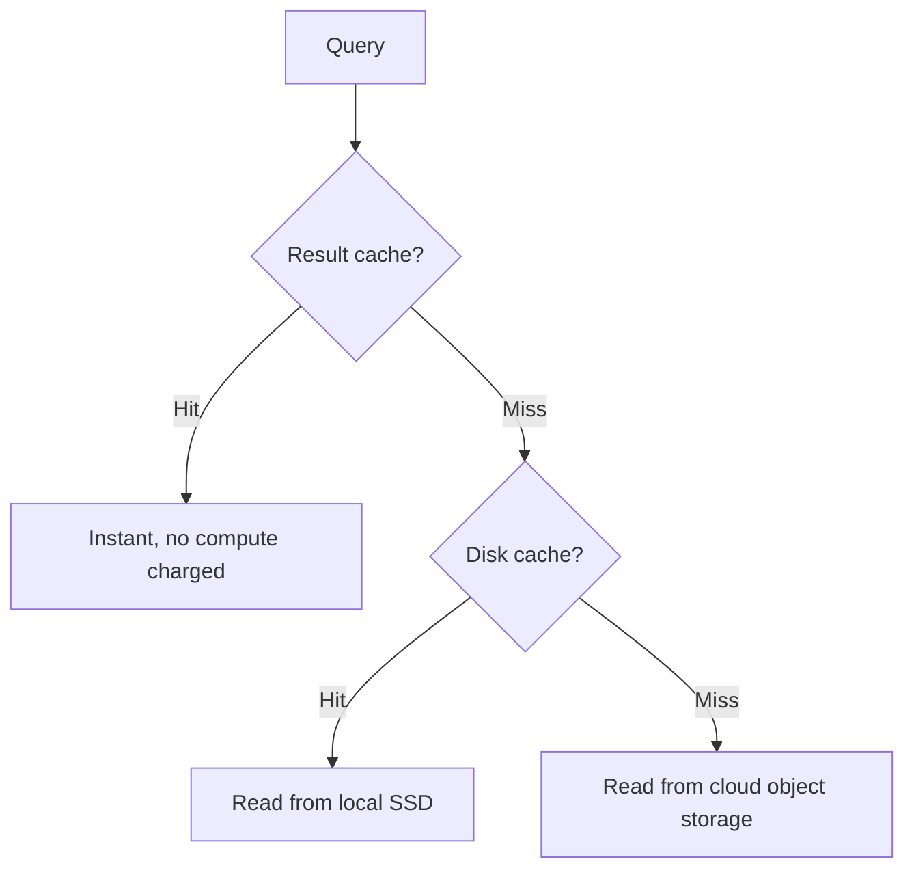
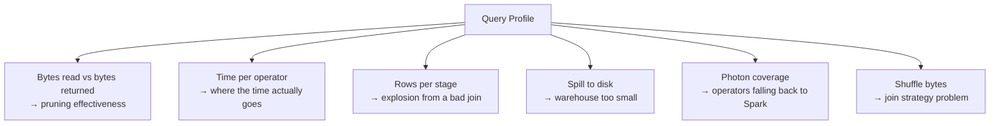
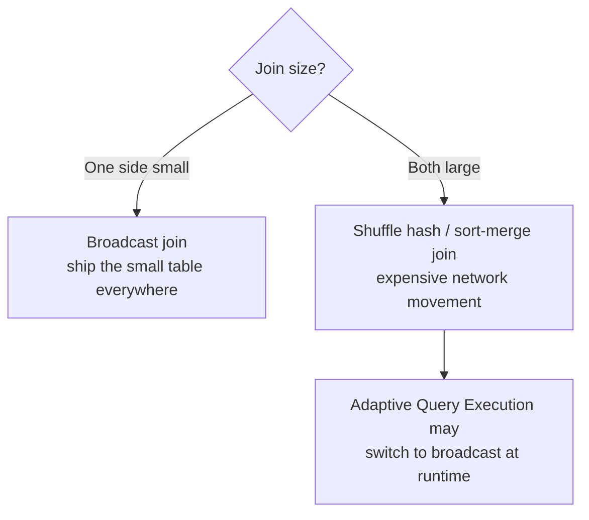
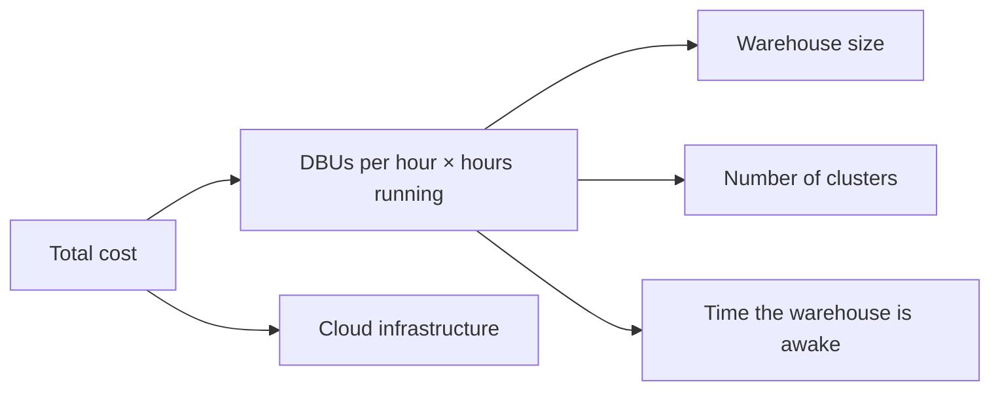
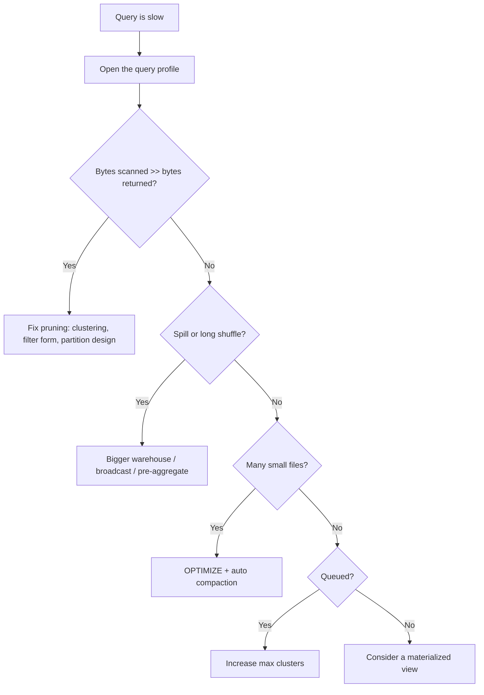

# SQL Performance and Cost

## The Only Question That Matters

```text
How many bytes did this query have to read?
```

Almost every SQL optimisation in Databricks is a way of reading less data.



---

## How Databricks Skips Data

Delta stores statistics (min, max, null count) for the first 32 columns of every
file. A filter can then eliminate whole files without opening them.



This is **data skipping**, and it works automatically — but only if your filter
matches how the data is physically laid out.

---

## Liquid Clustering: the Modern Default

```sql
CREATE TABLE main.gold.sales (
    order_id BIGINT,
    order_date DATE,
    country STRING,
    amount DOUBLE
)
CLUSTER BY (order_date, country);

-- Existing table
ALTER TABLE main.gold.sales CLUSTER BY (order_date, country);
OPTIMIZE main.gold.sales;
```

```text
Liquid clustering:
✔ Replaces both partitioning and Z-ordering
✔ Clustering keys can be changed later without rewriting everything
✔ Handles skew and small files far better than static partitions
✔ Recommended for all new tables
```

| Approach | Change keys later | Skew handling | Small-file risk |
|----------|-------------------|---------------|-----------------|
| Hive-style partitioning | Rewrite the table | Poor | High |
| Z-ordering | Re-run OPTIMIZE | Moderate | Moderate |
| Liquid clustering | `ALTER TABLE` | Good | Low |

---

## Partitioning: When It Still Applies

```text
Partition only when:
✔ The table is large (roughly > 1 TB)
✔ The column has low cardinality (date, region — not customer_id)
✔ Most queries filter on it
✔ Each partition holds at least ~1 GB
```

```sql
-- Reasonable
PARTITIONED BY (order_date)

-- Disastrous: millions of tiny directories
PARTITIONED BY (customer_id)
```



For new tables, prefer liquid clustering over partitioning.

---

## OPTIMIZE and the Small File Problem



```sql
OPTIMIZE main.gold.sales;
OPTIMIZE main.gold.sales WHERE order_date >= current_date() - INTERVAL 7 DAYS;
```

Diagnose first:

```sql
DESCRIBE DETAIL main.gold.sales;
-- numFiles 42000, sizeInBytes 3 GB → average 71 KB → definitely needs OPTIMIZE
```

Enable automatic maintenance so you do not have to remember:

```sql
ALTER TABLE main.gold.sales SET TBLPROPERTIES (
    'delta.autoOptimize.optimizeWrite' = 'true',
    'delta.autoOptimize.autoCompact'   = 'true'
);
```

Or let **predictive optimization** handle OPTIMIZE and VACUUM for Unity Catalog
managed tables automatically.

---

## Caching Layers



| Cache | What it stores | Invalidated by |
|-------|----------------|----------------|
| **Result cache** | Final result of an identical query | Any change to the underlying data, or 24 hours |
| **Disk cache** | Parquet data on cluster SSD | Warehouse restart |
| **Materialized view** | Precomputed aggregate you defined | Its refresh schedule |

```text
Result cache is why the second run of a dashboard is instant.
It is also why "my query got slower" is often just a cache miss after a write.
```

---

## Reading a Query Profile

The query profile is the ground truth. Guessing without it wastes hours.



| Symptom in the profile | Likely cause | Fix |
|------------------------|--------------|-----|
| Scans 500 GB, returns 1 MB | No pruning | Add clustering keys, filter on clustered columns |
| Huge shuffle | Two large tables joined | Broadcast the small side, or pre-aggregate |
| Spill to disk | Not enough memory | Increase warehouse size, reduce data |
| Many small file reads | Small file problem | `OPTIMIZE` |
| Photon coverage low | Python UDF or unsupported operator | Rewrite in SQL or use a built-in function |
| Long time in "queued" | Concurrency limit | Increase max clusters, not size |

---

## Join Strategy



```sql
-- Hint only when AQE gets it wrong
SELECT /*+ BROADCAST(c) */ o.*, c.country
FROM main.silver.orders o
JOIN main.silver.countries c ON o.country_code = c.code;
```

```text
Broadcast when the small side is roughly < 100 MB.
AQE usually detects this automatically at runtime, so hints are a last resort.
```

---

## Adaptive Query Execution

AQE re-plans the query **while it runs**, using real statistics instead of
estimates.

```text
✔ Coalesces too many small shuffle partitions
✔ Switches sort-merge joins to broadcast joins when the side turns out small
✔ Splits skewed partitions into smaller ones
```

It is on by default. The main thing you can do is not fight it with stale hints.

---

## Writing Faster SQL

```sql
-- ❌ Filter that defeats data skipping
WHERE year(order_date) = 2026

-- ✅ Filter that prunes files
WHERE order_date >= '2026-01-01' AND order_date < '2027-01-01'
```

```sql
-- ❌ SELECT * on a 200-column table
SELECT * FROM main.silver.orders;

-- ✅ Only what you need — Parquet is columnar, this genuinely reads less
SELECT order_id, amount, order_date FROM main.silver.orders;
```

```sql
-- ❌ Aggregate the whole table, then filter
SELECT * FROM (SELECT country, sum(amount) s FROM orders GROUP BY country)
WHERE country = 'IN';

-- ✅ Filter first
SELECT country, sum(amount) FROM orders WHERE country = 'IN' GROUP BY country;
```

```sql
-- ❌ DISTINCT as a band-aid for a bad join
SELECT DISTINCT o.order_id, c.name FROM orders o JOIN customers c ...

-- ✅ Fix the join key / duplicate rows at the source
```

```text
Wrapping a filter column in a function usually disables file pruning.
Keep the column bare on the left side of the comparison.
```

---

## Cost Model



```text
You pay for TIME THE WAREHOUSE IS RUNNING, not per query.

Therefore:
✔ Auto stop is the single biggest lever
✔ One shared warehouse beats five idle ones
✔ Serverless removes idle waste entirely for spiky usage
✔ A faster query is cheaper only because the warehouse sleeps sooner
```

---

## Monitoring Cost and Performance

```sql
-- Slowest queries in the last day
SELECT
    executed_by,
    left(statement_text, 100) AS query_start,
    total_duration_ms / 1000 AS seconds,
    read_bytes / 1e9 AS gb_read,
    warehouse_id
FROM system.query.history
WHERE start_time >= current_date() - INTERVAL 1 DAY
ORDER BY total_duration_ms DESC
LIMIT 20;
```

```sql
-- Warehouse spend over 30 days
SELECT
    usage_metadata.warehouse_id,
    round(sum(usage_quantity), 1) AS dbus
FROM system.billing.usage
WHERE usage_date >= current_date() - INTERVAL 30 DAYS
  AND usage_metadata.warehouse_id IS NOT NULL
GROUP BY 1
ORDER BY dbus DESC;
```

```sql
-- Tables that need OPTIMIZE (small file detection)
DESCRIBE DETAIL main.gold.sales;
```

---

## Optimisation Workflow



Work top-down. Increasing the warehouse size first is the most common and most
expensive mistake.

---

## Common Interview Questions

### How does Databricks skip reading data?

Delta stores per-file min/max statistics in the transaction log, so filters can
eliminate whole files. Clustering or partitioning determines how effective that
skipping is.

### Liquid clustering vs partitioning vs Z-ordering?

Partitioning creates physical directories and cannot be changed without a
rewrite. Z-ordering co-locates related data within files via OPTIMIZE. Liquid
clustering supersedes both, allows changing keys later, and handles skew and
small files better.

### Why is `WHERE year(order_date) = 2026` slow?

Wrapping the column in a function prevents file-level pruning, so every file must
be read. Use a range predicate on the bare column instead.

### What does AQE do?

Re-optimises the plan at runtime: coalescing shuffle partitions, converting joins
to broadcast joins, and splitting skewed partitions.

### How is a SQL warehouse billed?

By DBUs consumed while it is running, not per query. Auto stop and right-sizing
are therefore the main cost controls.

### A dashboard is slow. Walk through your diagnosis.

Check the query profile for bytes scanned versus returned, look for missing
pruning, check for small files, check whether queries are queued rather than
slow, and consider pre-aggregating into gold or a materialized view.

---

## Quick Revision

```text
Everything reduces to: read fewer bytes

Layout:    liquid clustering (default) > Z-order > partitioning
Maintenance: OPTIMIZE, auto compaction, predictive optimization, VACUUM
Caches:    result cache | disk cache | materialized views
Runtime:   Photon + AQE, on by default

Query hygiene:
✔ Bare column in the filter (no year(col) = ...)
✔ Select only needed columns
✔ Filter before aggregating
✔ Broadcast the small side of a join

Diagnosis order:
profile → pruning → small files → spill → concurrency → materialize

Cost = size × clusters × time awake
Biggest lever = auto stop
```
