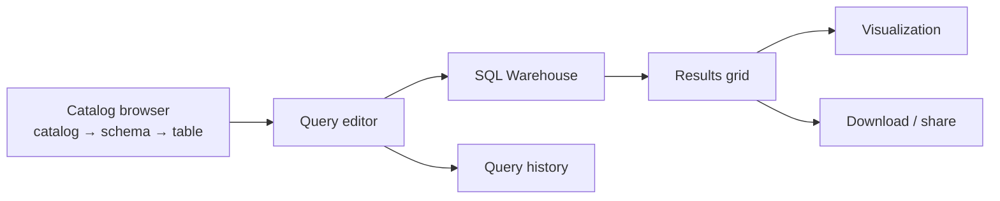
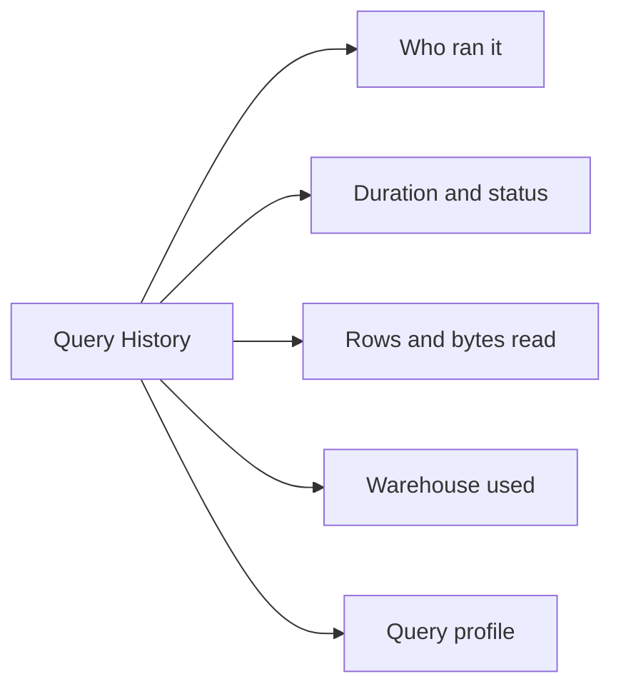

# Queries and the SQL Editor

## The SQL Editor

The SQL editor is where analysts live. It gives you a catalog browser, a query
tab, results, and a history of everything you ran.



---

## Three-Level Namespace

Every object in Unity Catalog has three parts:

```text
catalog . schema . table

main.gold.daily_sales_summary
```

```sql
-- Set context once, then use short names
USE CATALOG main;
USE SCHEMA gold;

SELECT * FROM daily_sales_summary LIMIT 10;

-- Or fully qualify, which is safer in saved queries
SELECT * FROM main.gold.daily_sales_summary LIMIT 10;
```

> Saved queries and dashboards should **always fully qualify** table names.
> A query that depends on the editor's current context breaks when someone else
> opens it.

---

## Exploring Data

```sql
SHOW CATALOGS;
SHOW SCHEMAS IN main;
SHOW TABLES IN main.gold;

DESCRIBE TABLE main.gold.daily_sales_summary;
DESCRIBE DETAIL main.gold.daily_sales_summary;    -- size, file count, location
DESCRIBE HISTORY main.gold.daily_sales_summary;   -- Delta version history
DESCRIBE TABLE EXTENDED main.gold.daily_sales_summary;
```

`DESCRIBE DETAIL` is the fastest way to spot a small-file problem:

```text
numFiles: 48213   sizeInBytes: 2.1 GB   → average file 43 KB → needs OPTIMIZE
```

---

## Saved Queries

A saved query is SQL with a name, an owner, permissions, and optionally a
schedule.

```text
Query
├── Name          "Daily Revenue by Country"
├── SQL text
├── Warehouse     analytics_serverless
├── Parameters    date range, country
├── Visualizations  attached charts
├── Schedule      refresh every hour
└── Permissions   CAN RUN / CAN EDIT / CAN MANAGE
```

Saved queries are the reusable unit: dashboards and alerts are both built on top
of them.

---

## Query Parameters

Parameters turn one query into many.

```sql
SELECT
    order_date,
    country,
    sum(total_revenue) AS revenue
FROM main.gold.daily_sales_summary
WHERE order_date BETWEEN :start_date AND :end_date
  AND country = :country
GROUP BY order_date, country
ORDER BY order_date;
```

| Parameter type | Use |
|----------------|-----|
| Text | Free-form string |
| Number | Numeric input |
| Date / Date range | Pickers, with relative options like "last 7 days" |
| Dropdown list | Fixed set of allowed values |
| Query-based dropdown | Values populated by another query |

A query-based dropdown is the professional touch:

```sql
-- Dropdown source query
SELECT DISTINCT country FROM main.gold.daily_sales_summary ORDER BY country;
```

> Use `:param` named parameters rather than string concatenation. They are safer
> and they work with dashboard filters.

---

## Common Analytical SQL Patterns

### Window functions

```sql
SELECT
    order_date,
    total_revenue,
    sum(total_revenue) OVER (ORDER BY order_date)                      AS running_total,
    avg(total_revenue) OVER (ORDER BY order_date ROWS BETWEEN 6 PRECEDING AND CURRENT ROW) AS ma_7d,
    lag(total_revenue, 1) OVER (ORDER BY order_date)                   AS prev_day,
    round(100.0 * (total_revenue - lag(total_revenue, 1) OVER (ORDER BY order_date))
          / nullif(lag(total_revenue, 1) OVER (ORDER BY order_date), 0), 2) AS pct_change
FROM main.gold.daily_sales_summary
ORDER BY order_date;
```

### Ranking within groups

```sql
SELECT country, segment, revenue
FROM (
    SELECT
        country,
        segment,
        sum(total_revenue) AS revenue,
        row_number() OVER (PARTITION BY country ORDER BY sum(total_revenue) DESC) AS rn
    FROM main.gold.daily_sales_summary
    GROUP BY country, segment
)
WHERE rn <= 3;
```

### Common Table Expressions

```sql
WITH daily AS (
    SELECT order_date, sum(total_revenue) AS revenue
    FROM main.gold.daily_sales_summary
    GROUP BY order_date
),
stats AS (
    SELECT avg(revenue) AS avg_rev, stddev(revenue) AS sd_rev FROM daily
)
SELECT d.*, s.avg_rev,
       CASE WHEN d.revenue > s.avg_rev + 2 * s.sd_rev THEN 'SPIKE'
            WHEN d.revenue < s.avg_rev - 2 * s.sd_rev THEN 'DROP'
            ELSE 'NORMAL' END AS anomaly
FROM daily d CROSS JOIN stats s
ORDER BY d.order_date;
```

CTEs make long queries readable. Readability is not cosmetic — most production
SQL bugs are comprehension failures.

### Pivoting

```sql
SELECT * FROM (
    SELECT country, segment, total_revenue
    FROM main.gold.daily_sales_summary
)
PIVOT (
    sum(total_revenue) FOR segment IN ('PREMIUM', 'STANDARD')
);
```

### Time travel in plain SQL

```sql
SELECT * FROM main.gold.daily_sales_summary VERSION AS OF 12;
SELECT * FROM main.gold.daily_sales_summary TIMESTAMP AS OF '2026-09-01';

-- What changed between two versions?
SELECT * FROM main.gold.daily_sales_summary VERSION AS OF 13
EXCEPT
SELECT * FROM main.gold.daily_sales_summary VERSION AS OF 12;
```

---

## Views: Saving Logic in the Catalog

A saved query lives in Databricks SQL. A **view** lives in Unity Catalog and is
visible to every tool, including Power BI and notebooks.

```sql
CREATE OR REPLACE VIEW main.gold.v_revenue_by_country AS
SELECT country, order_date, sum(total_revenue) AS revenue
FROM main.gold.daily_sales_summary
GROUP BY country, order_date;
```

| | Saved query | View | Materialized view |
|---|---|---|---|
| Stored where | Databricks SQL | Unity Catalog | Unity Catalog |
| Visible to BI tools | No | Yes | Yes |
| Computed | Every run | Every run | Precomputed, refreshed |
| Governed by UC grants | Indirect | Yes | Yes |
| Good for | Analyst workspace | Shared logic | Expensive repeated aggregations |

```sql
CREATE MATERIALIZED VIEW main.gold.mv_daily_revenue
SCHEDULE CRON '0 0 7 * * ?'
AS
SELECT order_date, country, sum(total_revenue) AS revenue
FROM main.silver.orders o JOIN main.silver.customers c USING (customer_id)
GROUP BY order_date, country;
```

A materialized view trades storage and a refresh job for much faster dashboards.

---

## Row and Column Level Security in Queries

Governance applies transparently — the analyst writes normal SQL and sees only
permitted data.

```sql
-- Column mask: hide email from non-privileged users
CREATE FUNCTION main.gold.mask_email(email STRING)
RETURN CASE WHEN is_account_group_member('pii_readers') THEN email ELSE '***@***' END;

ALTER TABLE main.gold.customers
ALTER COLUMN email SET MASK main.gold.mask_email;

-- Row filter: restrict to the user's own country
CREATE FUNCTION main.gold.country_filter(country STRING)
RETURN is_account_group_member('global_analysts') OR country = current_user_country();

ALTER TABLE main.gold.customers SET ROW FILTER main.gold.country_filter ON (country);
```

Covered in depth in topic 07.

---

## Query History



The **query profile** is the single most useful debugging tool in Databricks SQL:

```text
✔ Time spent per operator (scan, join, aggregate, shuffle)
✔ Rows read vs rows returned  → is pruning working?
✔ Bytes scanned               → is the filter hitting the partitions?
✔ Spill to disk               → is the warehouse too small?
✔ Photon coverage             → which operators fell back to Spark?
```

Query history is also queryable as a system table:

```sql
SELECT
    statement_text,
    executed_by,
    total_duration_ms / 1000 AS seconds,
    read_bytes / 1e9 AS gb_read
FROM system.query.history
WHERE start_time >= current_date() - INTERVAL 1 DAY
ORDER BY total_duration_ms DESC
LIMIT 20;
```

---

## SQL in Jobs

A SQL task inside a Workflow can run a saved query, a file, an alert, or a
dashboard refresh.

```yaml
- task_key: refresh_sales_dashboard
  sql_task:
    warehouse_id: "abc123"
    dashboard:
      dashboard_id: "dash456"
```

This is how the gold layer and the dashboard stay in sync: the same job that
builds gold refreshes the dashboard as its last step.

---

## Common Mistakes

```text
❌ SELECT * on a wide table just to look at it → use LIMIT and pick columns
❌ Unqualified table names in saved queries    → breaks for other users
❌ String concatenation instead of :parameters → injection risk, no filters
❌ Recomputing the same heavy aggregate in 10 dashboards → use a materialized view
❌ Assuming a query is slow because the warehouse is small → read the query profile first
```

---

## Common Interview Questions

### What is the three-level namespace?

`catalog.schema.table`, introduced by Unity Catalog, replacing the two-level
`database.table` of the Hive metastore.

### Difference between a view and a materialized view?

A view recomputes on every query; a materialized view stores precomputed results
and refreshes on a schedule, trading storage for speed.

### How do you parameterise a query?

Named parameters like `:start_date`, bound to widgets (text, number, date range,
dropdown, or query-based dropdown) which dashboards expose as filters.

### How do you find why a query is slow?

Open the query profile: check bytes scanned versus returned, join strategy,
shuffle size, disk spill, and Photon coverage.

### How do you query a table as it was yesterday?

Delta time travel: `TIMESTAMP AS OF` or `VERSION AS OF`.

---

## Quick Revision

```text
Namespace: catalog.schema.table — always qualify in saved queries

Explore: SHOW CATALOGS/SCHEMAS/TABLES, DESCRIBE TABLE/DETAIL/HISTORY

Query objects:
Saved query        → lives in DBSQL
View               → lives in UC, recomputed
Materialized view  → lives in UC, precomputed + scheduled refresh

Parameters: :name (text, number, date, dropdown, query-based dropdown)

Patterns: window functions | CTEs | PIVOT | time travel | anomaly flags

Debugging: Query History → Query Profile → system.query.history
```
