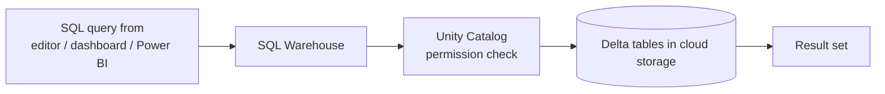
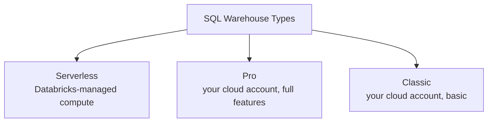
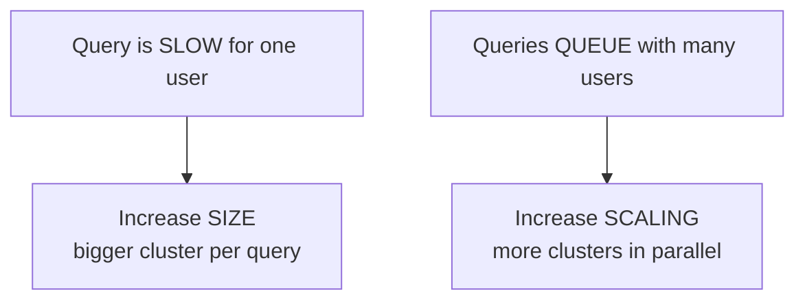
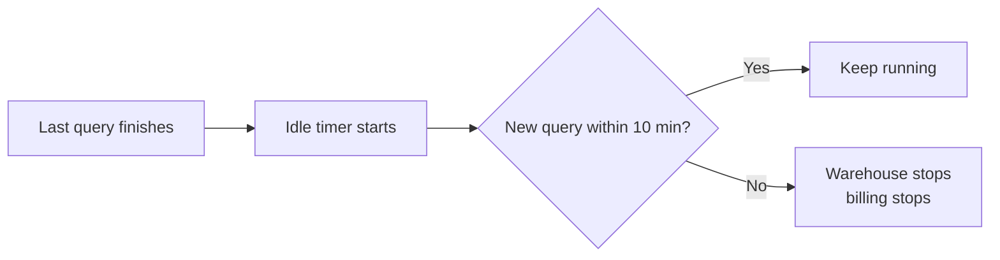
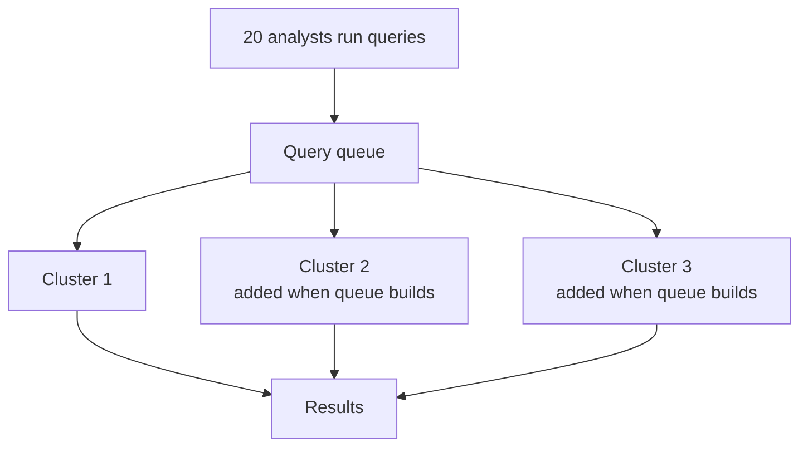
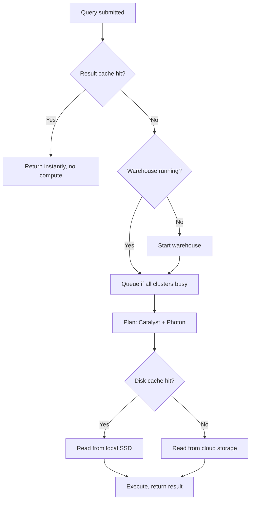
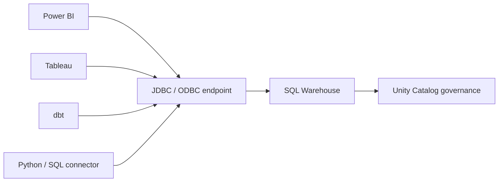
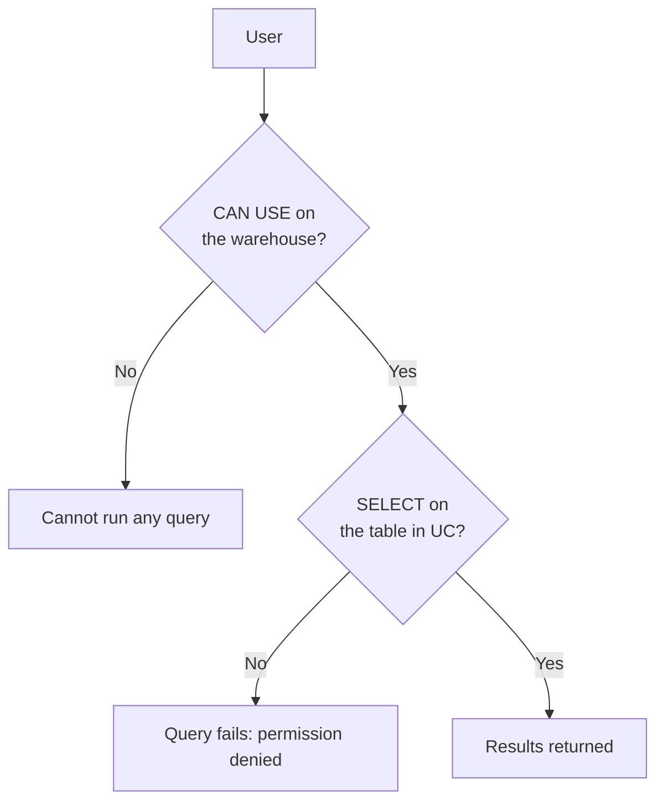

# SQL Warehouses

## What Is a SQL Warehouse?

A **SQL warehouse** is compute tuned for SQL analytics. It is still Spark
underneath, but you do not configure workers, runtimes, or libraries. You pick a
size and it runs queries.

```text
All-purpose cluster → you choose DBR, workers, libraries, Python packages
SQL warehouse       → you choose a T-shirt size
```



---

## Three Types



| | Serverless | Pro | Classic |
|---|-----------|-----|---------|
| Compute lives in | Databricks account | Your cloud account | Your cloud account |
| Start time | 2 to 10 seconds | 2 to 5 minutes | 2 to 5 minutes |
| Photon | Yes | Yes | Yes |
| Predictive I/O | Yes | Yes | No |
| Cost model | Highest per DBU, no idle waste | Middle | Lowest per DBU |
| Best for | Dashboards, BI, spiky usage | Steady heavy usage with network constraints | Legacy / cost-sensitive batch SQL |

> **Default choice: Serverless.** The startup time is what analysts actually feel.
> A warehouse that takes 4 minutes to wake up gets replaced by an extract in
> Excel, which is how data governance dies.

---

## Sizing

Sizes go 2X-Small through 4X-Large. Each step up roughly doubles the compute
**and** the cost per hour.

```text
2X-Small  → small dashboards, few users, small tables
Small     → team dashboards, moderate data
Medium    → heavier joins, tens of concurrent users
Large+    → large scans, big aggregations, many concurrent users
```

### Size vs Scaling: two different knobs



```text
Size    = how much power for one query
Scaling = how many warehouse clusters run at once (min 1, max N)
```

This distinction is a very common interview question and a very common real-world
misconfiguration. Adding size to fix a queueing problem wastes money and does not
help.

---

## Auto Stop

```yaml
auto_stop_mins: 10
```



```text
Serverless → auto stop can be very low (1 to 5 min), restart is seconds
Pro/Classic → keep it higher (10 to 30 min), restart costs minutes of waiting
```

Leaving auto stop off is one of the most common sources of a surprise bill.

---

## Creating a Warehouse

### UI

```text
SQL → SQL Warehouses → Create SQL Warehouse
  Name:            analytics_serverless
  Size:            Small
  Type:            Serverless
  Auto stop:       10 minutes
  Scaling:         min 1, max 4
  Unity Catalog:   enabled
  Tags:            team=analytics, cost_center=1234
```

### As code

```yaml
resources:
  sql_warehouses:
    analytics:
      name: analytics_serverless
      cluster_size: "Small"
      warehouse_type: "PRO"
      enable_serverless_compute: true
      auto_stop_mins: 10
      min_num_clusters: 1
      max_num_clusters: 4
      tags:
        custom_tags:
          - key: team
            value: analytics
```

### CLI

```bash
databricks warehouses create --json '{
  "name": "analytics_serverless",
  "cluster_size": "Small",
  "enable_serverless_compute": true,
  "auto_stop_mins": 10,
  "max_num_clusters": 4
}'
```

---

## How Scaling Actually Works



```text
Queue grows      → Databricks adds a cluster (up to max_num_clusters)
Queue drains     → clusters are removed down to min_num_clusters
Each cluster     → same size, handles its share of concurrent queries
```

Set `min_num_clusters > 1` only when you need instant capacity at a known busy
hour, since idle clusters still cost money.

---

## Query Lifecycle Inside a Warehouse



Three caches matter:

| Cache | Scope | Cleared by |
|-------|-------|-----------|
| **Result cache** | Identical query text and unchanged data | Data change, 24h |
| **Disk cache** | Parquet files on the cluster SSD | Cluster restart |
| **Materialized views** | Precomputed results you define | Refresh schedule |

---

## Photon

Photon is a vectorised C++ execution engine that replaces parts of the JVM Spark
engine. It is on by default for SQL warehouses.

```text
Helps a lot with:  scans, filters, joins, aggregations, writes to Delta
Helps less with:   Python UDFs, RDD operations, non-SQL workloads
Cost:              higher DBU rate, usually offset by shorter runtime
```

---

## Connecting BI Tools



Connection details live under **Connection details** on the warehouse page:

```text
Server hostname: adb-1234567890.11.azuredatabricks.net
HTTP path:       /sql/1.0/warehouses/abc123def456
Port:            443
Auth:            personal access token or OAuth (prefer OAuth / service principal)
```

```python
from databricks import sql

with sql.connect(
    server_hostname="adb-1234567890.11.azuredatabricks.net",
    http_path="/sql/1.0/warehouses/abc123def456",
    access_token=dbutils.secrets.get("bi", "token"),
) as conn:
    with conn.cursor() as cur:
        cur.execute("SELECT country, sum(total_revenue) FROM gold.daily_sales_summary GROUP BY 1")
        print(cur.fetchall())
```

---

## Governance and Permissions

A SQL warehouse has two independent permission layers, and confusing them causes
most "why can't they see the data" tickets.



```sql
-- Table-level access is Unity Catalog, not the warehouse
GRANT USE CATALOG ON CATALOG main TO `analysts`;
GRANT USE SCHEMA  ON SCHEMA main.gold TO `analysts`;
GRANT SELECT      ON TABLE main.gold.daily_sales_summary TO `analysts`;
```

Warehouse permissions: `CAN USE`, `CAN MANAGE`, `CAN MONITOR`, `IS OWNER`.

---

## Warehouse vs Cluster: When to Use Which

| Workload | Use |
|----------|-----|
| BI dashboard, ad-hoc analyst SQL | SQL warehouse |
| SQL task inside a job | SQL warehouse |
| dbt transformations | SQL warehouse |
| PySpark ETL notebook | Job cluster |
| ML training with Python libraries | All-purpose or job cluster |
| Streaming ingestion | Job cluster (or DLT) |

```text
Rule: if the workload is pure SQL, a warehouse is almost always the right answer.
```

---

## Cost Control Checklist

```text
✔ Auto stop enabled and short
✔ Serverless for spiky, interactive usage
✔ Right size, then tune scaling separately
✔ Tag warehouses by team for chargeback
✔ Separate warehouses per workload (BI vs dbt vs jobs) so one does not starve another
✔ Monitor system.billing.usage by warehouse
✔ Do not give everyone CAN MANAGE — someone will set it to 4X-Large
```

---

## Common Interview Questions

### What is a SQL warehouse?

Compute optimised for SQL workloads in Databricks, sized by T-shirt size rather
than configured as a Spark cluster, with Photon enabled and Unity Catalog
enforcement.

### Serverless vs Pro vs Classic?

Serverless runs in the Databricks account and starts in seconds; Pro and Classic
run in your cloud account and take minutes. Pro adds features such as Predictive
I/O over Classic. Serverless is the default recommendation for interactive
analytics.

### Difference between warehouse size and scaling?

Size is the power applied to a single query. Scaling is the number of clusters
handling concurrent queries. Slow query → increase size. Queued queries →
increase max clusters.

### What is auto stop and why does it matter?

The idle timeout after which the warehouse shuts down and billing stops. Without
it, an idle warehouse bills all night.

### How do you connect Power BI to Databricks?

Through the JDBC/ODBC connection details of a SQL warehouse, authenticating with
OAuth or a token, with table access governed by Unity Catalog.

### A user can start a query but gets permission denied. Why?

They have `CAN USE` on the warehouse but lack `SELECT` (and `USE CATALOG` /
`USE SCHEMA`) on the object in Unity Catalog. The two permission layers are
separate.

---

## Quick Revision

```text
SQL Warehouse = SQL-optimised compute, T-shirt sized

Types:    Serverless (seconds to start) | Pro | Classic
Sizing:   size = power per query | scaling = clusters for concurrency
Auto stop: always on, short for serverless

Caches:   result cache | disk cache | materialized views
Engine:   Photon, on by default

Permissions:
Warehouse → CAN USE / CAN MANAGE / CAN MONITOR
Data      → Unity Catalog GRANTs (USE CATALOG, USE SCHEMA, SELECT)

Use a warehouse for pure SQL; a cluster for Python/Spark/ML.
```
