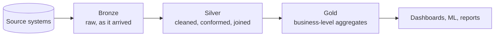

# 10 – Data Engineering Patterns

This topic is about **how to organise data as it moves through a platform**.
Topics 06 to 09 gave you the tools — Delta, Unity Catalog, Workflows, SQL. This
topic gives you the blueprint they all serve.

---

## The Core Idea

Raw data is messy. Business questions need clean data. Trying to do that in one
step produces pipelines nobody can debug.



Each layer has exactly one job. That constraint is what makes the platform
debuggable, testable, and reprocessable.

---

## Reading Order

| # | File | What you learn |
|---|------|----------------|
| 1 | [medallion_architecture.md](medallion_architecture.md) | The pattern, why three layers, how to apply it |
| 2 | [bronze_layer.md](bronze_layer.md) | Landing raw data safely and completely |
| 3 | [silver_layer.md](silver_layer.md) | Cleaning, deduplication, conforming, joining |
| 4 | [gold_layer.md](gold_layer.md) | Business aggregates, marts, dimensional models |
| 5 | [batch_and_incremental.md](batch_and_incremental.md) | Full loads, incremental loads, watermarks, CDC |
| 6 | [interview_questions.md](interview_questions.md) | Questions asked in interviews |

---

## The One-Sentence Summary of Each Layer

```text
Bronze = what the source said
Silver = what is true
Gold   = what the business asks about
```

If you remember nothing else from this topic, remember those three lines.

---

## Quick Revision

```text
Medallion = Bronze → Silver → Gold

Bronze: append-only, schema-on-read, keep everything, never transform
Silver: deduplicate, validate, conform types, apply business keys, join
Gold:   aggregate, model, serve — dimensional or wide tables

Batch vs incremental:
Full reload      → simple, expensive, fine for small tables
Incremental      → watermark or CDC, essential at scale

Key Delta features used: MERGE, replaceWhere, time travel, Change Data Feed
```
