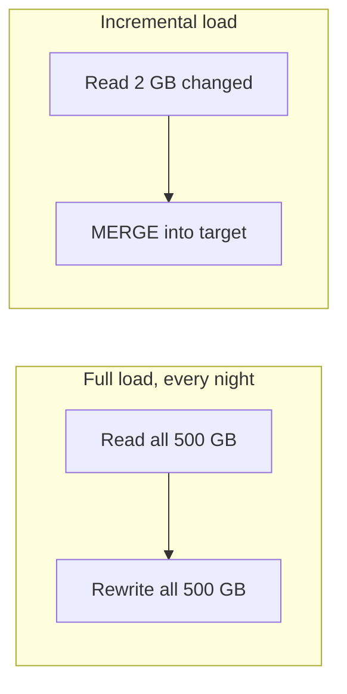
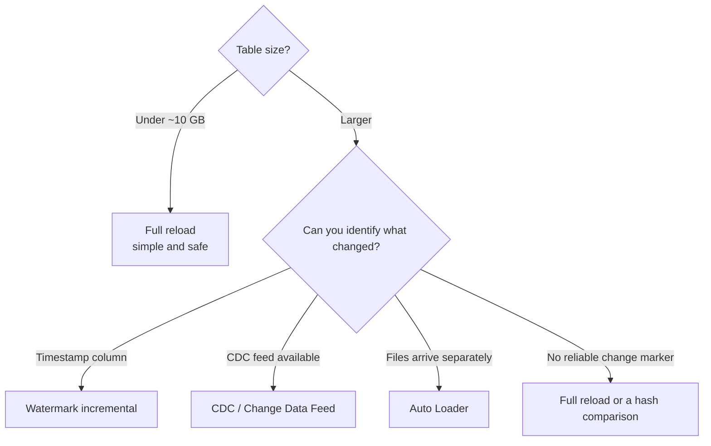
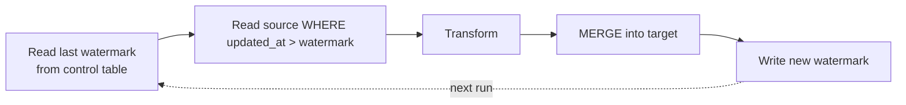
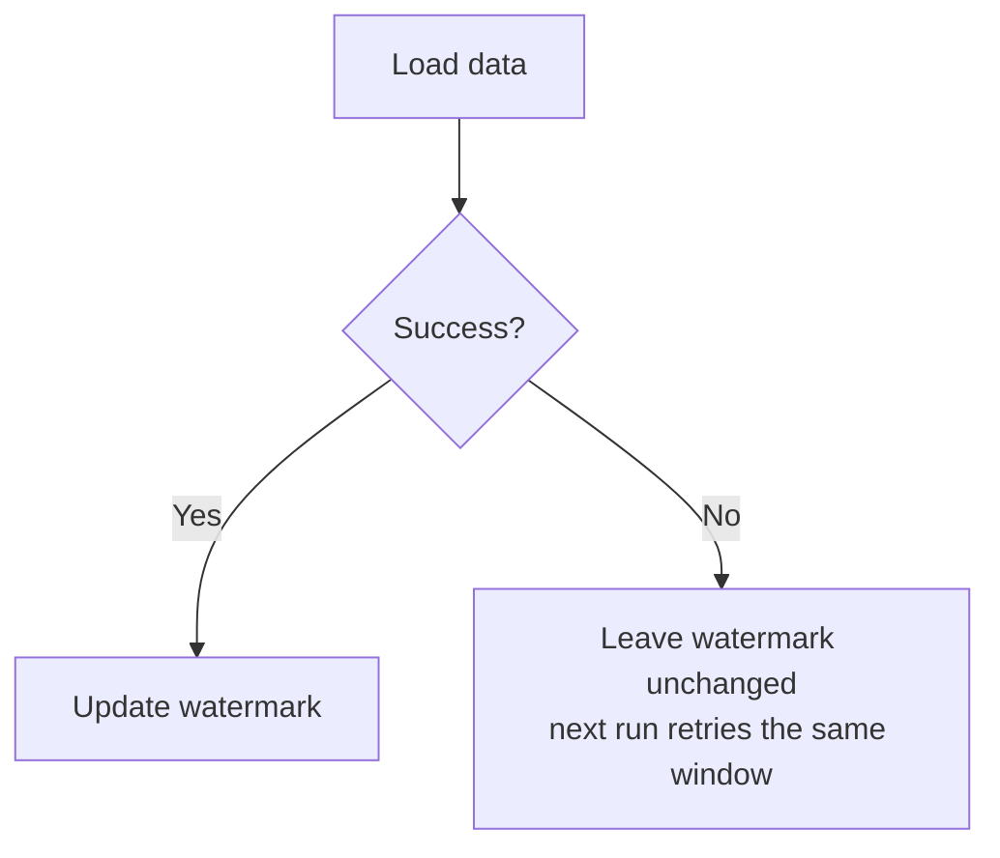
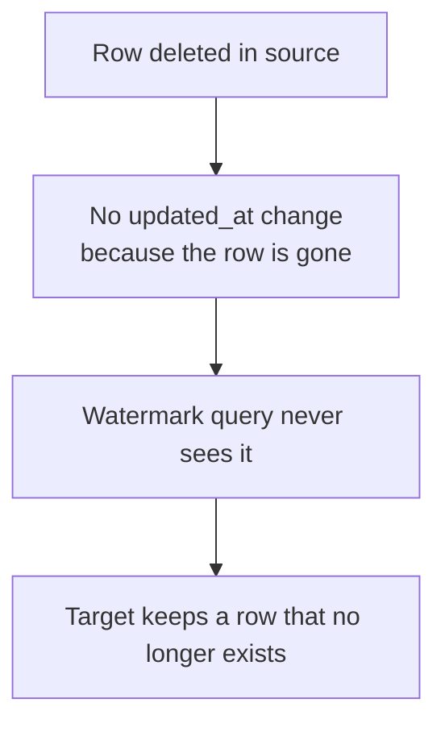
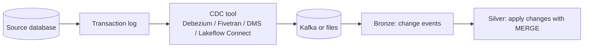
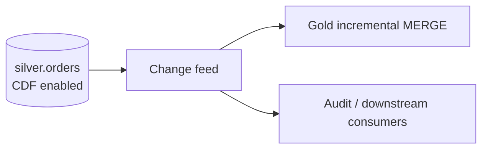
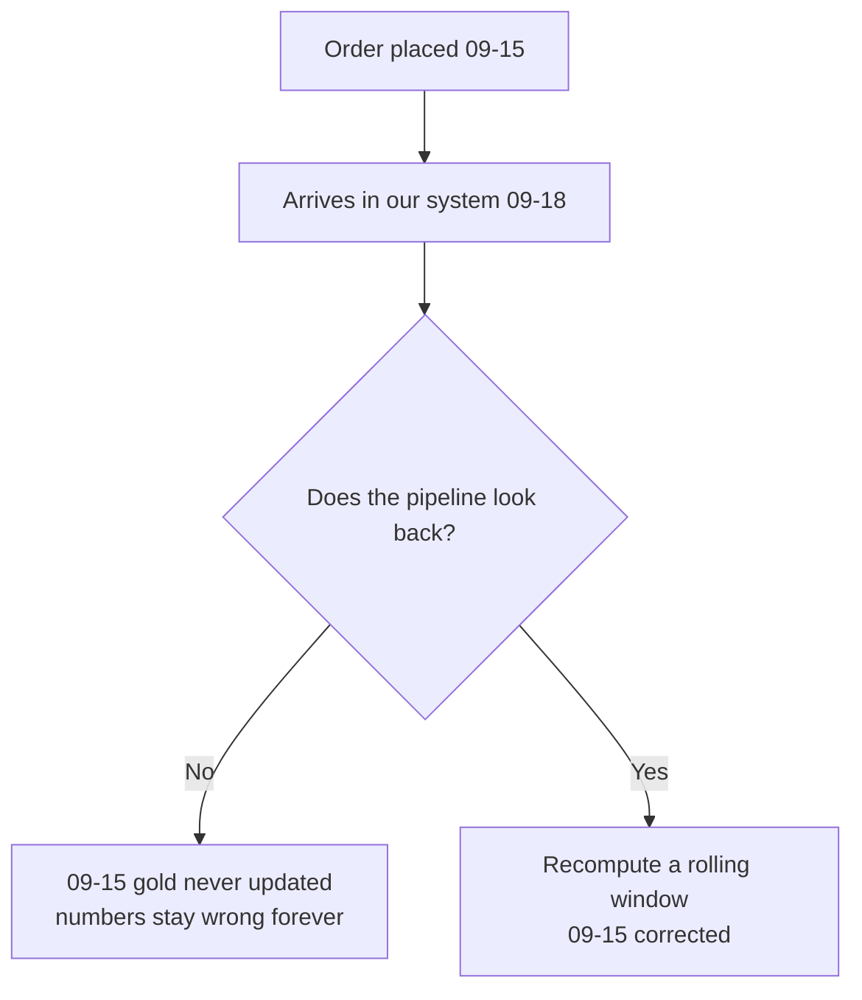

# Batch and Incremental Loads

## The Fundamental Trade-off

```text
Full load        → simple, always correct, cost grows with total data size
Incremental load → complex, needs care, cost grows with CHANGED data size
```



At 1 GB, full reload is the right answer and anything else is over-engineering.
At 5 TB, full reload is impossible. The skill is knowing where you are.

---

## When to Use Which



| Method | Needs | Cost | Complexity |
|--------|-------|------|------------|
| Full reload | Nothing | High | Very low |
| Watermark | A reliable `updated_at` | Low | Low |
| Auto Loader | New files per batch | Low | Low |
| CDC / CDF | A change feed from the source | Lowest | Medium |
| Hash comparison | Stable row identity | Medium | High |

---

## Full Load

```python
df = spark.read.format("jdbc").option("dbtable", "orders").load()

(df.write.format("delta")
   .mode("overwrite")
   .option("overwriteSchema", "true")
   .saveAsTable("main.bronze.orders_raw"))
```

```text
✔ Trivially correct — the target always matches the source
✔ No state to maintain, no watermark to corrupt
✔ Self-healing: yesterday's bug disappears after tonight's run

✘ Reads everything every time
✘ Long runtime, large compute
✘ Deletes history unless you snapshot it
✘ The source system feels the load too
```

Use it for dimension tables, reference data, and small facts. Do not feel bad
about it — a correct full reload beats a subtly broken incremental load.

---

## Incremental with a Watermark

The most common incremental pattern.



```python
from pyspark.sql import functions as F

TABLE = "orders"

# 1. read the last successful watermark
last = (spark.table("main.control.load_state")
        .filter(f"table_name = '{TABLE}'")
        .select("watermark").collect())
last_wm = last[0].watermark if last else "1900-01-01 00:00:00"

# 2. read only what changed
src = (spark.read.format("jdbc")
       .option("url", jdbc_url)
       .option("dbtable", f"(SELECT * FROM orders WHERE updated_at > '{last_wm}') q")
       .load())

if src.isEmpty():
    print("No new data")
    dbutils.notebook.exit("NO_DATA")

# 3. idempotent write
src.createOrReplaceTempView("updates")
spark.sql("""
MERGE INTO main.silver.orders t
USING updates s ON t.order_id = s.order_id
WHEN MATCHED AND s.updated_at > t.updated_at THEN UPDATE SET *
WHEN NOT MATCHED THEN INSERT *
""")

# 4. advance the watermark ONLY after success
new_wm = src.agg(F.max("updated_at")).collect()[0][0]
spark.sql(f"""
MERGE INTO main.control.load_state t
USING (SELECT '{TABLE}' AS table_name, TIMESTAMP'{new_wm}' AS watermark) s
ON t.table_name = s.table_name
WHEN MATCHED THEN UPDATE SET watermark = s.watermark, updated_at = current_timestamp()
WHEN NOT MATCHED THEN INSERT (table_name, watermark, updated_at)
                    VALUES (s.table_name, s.watermark, current_timestamp())
""")
```

### The ordering rule



```text
Update the watermark AFTER the write succeeds.

Fail before the watermark update → reprocess the window (safe, MERGE is idempotent)
Fail after the watermark update  → silent permanent data loss
```

This single ordering decision separates working pipelines from ones that lose
data once a quarter and nobody knows why.

---

## Watermark Pitfalls

### Pitfall 1: boundary records

```text
Watermark = 10:00:00
A row written at exactly 10:00:00 during the previous read may be missed.

Fix: use >= with a small overlap, and rely on MERGE for idempotency.
```

```sql
WHERE updated_at >= '{last_wm}' - INTERVAL 5 MINUTES
```

### Pitfall 2: clock skew

```text
Source timestamps come from the source's clock, which may drift from yours.
Always use the SOURCE column, never current_timestamp() on the Databricks side.
```

### Pitfall 3: deletes are invisible



```text
Fixes:
✔ Soft deletes in the source (is_deleted flag, which updates updated_at)
✔ CDC feed, which emits delete events
✔ Periodic full reconciliation (weekly full compare)
```

### Pitfall 4: the source does not maintain `updated_at`

Some systems only set it on insert, not on update. Verify before trusting it:

```sql
SELECT count(*) FROM source_table WHERE updated_at < created_at;  -- expect 0
SELECT max(updated_at) FROM source_table;  -- should be recent, not months old
```

---

## Change Data Capture (CDC)

CDC reads the database's transaction log, so it captures inserts, updates, **and
deletes**, in order.



A CDC event stream looks like this:

```text
op | order_id | amount | updated_at
I  | 1001     | 100.00 | 10:00:01     (insert)
U  | 1001     | 150.00 | 10:05:22     (update)
D  | 1001     | null   | 10:09:47     (delete)
```

```python
from pyspark.sql.window import Window
from pyspark.sql import functions as F

# keep only the LAST event per key in this batch
w = Window.partitionBy("order_id").orderBy(F.col("_commit_ts").desc())
latest = (changes.withColumn("_rn", F.row_number().over(w))
                 .filter("_rn = 1").drop("_rn"))

latest.createOrReplaceTempView("cdc_batch")

spark.sql("""
MERGE INTO main.silver.orders t
USING cdc_batch s ON t.order_id = s.order_id
WHEN MATCHED AND s.op = 'D' THEN DELETE
WHEN MATCHED AND s.op IN ('U','I') THEN UPDATE SET *
WHEN NOT MATCHED AND s.op <> 'D' THEN INSERT *
""")
```

```text
Critical: collapse multiple events per key BEFORE the MERGE.
MERGE fails if the source has more than one matching row per target row.
```

---

## Delta Change Data Feed

For changes happening **inside** Databricks, Delta can produce its own CDC feed.

```sql
ALTER TABLE main.silver.orders
SET TBLPROPERTIES (delta.enableChangeDataFeed = true);
```

```python
changes = (spark.read.format("delta")
    .option("readChangeFeed", "true")
    .option("startingVersion", last_version)
    .table("main.silver.orders"))
```

```text
_change_type:  insert | update_preimage | update_postimage | delete
_commit_version, _commit_timestamp
```

```python
# propagate silver changes into gold without rebuilding gold
upserts = changes.filter("_change_type IN ('insert', 'update_postimage')")
deletes = changes.filter("_change_type = 'delete'")
```



This is how you make gold incremental without re-reading all of silver.

---

## Auto Loader for File-Based Incremental

```python
(spark.readStream.format("cloudFiles")
   .option("cloudFiles.format", "parquet")
   .option("cloudFiles.schemaLocation", "/Volumes/main/bronze/_schema/orders")
   .load("/Volumes/main/landing/orders/")
   .writeStream
   .option("checkpointLocation", "/Volumes/main/bronze/_ckpt/orders")
   .trigger(availableNow=True)
   .toTable("main.bronze.orders_raw"))
```

```text
Auto Loader keeps its own record of processed files in the checkpoint.
No watermark table needed — the "what changed" question is answered by
"which files have I not seen yet". Covered fully in topic 12.
```

---

## Handling Late-Arriving Data



```sql
-- Recompute the last N days, not just today
WHERE order_date >= current_date() - INTERVAL 3 DAYS
```

```text
Choosing the window:
✔ Measure actual lateness: max(ingested_date - event_date) over history
✔ Set the window to cover the 99th percentile
✔ Add a monthly full recompute to catch the long tail
```

```sql
-- How late does data actually arrive?
SELECT
    percentile(datediff(date(_ingested_at), order_date), 0.50) AS p50_days,
    percentile(datediff(date(_ingested_at), order_date), 0.99) AS p99_days,
    max(datediff(date(_ingested_at), order_date))              AS max_days
FROM main.silver.orders
WHERE _ingested_at >= current_date() - INTERVAL 90 DAYS;
```

Never guess this number. Measure it.

---

## Reconciliation

Incremental pipelines drift. Reconciliation catches it.

```sql
-- Weekly: compare source and target counts
SELECT
    'source' AS side, count(*) AS rows, sum(amount) AS total FROM source_orders
UNION ALL
SELECT
    'target', count(*), sum(amount) FROM main.silver.orders;
```

```python
diff_pct = abs(source_total - target_total) / max(source_total, 1)
if diff_pct > 0.001:
    raise Exception(f"Reconciliation failed: {diff_pct:.3%} difference")
```

```text
A pipeline without reconciliation is a pipeline that is quietly wrong
and nobody has checked.
```

---

## Choosing a Strategy: Worked Decisions

| Table | Size | Change rate | Strategy |
|-------|------|-------------|----------|
| `countries` | 200 rows | Almost never | Full reload |
| `products` | 50 000 rows | Daily edits | Full reload (still cheap) |
| `customers` | 5 M rows | 1% daily | Watermark + MERGE, SCD2 |
| `orders` | 500 M rows | Append-heavy | Watermark or Auto Loader |
| `order_events` | 5 B rows | Streaming | Auto Loader / Structured Streaming |
| `inventory` | 10 M rows | Updates and deletes | CDC (deletes matter) |

---

## Full Pipeline Example

```python
# Task: incremental silver load with quality gate and reconciliation
run_date = dbutils.widgets.get("run_date")
LOOKBACK = 3

src = (spark.table("main.bronze.orders_raw")
       .filter(f"date(_ingested_at) >= date_sub('{run_date}', {LOOKBACK})"))

clean = transform(src)          # cast, validate, deduplicate (see silver_layer.md)

clean.createOrReplaceTempView("updates")
spark.sql("""
MERGE INTO main.silver.orders t USING updates s
ON t.order_id = s.order_id
WHEN MATCHED AND s._ingested_at > t._ingested_at THEN UPDATE SET *
WHEN NOT MATCHED THEN INSERT *
""")

# reconcile against bronze for the same window
bronze_n = src.select("ord_id").distinct().count()
silver_n = (spark.table("main.silver.orders")
            .filter(f"date(_ingested_at) >= date_sub('{run_date}', {LOOKBACK})")
            .count())

dbutils.jobs.taskValues.set(key="bronze_keys", value=bronze_n)
dbutils.jobs.taskValues.set(key="silver_rows", value=silver_n)

if silver_n < bronze_n * 0.95:
    raise Exception(f"Row loss detected: bronze {bronze_n} vs silver {silver_n}")
```

---

## Common Interview Questions

### Full load vs incremental load?

Full reloads the entire dataset each run — simple and self-healing but expensive.
Incremental processes only changed data — cheaper and faster but requires
watermarks or CDC and careful idempotency.

### How does a watermark-based incremental load work?

Store the maximum processed timestamp in a control table, read source rows newer
than it, MERGE them into the target, then advance the watermark **only after** a
successful write.

### Why must the watermark be updated after the load?

Updating it first means a failure skips that window permanently, silently losing
data. Updating it after means a failure just reprocesses the window, which is
safe because MERGE is idempotent.

### Why do incremental loads miss deletes?

A deleted row has no updated timestamp to detect. You need soft deletes, a CDC
feed, or periodic full reconciliation.

### What is CDC and how is it different from a watermark?

CDC reads the database transaction log and emits insert, update, and delete
events in order. A watermark only sees rows that still exist and have a reliable
change timestamp.

### What is Delta Change Data Feed?

A Delta feature that exposes row-level changes made to a Delta table, with
`_change_type` values, letting downstream tables update incrementally instead of
rebuilding.

### How do you handle late-arriving data?

Recompute a rolling window sized from measured lateness percentiles, plus a
periodic full recompute for the long tail.

### Why collapse CDC events before MERGE?

MERGE fails if multiple source rows match one target row. Keep only the latest
event per key using `row_number()` ordered by commit time.

---

## Quick Revision

```text
Full load        → small tables, reference data; self-healing
Watermark        → needs a reliable updated_at; cannot see deletes
Auto Loader      → file-based; checkpoint tracks processed files
CDC / CDF        → captures inserts, updates AND deletes, in order

The critical rule:
    load first, advance the watermark only after success

MERGE guard:
    WHEN MATCHED AND s.updated_at > t.updated_at
    → prevents an older record overwriting a newer one

CDC MERGE:
    collapse to one event per key first (row_number by commit time)

Late data:
    measure lateness percentiles → set a lookback window → periodic full recompute

Reconciliation:
    compare source vs target counts and sums on a schedule, and alert on drift
```
