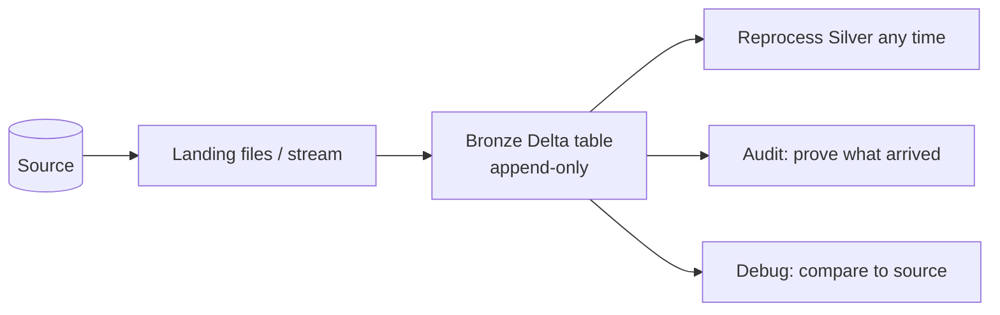
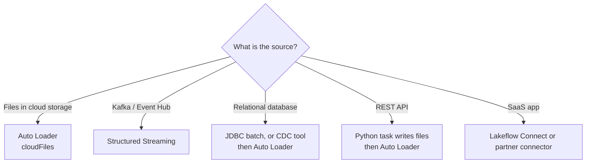
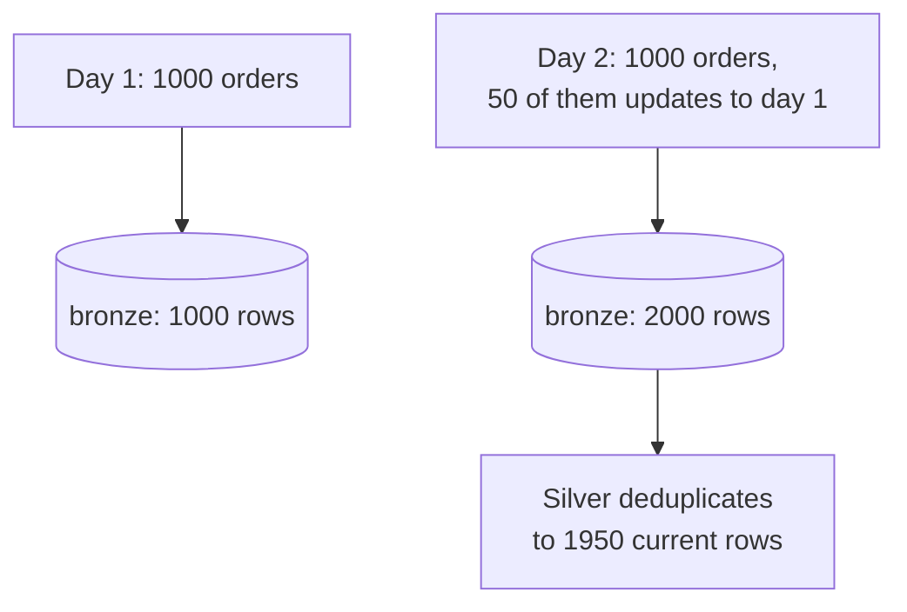
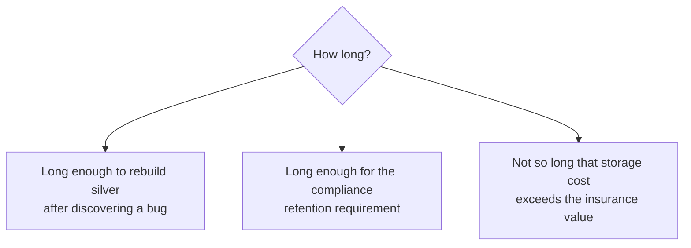

# Bronze Layer

## The One Rule

```text
Bronze stores what the source sent, exactly as it sent it, forever.
```

Every design decision in this file follows from that sentence.



---

## Why Not Just Clean It Immediately?

```text
Scenario: three months in, you discover the cleaning logic
dropped every order with a negative discount.

With bronze:    re-run silver from bronze. Fixed in an hour.
Without bronze: the source system purged those records 60 days ago.
                The data is gone. Permanently.
```

Bronze is insurance. It is cheap storage buying expensive optionality.

---

## What Goes In

```text
✔ Every column the source provided, original names
✔ Every row, including ones that look wrong
✔ Ingestion metadata (when, from where, which file)
✔ The raw payload itself for semi-structured sources
```

```text
✘ No type casting
✘ No renaming
✘ No filtering
✘ No deduplication
✘ No joins
✘ No business logic
```

The only additions are metadata columns, and they are prefixed so they never
collide with source columns.

---

## Standard Bronze Metadata Columns

```python
from pyspark.sql import functions as F

bronze = (raw_df
    .withColumn("_ingested_at",   F.current_timestamp())
    .withColumn("_source_file",   F.col("_metadata.file_path"))
    .withColumn("_file_modified", F.col("_metadata.file_modification_time"))
    .withColumn("_batch_id",      F.lit(batch_id))
    .withColumn("_source_system", F.lit("erp_oracle")))
```

| Column | Answers |
|--------|---------|
| `_ingested_at` | When did we receive it? |
| `_source_file` | Which file did this row come from? |
| `_file_modified` | When did the source write it? |
| `_batch_id` | Which run loaded it? (makes a bad batch deletable) |
| `_source_system` | Which upstream system? |

`_batch_id` earns its keep the first time you need to surgically remove one bad
load:

```sql
DELETE FROM main.bronze.orders_raw WHERE _batch_id = '2026-09-18-run-3';
```

---

## Ingestion Patterns by Source Type



### Files with Auto Loader (the default)

```python
(spark.readStream
   .format("cloudFiles")
   .option("cloudFiles.format", "json")
   .option("cloudFiles.schemaLocation", "/Volumes/main/bronze/_schema/orders")
   .option("cloudFiles.schemaEvolutionMode", "rescue")
   .option("cloudFiles.inferColumnTypes", "false")     # keep everything as string
   .load("/Volumes/main/landing/orders/")
   .withColumn("_ingested_at", F.current_timestamp())
   .withColumn("_source_file", F.col("_metadata.file_path"))
   .writeStream
   .option("checkpointLocation", "/Volumes/main/bronze/_ckpt/orders")
   .option("mergeSchema", "true")
   .trigger(availableNow=True)
   .toTable("main.bronze.orders_raw"))
```

```text
inferColumnTypes = false  →  everything lands as string
Why? A column that is numeric today and alphanumeric tomorrow will not
break ingestion. Typing is silver's job.
```

`trigger(availableNow=True)` processes all available files then stops, which is
exactly what a scheduled batch job wants. Topic 12 covers Auto Loader in depth.

### Kafka

```python
(spark.readStream
   .format("kafka")
   .option("kafka.bootstrap.servers", "broker:9092")
   .option("subscribe", "orders")
   .option("startingOffsets", "earliest")
   .load()
   .select(
       F.col("key").cast("string").alias("_kafka_key"),
       F.col("value").cast("string").alias("raw_payload"),   # keep the raw JSON
       F.col("topic").alias("_topic"),
       F.col("partition").alias("_partition"),
       F.col("offset").alias("_offset"),
       F.col("timestamp").alias("_kafka_timestamp"),
       F.current_timestamp().alias("_ingested_at"))
   .writeStream
   .option("checkpointLocation", "/Volumes/main/bronze/_ckpt/orders_kafka")
   .toTable("main.bronze.orders_events"))
```

Storing `raw_payload` as a string is deliberate: if the JSON schema changes, the
payload still lands and silver can be fixed retroactively.

### JDBC from a database

```python
df = (spark.read.format("jdbc")
    .option("url", "jdbc:postgresql://host:5432/erp")
    .option("dbtable", "(SELECT * FROM orders WHERE updated_at > '2026-09-17') q")
    .option("user", dbutils.secrets.get("erp", "user"))
    .option("password", dbutils.secrets.get("erp", "password"))
    .option("partitionColumn", "order_id")
    .option("lowerBound", 1).option("upperBound", 10000000)
    .option("numPartitions", 8)
    .load())

(df.withColumn("_ingested_at", F.current_timestamp())
   .write.format("delta").mode("append")
   .saveAsTable("main.bronze.orders_raw"))
```

```text
partitionColumn + numPartitions → parallel reads instead of a single thread
Credentials always from secrets, never inline
```

---

## Append-Only, and What That Means



Bronze keeps **both versions** of an updated record. Silver decides which one
wins. This means bronze row counts grow forever and never match the source — that
is correct behaviour, not a bug.

---

## Handling Late and Duplicate Files

```text
Problem: the vendor re-sends yesterday's file "just to be safe".

With append-only bronze:  duplicate rows land, silver deduplicates. Fine.
With Auto Loader:         already-processed files are skipped automatically
                          via the checkpoint, so exact re-delivery is a no-op.
```

Idempotency at the bronze layer comes from Auto Loader's file tracking. If you
are writing a custom loader, add your own guard:

```python
processed = spark.table("main.control.processed_files").select("file_path")
new_files = all_files.join(processed, "file_path", "left_anti")
```

---

## Schema Evolution in Bronze

Sources add columns. Bronze must not break when they do.

```python
.option("mergeSchema", "true")                  # new columns are added
.option("cloudFiles.schemaEvolutionMode", "rescue")
```

| Evolution mode | Behaviour |
|----------------|-----------|
| `addNewColumns` | Stream fails, restarts with the new column added |
| `rescue` | Unexpected data goes to `_rescued_data`, stream never fails |
| `failOnNewColumns` | Stream fails and waits for a human |
| `none` | New columns silently ignored |

```text
For bronze, "rescue" is usually right: never lose data, never break the pipeline.
Then monitor _rescued_data and fix silver deliberately.
```

```sql
-- What is being rescued?
SELECT _rescued_data, count(*)
FROM main.bronze.orders_raw
WHERE _rescued_data IS NOT NULL
GROUP BY _rescued_data
ORDER BY 2 DESC;
```

An empty result means schemas are stable. A growing result means the source
changed and nobody told you — which is exactly the alert you want.

---

## Partitioning and Layout

```sql
-- Typical: cluster by ingestion date so reprocessing a day is cheap
CREATE TABLE main.bronze.orders_raw (...)
CLUSTER BY (_ingest_date);
```

```text
✔ Cluster or partition on ingestion date, not business date
   (bronze is organised by when we received it, not when it happened)
✔ Enable auto compaction — streaming ingestion creates many small files
✔ Set a retention policy deliberately
```

```sql
ALTER TABLE main.bronze.orders_raw SET TBLPROPERTIES (
  'delta.autoOptimize.optimizeWrite' = 'true',
  'delta.autoOptimize.autoCompact'   = 'true',
  'delta.deletedFileRetentionDuration' = 'interval 30 days'
);
```

---

## Retention: How Long to Keep Bronze



```text
Common: 90 days to 2 years hot, then archive to cheaper storage
Regulated data: whatever the regulation says, and no less
```

Storage is cheap; re-extraction after the source purged is impossible. When in
doubt, keep it longer.

---

## Access Control

```sql
-- Engineers can read and write bronze
GRANT ALL PRIVILEGES ON SCHEMA main.bronze TO `data_engineers`;

-- Analysts cannot — bronze is untrustworthy by design
REVOKE ALL PRIVILEGES ON SCHEMA main.bronze FROM `analysts`;
```

```text
Bronze contains known-bad rows, duplicates, and untyped columns.
An analyst querying it will produce a wrong number and blame the platform.
Restrict it.
```

---

## Bronze Checklist

```text
✔ Append-only writes, never UPDATE or DELETE (except removing a bad batch)
✔ All source columns preserved with original names
✔ Ingestion metadata: _ingested_at, _source_file, _batch_id, _source_system
✔ Everything as string when the source is semi-structured
✔ Schema evolution enabled with rescue mode
✔ Auto Loader checkpoints for exactly-once file processing
✔ Auto compaction enabled
✔ Clustered on ingestion date
✔ Retention long enough to rebuild silver
✔ Access restricted to engineers
✔ Alert on growing _rescued_data
```

---

## Common Interview Questions

### What is the bronze layer?

The raw landing zone: an append-only Delta table holding source data exactly as
received, plus ingestion metadata, retained long enough to reprocess downstream
layers.

### Why keep raw data if it is messy?

To enable reprocessing when downstream logic has a bug, to audit what the source
actually sent, and because source systems purge history that you cannot recover.

### Should bronze deduplicate?

No. Duplicates are part of what arrived. Deduplication is silver's job, where the
business key and the "latest wins" rule are defined.

### Why store everything as string in bronze?

So a source changing a column's format does not break ingestion. Casting happens
in silver where failures can be quarantined and handled deliberately.

### What is `_rescued_data`?

An Auto Loader column capturing fields that did not match the expected schema, so
unexpected source changes are preserved rather than dropped, and can be alerted
on.

### How do you make bronze ingestion idempotent?

Auto Loader checkpoints track processed files exactly once. For custom loaders,
maintain a processed-files control table and anti-join against it.

---

## Quick Revision

```text
Bronze = what the source said, forever

Do:    append-only | all columns | metadata columns | string types
       | schema evolution (rescue) | checkpoints | auto compact
Do not: cast | rename | filter | deduplicate | join | apply business rules

Metadata: _ingested_at | _source_file | _batch_id | _source_system

Ingestion:
files → Auto Loader | streams → Structured Streaming | DB → JDBC or CDC

Retention: long enough to rebuild silver from scratch
Access:    engineers only

Why it exists: reprocessing, auditing, and the fact that sources purge history
```
