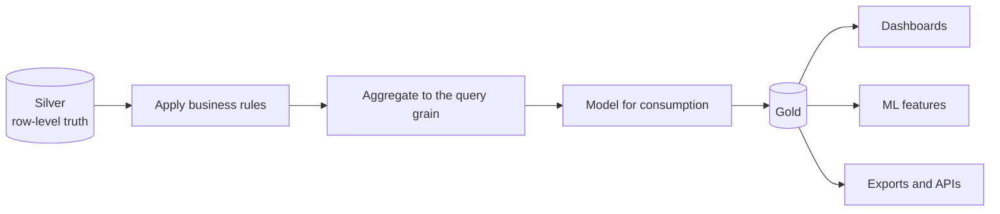
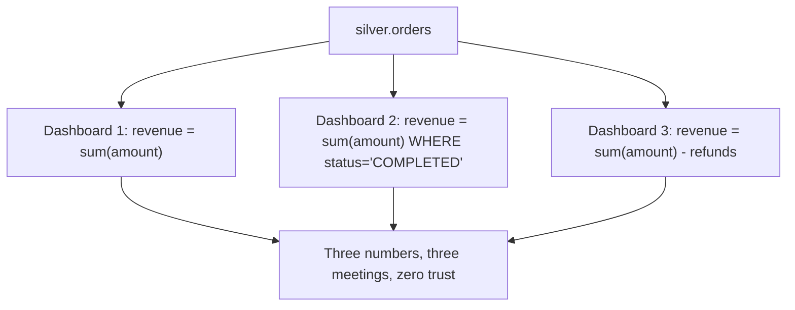
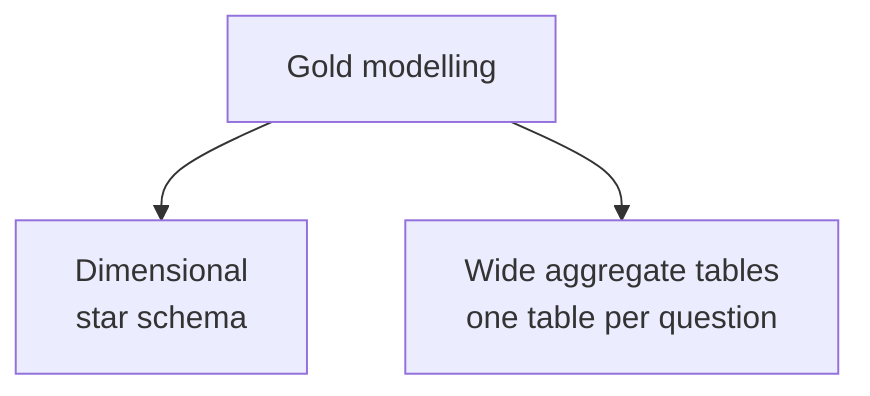
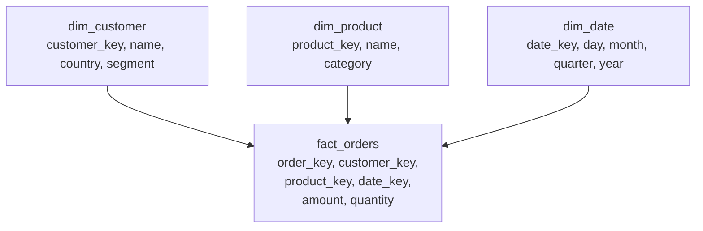
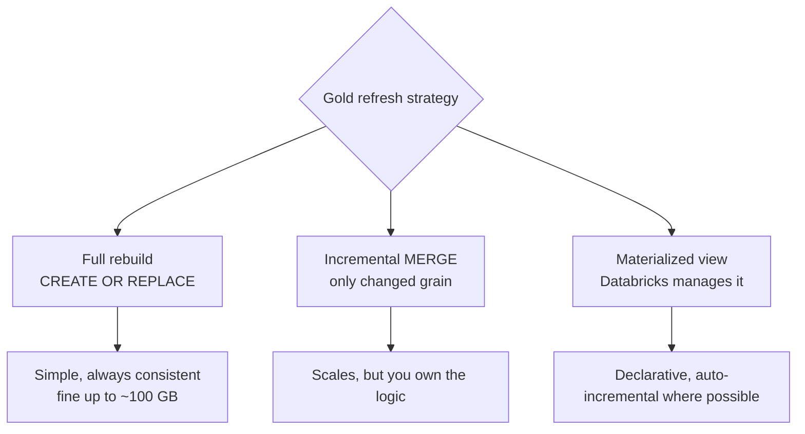
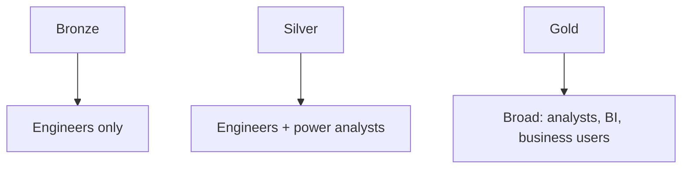

# Gold Layer

## The One Rule

```text
Gold answers the questions the business actually asks,
with the business definitions applied exactly once.
```



---

## Why Gold Exists

Without a gold layer, every dashboard writes its own version of the same
calculation.



Gold's job is to make that impossible: one table, one definition, one number.

---

## What Belongs in Gold

```text
✔ Business rules      "revenue excludes cancelled orders"
✔ Aggregations        daily, weekly, by country, by segment
✔ Derived metrics     conversion rate, churn, average order value
✔ Dimensional models  fact and dimension tables
✔ Feature tables      for ML
✔ Denormalised marts  wide tables joined for fast querying
```

```text
✘ Cleaning and type casting   → silver already did it
✘ Deduplication               → silver already did it
✘ Raw row-level detail        → that is silver
```

---

## Two Gold Styles



| | Star schema | Wide aggregate table |
|---|-------------|---------------------|
| Structure | Fact table + dimension tables | One denormalised table |
| Flexibility | High — slice any dimension | Low — fixed grain |
| Query speed | Good, needs joins | Excellent, no joins |
| Storage | Efficient | Redundant |
| Best for | Self-service BI, Genie, ad-hoc | Specific dashboards, APIs |

Most real platforms use **both**: a star schema for exploration, plus
pre-aggregated tables for the dashboards people open every morning.

---

## Style 1: Star Schema



```sql
CREATE OR REPLACE TABLE main.gold.dim_customer AS
SELECT
    customer_id                AS customer_key,
    name,
    country,
    segment,
    registration_date,
    current_timestamp()        AS _updated_at
FROM main.silver.customers;

CREATE OR REPLACE TABLE main.gold.fact_orders
CLUSTER BY (order_date, country)
AS
SELECT
    o.order_id                 AS order_key,
    o.customer_id              AS customer_key,
    o.product_id               AS product_key,
    o.order_date,
    o.amount,
    o.quantity,
    o.amount * o.quantity      AS line_total,
    c.country,                                -- degenerate dimension for pruning
    current_timestamp()        AS _updated_at
FROM main.silver.orders o
JOIN main.silver.customers c USING (customer_id)
WHERE o.status = 'COMPLETED';                 -- the business rule, applied once
```

```text
Fact table   = the events, numeric measures, foreign keys, fine grain
Dimension    = the descriptive context, one row per entity
Grain        = "one row per order line" — state it explicitly in a comment
```

### The date dimension

Every serious warehouse has one. It removes date arithmetic from every query.

```sql
CREATE OR REPLACE TABLE main.gold.dim_date AS
SELECT
    d                                    AS date_key,
    year(d)                              AS year,
    quarter(d)                           AS quarter,
    month(d)                             AS month,
    date_format(d, 'MMMM')               AS month_name,
    weekofyear(d)                        AS week_of_year,
    dayofweek(d)                         AS day_of_week,
    date_format(d, 'EEEE')               AS day_name,
    CASE WHEN dayofweek(d) IN (1, 7) THEN true ELSE false END AS is_weekend,
    trunc(d, 'MM')                       AS month_start,
    last_day(d)                          AS month_end
FROM (SELECT explode(sequence(DATE'2020-01-01', DATE'2030-12-31', INTERVAL 1 DAY)) AS d);
```

---

## Style 2: Pre-Aggregated Marts

```sql
CREATE OR REPLACE TABLE main.gold.daily_sales_summary
CLUSTER BY (order_date, country)
COMMENT 'Daily completed-order revenue by country and segment. Grain: one row per date/country/segment. Excludes cancelled and refunded orders.'
AS
SELECT
    o.order_date,
    c.country,
    c.segment,
    count(DISTINCT o.order_id)                       AS order_count,
    count(DISTINCT o.customer_id)                    AS customer_count,
    sum(o.amount)                                    AS total_revenue,
    avg(o.amount)                                    AS avg_order_value,
    sum(CASE WHEN o.is_first_order THEN 1 ELSE 0 END) AS new_customer_orders
FROM main.silver.orders o
JOIN main.silver.customers c USING (customer_id)
WHERE o.status = 'COMPLETED'
GROUP BY o.order_date, c.country, c.segment;
```

```text
Grain rule: aggregate to the finest grain any dashboard needs, and no finer.
Too fine  → dashboards still aggregate at query time, no benefit
Too coarse → a new question forces a new table
```

A dashboard filtering by country and segment can roll up from this table. A
dashboard needing per-product detail cannot — so either add product to the grain,
or build a second mart.

---

## Derived Metrics and Definitions

```sql
CREATE OR REPLACE TABLE main.gold.customer_metrics AS
WITH order_stats AS (
    SELECT
        customer_id,
        count(*)                                   AS lifetime_orders,
        sum(amount)                                AS lifetime_value,
        avg(amount)                                AS avg_order_value,
        min(order_date)                            AS first_order_date,
        max(order_date)                            AS last_order_date,
        datediff(current_date(), max(order_date))  AS days_since_last_order
    FROM main.silver.orders
    WHERE status = 'COMPLETED'
    GROUP BY customer_id
)
SELECT
    c.customer_id,
    c.name,
    c.country,
    c.segment,
    coalesce(o.lifetime_orders, 0)   AS lifetime_orders,
    coalesce(o.lifetime_value, 0)    AS lifetime_value,
    o.avg_order_value,
    o.first_order_date,
    o.last_order_date,
    o.days_since_last_order,
    CASE
        WHEN o.days_since_last_order IS NULL       THEN 'NEVER_PURCHASED'
        WHEN o.days_since_last_order <= 30         THEN 'ACTIVE'
        WHEN o.days_since_last_order <= 90         THEN 'AT_RISK'
        ELSE 'CHURNED'
    END                              AS lifecycle_stage
FROM main.silver.customers c
LEFT JOIN order_stats o USING (customer_id);
```

The `CASE` block **is** the churn definition for the whole company. It lives
here, in one place, where it can be reviewed and changed deliberately.

---

## Incremental Gold

Rebuilding gold from scratch every night is simple but does not scale.



```sql
-- Incremental: recompute only the affected dates
MERGE INTO main.gold.daily_sales_summary t
USING (
    SELECT o.order_date, c.country, c.segment,
           count(*) AS order_count, sum(o.amount) AS total_revenue,
           avg(o.amount) AS avg_order_value
    FROM main.silver.orders o
    JOIN main.silver.customers c USING (customer_id)
    WHERE o.status = 'COMPLETED'
      AND o.order_date >= current_date() - INTERVAL 3 DAYS   -- late-arriving window
    GROUP BY o.order_date, c.country, c.segment
) s
ON  t.order_date = s.order_date
AND t.country    = s.country
AND t.segment    = s.segment
WHEN MATCHED THEN UPDATE SET *
WHEN NOT MATCHED THEN INSERT *;
```

```text
The 3-day window handles late-arriving data. Without it, an order that
lands two days late never appears in gold.
```

```sql
-- Or let Databricks do it
CREATE MATERIALIZED VIEW main.gold.mv_daily_sales
SCHEDULE CRON '0 0 7 * * ?'
AS SELECT ... ;
```

---

## Making Gold Fast

```sql
ALTER TABLE main.gold.daily_sales_summary CLUSTER BY (order_date, country);

ALTER TABLE main.gold.daily_sales_summary SET TBLPROPERTIES (
  'delta.autoOptimize.optimizeWrite' = 'true',
  'delta.autoOptimize.autoCompact'   = 'true'
);

OPTIMIZE main.gold.daily_sales_summary;
```

```text
✔ Cluster on the columns dashboards filter by (usually date first)
✔ Keep gold tables small — that is the entire point
✔ Use materialized views for repeatedly expensive aggregates
✔ Check DESCRIBE DETAIL: a gold table with 50 000 tiny files is misconfigured
```

---

## Documentation Is Part of the Deliverable

Gold is consumed by people who did not build it. Undocumented gold gets
misused, then distrusted.

```sql
COMMENT ON TABLE main.gold.daily_sales_summary IS
  'Daily revenue aggregates. Grain: one row per order_date, country, segment. Revenue = sum of COMPLETED order amounts in USD, excludes cancelled and refunded. Refreshed daily at 06:30 UTC by job retail_daily_pipeline.';

ALTER TABLE main.gold.daily_sales_summary
  ALTER COLUMN total_revenue COMMENT 'Sum of completed order amounts, USD, excludes tax and shipping';

ALTER TABLE main.gold.daily_sales_summary
  ALTER COLUMN order_count COMMENT 'Distinct completed orders. An order with 5 line items counts once.';
```

Those comments also feed Genie and the catalog search, so they pay for
themselves twice.

---

## Access and Governance

```sql
GRANT USE CATALOG ON CATALOG main TO `analysts`;
GRANT USE SCHEMA  ON SCHEMA main.gold TO `analysts`;
GRANT SELECT      ON SCHEMA main.gold TO `analysts`;

-- Sensitive marts stay narrower
GRANT SELECT ON TABLE main.gold.customer_metrics TO `crm_team`;
```



Gold is the layer you deliberately open up. That is only safe because silver
guaranteed correctness first.

---

## Gold Checklist

```text
✔ Business definitions implemented exactly once
✔ Grain stated in a table comment
✔ Aggregated to what dashboards actually query
✔ Clustered on the common filter columns
✔ Comments on the table and every non-obvious column
✔ Incremental refresh with a late-arrival window, or a materialized view
✔ Refreshed by the same job that builds it, with a quality gate before publish
✔ Granted broadly, with sensitive marts scoped narrowly
✔ Small enough that a dashboard query is trivially fast
```

---

## Common Interview Questions

### What is the gold layer?

The consumption layer: business rules applied, data aggregated and modelled for
dashboards, reports, and ML, with definitions implemented once.

### Star schema or one big table?

Star schema for flexible self-service exploration; wide pre-aggregated tables for
known, repeated dashboard queries. Mature platforms have both.

### What is the grain of a table and why does it matter?

The grain is what one row represents. Every aggregation, join, and metric depends
on it, and mismatched grain is the most common cause of double counting.

### How do you refresh gold incrementally?

MERGE recomputed aggregates for a recent window (to catch late-arriving data),
keyed on the grain columns — or use a materialized view and let Databricks manage
incremental refresh.

### Why should dashboards not query silver?

Silver is row-level and unaggregated, so queries are slow, and each dashboard
re-implements business rules, producing numbers that disagree.

### How do you prevent three dashboards from reporting three different revenues?

Define the metric once in gold (a table, view, or metric definition) and require
all consumers to read it rather than recomputing from silver.

---

## Quick Revision

```text
Gold = what the business asks about

Contains: business rules | aggregates | derived metrics | dimensional models
Excludes: cleaning | casting | deduplication | raw detail

Styles:
star schema      → flexible self-service (fact + dimensions + dim_date)
wide aggregates  → fast, fixed-grain dashboard tables

Grain = what one row represents — always document it

Refresh:
full rebuild (small) | incremental MERGE with late-arrival window | materialized view

Performance: cluster on filter columns, keep tables small, OPTIMIZE

Governance: broad SELECT for analysts, narrow for sensitive marts

Documentation is part of the deliverable — it feeds Genie and catalog search
```
