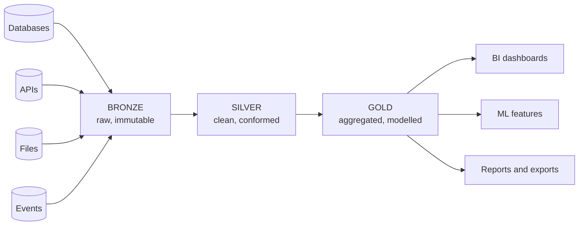
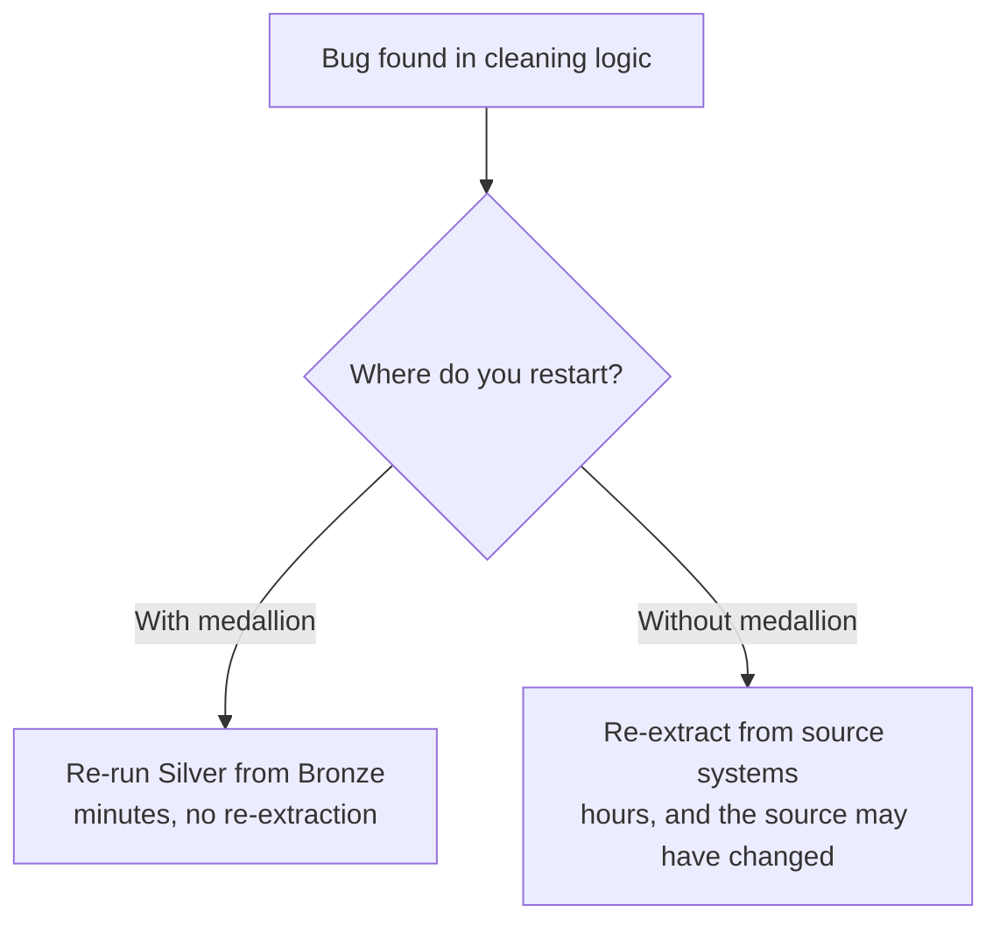
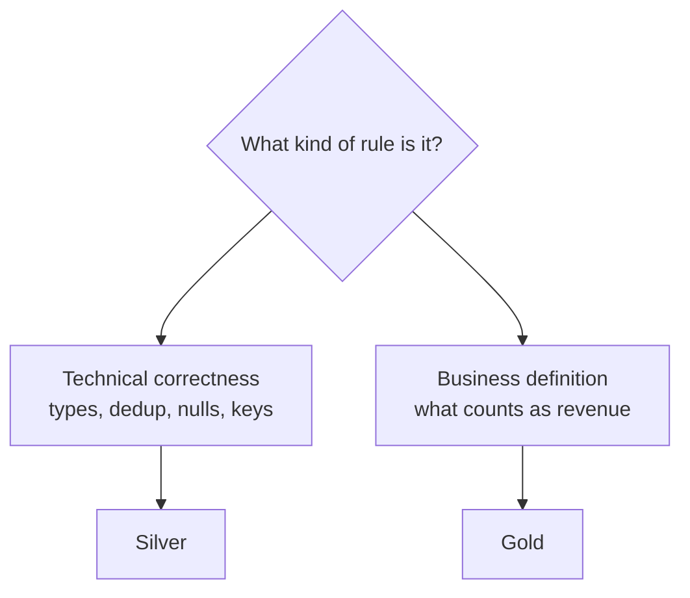
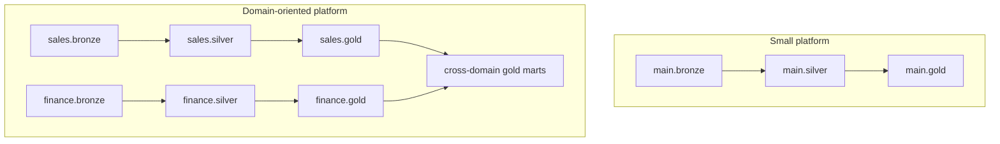
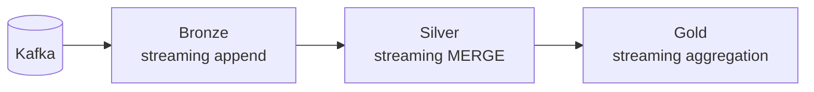

# Medallion Architecture

## The Problem It Solves

Imagine a single notebook that reads a CSV from a vendor, fixes the dates,
deduplicates, joins three tables, and produces a revenue report.

```text
One day the report is wrong. Now answer these:
- Did the vendor send bad data, or did we corrupt it?
- What exactly did the file contain last Tuesday?
- Can we reprocess just the cleaning step without re-downloading everything?
- Which of the 400 lines introduced the error?
```

With one step, none of these are answerable. With three layers, all of them are.

---

## The Pattern



```text
Bronze  →  fidelity     (we can always prove what the source sent)
Silver  →  correctness  (one row per real-world thing, types are right)
Gold    →  usability    (a business user can query it without a data engineer)
```

---

## Why Three Layers Specifically

Each boundary exists because something different can go wrong.

| Boundary | Protects against |
|----------|------------------|
| Source → Bronze | Losing the original data; not being able to reprocess |
| Bronze → Silver | Bad records, duplicates, type mismatches, broken keys |
| Silver → Gold | Every analyst computing "revenue" a different way |



That reprocessing property is the single strongest argument for the pattern.

---

## Layer Characteristics at a Glance

| | Bronze | Silver | Gold |
|---|--------|--------|------|
| **Content** | Exactly what arrived | Cleaned, deduplicated, conformed | Aggregated, modelled |
| **Schema** | Loose, schema-on-read | Enforced, typed | Business-defined |
| **Write mode** | Append-only | MERGE / upsert | Overwrite or incremental |
| **Grain** | Source grain | One row per business entity or event | Aggregated grain |
| **History** | Everything, forever | Current state (or SCD2) | Usually current |
| **Consumers** | Engineers only | Engineers, some analysts | Analysts, BI, ML |
| **Access** | Restricted | Restricted or team-level | Broad |
| **Naming** | `bronze.orders_raw` | `silver.orders` | `gold.daily_sales_summary` |

---

## Worked Example: An Order Flows Through

### The source sends

```json
{"ord_id": "1001", "cust": " 42 ", "amt": "199.99",
 "dt": "18/09/2026", "status": "completed"}
```

### Bronze stores it almost untouched

```python
(spark.readStream.format("cloudFiles")
   .option("cloudFiles.format", "json")
   .option("cloudFiles.schemaLocation", "/Volumes/main/bronze/_schema/orders")
   .load("/Volumes/main/landing/orders/")
   .withColumn("_ingested_at", F.current_timestamp())
   .withColumn("_source_file", F.col("_metadata.file_path"))
   .writeStream
   .option("checkpointLocation", "/Volumes/main/bronze/_ckpt/orders")
   .toTable("main.bronze.orders_raw"))
```

```text
bronze.orders_raw
ord_id | cust  | amt     | dt         | status    | _ingested_at | _source_file
"1001" | " 42 "| "199.99"| 18/09/2026 | completed | 2026-09-18.. | orders_01.json
```

Strings everywhere, original column names, nothing thrown away.

### Silver makes it true

```python
clean = (spark.table("main.bronze.orders_raw")
    .select(
        F.col("ord_id").cast("bigint").alias("order_id"),
        F.trim(F.col("cust")).cast("int").alias("customer_id"),
        F.col("amt").cast("decimal(18,2)").alias("amount"),
        F.to_date("dt", "dd/MM/yyyy").alias("order_date"),
        F.upper(F.trim("status")).alias("status"),
        F.col("_ingested_at"),
    )
    .filter("order_id IS NOT NULL AND amount >= 0")
    .dropDuplicates(["order_id"]))
```

```text
silver.orders
order_id | customer_id | amount | order_date | status    | _ingested_at
1001     | 42          | 199.99 | 2026-09-18 | COMPLETED | 2026-09-18..
```

Proper types, business column names, one row per order.

### Gold answers the question

```sql
CREATE OR REPLACE TABLE main.gold.daily_sales_summary AS
SELECT
    o.order_date,
    c.country,
    c.segment,
    count(*)                    AS order_count,
    sum(o.amount)               AS total_revenue,
    avg(o.amount)               AS avg_order_value
FROM main.silver.orders o
JOIN main.silver.customers c USING (customer_id)
WHERE o.status = 'COMPLETED'
GROUP BY o.order_date, c.country, c.segment;
```

```text
gold.daily_sales_summary
order_date | country | segment  | order_count | total_revenue | avg_order_value
2026-09-18 | IN      | PREMIUM  | 1 240       | 248 120.50    | 200.10
```

Notice the business rule "revenue excludes cancelled orders" lives in **one
place**, in gold. That is the point.

---

## Where Business Logic Belongs



```text
Silver: "a null order_id is invalid"        → true regardless of who asks
Gold:   "revenue excludes cancelled orders" → a business decision
```

Putting business definitions in silver means every new business question forces a
silver rewrite. Putting technical cleaning in gold means every gold table repeats
the same cleanup.

---

## Naming and Organisation

```text
Catalog per environment:
  dev_catalog | stg_catalog | main

Schema per layer:
  main.bronze | main.silver | main.gold

Or, at larger scale, schema per domain and layer:
  main.sales_bronze | main.sales_silver | main.sales_gold
  main.finance_bronze | ...
```



Domain separation matters once multiple teams own pipelines, because Unity
Catalog permissions and ownership align naturally with catalogs and schemas.

---

## Common Variations

### More than three layers

Some platforms add a **raw/landing** zone before bronze (files as delivered,
before any Delta table) or a **platinum** layer (heavily curated, certified
datasets). Both are fine; the reasoning is the same.

```text
Landing → Bronze → Silver → Gold → Platinum
files     delta    clean     marts   certified
```

### Silver split into two

```text
Silver 1: cleaned, one row per source record
Silver 2: conformed and joined across sources (a canonical "customer")
```

This is common when many source systems describe the same entity.

### Streaming medallion



The layers are identical; only the trigger changes. Topics 11 to 13 cover this.

---

## Anti-Patterns

```text
❌ Transforming data on the way into bronze
   → you lose the ability to prove what the source sent

❌ Business logic in silver
   → every new question rewrites silver

❌ Dashboards querying silver directly
   → slow, and every dashboard reimplements the same aggregation

❌ Skipping silver: bronze straight to gold
   → cleaning logic is duplicated in every gold table

❌ A gold table per dashboard tile
   → hundreds of near-identical tables, none trusted

❌ Same table name across layers with no prefix
   → nobody can tell which one is safe to query
```

---

## Layer Design Checklist

```text
Bronze
✔ Append-only, never updated in place
✔ Source columns preserved, plus ingestion metadata
✔ Retention long enough to reprocess silver from scratch

Silver
✔ One row per business entity, with a clear primary key
✔ Types enforced, nulls handled explicitly
✔ Idempotent MERGE so reprocessing is safe
✔ Rejected rows quarantined, not silently dropped

Gold
✔ Business definitions documented and implemented once
✔ Aggregated to the grain dashboards actually query
✔ Comments on every table and column
✔ Optimised layout (liquid clustering) for dashboard filters
```

---

## Common Interview Questions

### What is the medallion architecture?

A layered design where data flows bronze (raw), silver (cleaned and conformed),
and gold (business aggregates), each layer with a single responsibility.

### Why not load straight from source to a reporting table?

Because you cannot reprocess without re-extracting, you cannot prove what the
source sent, and cleaning plus business logic get tangled into one untestable
step.

### Which layer holds business logic?

Gold. Silver holds technical correctness rules that are true regardless of who is
asking.

### Should dashboards read silver or gold?

Gold. Silver is row-level and unaggregated; dashboards reading it are slow and
each one re-implements the same business rules.

### Is medallion only for batch?

No. Streaming pipelines use the same three layers; only the trigger and the write
mechanics change.

### How many layers should you have?

Three by default. Add a landing zone or a certified layer only when there is a
concrete reason, because each extra layer costs storage and latency.

---

## Quick Revision

```text
Bronze = what the source said      → append-only, raw, immutable
Silver = what is true              → typed, deduplicated, MERGE, quarantine
Gold   = what the business asks    → aggregated, modelled, documented

Rules:
✔ Never transform on the way into bronze
✔ Technical rules in silver, business rules in gold
✔ Dashboards read gold only
✔ Every layer reprocessable from the one before it

Naming: catalog per environment, schema per layer (or per domain + layer)

Biggest benefit: you can always rebuild downstream from upstream
```
