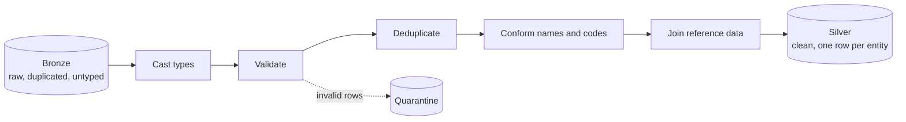
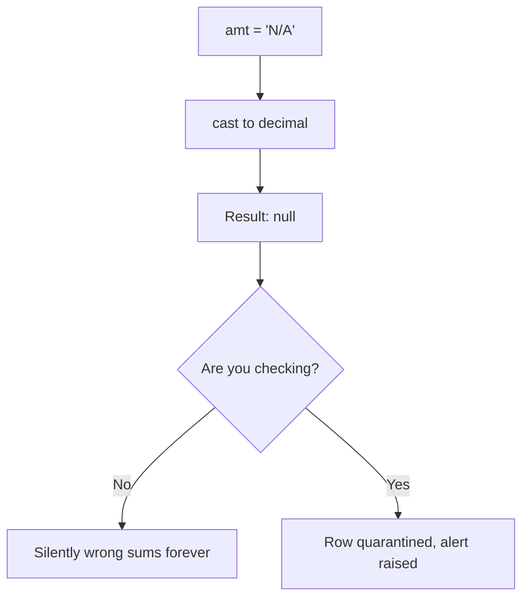
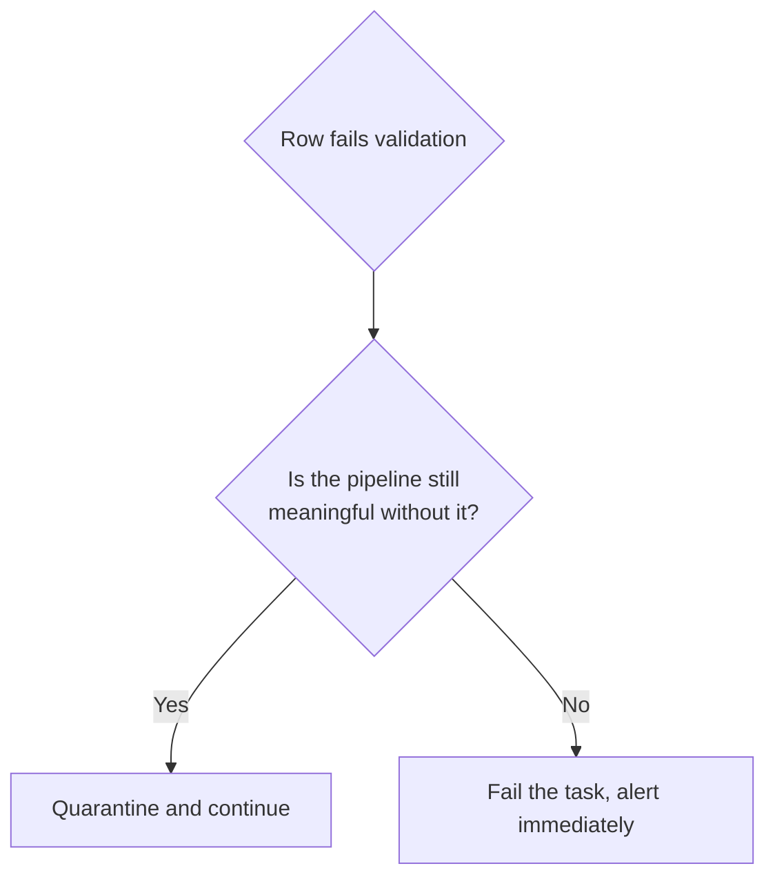
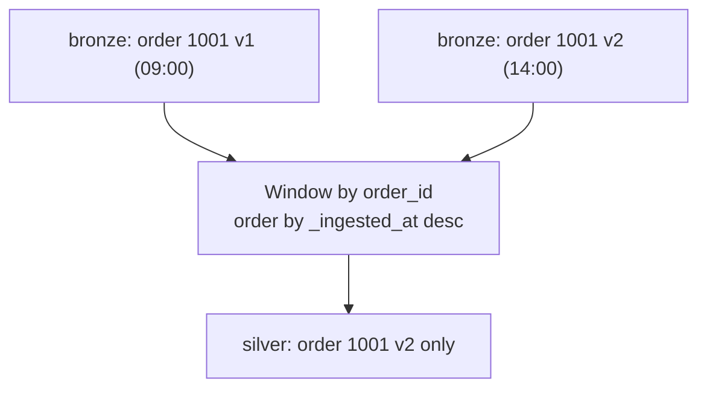
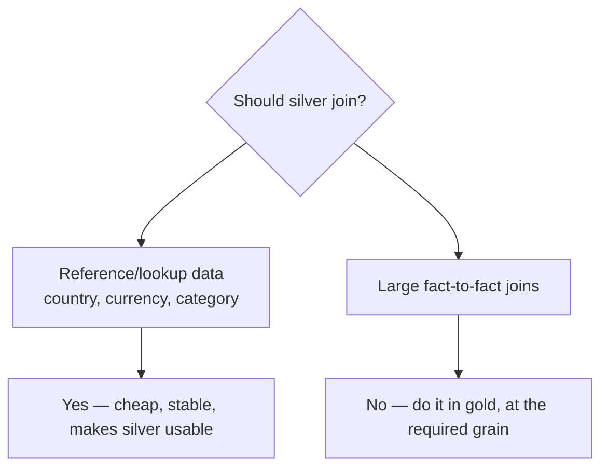
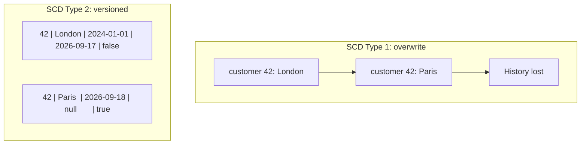

# Silver Layer

## The One Rule

```text
Silver holds what is TRUE: one row per real-world thing, with correct types.
```

Bronze answers "what did the source send?". Silver answers "what is actually the
case?".



---

## The Six Jobs of Silver

| Job | Example |
|-----|---------|
| **1. Cast types** | `"199.99"` → `decimal(18,2)`, `"18/09/2026"` → `date` |
| **2. Validate** | Reject rows with a null business key or a negative amount |
| **3. Deduplicate** | Keep the latest version of order 1001 |
| **4. Conform** | `"completed"`, `"COMPLETE"`, `"C"` → `COMPLETED` |
| **5. Enrich** | Add `country` from a reference table |
| **6. Standardise structure** | Consistent column names across source systems |

---

## Job 1: Casting Types Safely

```python
from pyspark.sql import functions as F

typed = raw.select(
    F.col("ord_id").cast("bigint").alias("order_id"),
    F.trim(F.col("cust")).cast("int").alias("customer_id"),
    F.col("amt").cast("decimal(18,2)").alias("amount"),
    F.to_date("dt", "dd/MM/yyyy").alias("order_date"),
    F.upper(F.trim("status")).alias("status"),
    F.col("_ingested_at"),
    F.col("_source_file"),
)
```

The trap: a failed cast in Spark returns **null**, it does not raise.



```python
# Detect cast failures explicitly
cast_failures = typed.filter(
    "(amount IS NULL AND raw_amt IS NOT NULL) OR (order_date IS NULL AND raw_dt IS NOT NULL)"
)
```

> A null that came from the source and a null that came from a failed cast mean
> completely different things. Distinguish them.

---

## Job 2: Validation and Quarantine

```python
rules = {
    "valid_order_id":   "order_id IS NOT NULL",
    "valid_customer":   "customer_id IS NOT NULL",
    "non_negative":     "amount >= 0",
    "valid_date":       "order_date IS NOT NULL AND order_date <= current_date()",
    "known_status":     "status IN ('COMPLETED','CANCELLED','PENDING','REFUNDED')",
}

condition = " AND ".join(f"({r})" for r in rules.values())

valid   = typed.filter(condition)
invalid = typed.filter(f"NOT ({condition})")
```

Tag **why** each row failed, otherwise the quarantine table is useless:

```python
tagged = invalid
for name, rule in rules.items():
    tagged = tagged.withColumn(f"_fail_{name}", F.expr(f"NOT ({rule})"))

(tagged
   .withColumn("_quarantined_at", F.current_timestamp())
   .write.format("delta").mode("append")
   .option("mergeSchema", "true")
   .saveAsTable("main.quarantine.orders"))
```

```sql
-- Monitor the quarantine, or it becomes a data graveyard
SELECT date(_quarantined_at) AS day, count(*) AS rejected
FROM main.quarantine.orders
GROUP BY 1 ORDER BY 1 DESC;
```



```text
Quarantine: a few malformed vendor rows out of a million
Fail fast:  the entire file arrived empty, or 40% of rows are invalid
```

A good rule: quarantine below a threshold, fail above it.

```python
reject_rate = invalid.count() / max(typed.count(), 1)
if reject_rate > 0.05:
    raise Exception(f"Reject rate {reject_rate:.1%} exceeds 5% — refusing to load")
```

---

## Job 3: Deduplication

Bronze is append-only, so the same order appears once per delivery.



```python
from pyspark.sql.window import Window

w = Window.partitionBy("order_id").orderBy(F.col("_ingested_at").desc())

latest = (valid
    .withColumn("_rn", F.row_number().over(w))
    .filter("_rn = 1")
    .drop("_rn"))
```

```text
Choosing the ordering column matters:
_ingested_at  → when we received it (safe default)
updated_at    → when the source changed it (better, if trustworthy)
_offset       → for Kafka, guaranteed ordering within a partition
```

`dropDuplicates(["order_id"])` picks an **arbitrary** row, not the latest. It is
fine only when duplicates are byte-identical.

---

## Job 4: Conforming Values

```python
status_map = {
    "completed": "COMPLETED", "complete": "COMPLETED", "c": "COMPLETED",
    "cancelled": "CANCELLED", "canceled": "CANCELLED", "x": "CANCELLED",
}

mapping = F.create_map([F.lit(x) for kv in status_map.items() for x in kv])

conformed = latest.withColumn(
    "status",
    F.coalesce(mapping[F.lower(F.trim("status"))], F.lit("UNKNOWN"))
)
```

Better at scale: keep the mapping in a **reference table** so business users can
maintain it without a deployment.

```sql
CREATE TABLE main.reference.status_mapping (
    source_system STRING,
    source_value  STRING,
    canonical_value STRING
);
```

```python
conformed = (latest.alias("o")
    .join(F.broadcast(spark.table("main.reference.status_mapping").alias("m")),
          (F.lower(F.trim(F.col("o.status"))) == F.col("m.source_value")) &
          (F.col("m.source_system") == F.lit("erp_oracle")),
          "left")
    .withColumn("status", F.coalesce("m.canonical_value", F.lit("UNKNOWN")))
    .drop("source_value", "canonical_value", "source_system"))
```

Then alert on `UNKNOWN`, because it means the source invented a new value.

---

## Job 5: The Idempotent Write

Silver must be safe to re-run. `MERGE` is how.

```python
clean.createOrReplaceTempView("updates")

spark.sql("""
MERGE INTO main.silver.orders t
USING updates s
ON t.order_id = s.order_id
WHEN MATCHED AND s._ingested_at > t._ingested_at THEN UPDATE SET *
WHEN NOT MATCHED THEN INSERT *
""")
```

```text
The AND clause matters: without it, an out-of-order reprocess can
overwrite a newer row with an older one.
```

Alternative for date-partitioned reloads:

```python
(clean.write.format("delta").mode("overwrite")
   .option("replaceWhere", f"order_date = '{run_date}'")
   .saveAsTable("main.silver.orders"))
```

| Approach | Use when |
|----------|----------|
| `MERGE` on business key | Records can be updated by the source |
| `replaceWhere` on a date | Each run owns one complete date partition |
| `overwrite` whole table | Small dimension tables |

---

## Job 6: Enrichment and Joins

```python
enriched = (deduped.alias("o")
    .join(F.broadcast(spark.table("main.silver.customers").alias("c")),
          F.col("o.customer_id") == F.col("c.customer_id"), "left")
    .select("o.*", "c.country", "c.segment"))
```



Watch for orphans:

```python
orphans = deduped.join(customers, "customer_id", "left_anti").count()
if orphans > 0:
    dbutils.jobs.taskValues.set(key="orphan_orders", value=orphans)
```

Orphan rows usually mean the dimension load ran **after** the fact load. That is
a dependency bug in the workflow, not a data bug.

---

## Slowly Changing Dimensions in Silver

For dimensions, "one row per entity" sometimes needs to become "one row per
version of an entity".



```sql
-- SCD Type 2 with MERGE
MERGE INTO main.silver.customers_scd2 t
USING (
    SELECT customer_id AS merge_key, * FROM updates
    UNION ALL
    -- second row forces the "close old version" branch
    SELECT NULL AS merge_key, u.*
    FROM updates u JOIN main.silver.customers_scd2 t
      ON u.customer_id = t.customer_id
    WHERE t.is_current = true AND u.city <> t.city
) s
ON t.customer_id = s.merge_key AND t.is_current = true

WHEN MATCHED AND t.city <> s.city THEN
  UPDATE SET t.is_current = false, t.valid_to = current_date()

WHEN NOT MATCHED THEN
  INSERT (customer_id, city, valid_from, valid_to, is_current)
  VALUES (s.customer_id, s.city, current_date(), NULL, true);
```

```text
SCD1 → "where does customer 42 live?"       → current state only
SCD2 → "where did they live when they ordered?" → point-in-time correctness
```

Use SCD2 when historical reporting must not change retroactively.

---

## Putting It Together

```python
from pyspark.sql import functions as F
from pyspark.sql.window import Window

run_date = dbutils.widgets.get("run_date")

raw = spark.table("main.bronze.orders_raw").filter(f"date(_ingested_at) = '{run_date}'")

# 1. cast
typed = raw.select(
    F.col("ord_id").cast("bigint").alias("order_id"),
    F.trim("cust").cast("int").alias("customer_id"),
    F.col("amt").cast("decimal(18,2)").alias("amount"),
    F.to_date("dt", "dd/MM/yyyy").alias("order_date"),
    F.upper(F.trim("status")).alias("status"),
    "_ingested_at", "_source_file",
)

# 2. validate
cond = "order_id IS NOT NULL AND customer_id IS NOT NULL AND amount >= 0 AND order_date IS NOT NULL"
valid, invalid = typed.filter(cond), typed.filter(f"NOT ({cond})")

if invalid.count() > 0:
    (invalid.withColumn("_quarantined_at", F.current_timestamp())
            .write.format("delta").mode("append")
            .option("mergeSchema", "true").saveAsTable("main.quarantine.orders"))

# 3. deduplicate
w = Window.partitionBy("order_id").orderBy(F.col("_ingested_at").desc())
clean = valid.withColumn("_rn", F.row_number().over(w)).filter("_rn = 1").drop("_rn")

# 4. write idempotently
clean.createOrReplaceTempView("updates")
spark.sql("""
MERGE INTO main.silver.orders t USING updates s
ON t.order_id = s.order_id
WHEN MATCHED AND s._ingested_at > t._ingested_at THEN UPDATE SET *
WHEN NOT MATCHED THEN INSERT *
""")

dbutils.jobs.taskValues.set(key="silver_rows", value=clean.count())
dbutils.jobs.taskValues.set(key="quarantined", value=invalid.count())
```

---

## Silver Checklist

```text
✔ Explicit schema with correct types
✔ Cast failures detected, not silently nulled
✔ Validation rules named, so rejects are explainable
✔ Quarantine table with failure reasons, and a reject-rate threshold
✔ Deduplicated by business key using a deterministic ordering
✔ Values conformed via a maintainable reference table
✔ MERGE with an ordering guard, so reprocessing is idempotent
✔ Reference joins only; fact-to-fact joins belong in gold
✔ Orphan detection on foreign keys
✔ Column comments, because silver is where the grain is defined
```

---

## Common Interview Questions

### What happens in the silver layer?

Casting, validation, deduplication, conforming, and reference enrichment,
producing one row per business entity with enforced types.

### Why does a bad cast in Spark not fail?

Spark returns null on cast failure by default. You must compare pre- and
post-cast nullness to detect it, otherwise data is silently lost.

### How do you deduplicate correctly?

`row_number()` over a window partitioned by the business key and ordered by a
meaningful timestamp, keeping row 1. `dropDuplicates` picks arbitrarily.

### Why is MERGE preferred over append in silver?

It makes the write idempotent, so retries and reprocessing produce the same
result instead of duplicating rows.

### When do you quarantine versus fail the pipeline?

Quarantine isolated bad records so good data still flows. Fail when the reject
rate crosses a threshold, which indicates a systemic problem rather than noise.

### SCD Type 1 vs Type 2?

Type 1 overwrites, keeping only current state. Type 2 versions rows with
`valid_from`, `valid_to`, and `is_current`, preserving point-in-time history.

### Should silver contain business logic?

No. Silver enforces technical truth. Definitions like "revenue excludes
cancelled orders" belong in gold.

---

## Quick Revision

```text
Silver = what is TRUE

Six jobs: cast | validate | deduplicate | conform | enrich | standardise

Traps:
✘ Silent null from a failed cast
✘ dropDuplicates instead of row_number
✘ MERGE without an ordering guard
✘ Quarantine table nobody monitors

Write patterns:
MERGE on business key      → source can update records
replaceWhere on a date     → run owns a full partition
overwrite                  → small dimensions

SCD1 = overwrite | SCD2 = valid_from / valid_to / is_current

Rule: technical rules here, business rules in gold
```
