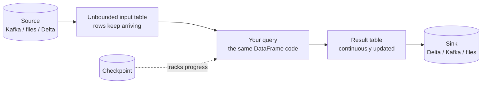

# 11 – Structured Streaming

Batch asks "what happened yesterday?". Streaming asks "what is happening right
now?". In Databricks both use the **same API** — which is the single most
important thing to understand about Structured Streaming.

```python
spark.read.format("delta").table("orders")        # batch
spark.readStream.format("delta").table("orders")  # streaming
```

One word changes, and Spark handles the rest.

---

## The Core Mental Model



```text
A stream is a table that never stops growing.
Your query runs incrementally over the new rows, forever.
```

---

## Reading Order

| # | File | What you learn |
|---|------|----------------|
| 1 | [streaming_basics.md](streaming_basics.md) | Micro-batches, sources, sinks, output modes |
| 2 | [checkpoints_and_fault_tolerance.md](checkpoints_and_fault_tolerance.md) | Exactly-once, state, recovery |
| 3 | [triggers_and_latency.md](triggers_and_latency.md) | Trigger modes and the cost/latency trade-off |
| 4 | [windows_and_watermarks.md](windows_and_watermarks.md) | Event time, late data, aggregations |
| 5 | [stream_joins.md](stream_joins.md) | Stream-to-stream and stream-to-batch joins |
| 6 | [production_streaming.md](production_streaming.md) | Monitoring, tuning, deployment |
| 7 | [interview_questions.md](interview_questions.md) | Questions asked in interviews |

---

## Quick Revision

```text
readStream / writeStream  → the only API change from batch
Micro-batch               → small batches, not row-by-row
Checkpoint                → progress + state; never delete it casually
Trigger                   → how often a micro-batch runs
Output mode               → append | update | complete
Watermark                 → how long to wait for late data
State                     → what aggregations and joins remember
```
