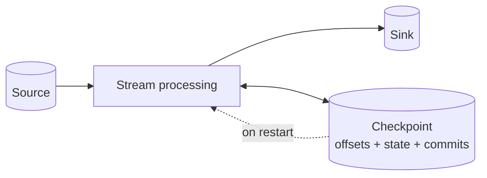
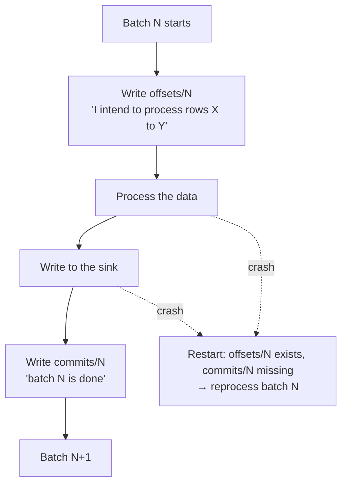
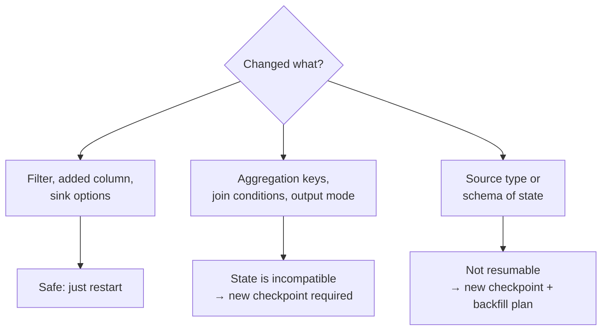
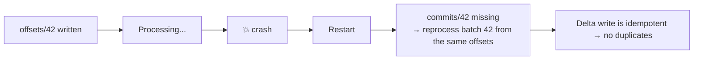
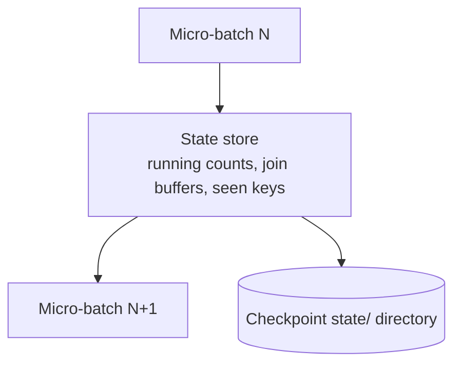

# Checkpoints and Fault Tolerance

## The Problem Checkpoints Solve

A stream runs for months. Clusters restart, code is redeployed, nodes fail.

```text
Question: after a restart, where should the stream resume?

Too early → duplicate data
Too late  → lost data
Exactly right → exactly-once
```

The checkpoint is the answer to that question, written durably to cloud storage.



---

## What Is Inside a Checkpoint

```text
/Volumes/main/silver/_ckpt/orders/
├── offsets/          what has been READ (per micro-batch)
│   ├── 0
│   ├── 1
│   └── 2
├── commits/          what has been successfully WRITTEN
│   ├── 0
│   └── 1
├── state/            stateful operator data (aggregations, joins)
│   └── 0/0/...
├── sources/          source-specific metadata (e.g. Auto Loader file list)
└── metadata          the query id
```

| Directory | Holds | Why it matters |
|-----------|-------|----------------|
| `offsets` | Planned range for each batch | Written **before** processing |
| `commits` | Batches that finished successfully | Written **after** the sink write |
| `state` | Aggregation and join state | Can be large; tune and monitor it |
| `sources` | Source bookkeeping | Auto Loader's processed-file record |

---

## How Exactly-Once Works



```text
The guarantee has two halves:

1. The SOURCE must be replayable  (Kafka offsets, Delta versions, file lists)
2. The SINK must be idempotent or transactional  (Delta is; a REST API is not)

Delta + Kafka  → exactly-once
Delta + Delta  → exactly-once
Delta + REST API → at-least-once, unless you deduplicate on the receiving side
```

This is why "exactly-once" in Databricks is not marketing: Delta commits are
atomic and carry the batch id, so a replayed batch is recognised and skipped.

---

## The Rules of Checkpoints

```text
1. Every stream needs its own checkpoint location. Never share.
2. The checkpoint is bound to the query, not the cluster.
3. Deleting the checkpoint resets the stream to the beginning (or to `latest`).
4. Checkpoints live in cloud storage or a Volume — never on local disk.
5. Do not edit checkpoint files by hand.
```

```python
# ❌ two streams, one checkpoint → corruption
.option("checkpointLocation", "/Volumes/main/_ckpt/shared")

# ✅ one checkpoint per stream, named after the target table
.option("checkpointLocation", "/Volumes/main/silver/_ckpt/orders")
.option("checkpointLocation", "/Volumes/main/silver/_ckpt/customers")
```

A sensible convention:

```text
/Volumes/<catalog>/<layer>/_ckpt/<target_table_name>/
```

---

## What Breaks a Checkpoint

Not all code changes are safe to make on a running stream.



| Change | Safe to resume? |
|--------|-----------------|
| Add or remove a `filter` | Yes |
| Add a `withColumn` | Yes |
| Change trigger interval | Yes |
| Change `maxFilesPerTrigger` | Yes |
| Change the sink table | No — new checkpoint |
| Change `groupBy` keys | No — state layout differs |
| Add or remove a stateful operator | No |
| Change source from Kafka to Delta | No |
| Upgrade DBR major version | Usually yes; test it |

```text
When in doubt: start a new checkpoint, write to a new table or a distinct
partition, verify, then switch consumers. Never gamble on a production stream.
```

---

## Recovery Scenarios

### Scenario 1: cluster dies mid-batch



Nothing to do. The stream heals itself.

### Scenario 2: bad code deployed, bad data written

```sql
-- Find the version before the bad deploy
DESCRIBE HISTORY main.silver.orders;

-- Restore the table
RESTORE TABLE main.silver.orders TO VERSION AS OF 118;
```

Then decide about the checkpoint:

```text
If you restored the SINK, the checkpoint now thinks batches are done
that no longer exist in the table.

Options:
A. Reset the checkpoint and reprocess from a known source position
B. Keep the checkpoint and backfill the gap with a separate batch job
```

Option A is cleaner for bronze/silver where the source is fully replayable.

### Scenario 3: checkpoint deleted or corrupted

```python
# Restart from a specific source position instead of the very beginning
(spark.readStream.format("delta")
   .option("startingVersion", 4210)          # Delta
   .table("main.bronze.orders_raw"))

(spark.readStream.format("kafka")
   .option("startingOffsets", '{"orders":{"0":153000,"1":152800}}')
   .load())
```

```text
For an append-only bronze target with a MERGE-based silver, reprocessing is
harmless because the write is idempotent. This is the payoff for designing
idempotent writes in topic 10.
```

### Scenario 4: need to reprocess everything

```python
# Full replay: new checkpoint, truncate target, start from the beginning
dbutils.fs.rm("/Volumes/main/silver/_ckpt/orders", recurse=True)
spark.sql("TRUNCATE TABLE main.silver.orders")

(spark.readStream.format("delta")
   .option("startingVersion", 0)
   .table("main.bronze.orders_raw")
   .writeStream
   .option("checkpointLocation", "/Volumes/main/silver/_ckpt/orders_v2")
   .trigger(availableNow=True)
   .toTable("main.silver.orders"))
```

```text
Use a NEW checkpoint directory rather than reusing the deleted path.
It keeps the old state recoverable if the replay goes wrong.
```

---

## State Store

Stateful operators keep data between micro-batches.



```text
State grows with:
  number of distinct keys × retention window × size per key

Without a watermark, state grows FOREVER and the stream eventually dies
with an out-of-memory error at 3 AM.
```

### RocksDB state store

For large state, use the RocksDB provider — it keeps state on disk rather than
JVM heap.

```python
spark.conf.set(
    "spark.sql.streaming.stateStore.providerClass",
    "com.databricks.sql.streaming.state.RocksDBStateStoreProvider")
```

```text
Default (HDFSBackedStateStore) → state in JVM memory, GC pressure at scale
RocksDB                        → state on local disk, handles millions of keys

Rule of thumb: more than a few hundred thousand keys → RocksDB.
```

### Monitoring state size

```python
p = query.lastProgress
for op in p["stateOperators"]:
    print("rows:", op["numRowsTotal"], "bytes:", op["memoryUsedBytes"])
```

```text
Watch for: numRowsTotal growing steadily with no plateau
→ your watermark is missing, too long, or the key cardinality is unbounded
```

---

## Asynchronous Checkpointing

By default, state is written synchronously at the end of each batch, which adds
latency for large state.

```python
spark.conf.set("spark.sql.streaming.stateStore.rocksdb.changelogCheckpointing.enabled", "true")
```

```text
Changelog checkpointing writes only the changes, not the whole state snapshot.
Result: much shorter batch durations for large stateful streams.
```

---

## Checkpoint Storage Location

```text
✔ Unity Catalog Volume     → governed, easiest to manage
✔ Cloud storage path       → works everywhere
✘ DBFS root                → legacy, avoid for new work
✘ Local disk / /tmp        → lost on cluster termination, breaks recovery
```

```python
# Good
.option("checkpointLocation", "/Volumes/main/silver/_ckpt/orders")

# Also fine with proper external location setup
.option("checkpointLocation", "abfss://checkpoints@account.dfs.core.windows.net/silver/orders")
```

---

## Operational Practices

```text
✔ One checkpoint per stream, path named after the target table
✔ Checkpoints in a governed Volume, backed up if the stream is critical
✔ Never delete a checkpoint without a documented replay plan
✔ Version checkpoint paths (_ckpt/orders_v2) when making breaking changes
✔ Monitor state size and batch duration, not just "is it running"
✔ Test restart behaviour before going live: stop, restart, verify no gaps
✔ Keep bronze retention long enough to fully replay silver
```

---

## Common Interview Questions

### What is a checkpoint in Structured Streaming?

A durable directory storing read offsets, commit records, source metadata, and
operator state, which lets a stream resume exactly where it left off after any
restart.

### How does Structured Streaming achieve exactly-once?

Offsets are written before processing and commits after the sink write. On
restart, any batch with offsets but no commit is reprocessed. Combined with a
replayable source and an idempotent or transactional sink such as Delta, the
end-to-end result is exactly-once.

### Can two streams share a checkpoint?

No. Each stream needs its own location; sharing corrupts offsets and state.

### What happens if you delete the checkpoint?

The stream loses all progress and state. On restart it begins from the configured
starting position, which usually means reprocessing or skipping data depending on
`startingOffsets` or `startingVersion`.

### Which code changes require a new checkpoint?

Changes to stateful operators — grouping keys, join conditions, adding or
removing aggregations — and changes to the source type or sink table. Stateless
changes such as filters and added columns are safe.

### What is the state store and when do you use RocksDB?

The store holding cross-batch state for aggregations, joins, and deduplication.
Use the RocksDB provider when state exceeds a few hundred thousand keys, to move
it off the JVM heap.

### Why does state grow without bound?

Because without a watermark, Spark cannot know that a key will never receive more
data, so it must keep it forever.

### How do you reprocess a stream from scratch?

Point the reader at `startingVersion 0` or `startingOffsets earliest`, truncate
the target, and use a **new** checkpoint directory.

---

## Quick Revision

```text
Checkpoint = offsets + commits + state + source metadata, in cloud storage

Exactly-once = offsets written BEFORE processing
             + commits written AFTER the sink write
             + replayable source + idempotent sink (Delta)

Rules:
✔ One checkpoint per stream, never shared
✔ Store in a Volume or cloud storage, never local disk
✔ New checkpoint for any stateful code change
✔ Version the path (_v2) instead of deleting

State:
grows with keys × window; bound it with a watermark
RocksDB provider for large state; changelog checkpointing for lower latency

Recovery:
crash mid-batch  → automatic, reprocesses the uncommitted batch
bad data written → RESTORE TABLE, then reset or backfill deliberately
full replay      → startingVersion 0 / earliest + new checkpoint + truncate
```
