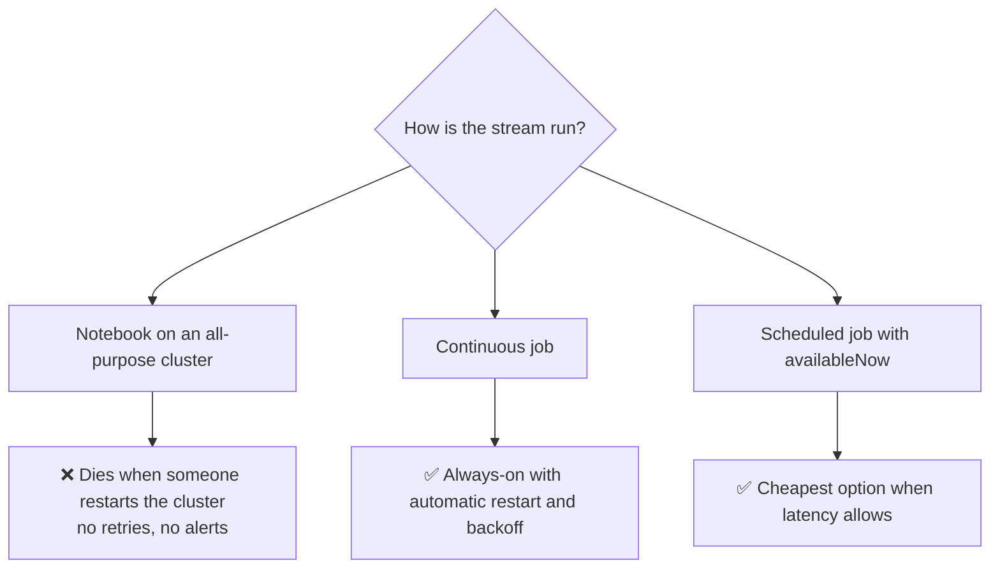
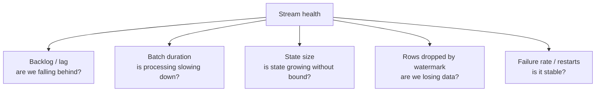
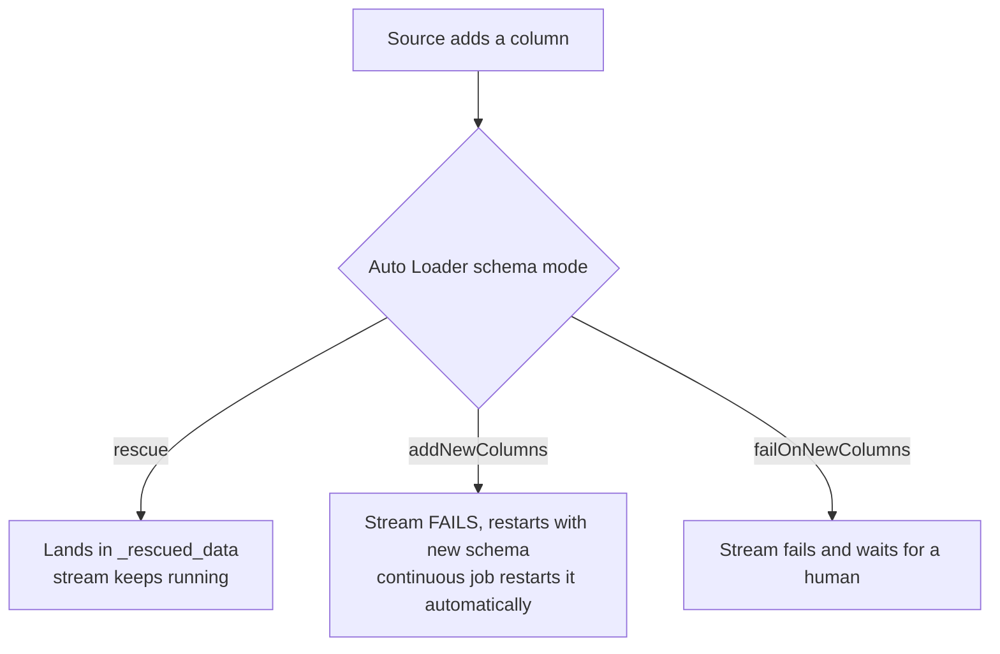
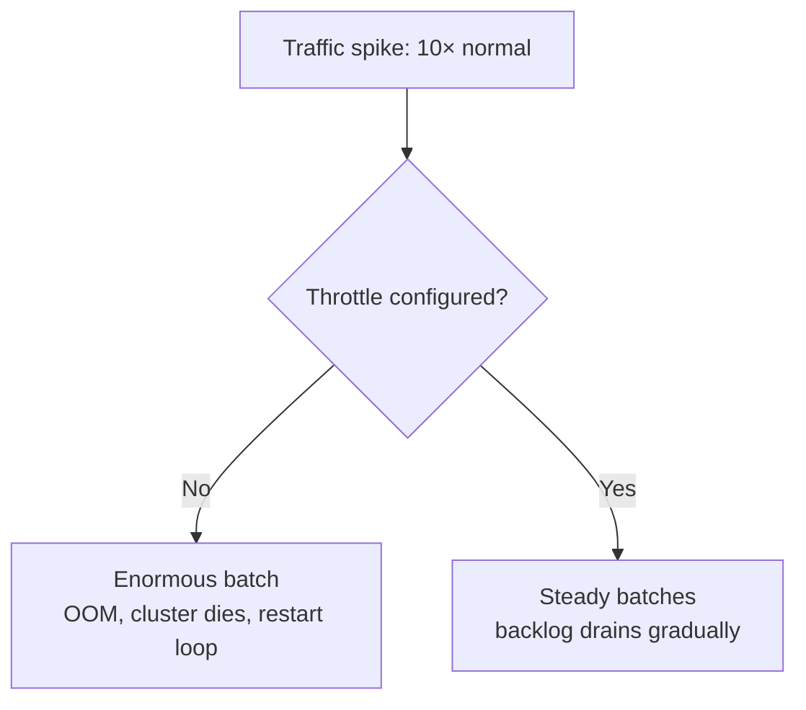
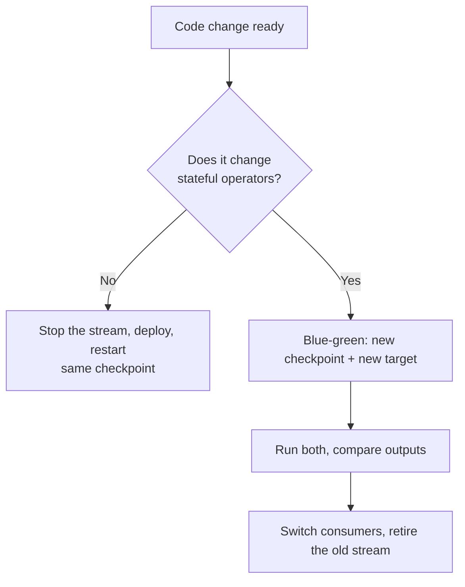
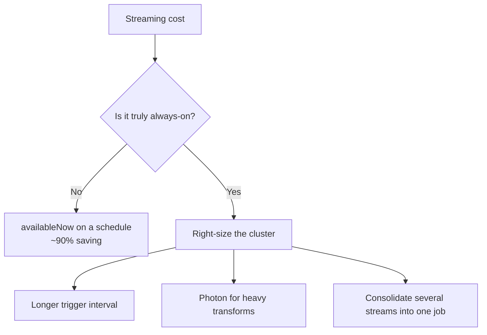

# Streaming in Production

## The Gap Between a Working Stream and a Production Stream

```text
Working:    it processes data correctly on your cluster today
Production: it survives redeploys, bad data, traffic spikes, cloud outages,
            schema changes, and three months of unattended operation
```

This file is about closing that gap.

---

## Deployment: Streams Belong in Jobs



```yaml
# Always-on stream as a continuous job
resources:
  jobs:
    orders_streaming:
      name: orders_streaming_bronze_to_silver
      max_concurrent_runs: 1
      continuous:
        pause_status: UNPAUSED
      email_notifications:
        on_failure: [data-oncall@company.com]
      health:
        rules:
          - metric: STREAMING_BACKLOG_SECONDS
            op: GREATER_THAN
            value: 600
      job_clusters:
        - job_cluster_key: stream
          new_cluster:
            spark_version: "14.3.x-scala2.12"
            node_type_id: "Standard_DS4_v2"
            num_workers: 4
            spark_conf:
              spark.sql.streaming.stateStore.providerClass: "com.databricks.sql.streaming.state.RocksDBStateStoreProvider"
      tasks:
        - task_key: bronze_to_silver
          job_cluster_key: stream
          notebook_task:
            notebook_path: ./streams/bronze_to_silver
```

```text
A continuous job restarts the stream automatically with exponential backoff
after a failure, which is exactly the behaviour a long-running stream needs.
```

---

## Streaming Health Metrics



| Metric | Healthy | Alarm |
|--------|---------|-------|
| `inputRowsPerSecond` vs `processedRowsPerSecond` | processed ≥ input | processed < input, sustained |
| `batchDuration` | stable, below trigger interval | growing trend |
| `numRowsTotal` (state) | plateaus | grows linearly forever |
| `numRowsDroppedByWatermark` | ~0 | rising |
| Restart count | rare | several per day |

```python
def stream_health(query):
    p = query.lastProgress
    if not p:
        return None
    return {
        "name": query.name,
        "batch_id": p["batchId"],
        "input_rps": p.get("inputRowsPerSecond", 0),
        "processed_rps": p.get("processedRowsPerSecond", 0),
        "batch_duration_ms": p.get("batchDuration", 0),
        "state_rows": sum(op.get("numRowsTotal", 0) for op in p.get("stateOperators", [])),
        "dropped_late": sum(op.get("numRowsDroppedByWatermark", 0) for op in p.get("stateOperators", [])),
        "watermark": p.get("eventTime", {}).get("watermark"),
    }
```

---

## Logging Progress to a Delta Table

The Spark UI disappears when the cluster does. Persist the metrics.

```python
from pyspark.sql.streaming import StreamingQueryListener
from pyspark.sql import functions as F
import json

class MetricsListener(StreamingQueryListener):
    def onQueryStarted(self, event):
        pass

    def onQueryProgress(self, event):
        p = json.loads(event.progress.json)
        row = [{
            "query_name": p.get("name"),
            "query_id": p.get("id"),
            "batch_id": p.get("batchId"),
            "timestamp": p.get("timestamp"),
            "input_rows": p.get("numInputRows"),
            "input_rps": p.get("inputRowsPerSecond"),
            "processed_rps": p.get("processedRowsPerSecond"),
            "batch_duration_ms": p.get("batchDuration"),
            "watermark": p.get("eventTime", {}).get("watermark"),
            "state_rows": sum(o.get("numRowsTotal", 0) for o in p.get("stateOperators", [])),
        }]
        (spark.createDataFrame(row)
            .withColumn("logged_at", F.current_timestamp())
            .write.format("delta").mode("append")
            .option("mergeSchema", "true")
            .saveAsTable("main.control.stream_metrics"))

    def onQueryTerminated(self, event):
        pass

spark.streams.addListener(MetricsListener())
```

Then alert on it with ordinary Databricks SQL (topic 09):

```sql
-- Streams falling behind
SELECT query_name, max(logged_at) AS last_seen,
       avg(input_rps) AS avg_in, avg(processed_rps) AS avg_out
FROM main.control.stream_metrics
WHERE logged_at >= current_timestamp() - INTERVAL 30 MINUTES
GROUP BY query_name
HAVING avg(input_rps) > avg(processed_rps) * 1.1;
```

```sql
-- Streams that stopped reporting entirely (the silent death)
SELECT query_name, max(logged_at) AS last_seen
FROM main.control.stream_metrics
GROUP BY query_name
HAVING max(logged_at) < current_timestamp() - INTERVAL 15 MINUTES;
```

That second query is the streaming equivalent of a freshness alert, and it
catches the failure mode nothing else catches.

---

## Handling Bad Data Without Killing the Stream

A single malformed record must not stop a pipeline that runs for months.

```python
from pyspark.sql import functions as F

parsed = (raw
    .withColumn("parsed", F.from_json("raw_payload", schema))
    .withColumn("_parse_failed", F.col("parsed").isNull() & F.col("raw_payload").isNotNull()))

good = parsed.filter("NOT _parse_failed").select("parsed.*", "_ingested_at")
bad  = parsed.filter("_parse_failed").select("raw_payload", "_ingested_at")

def write_both(batch_df, batch_id):
    b = batch_df.cache()
    (b.filter("NOT _parse_failed").select("parsed.*", "_ingested_at")
       .write.format("delta").mode("append").saveAsTable("main.silver.orders"))
    (b.filter("_parse_failed").select("raw_payload", "_ingested_at")
       .withColumn("_batch_id", F.lit(batch_id))
       .write.format("delta").mode("append")
       .option("mergeSchema", "true").saveAsTable("main.quarantine.orders_unparseable"))
    b.unpersist()
```

```text
✔ from_json returns null instead of throwing → a bad record cannot crash the batch
✔ Quarantine preserves it for investigation
✔ Alert on quarantine growth rather than on stream failure
```

---

## Schema Evolution in a Running Stream



```text
For always-on streams: prefer "rescue" — never break at 3 AM.
For pipelines where new columns must be handled deliberately:
"addNewColumns" plus a continuous job that auto-restarts is acceptable.
```

```python
.option("mergeSchema", "true")        # on the write side, for the Delta target
```

---

## Backpressure and Spikes



```python
.option("maxOffsetsPerTrigger", 100000)      # Kafka
.option("cloudFiles.maxFilesPerTrigger", 1000)
.option("maxBytesPerTrigger", "10g")         # Delta source
```

```text
Set throttles based on what ONE batch can process comfortably,
not on the normal arrival rate. The spike is what you are defending against.
```

Combine with autoscaling so the cluster grows while the backlog drains.

---

## Cluster Configuration for Streams

```text
✔ Job cluster or serverless, never all-purpose
✔ Fewer, larger workers usually beat many small ones for stateful work
✔ RocksDB state store for large state
✔ Changelog checkpointing to cut batch duration
✔ Autoscaling enabled, with a sensible minimum so latency stays stable
✔ Spot/preemptible instances are acceptable — checkpoints make recovery automatic
✔ Cluster log delivery enabled, so logs survive termination
```

```python
spark.conf.set("spark.sql.streaming.stateStore.providerClass",
               "com.databricks.sql.streaming.state.RocksDBStateStoreProvider")
spark.conf.set("spark.sql.streaming.stateStore.rocksdb.changelogCheckpointing.enabled", "true")
spark.conf.set("spark.sql.shuffle.partitions", "64")   # tune to cluster size, not the default 200
```

```text
spark.sql.shuffle.partitions matters more in streaming than in batch:
it is fixed per query and determines the number of state store instances.
Too high → overhead per micro-batch. Too low → skew and poor parallelism.
```

---

## Upgrading a Running Stream



```python
# Graceful stop
query.stop()
query.awaitTermination(timeout=300)
```

```text
✔ Always stop gracefully — a killed cluster leaves an uncommitted batch
  (which is safe, but reprocessing costs time)
✔ Deploy via Asset Bundles so the change is versioned and reviewable
✔ For breaking changes, run the new version in parallel before cutting over
```

---

## Disaster Recovery Checklist

```text
✔ Checkpoints stored in cloud storage / Volumes, in a region-appropriate location
✔ Bronze retention long enough to fully replay silver and gold
✔ A documented replay procedure, tested at least once
✔ Source retention (Kafka) longer than your worst-case outage
✔ Idempotent writes everywhere, so replay is always safe
✔ Runbook: how to reset a checkpoint, how to backfill a gap
```

```python
# Documented replay procedure
# 1. Stop the stream
# 2. Note the last good Delta version of the target
# 3. RESTORE TABLE target TO VERSION AS OF <n>
# 4. Start with a NEW checkpoint and an explicit starting position
(spark.readStream.format("delta")
   .option("startingVersion", 12045)
   .table("main.bronze.orders_events")
   .writeStream
   .option("checkpointLocation", "/Volumes/main/silver/_ckpt/orders_v3")
   .trigger(availableNow=True)
   .toTable("main.silver.orders"))
```

---

## Cost Optimisation



```text
Common wins:
✔ Three separate always-on streams → one job with three chained availableNow tasks
✔ 10-second trigger → 1-minute trigger, where nobody can tell the difference
✔ 8 workers → 3 workers after measuring actual utilisation
✔ Turning off a dev stream that has been running for four months
```

```sql
-- Find long-running streaming jobs and their cost
SELECT usage_metadata.job_id, round(sum(usage_quantity), 1) AS dbus
FROM system.billing.usage
WHERE usage_date >= current_date() - INTERVAL 30 DAYS
  AND usage_metadata.job_id IS NOT NULL
GROUP BY 1 ORDER BY dbus DESC LIMIT 20;
```

---

## Production Readiness Checklist

```text
Deployment
✔ Runs as a job (continuous or scheduled), not a notebook
✔ Defined in Git via Asset Bundles
✔ Runs as a service principal

Reliability
✔ Dedicated checkpoint per stream, in a Volume
✔ Idempotent writes (MERGE or Delta append)
✔ Bad records quarantined, not fatal
✔ Schema evolution mode chosen deliberately
✔ Throttles set for spike protection

Observability
✔ Progress metrics logged to a Delta table
✔ Alert: falling behind (input rate > processed rate)
✔ Alert: stopped reporting (silent death)
✔ Alert: state growth without plateau
✔ Alert: rows dropped by watermark
✔ Cluster log delivery enabled

Operations
✔ Documented replay and recovery procedure
✔ Bronze and Kafka retention exceed worst-case outage
✔ Tested restart and upgrade path
✔ Cost reviewed against the actual latency requirement
```

---

## Common Interview Questions

### How do you run a stream in production?

As a Databricks job — continuous for always-on streams so it auto-restarts with
backoff, or scheduled with `availableNow` when the latency budget allows.

### How do you detect that a stream has silently died?

Log progress metrics to a Delta table and alert when a query stops reporting.
Job failure alerts do not fire for a stream that was never restarted.

### How do you stop one bad record from killing a stream?

Parse with `from_json`, which returns null rather than throwing, then route
unparseable rows to a quarantine table and alert on its growth.

### What do you monitor for a streaming pipeline?

Input versus processed rate, batch duration trend, state row count, rows dropped
by watermark, restart frequency, and end-to-end freshness of the target table.

### How do you handle a 10× traffic spike?

Throttle batch size with `maxOffsetsPerTrigger` or `maxFilesPerTrigger` so
batches stay processable, and let autoscaling add capacity while the backlog
drains.

### How do you deploy a breaking change to a running stream?

Blue-green: start the new version with a new checkpoint writing to a new target,
compare results, then switch consumers and retire the old stream.

### Why does `spark.sql.shuffle.partitions` matter more in streaming?

It is fixed for the life of the query and determines the number of state store
instances, so a poor value permanently affects every micro-batch.

---

## Quick Revision

```text
Deployment: continuous job (always-on) or scheduled availableNow (cheaper)

Monitor:
input vs processed rate | batch duration | state rows
rows dropped by watermark | restart count | last-reported timestamp

Log progress to Delta via StreamingQueryListener, then alert with SQL

Resilience:
from_json + quarantine → bad data cannot kill the stream
throttles              → spikes cannot kill the cluster
idempotent writes      → replay is always safe
rescue schema mode     → source changes cannot break ingestion

Upgrades:
stateless change → restart on the same checkpoint
stateful change  → blue-green with a new checkpoint and target

Cost: question "always-on", right-size, lengthen triggers, consolidate jobs
```
