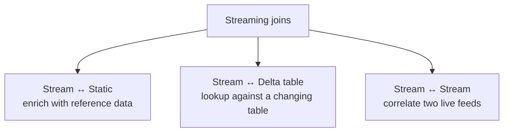
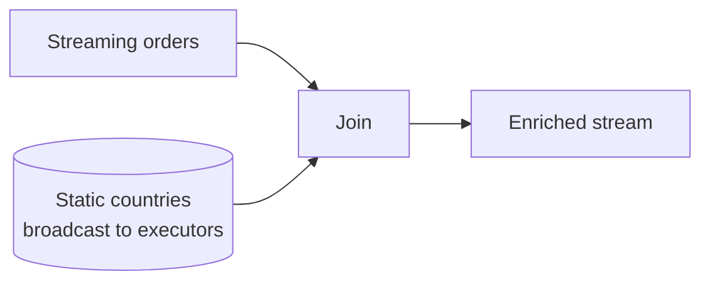
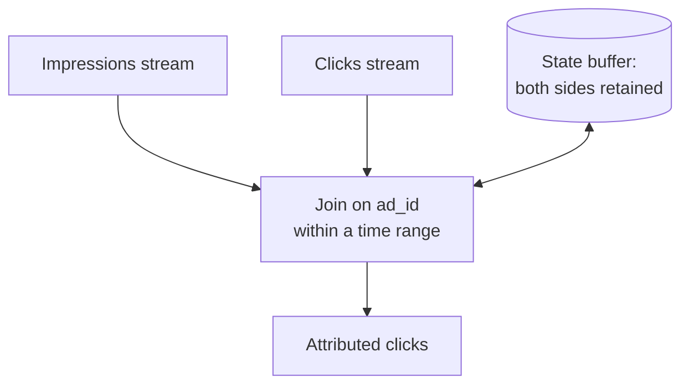
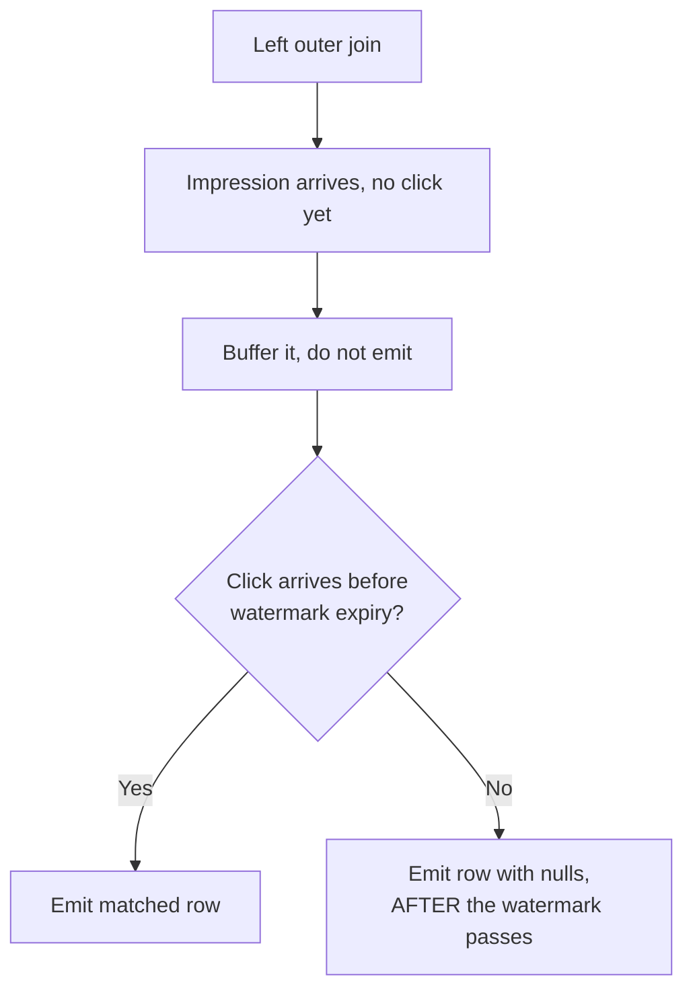
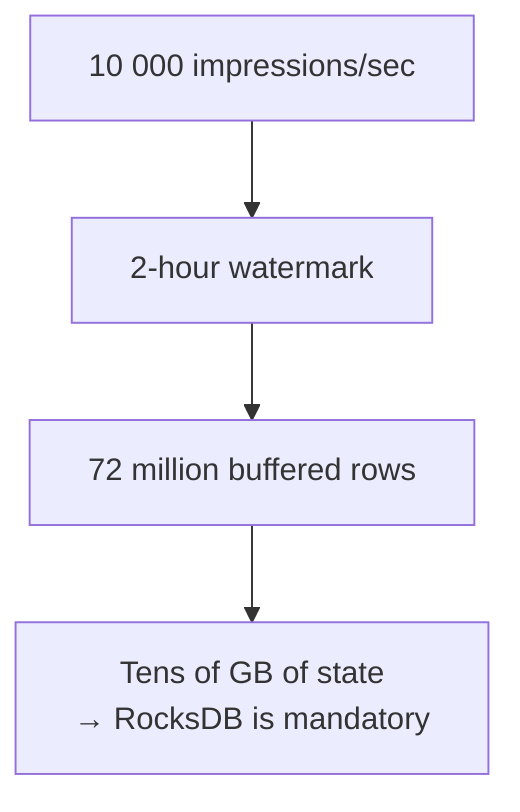
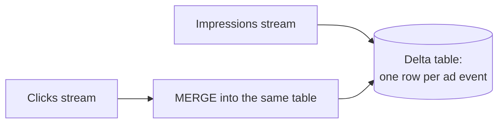
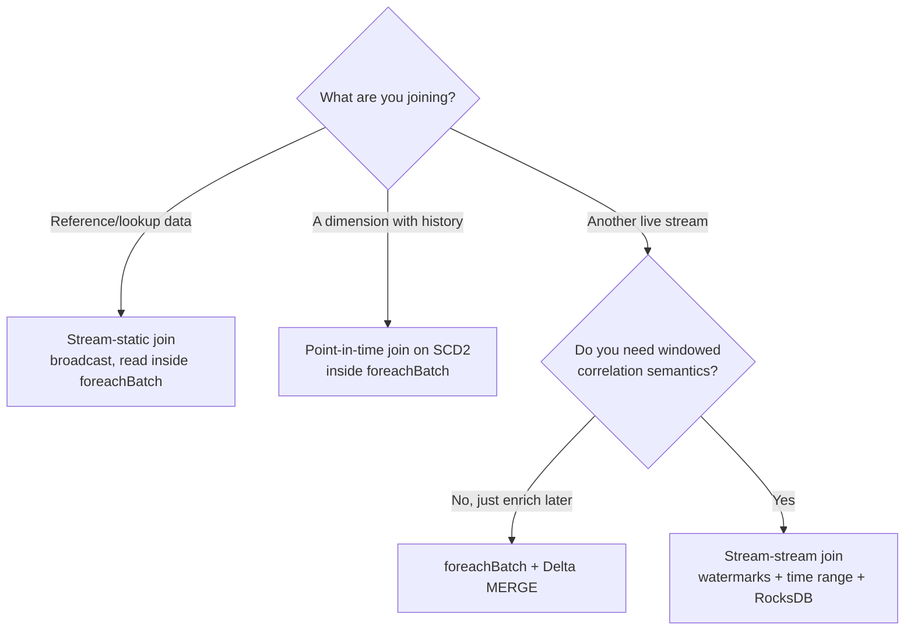

# Stream Joins

## Three Kinds of Join



```text
Stream-to-static  → easy, stateless, use freely
Stream-to-stream  → stateful, needs watermarks on BOTH sides, use carefully
```

---

## Stream to Static Join

The most common and least dangerous join: enrich streaming events with a lookup
table.

```python
from pyspark.sql import functions as F

orders = spark.readStream.format("delta").table("main.bronze.orders_events")
countries = spark.read.table("main.reference.countries")      # batch read

enriched = orders.join(F.broadcast(countries), "country_code", "left")
```



```text
✔ Stateless — no watermark needed
✔ Broadcast the small side to avoid a shuffle
✘ The static side is read ONCE per micro-batch plan
```

### The staleness trap

```text
A "static" DataFrame created from a Delta table is re-read on each micro-batch
when read as spark.read inside foreachBatch, but a DataFrame defined ONCE
outside the stream may be cached in the plan.

If your reference data changes and the stream does not see it, that is why.
```

Safest pattern — read the lookup **inside** `foreachBatch`:

```python
def process(batch_df, batch_id):
    countries = batch_df.sparkSession.read.table("main.reference.countries")
    enriched = batch_df.join(F.broadcast(countries), "country_code", "left")
    enriched.write.format("delta").mode("append").saveAsTable("main.silver.orders")

(orders.writeStream
   .foreachBatch(process)
   .option("checkpointLocation", ckpt)
   .trigger(processingTime="1 minute")
   .start())
```

Each batch re-reads the current version of the reference table.

---

## Stream to Delta Table Join (Point-in-Time Lookups)

For slowly changing dimensions, join against the version that was current when
the event happened.

```python
def process(batch_df, batch_id):
    spark = batch_df.sparkSession
    dim = spark.read.table("main.silver.customers_scd2")

    joined = (batch_df.alias("o")
        .join(dim.alias("c"),
              (F.col("o.customer_id") == F.col("c.customer_id")) &
              (F.col("o.event_time") >= F.col("c.valid_from")) &
              (F.coalesce(F.col("c.valid_to"), F.lit("9999-12-31")) > F.col("o.event_time")),
              "left")
        .select("o.*", "c.country", "c.segment"))

    joined.write.format("delta").mode("append").saveAsTable("main.silver.orders_enriched")
```

```text
This gives point-in-time correctness: an order from March joins to the
customer's March attributes, not today's.
```

---

## Stream to Stream Join

Two live feeds correlated with each other. Powerful, and the most common source
of runaway state.



The core difficulty: when an impression arrives, its matching click may not exist
yet. Spark must **buffer** rows from both sides until a match is possible or the
window expires.

```python
impressions = (spark.readStream.format("delta").table("main.bronze.impressions")
    .withWatermark("impression_time", "2 hours"))

clicks = (spark.readStream.format("delta").table("main.bronze.clicks")
    .withWatermark("click_time", "3 hours"))

attributed = impressions.join(
    clicks,
    F.expr("""
        ad_id = click_ad_id AND
        click_time >= impression_time AND
        click_time <= impression_time + INTERVAL 1 HOUR
    """),
    "inner")
```

Three things are mandatory:

```text
1. A watermark on BOTH streams
2. A time-range condition in the join (not just an equality)
3. An understanding of how much state that range implies
```

Without 1 and 2, Spark must buffer both streams forever and will eventually fail.

---

## Join Types and What They Require

| Join type | Watermarks | Time constraint | Notes |
|-----------|-----------|-----------------|-------|
| Inner | Recommended | Recommended | Without them, state is unbounded |
| Left outer | **Required** | **Required** | Nulls emitted only after the watermark expires |
| Right outer | **Required** | **Required** | Same |
| Full outer | **Required** | **Required** | Same |
| Semi / anti | **Required** | **Required** | Same |



```text
Consequence: outer join results are DELAYED by the watermark.
An unmatched impression with a 3-hour watermark appears 3 hours later.
This surprises people constantly.
```

---

## State Growth in Stream-Stream Joins

```text
State size ≈ (arrival rate of stream A × retention of A)
           + (arrival rate of stream B × retention of B)

Retention is driven by the watermark delay and the join time range.
```



Mitigations:

```text
✔ Use the shortest watermark the business can tolerate
✔ Tighten the join time range (1 hour, not 24)
✔ Project only the columns you need BEFORE the join
✔ Use RocksDB state store with changelog checkpointing
✔ Consider pre-aggregating one side before joining
```

```python
# Project early — do not buffer 50 columns you will never use
impressions_slim = impressions.select("ad_id", "impression_time", "user_id")
clicks_slim = clicks.select("click_ad_id", "click_time", "click_id")
```

---

## The Alternative: Delta MERGE Instead of a Stream-Stream Join

Often you do not need a true stream-stream join. You need "update this row when
the other event arrives".



```python
def merge_clicks(batch_df, batch_id):
    batch_df.createOrReplaceTempView("clicks")
    batch_df.sparkSession.sql("""
        MERGE INTO main.silver.ad_events t
        USING clicks s ON t.ad_id = s.ad_id
        WHEN MATCHED THEN UPDATE SET t.clicked = true, t.click_time = s.click_time
    """)

(clicks.writeStream.foreachBatch(merge_clicks)
   .option("checkpointLocation", ckpt).start())
```

```text
✔ No join state at all — Delta is the state store
✔ No watermark tuning
✔ Late clicks still update the row, days later
✘ Higher write amplification
✘ Not suitable when you need true windowed correlation semantics

For most "enrich an event with a later event" problems, this is simpler,
cheaper, and more robust than a stream-stream join.
```

This substitution is worth knowing for interviews and for real systems.

---

## Worked Example: Order and Payment Correlation

```python
from pyspark.sql import functions as F

orders = (spark.readStream.format("delta").table("main.bronze.orders")
    .select("order_id", "customer_id", "amount", "order_time")
    .withWatermark("order_time", "1 hour"))

payments = (spark.readStream.format("delta").table("main.bronze.payments")
    .select("payment_id", F.col("order_id").alias("pay_order_id"),
            "payment_amount", "payment_time")
    .withWatermark("payment_time", "2 hours"))

matched = orders.join(
    payments,
    F.expr("""
        order_id = pay_order_id AND
        payment_time >= order_time AND
        payment_time <= order_time + INTERVAL 30 MINUTES
    """),
    "leftOuter")

result = matched.select(
    "order_id", "customer_id", "amount", "order_time",
    "payment_id", "payment_amount", "payment_time",
    F.when(F.col("payment_id").isNull(), "UNPAID").otherwise("PAID").alias("status"))

(result.writeStream
   .outputMode("append")
   .option("checkpointLocation", "/Volumes/main/silver/_ckpt/order_payments")
   .trigger(processingTime="1 minute")
   .toTable("main.silver.order_payments"))
```

```text
Behaviour:
- Paid orders appear once the payment arrives (within 30 minutes)
- Unpaid orders appear as UNPAID only after the 2-hour watermark expires
- State holds ~1 hour of orders and ~2 hours of payments
```

---

## Unsupported and Restricted Operations

```text
✘ Full outer join without watermarks and a time constraint
✘ Chaining multiple stream-stream joins in one query (limited support)
✘ Aggregating before a stream-stream join (update mode conflicts)
✘ Non-equality-only joins with no time bound

If the planner rejects your query, the usual fix is:
add watermarks, add a time range, or restructure with foreachBatch + MERGE.
```

---

## Decision Guide



---

## Common Interview Questions

### What types of streaming joins does Spark support?

Stream-to-static (stateless), and stream-to-stream inner and outer joins
(stateful, requiring watermarks and time constraints).

### Why do stream-stream joins need watermarks?

Because a matching row may arrive later, Spark must buffer both sides. The
watermark bounds how long rows are retained so state does not grow forever.

### Why do outer stream-stream joins require a time constraint?

To know when it is safe to emit a null for an unmatched row. Without a bound,
Spark can never conclude that no match will ever arrive.

### Why are outer join results delayed?

An unmatched row is only emitted once the watermark passes its expiry, so the
delay equals the watermark plus the join range.

### How do you reduce state in a stream-stream join?

Shorter watermarks, tighter time ranges, projecting only needed columns before
the join, RocksDB with changelog checkpointing, and pre-aggregating one side.

### When would you avoid a stream-stream join entirely?

When the requirement is "update this record when a related event arrives".
`foreachBatch` plus a Delta `MERGE` uses the table as state, removes watermark
tuning, and handles arbitrarily late events.

### How do you join a stream to a dimension with history?

A point-in-time join on an SCD2 table, matching where the event time falls
between `valid_from` and `valid_to`.

---

## Quick Revision

```text
Stream ↔ Static:
stateless | broadcast the small side | re-read inside foreachBatch for freshness

Stream ↔ SCD2:
point-in-time join on valid_from / valid_to → historically correct enrichment

Stream ↔ Stream:
REQUIRES watermarks on both sides + a time-range condition
outer joins: results delayed until the watermark expires
state ≈ rate × retention on both sides → use RocksDB

Better alternative for "enrich later":
foreachBatch + Delta MERGE → the table IS the state, no watermark tuning

Reduce state: shorter watermark | tighter range | project early | RocksDB
```
