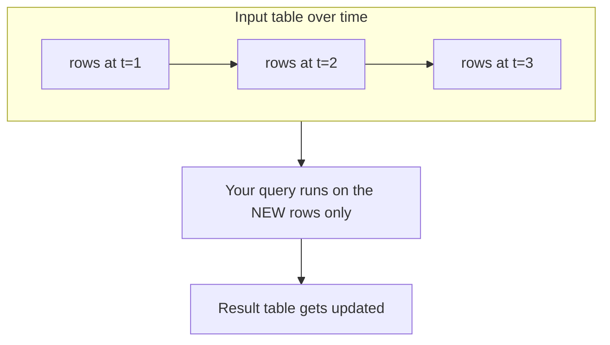
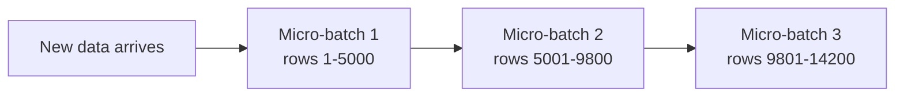
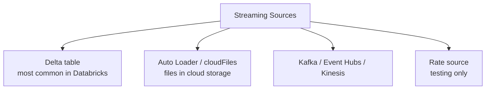
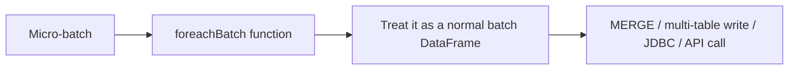
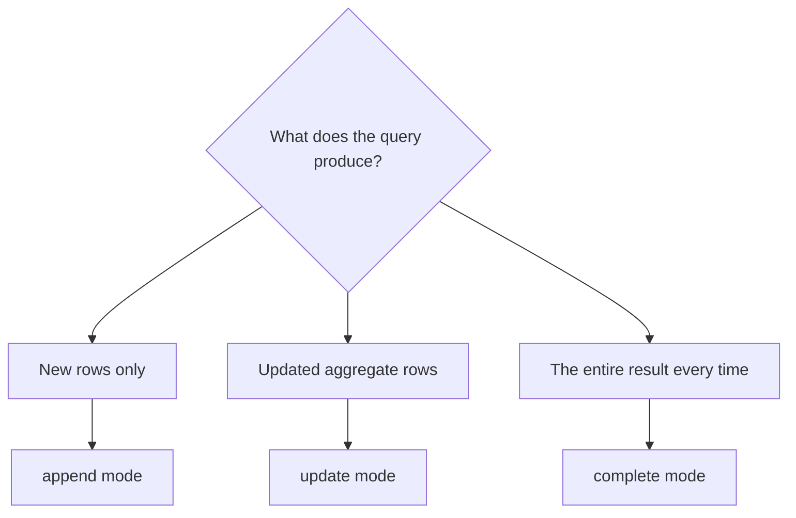
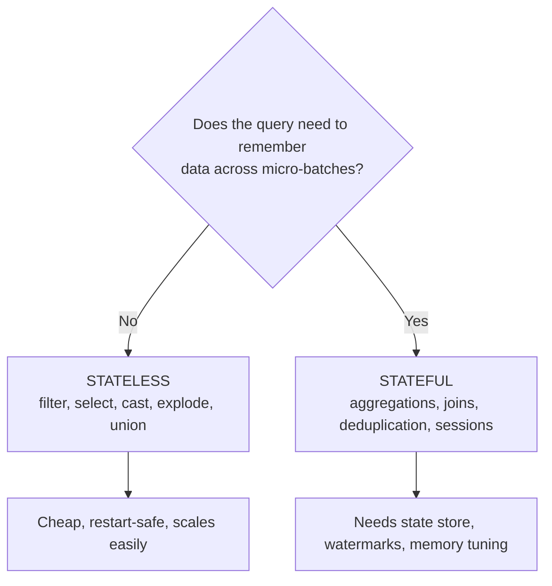

# Structured Streaming Basics

## First Principle: A Stream Is an Unbounded Table

The genius of Structured Streaming is that it does not invent a new mental model.
It reuses tables.



```text
Batch:     a table with a fixed number of rows
Streaming: a table where rows keep being appended

Same SQL. Same DataFrame operations. Same optimiser.
```

---

## Micro-Batch Execution

Spark does not process one row at a time. It processes small batches, very
frequently.



```text
Why micro-batches?
✔ Reuses the entire batch engine — optimiser, Photon, Delta writes
✔ Amortises overhead across thousands of rows
✔ Gives exactly-once semantics through atomic commits

Cost: latency is measured in seconds, not microseconds.
For sub-second latency you need a different kind of system.
```

---

## Your First Stream

```python
from pyspark.sql import functions as F

stream = (spark.readStream
    .format("delta")
    .table("main.bronze.orders_raw"))

clean = (stream
    .filter("order_id IS NOT NULL")
    .withColumn("amount", F.col("amt").cast("decimal(18,2)"))
    .withColumn("processed_at", F.current_timestamp()))

query = (clean.writeStream
    .format("delta")
    .outputMode("append")
    .option("checkpointLocation", "/Volumes/main/silver/_ckpt/orders")
    .trigger(processingTime="1 minute")
    .toTable("main.silver.orders"))
```

Four things every stream needs:

```text
1. readStream   → where data comes from
2. transform    → normal DataFrame code
3. checkpoint   → where progress is remembered (mandatory)
4. writeStream  → where results go
```

---

## Sources



### Delta as a source

```python
(spark.readStream.format("delta")
   .option("maxFilesPerTrigger", 100)      # throttle to control batch size
   .option("ignoreChanges", "true")        # tolerate upstream rewrites
   .table("main.bronze.orders_raw"))
```

```text
ignoreDeletes → skip commits that only delete data
ignoreChanges → re-emit rewritten files (you must handle duplicates downstream)
skipChangeCommits → skip update/delete commits entirely (preferred, newer)
```

A Delta source is append-only by nature. If the upstream table gets updated in
place, the stream must be told how to react — this is one of the most common
"my stream failed overnight" causes.

### Auto Loader as a source

```python
(spark.readStream.format("cloudFiles")
   .option("cloudFiles.format", "json")
   .option("cloudFiles.schemaLocation", "/Volumes/main/bronze/_schema/orders")
   .load("/Volumes/main/landing/orders/"))
```

Covered fully in topic 12.

### Kafka as a source

```python
(spark.readStream.format("kafka")
   .option("kafka.bootstrap.servers", "broker:9092")
   .option("subscribe", "orders")
   .option("startingOffsets", "latest")     # or "earliest"
   .option("maxOffsetsPerTrigger", 100000)  # throttle
   .load())
```

Kafka gives you `key`, `value`, `topic`, `partition`, `offset`, `timestamp` — all
binary or metadata. Parsing is your job:

```python
schema = "order_id BIGINT, customer_id INT, amount DOUBLE, event_time TIMESTAMP"

parsed = (kafka_df
    .select(F.from_json(F.col("value").cast("string"), schema).alias("d"),
            F.col("timestamp").alias("_kafka_ts"))
    .select("d.*", "_kafka_ts"))
```

---

## Sinks

| Sink | Use |
|------|-----|
| **Delta table** | The default. ACID, exactly-once, queryable immediately |
| **Kafka** | Publishing results to other systems |
| **Files (parquet/json)** | Interop with non-Delta consumers |
| **foreachBatch** | Anything else: MERGE, JDBC writes, APIs |
| **Console / memory** | Development and debugging only |

### foreachBatch: the escape hatch

The most important sink to understand, because it unlocks upserts.

```python
def upsert_to_silver(batch_df, batch_id):
    batch_df.createOrReplaceTempView("updates")
    batch_df.sparkSession.sql("""
        MERGE INTO main.silver.orders t
        USING updates s ON t.order_id = s.order_id
        WHEN MATCHED THEN UPDATE SET *
        WHEN NOT MATCHED THEN INSERT *
    """)

(stream.writeStream
   .foreachBatch(upsert_to_silver)
   .option("checkpointLocation", "/Volumes/main/silver/_ckpt/orders_merge")
   .trigger(availableNow=True)
   .start())
```



```text
Inside foreachBatch you have an ordinary batch DataFrame, so every
batch operation becomes available — MERGE above all.

Caution: the function may be called more than once for the same batch_id
after a failure. Use batch_id to make your write idempotent.
```

---

## Output Modes



| Mode | Writes | Works with | Typical use |
|------|--------|-----------|-------------|
| **append** | Only new rows, never changed | Non-aggregating queries, or aggregations with a watermark | Bronze and silver ingestion |
| **update** | Rows that changed since last batch | Aggregations | Running totals into a Delta table via foreachBatch |
| **complete** | The whole result table | Aggregations only | Small dashboards, never large state |

```python
# append: simple transformation
.outputMode("append")

# update: running aggregate
(events.groupBy("country").count()
   .writeStream.outputMode("update").foreachBatch(upsert).start())

# complete: recompute everything — state grows forever, use with care
.outputMode("complete")
```

```text
Trap: an aggregation in append mode without a watermark throws an error,
because Spark cannot know when a group is final.
```

---

## Stateless vs Stateful

This distinction determines everything about cost and complexity.



| Stateless | Stateful |
|-----------|----------|
| `filter`, `select`, `withColumn` | `groupBy().agg()` |
| `explode`, `from_json` | `dropDuplicates` |
| `union` | stream-stream joins |
| Row-by-row mapping | `window()` aggregations |
| No memory growth | State grows unless bounded by a watermark |

```text
Guidance: keep bronze and silver streams stateless wherever possible.
Push aggregation into gold, as batch or as a clearly bounded stateful stream.
```

---

## A Realistic Bronze-to-Silver Stream

```python
from pyspark.sql import functions as F

schema = """
    order_id BIGINT, customer_id INT, amount DOUBLE,
    status STRING, event_time TIMESTAMP
"""

raw = (spark.readStream.format("kafka")
    .option("kafka.bootstrap.servers", "broker:9092")
    .option("subscribe", "orders")
    .option("startingOffsets", "earliest")
    .option("maxOffsetsPerTrigger", 50000)
    .load())

# Bronze: keep the payload intact
bronze = raw.select(
    F.col("value").cast("string").alias("raw_payload"),
    F.col("topic"), F.col("partition"), F.col("offset"),
    F.col("timestamp").alias("_kafka_ts"),
    F.current_timestamp().alias("_ingested_at"),
)

(bronze.writeStream
   .option("checkpointLocation", "/Volumes/main/bronze/_ckpt/orders")
   .trigger(processingTime="30 seconds")
   .toTable("main.bronze.orders_events"))

# Silver: parse, validate, upsert
def to_silver(batch_df, batch_id):
    parsed = (batch_df
        .select(F.from_json("raw_payload", schema).alias("d"), "_ingested_at")
        .select("d.*", "_ingested_at")
        .filter("order_id IS NOT NULL AND amount >= 0"))

    parsed.createOrReplaceTempView("updates")
    batch_df.sparkSession.sql("""
        MERGE INTO main.silver.orders t
        USING (
            SELECT * FROM (
                SELECT *, row_number() OVER (PARTITION BY order_id ORDER BY event_time DESC) rn
                FROM updates
            ) WHERE rn = 1
        ) s
        ON t.order_id = s.order_id
        WHEN MATCHED AND s.event_time > t.event_time THEN UPDATE SET *
        WHEN NOT MATCHED THEN INSERT *
    """)

(spark.readStream.format("delta").table("main.bronze.orders_events")
   .writeStream
   .foreachBatch(to_silver)
   .option("checkpointLocation", "/Volumes/main/silver/_ckpt/orders")
   .trigger(processingTime="1 minute")
   .start())
```

Note the deduplication **inside** the micro-batch before MERGE — the same rule as
CDC in topic 10.

---

## Inspecting a Running Stream

```python
query = clean.writeStream...start()

query.id            # stable across restarts (tied to the checkpoint)
query.runId         # changes on every restart
query.status        # what it is doing right now
query.lastProgress  # metrics for the last micro-batch
query.isActive

query.stop()
query.awaitTermination()
```

```python
# All active streams on this cluster
for q in spark.streams.active:
    print(q.name, q.id, q.lastProgress["numInputRows"])
```

Key metrics in `lastProgress`:

```text
numInputRows              rows in this micro-batch
inputRowsPerSecond        arrival rate
processedRowsPerSecond    processing rate
batchDuration             how long the batch took
stateOperators            state size, if stateful
sources[0].endOffset      how far through the source we are
```

```text
The one number that matters most:
    inputRowsPerSecond > processedRowsPerSecond  →  you are falling behind
```

---

## Streaming in Development

```python
# Console sink for quick checks
(clean.writeStream.format("console").outputMode("append")
   .option("truncate", False).trigger(once=True).start())

# Memory sink, then query it with SQL
(clean.writeStream.format("memory").queryName("preview")
   .outputMode("append").trigger(once=True).start())

spark.sql("SELECT * FROM preview LIMIT 20").show()
```

```text
Never use console or memory sinks in production —
they hold results in driver memory and provide no durability.
```

---

## Common Mistakes

```text
❌ No checkpoint location → the stream cannot recover, and restarts reprocess
❌ Sharing one checkpoint between two streams → corrupted, unpredictable state
❌ Aggregating without a watermark in append mode → error or unbounded state
❌ Using all-purpose compute for a production stream → someone restarts it
❌ Assuming streaming means sub-second latency → micro-batches are seconds
❌ Doing .count() on a streaming DataFrame → not allowed, it is unbounded
❌ Forgetting that foreachBatch may retry a batch → make writes idempotent
```

---

## Common Interview Questions

### What is Structured Streaming?

A stream processing engine built on Spark SQL that treats a stream as an
unbounded table, so the same DataFrame and SQL API works for batch and streaming.

### How does micro-batch execution work?

Spark periodically collects newly available data into a small batch, runs the
query over it, and atomically commits both the output and the progress offsets.

### Difference between `read` and `readStream`?

`read` returns a bounded DataFrame evaluated once. `readStream` returns an
unbounded DataFrame that is evaluated incrementally and continuously.

### What are the output modes?

`append` (new rows only), `update` (changed rows), `complete` (entire result
table). Aggregations require update or complete, or append with a watermark.

### What is `foreachBatch` and why is it important?

A sink that hands you each micro-batch as a normal batch DataFrame, enabling
MERGE, multi-table writes, and arbitrary sinks. The function must be idempotent
because a batch can be retried.

### Stateless vs stateful streaming?

Stateless queries process each row independently and use no memory across
batches. Stateful queries (aggregations, joins, deduplication) maintain a state
store and need watermarks to bound growth.

### How do you know a stream is falling behind?

Compare `inputRowsPerSecond` with `processedRowsPerSecond` in `lastProgress`, and
watch source lag (Kafka offset lag or unprocessed file backlog).

---

## Quick Revision

```text
Stream = unbounded table | same API as batch | micro-batch execution

Every stream needs:
readStream → transform → checkpointLocation → writeStream

Sources: Delta | Auto Loader | Kafka / Event Hubs / Kinesis | rate (test)
Sinks:   Delta | Kafka | files | foreachBatch | console (dev only)

Output modes:
append   → new rows (needs a watermark for aggregations)
update   → changed rows
complete → entire result table (small state only)

foreachBatch = escape hatch → MERGE, multi-table writes; must be idempotent

Stateless (filter, select) → cheap
Stateful (agg, join, dedupe) → needs watermarks and memory tuning

Health check: inputRowsPerSecond vs processedRowsPerSecond
```
