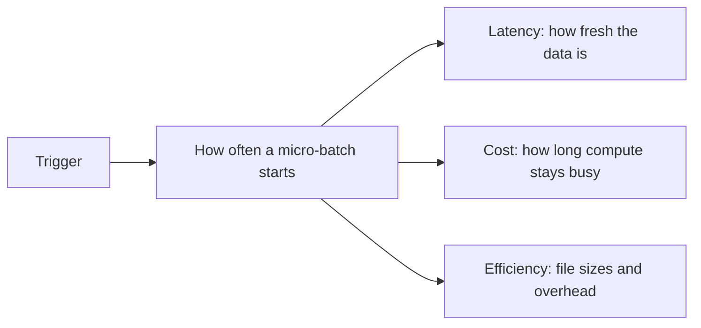
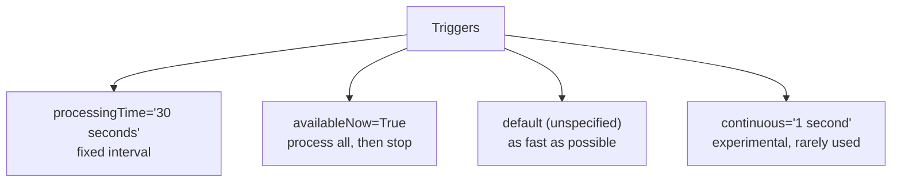
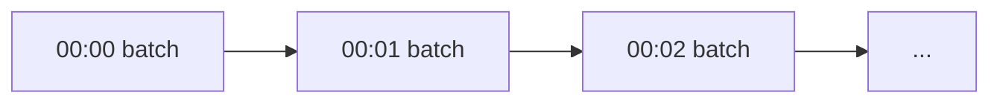
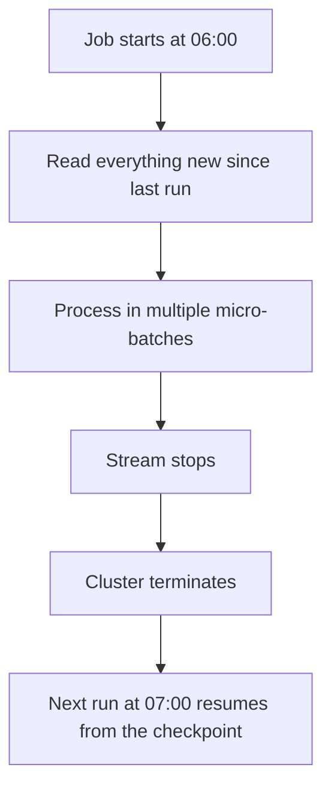
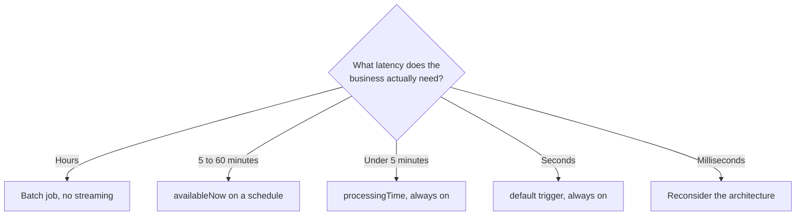
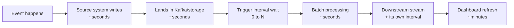
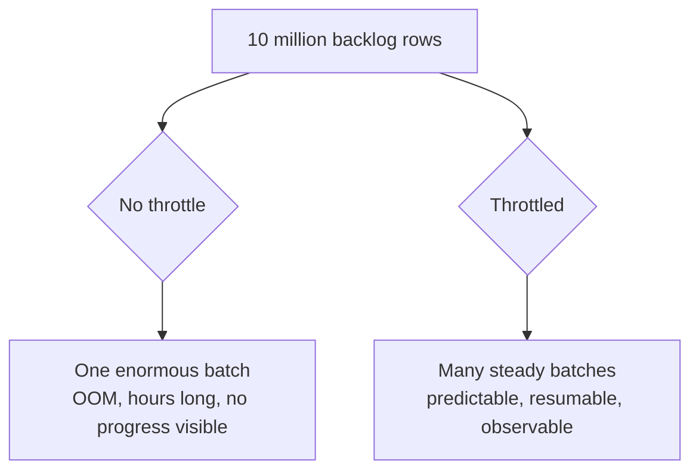
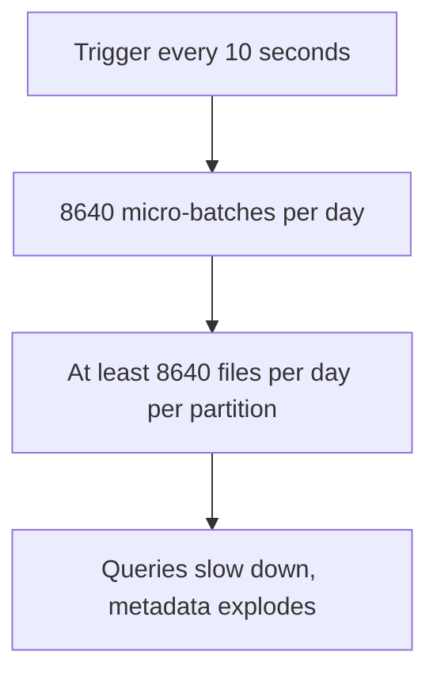
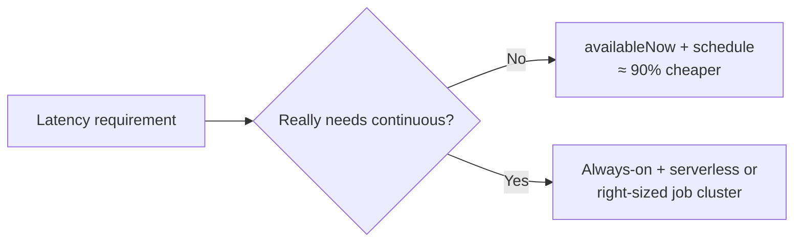

# Triggers and Latency

## What a Trigger Controls

A trigger answers one question: **how often does a micro-batch run?**



```text
More frequent → fresher data, more small files, more compute time
Less frequent → cheaper, larger files, staler data
```

Choosing a trigger is choosing a point on that trade-off. It is the single
biggest cost lever in streaming.

---

## The Four Trigger Modes



| Trigger | Behaviour | Use for |
|---------|-----------|---------|
| `processingTime="N"` | A batch every N, if data is available | Always-on streams with a latency target |
| `availableNow=True` | Process everything available, then stop | Scheduled incremental batch |
| *(default)* | Next batch starts as soon as the previous ends | Lowest latency, highest cost |
| `continuous="N"` | Long-running tasks, ~1 ms latency | Experimental; limited operations |

---

## processingTime: the Always-On Stream

```python
(stream.writeStream
   .trigger(processingTime="1 minute")
   .option("checkpointLocation", ckpt)
   .toTable("main.silver.orders"))
```



```text
If a batch takes LONGER than the interval, the next one starts immediately
after it finishes. Batches never overlap.

Batch takes 20s, interval 60s → 40s idle, cluster still billed
Batch takes 90s, interval 60s → continuously behind, no idle time
```

That second case is the warning sign: if batch duration consistently exceeds the
interval, the stream is under-provisioned or the interval is unrealistic.

---

## availableNow: Streaming Semantics, Batch Economics

This is the most underused and most valuable trigger.

```python
(spark.readStream.format("cloudFiles")
   .option("cloudFiles.format", "json")
   .option("cloudFiles.schemaLocation", schema_path)
   .load(landing_path)
   .writeStream
   .trigger(availableNow=True)
   .option("checkpointLocation", ckpt)
   .toTable("main.bronze.orders_raw"))
```



```text
You get:
✔ Checkpointing and exactly-once
✔ Automatic "what is new since last time" tracking
✔ No watermark table to maintain
✔ Job cluster economics — compute only while working

You give up:
✘ Continuous freshness (latency = your schedule interval)
```

```text
Rule of thumb:
If your latency requirement is 5 minutes or more, use availableNow
on a schedule instead of an always-on stream. It is dramatically cheaper.
```

This is how most "streaming" pipelines in production should actually run.

---

## Default Trigger: Back-to-Back Batches

```python
(stream.writeStream
   .option("checkpointLocation", ckpt)
   .toTable("main.silver.orders"))     # no .trigger() call
```

```text
✔ Lowest possible micro-batch latency
✘ Creates many small files when data arrives slowly
✘ Compute is fully occupied at all times

Use only when latency genuinely matters more than cost.
```

---

## Continuous Processing

```python
.trigger(continuous="1 second")
```

```text
Experimental. Supports only map-like operations — no aggregations, no joins.
Achieves ~1 ms latency with at-least-once semantics.

In practice: almost never used in Databricks production pipelines.
If you need millisecond latency, you likely need a different system.
```

---

## Choosing a Trigger



The question to ask the business is never "do you want real time?" — everyone
says yes. Ask instead: **"what decision changes if this data is 10 minutes old
instead of 1 minute old?"** Usually the answer is "nothing", and you just saved
80% of the cost.

---

## Latency Budget

End-to-end latency is the sum of every stage, not just your trigger.



```text
Bronze trigger 1 min + silver trigger 1 min + gold trigger 5 min
+ dashboard cache 5 min  =  up to 12 minutes end to end

Tuning only the bronze trigger to 10 seconds changes almost nothing.
Find the slowest stage first.
```

---

## Throttling: Controlling Batch Size

A trigger says *when*. These options say *how much*.

```python
# Auto Loader
.option("cloudFiles.maxFilesPerTrigger", 1000)
.option("cloudFiles.maxBytesPerTrigger", "10g")

# Delta source
.option("maxFilesPerTrigger", 500)
.option("maxBytesPerTrigger", "5g")

# Kafka
.option("maxOffsetsPerTrigger", 100000)
```



```text
Always throttle before the first production run, especially when
backfilling from `earliest`. The first batch after a reset is the
one that kills clusters.
```

---

## Small Files: the Streaming Tax



Mitigations:

```sql
ALTER TABLE main.silver.orders SET TBLPROPERTIES (
  'delta.autoOptimize.optimizeWrite' = 'true',
  'delta.autoOptimize.autoCompact'   = 'true'
);
```

```text
✔ optimizeWrite  → fewer, larger files at write time
✔ autoCompact    → automatic compaction after writes
✔ Longer trigger intervals → fewer files at the source of the problem
✔ Scheduled OPTIMIZE for hot tables
✔ Predictive optimization on UC managed tables
```

```sql
-- Detect the problem
DESCRIBE DETAIL main.silver.orders;   -- numFiles vs sizeInBytes
```

---

## Cost Model

```text
Always-on stream:
  cluster running 24 × 7 = 168 hours/week, regardless of data volume

availableNow, hourly:
  24 runs/day × ~4 minutes = ~1.6 hours/day = ~11 hours/week

Same data. Roughly 15× difference in compute cost.
```



For always-on streams that genuinely need to be always on, use a **continuous
job** (topic 08) so the platform restarts them automatically with backoff.

---

## Worked Example: Tuning a Pipeline

```text
Starting point:
  bronze: default trigger, always on, 8-worker cluster
  silver: default trigger, always on, 8-worker cluster
  gold:   default trigger, always on, 8-worker cluster
  Cost: 3 clusters × 24 × 7

Business requirement, once actually asked:
  "the dashboard should be no more than 15 minutes stale"

Redesign:
  bronze: availableNow, every 5 minutes, 2 workers
  silver: availableNow, every 5 minutes, 2 workers (same job, chained tasks)
  gold:   availableNow, every 15 minutes, 4 workers
  Cost: one job cluster, running a few minutes per trigger

Result: same business outcome, a fraction of the spend,
        plus retries, alerting, and run history from Workflows.
```

---

## Common Interview Questions

### What does a trigger control?

How often a micro-batch is scheduled, which determines latency, cost, and output
file sizes.

### What is `availableNow` and why is it useful?

It processes all available data in multiple micro-batches then stops, giving
streaming semantics (checkpoints, exactly-once, automatic change tracking) with
batch economics on a scheduled job.

### What happens if a batch takes longer than the trigger interval?

The next batch starts immediately after the current one finishes. Batches never
overlap, but the stream falls progressively behind if this persists.

### How do you stop a backfill from creating one giant batch?

Throttle with `maxFilesPerTrigger`, `maxBytesPerTrigger`, or
`maxOffsetsPerTrigger`.

### Why do streaming pipelines create small files, and how do you fix it?

Each micro-batch writes at least one file per partition. Fix with optimized
writes, auto compaction, scheduled `OPTIMIZE`, and longer trigger intervals.

### How would you reduce the cost of an always-on stream?

Confirm the real latency requirement, then switch to `availableNow` on a
schedule, right-size the cluster, and consolidate layers into one job with
chained tasks.

### What is continuous processing mode?

An experimental trigger giving about 1 ms latency with at-least-once semantics,
supporting only map-like operations. Rarely used in production.

---

## Quick Revision

```text
Triggers:
processingTime="N"  → fixed interval, always on
availableNow=True   → process all available, then stop  ← usually the right answer
default             → back-to-back batches, lowest latency, highest cost
continuous="1s"     → experimental, map-only

Throttles (how much, not when):
maxFilesPerTrigger | maxBytesPerTrigger | maxOffsetsPerTrigger

Small files:
optimizeWrite + autoCompact + scheduled OPTIMIZE + longer intervals

Cost:
always-on ≈ 168 h/week | availableNow hourly ≈ 11 h/week

The key question:
"What decision changes if the data is 10 minutes old instead of 1?"
```
