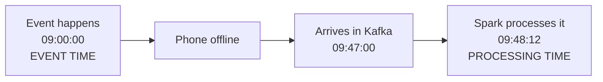
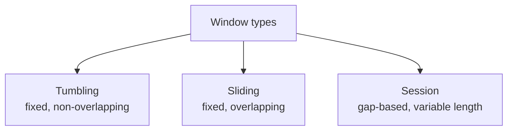
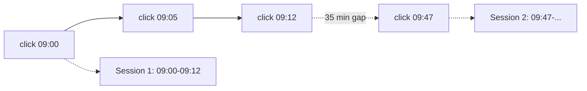
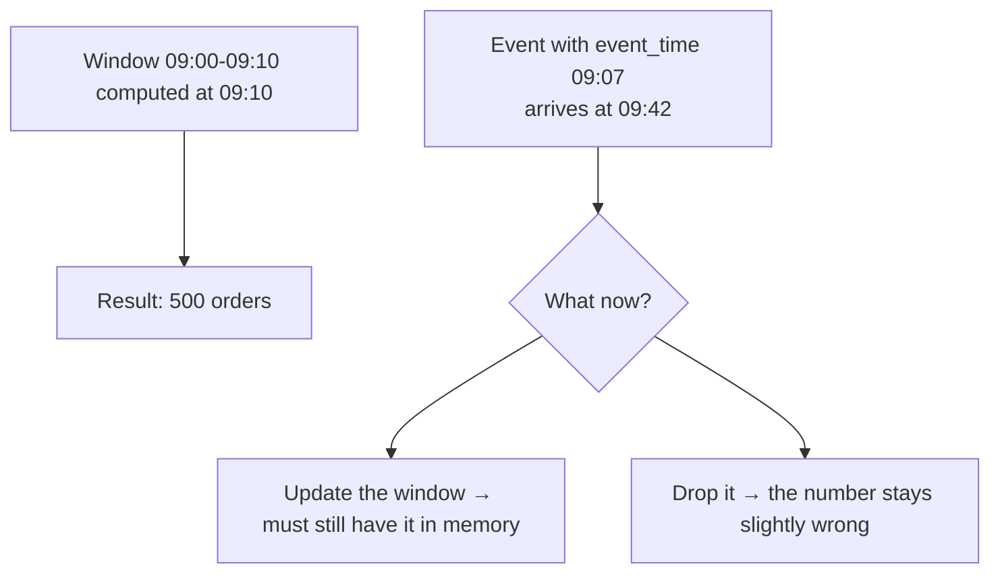
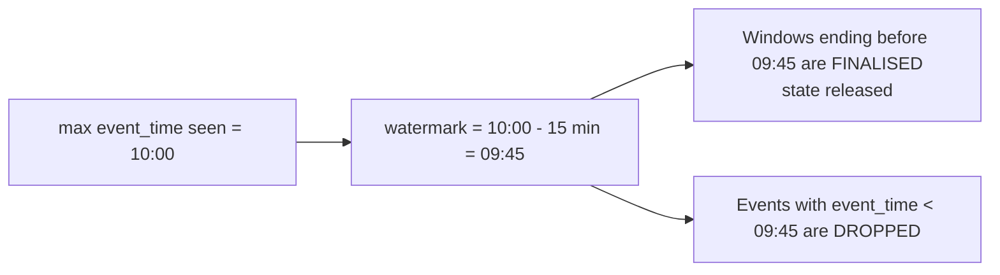
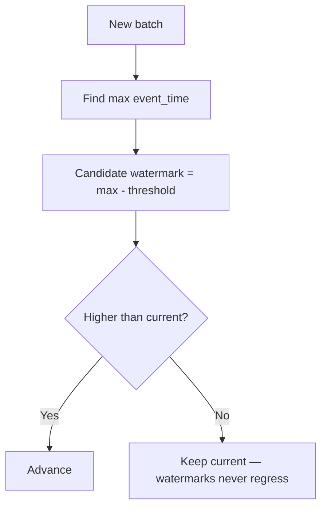
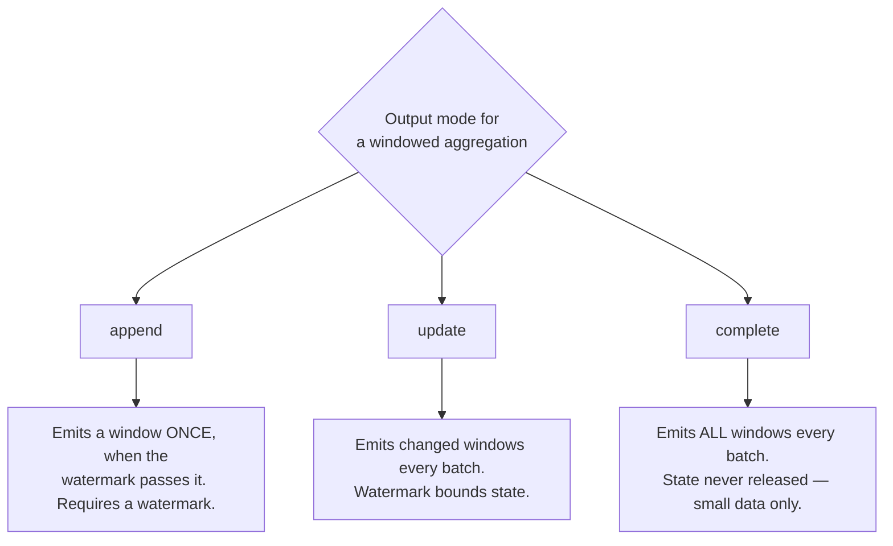
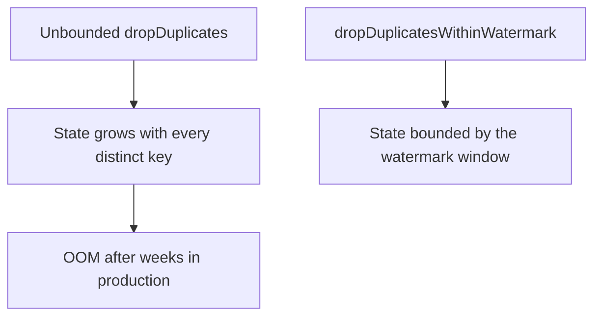

# Windows and Watermarks

## Two Kinds of Time

This is the concept that makes streaming hard, and understanding it makes
everything else fall into place.



```text
Event time      → when it actually happened (a column in your data)
Processing time → when Spark got around to it (the clock on the cluster)
```

```text
Aggregating by processing time is easy and almost always wrong.
"Sales at 9 AM" means sales that HAPPENED at 9 AM, not sales we
happened to receive at 9 AM.
```

Always aggregate on event time.

---

## Windows: Bucketing Time



### Tumbling windows

```python
from pyspark.sql import functions as F

(events
  .groupBy(F.window("event_time", "10 minutes"), "country")
  .agg(F.sum("amount").alias("revenue"),
       F.count("*").alias("order_count")))
```

```text
09:00-09:10 | 09:10-09:20 | 09:20-09:30
Every event belongs to exactly ONE window.
```

Use for: hourly revenue, daily counts, per-minute metrics.

### Sliding windows

```python
.groupBy(F.window("event_time", "10 minutes", "5 minutes"))
```

```text
09:00-09:10
     09:05-09:15
          09:10-09:20

Window size 10 min, slide 5 min → every event is in TWO windows.
```

Use for: moving averages, rolling alerts ("more than 100 errors in any 10-minute
period").

```text
Cost warning: size / slide = number of windows each event belongs to.
A 60-minute window sliding every 1 minute puts each event in 60 windows.
```

### Session windows

```python
.groupBy(F.session_window("event_time", "30 minutes"), "user_id")
```



Use for: user sessions, visit analysis, activity bursts. The window length is
determined by the data, not by you.

---

## The Late Data Problem



```text
To update a window you must keep its state.
To keep every window forever, you need infinite memory.

Therefore: you must decide how long to wait. That decision is the watermark.
```

---

## Watermarks

```python
(events
  .withWatermark("event_time", "15 minutes")
  .groupBy(F.window("event_time", "10 minutes"), "country")
  .agg(F.sum("amount")))
```

```text
"I will accept events up to 15 minutes late.
 Anything later than that is dropped, and I will free the state."
```



The watermark is derived from the **data**, not the wall clock: it is the maximum
event time observed so far, minus the delay threshold.

---

## How the Watermark Advances

```text
Batch 1: max event_time = 09:30  →  watermark = 09:15
Batch 2: max event_time = 09:45  →  watermark = 09:30
Batch 3: max event_time = 09:44  →  watermark stays 09:30  (never goes backwards)
```



A consequence worth remembering: **if data stops arriving, the watermark stops
advancing**, and open windows are never finalised. A stream that goes quiet
overnight will not emit its last windows until data resumes.

---

## Choosing the Watermark Delay

```text
Too short → legitimate late data is dropped, numbers are wrong
Too long  → state grows large, results are emitted slowly
```

Measure it rather than guessing:

```sql
SELECT
    percentile(unix_timestamp(_ingested_at) - unix_timestamp(event_time), 0.50) AS p50_sec,
    percentile(unix_timestamp(_ingested_at) - unix_timestamp(event_time), 0.95) AS p95_sec,
    percentile(unix_timestamp(_ingested_at) - unix_timestamp(event_time), 0.99) AS p99_sec,
    max(unix_timestamp(_ingested_at) - unix_timestamp(event_time))              AS max_sec
FROM main.bronze.orders_events
WHERE _ingested_at >= current_date() - INTERVAL 7 DAYS;
```

```text
Set the watermark to roughly the p99 lateness.
Then handle the remaining 1% with a periodic batch recompute from bronze —
the same "lookback window" pattern as topic 10.
```

| Source type | Typical watermark |
|-------------|-------------------|
| Server-side events (web backend) | 1 to 5 minutes |
| Mobile apps (offline usage) | 1 to 24 hours |
| IoT with intermittent connectivity | hours to days |
| Batch file drops | size it to the delivery SLA |

---

## Watermarks and Output Modes



```python
# append: one final row per window — best for a Delta gold table
(events.withWatermark("event_time", "15 minutes")
   .groupBy(F.window("event_time", "1 hour"), "country")
   .agg(F.sum("amount").alias("revenue"))
   .writeStream.outputMode("append")
   .option("checkpointLocation", ckpt)
   .toTable("main.gold.hourly_revenue"))
```

```text
append + watermark → each window appears exactly once, when it is final.
Latency: results appear only after the watermark passes the window end.
```

```python
# update: see partial results early, upsert them
def upsert(batch_df, batch_id):
    batch_df.createOrReplaceTempView("w")
    batch_df.sparkSession.sql("""
        MERGE INTO main.gold.hourly_revenue t
        USING w s
        ON t.window_start = s.window_start AND t.country = s.country
        WHEN MATCHED THEN UPDATE SET *
        WHEN NOT MATCHED THEN INSERT *
    """)

(events.withWatermark("event_time", "15 minutes")
   .groupBy(F.window("event_time", "1 hour"), "country")
   .agg(F.sum("amount").alias("revenue"))
   .select(F.col("window.start").alias("window_start"),
           F.col("window.end").alias("window_end"), "country", "revenue")
   .writeStream.outputMode("update")
   .foreachBatch(upsert)
   .option("checkpointLocation", ckpt).start())
```

```text
Trade-off:
append → correct and final, but delayed
update → fresh but non-final numbers that keep changing
```

For dashboards, `update` with a MERGE is usually the better experience.

---

## Unpacking the Window Column

`window()` produces a struct. Flatten it before writing.

```python
result = (aggregated
    .select(
        F.col("window.start").alias("window_start"),
        F.col("window.end").alias("window_end"),
        "country",
        "revenue"))
```

---

## Streaming Deduplication

Watermarks also bound deduplication state.

```python
deduped = (events
    .withWatermark("event_time", "1 hour")
    .dropDuplicatesWithinWatermark(["order_id"]))
```

```text
dropDuplicates(["order_id"])                 → remembers every key FOREVER
dropDuplicatesWithinWatermark(["order_id"])  → forgets after the watermark passes
```



Use the watermarked version unless you genuinely need global deduplication, in
which case a MERGE into a Delta table is a better tool.

---

## Full Example: Hourly Revenue with Late Data

```python
from pyspark.sql import functions as F

schema = "order_id BIGINT, customer_id INT, amount DOUBLE, country STRING, event_time TIMESTAMP"

events = (spark.readStream.format("delta")
    .table("main.bronze.orders_events")
    .select(F.from_json("raw_payload", schema).alias("d"), "_ingested_at")
    .select("d.*", "_ingested_at")
    .filter("order_id IS NOT NULL AND event_time IS NOT NULL"))

hourly = (events
    .withWatermark("event_time", "30 minutes")
    .groupBy(F.window("event_time", "1 hour"), "country")
    .agg(F.sum("amount").alias("revenue"),
         F.count("*").alias("order_count"),
         F.approx_count_distinct("customer_id").alias("customers"))
    .select(F.col("window.start").alias("hour_start"),
            F.col("window.end").alias("hour_end"),
            "country", "revenue", "order_count", "customers"))

(hourly.writeStream
   .outputMode("append")
   .option("checkpointLocation", "/Volumes/main/gold/_ckpt/hourly_revenue")
   .trigger(processingTime="5 minutes")
   .toTable("main.gold.hourly_revenue"))
```

Then catch the long tail with a daily batch job:

```sql
-- Recompute the last 2 days from bronze to capture very late events
MERGE INTO main.gold.hourly_revenue t
USING (
    SELECT date_trunc('hour', event_time) AS hour_start,
           country, sum(amount) AS revenue, count(*) AS order_count
    FROM main.silver.orders
    WHERE event_time >= current_timestamp() - INTERVAL 2 DAYS
    GROUP BY 1, 2
) s
ON t.hour_start = s.hour_start AND t.country = s.country
WHEN MATCHED THEN UPDATE SET *
WHEN NOT MATCHED THEN INSERT *;
```

```text
Streaming handles the 99%. Batch reconciliation handles the rest.
This combination is what production actually looks like.
```

---

## Monitoring Watermark Behaviour

```python
p = query.lastProgress
print(p["eventTime"])
# {'watermark': '2026-09-18T09:45:00.000Z', 'max': '...', 'min': '...', 'avg': '...'}

for op in p["stateOperators"]:
    print("state rows:", op["numRowsTotal"])
    print("late rows dropped:", op.get("numRowsDroppedByWatermark"))
```

```text
Alert on:
✔ numRowsDroppedByWatermark growing → watermark too aggressive, data being lost
✔ numRowsTotal growing without plateau → watermark too generous or missing
✔ watermark not advancing → the source has stopped delivering data
```

---

## Common Mistakes

```text
❌ Aggregating on processing time instead of event time
❌ No watermark on a streaming aggregation → error, or unbounded state
❌ Watermark guessed rather than measured → silent data loss
❌ Watermark applied after groupBy → it must come before
❌ dropDuplicates without a watermark → state grows forever
❌ Expecting append-mode windows to appear immediately → they wait for the watermark
❌ Forgetting that a quiet stream never advances its watermark
```

---

## Common Interview Questions

### Event time vs processing time?

Event time is when the event occurred, stored as a column in the data.
Processing time is when Spark handled it. Correct business aggregations use event
time.

### What is a watermark?

A threshold that says how late an event may arrive and still be counted. It is
computed as the maximum observed event time minus the delay, and it lets Spark
finalise windows and release state.

### Why does a streaming aggregation need a watermark?

Without one, Spark must retain every window forever in case a late event arrives,
so state grows unbounded. In append mode it also cannot know when to emit a
window as final.

### Tumbling vs sliding vs session windows?

Tumbling are fixed and non-overlapping; sliding are fixed and overlapping, so an
event belongs to multiple windows; session windows are defined by inactivity gaps
and vary in length.

### What happens to data later than the watermark?

It is dropped from the streaming aggregation. Recover it with a periodic batch
recompute from bronze or silver.

### How do you choose the watermark delay?

Measure actual lateness percentiles from historical data and set it around p99,
then handle the remainder with batch reconciliation.

### Append vs update mode for windowed aggregations?

Append emits each window once when it becomes final, so results are correct but
delayed. Update emits changed windows each batch, so results are fresh but keep
changing.

### Why might a windowed stream stop producing output?

If data stops arriving, the watermark stops advancing, so open windows are never
finalised in append mode.

---

## Quick Revision

```text
Event time = when it happened | Processing time = when Spark saw it
Always aggregate on event time

Windows:
tumbling (non-overlapping) | sliding (overlapping) | session (gap-based)

Watermark = max(event_time) - delay
✔ Finalises windows
✔ Releases state
✔ Drops events later than the threshold

withWatermark() must come BEFORE groupBy()

Output modes:
append + watermark → final results, delayed
update             → fresh results, keep changing
complete           → everything every batch, small data only

Deduplication:
dropDuplicatesWithinWatermark, not plain dropDuplicates

Production pattern:
streaming handles 99% + daily batch recompute handles the late tail

Monitor: watermark advancement, numRowsDroppedByWatermark, state row count
```
