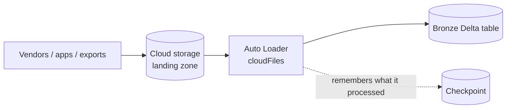

# 12 – Auto Loader

Auto Loader is the answer to one very common, very annoying problem:

```text
Files keep landing in cloud storage.
How do I load ONLY the new ones, exactly once, without a control table,
without listing a million files every run, and without breaking when the
schema changes?
```



---

## What It Replaces

| Doing it yourself | Auto Loader |
|-------------------|-------------|
| A control table of processed filenames | Checkpoint tracks files automatically |
| `ls` the whole directory every run | Incremental listing or cloud notifications |
| Custom logic for schema drift | Built-in inference, evolution, and rescue |
| Hand-rolled deduplication | Exactly-once by design |
| Breaks at 10 million files | Scales to billions |

---

## Reading Order

| # | File | What you learn |
|---|------|----------------|
| 1 | [auto_loader_basics.md](auto_loader_basics.md) | What it is and how to write your first loader |
| 2 | [file_detection_modes.md](file_detection_modes.md) | Directory listing vs file notification |
| 3 | [schema_inference_and_evolution.md](schema_inference_and_evolution.md) | Schema handling and `_rescued_data` |
| 4 | [options_reference.md](options_reference.md) | The options that actually matter |
| 5 | [production_best_practices.md](production_best_practices.md) | Running it reliably and cheaply |
| 6 | [interview_questions.md](interview_questions.md) | Questions asked in interviews |

---

## Quick Revision

```text
format("cloudFiles")            → this is Auto Loader
cloudFiles.format               → the file type (json, csv, parquet, avro, ...)
cloudFiles.schemaLocation       → where the inferred schema is stored
checkpointLocation              → where processed-file state lives

Detection:
directory listing   → default, simple, fine for most volumes
file notification   → cloud events, for very high file counts

Schema:
inference + evolution modes + _rescued_data → ingestion never silently loses data

Trigger:
availableNow → scheduled batch ingestion (the common production choice)
```
