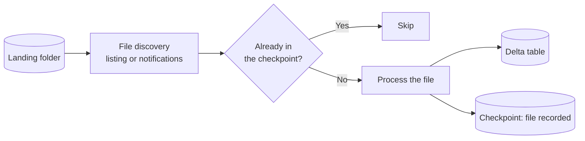
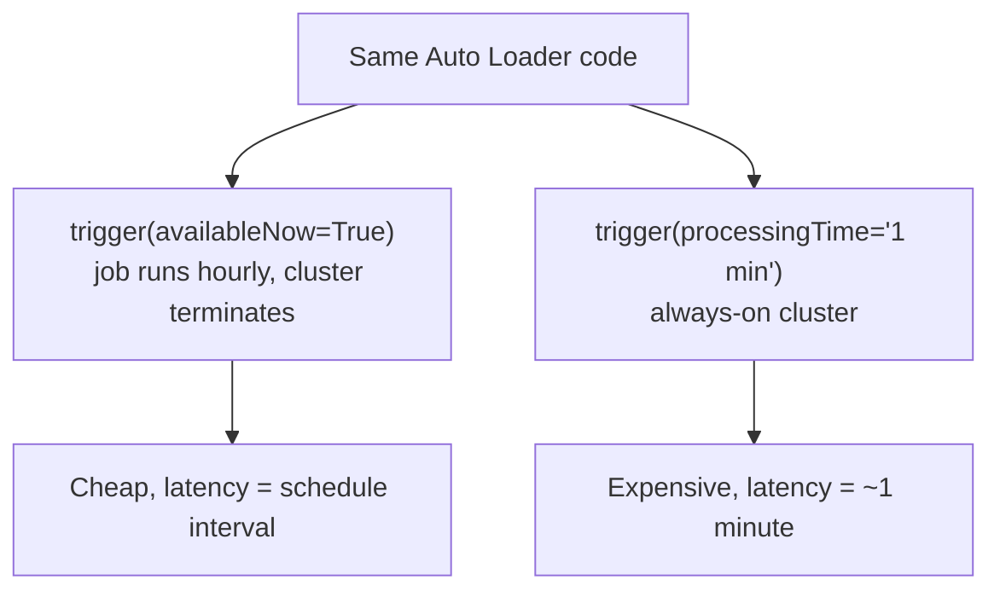
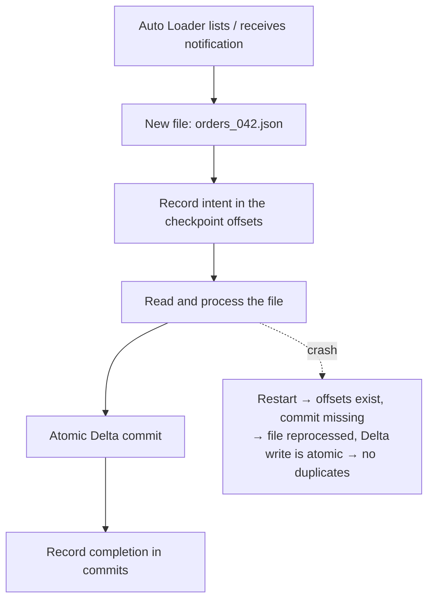
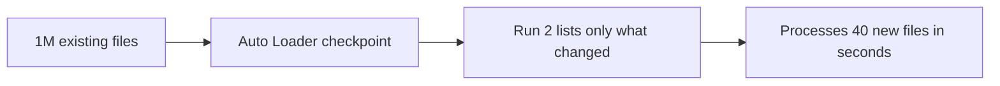

# Auto Loader Basics

## The Problem, Concretely

A vendor drops files into cloud storage:

```text
/landing/orders/
├── orders_2026-09-15_001.json
├── orders_2026-09-15_002.json
├── orders_2026-09-16_001.json
└── ... 400 000 more files
```

Every hour you must load only the new ones. The naive approach:

```python
# ❌ This breaks in production
df = spark.read.json("/landing/orders/")     # reads ALL files, every time
```

```text
Problems:
✘ Reprocesses everything → duplicates
✘ Listing 400 000 files takes minutes, then hours
✘ A new column in one file breaks the job
✘ A half-written file being uploaded gets read
```

Auto Loader solves all four.

---

## What Auto Loader Is

```text
Auto Loader = a Structured Streaming source ("cloudFiles")
              that incrementally discovers new files in cloud storage.
```



Because it is a streaming source, you get checkpoints, exactly-once processing,
and the ability to run it either continuously or as a scheduled batch.

---

## Your First Auto Loader

```python
from pyspark.sql import functions as F

(spark.readStream
    .format("cloudFiles")
    .option("cloudFiles.format", "json")
    .option("cloudFiles.schemaLocation", "/Volumes/main/bronze/_schema/orders")
    .load("/Volumes/main/landing/orders/")
    .withColumn("_ingested_at", F.current_timestamp())
    .withColumn("_source_file", F.col("_metadata.file_path"))
    .writeStream
    .option("checkpointLocation", "/Volumes/main/bronze/_ckpt/orders")
    .trigger(availableNow=True)
    .toTable("main.bronze.orders_raw"))
```

Five required pieces:

| Piece | Purpose |
|-------|---------|
| `format("cloudFiles")` | Selects Auto Loader |
| `cloudFiles.format` | The file type inside the folder |
| `cloudFiles.schemaLocation` | Where the inferred schema is stored and versioned |
| `load(path)` | The folder to watch |
| `checkpointLocation` | Where processed-file state lives |

```text
schemaLocation and checkpointLocation are different things:
schemaLocation   → what the data looks like
checkpointLocation → which files have been handled

Convention: keep them under the same parent, one pair per target table.
```

---

## The `_metadata` Column

Every file-based source exposes a hidden `_metadata` struct. It is the source of
your bronze audit columns.

```python
.withColumn("_source_file",   F.col("_metadata.file_path"))
.withColumn("_file_name",     F.col("_metadata.file_name"))
.withColumn("_file_size",     F.col("_metadata.file_size"))
.withColumn("_file_modified", F.col("_metadata.file_modification_time"))
```

```text
Why it matters: when a bad batch lands, "which file did this row come from?"
is the first question you will ask. Capture it at ingestion or lose it forever.
```

---

## Supported Formats

```text
json | csv | parquet | avro | orc | text | binaryFile | xml
```

```python
# CSV with a header
.option("cloudFiles.format", "csv")
.option("header", "true")
.option("sep", ",")

# Multi-line JSON (one JSON object spanning lines)
.option("cloudFiles.format", "json")
.option("multiLine", "true")

# Binary: images, PDFs — one row per file
.option("cloudFiles.format", "binaryFile")
```

Format-specific reader options (`header`, `sep`, `multiLine`, `escape`) pass
straight through alongside the `cloudFiles.*` options.

---

## Batch or Streaming: Same Code

```python
# Scheduled batch ingestion — process everything new, then stop
.trigger(availableNow=True)

# Continuous ingestion — a batch every minute, forever
.trigger(processingTime="1 minute")
```



```text
Most production ingestion uses availableNow on a schedule.
You still get exactly-once and automatic new-file tracking —
you just do not pay for an idle cluster between file drops.
```

Pair it with a **file arrival trigger** (topic 08) and you get low latency
without an always-on cluster:

```yaml
trigger:
  file_arrival:
    url: "/Volumes/main/landing/orders/"
    wait_after_last_change_seconds: 60
```

---

## How Exactly-Once Works Here



```text
Consequences you can rely on:
✔ Re-delivering the same file name is a no-op
✔ A crash mid-batch never loses or duplicates data
✔ You never need a "processed files" control table
```

```text
Important caveat: tracking is by FILE PATH.
If a vendor re-sends the same content under a NEW filename,
Auto Loader treats it as new data. Deduplicate in silver by business key.
```

---

## Incremental Listing and Scale

```text
Naive listing: every run lists every file → O(total files)
Auto Loader:   remembers where it got to → O(new files)
```



For extremely large or fast-growing directories, switch from listing to **file
notification mode** (next file).

---

## Directory Layout Matters

```text
✔ Good — date-partitioned, bounded files per folder
/landing/orders/year=2026/month=09/day=18/orders_001.json

✘ Bad — one flat folder accumulating millions of files
/landing/orders/orders_00000001.json ... orders_09412773.json
```

```text
Even with incremental listing, a flat folder with millions of files
makes every operation slower and complicates archival.

Also: do not write files INTO the folder Auto Loader watches from a
process that writes partial files. Write to a temp path and move/rename
atomically, or Auto Loader may read a half-written file.
```

---

## A Realistic Bronze Loader

```python
from pyspark.sql import functions as F

SOURCE = "/Volumes/main/landing/orders/"
SCHEMA = "/Volumes/main/bronze/_schema/orders"
CKPT   = "/Volumes/main/bronze/_ckpt/orders"

df = (spark.readStream
    .format("cloudFiles")
    .option("cloudFiles.format", "json")
    .option("cloudFiles.schemaLocation", SCHEMA)
    .option("cloudFiles.schemaEvolutionMode", "rescue")
    .option("cloudFiles.inferColumnTypes", "false")     # everything as string
    .option("cloudFiles.maxFilesPerTrigger", 1000)      # spike protection
    .load(SOURCE))

bronze = (df
    .withColumn("_ingested_at",   F.current_timestamp())
    .withColumn("_source_file",   F.col("_metadata.file_path"))
    .withColumn("_file_modified", F.col("_metadata.file_modification_time"))
    .withColumn("_ingest_date",   F.current_date()))

(bronze.writeStream
    .option("checkpointLocation", CKPT)
    .option("mergeSchema", "true")
    .trigger(availableNow=True)
    .toTable("main.bronze.orders_raw"))
```

Every choice here maps to a bronze-layer rule from topic 10: strings not types,
metadata columns, rescue mode, append only.

---

## Verifying What Happened

```sql
-- How many rows and files landed today?
SELECT
    _ingest_date,
    count(*)                        AS rows_loaded,
    count(DISTINCT _source_file)    AS files_loaded,
    min(_ingested_at)               AS first_load,
    max(_ingested_at)               AS last_load
FROM main.bronze.orders_raw
GROUP BY _ingest_date
ORDER BY _ingest_date DESC
LIMIT 7;
```

```python
# What did the last run do?
q = spark.streams.active[0] if spark.streams.active else None
print(q.lastProgress if q else "no active stream")
```

---

## Common Mistakes

```text
❌ Missing schemaLocation → Auto Loader cannot persist inferred schema
❌ Reusing one checkpoint for two loaders → corrupted state
❌ Writing partial files into the watched folder → truncated reads
❌ Expecting content-based deduplication → tracking is by file path
❌ No maxFilesPerTrigger on the first backfill run → one enormous batch
❌ Running always-on when hourly would do → unnecessary cost
❌ Casting and cleaning inside the Auto Loader stream → that is silver's job
```

---

## Common Interview Questions

### What is Auto Loader?

A Structured Streaming source (`cloudFiles`) that incrementally and exactly-once
ingests new files from cloud storage, with built-in schema inference, evolution,
and rescue.

### How does it know which files are new?

It records processed files in its checkpoint, using either incremental directory
listing or cloud file notifications, so each run only handles files it has not
seen.

### Difference between `schemaLocation` and `checkpointLocation`?

`schemaLocation` stores the inferred and evolving schema. `checkpointLocation`
stores streaming progress including which files were processed. Both are
required and should be unique per loader.

### Can Auto Loader run as a batch job?

Yes. `trigger(availableNow=True)` processes all available files then stops,
giving exactly-once semantics with batch economics.

### What happens if the same file is delivered twice?

If the path is identical, it is skipped. If the content is re-sent under a new
filename, it is ingested again — deduplication by business key belongs in silver.

### Why use `_metadata.file_path`?

To record which source file each row came from, which is essential for auditing
and for deleting a bad batch later.

### Why keep everything as strings in bronze?

So a source changing a column's format cannot break ingestion. Typing and
validation belong in silver where failures can be quarantined.

---

## Quick Revision

```text
Auto Loader = format("cloudFiles") streaming source over cloud storage

Required:
cloudFiles.format | cloudFiles.schemaLocation | load(path) | checkpointLocation

Formats: json csv parquet avro orc text binaryFile xml

Trigger:
availableNow      → scheduled ingestion (usual production choice)
processingTime    → continuous ingestion

Exactly-once via checkpoint, tracked BY FILE PATH
Content re-sent under a new name = new data → dedupe in silver

Bronze pattern:
strings + _ingested_at + _source_file + rescue mode + append only

Protect the first run with maxFilesPerTrigger
```
