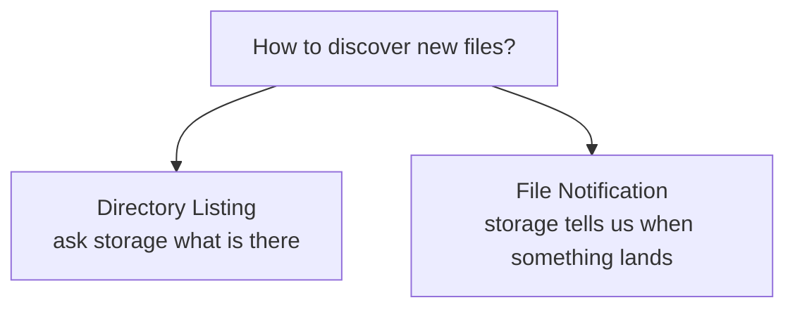
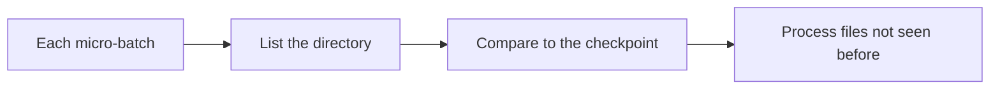
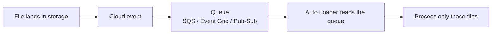
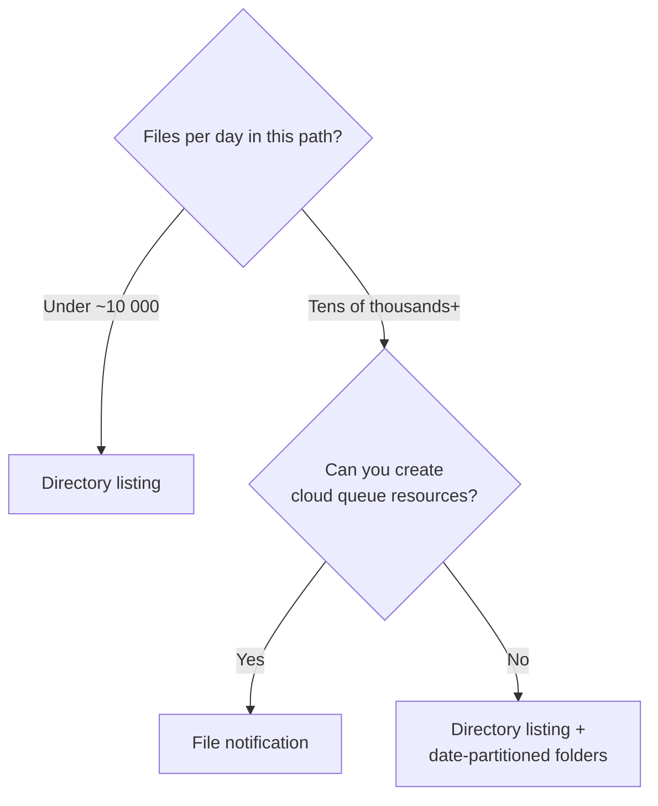
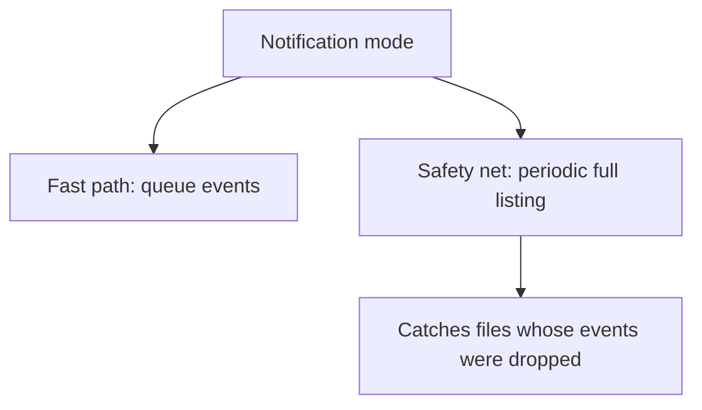
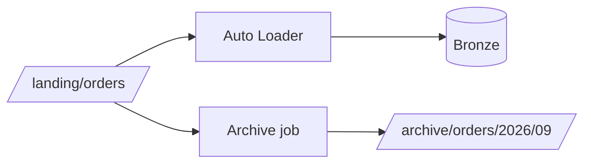

# File Detection Modes

## The Question

How does Auto Loader find out that a new file exists?



Choosing between them is the main scaling decision in Auto Loader.

---

## Mode 1: Directory Listing (Default)



```python
(spark.readStream.format("cloudFiles")
   .option("cloudFiles.format", "json")
   .option("cloudFiles.schemaLocation", schema_path)
   .load("/Volumes/main/landing/orders/"))
# directory listing is used automatically
```

```text
✔ Zero setup — no cloud permissions beyond reading the files
✔ Works on any storage Databricks can read
✔ Incremental: Auto Loader optimises listing using lexical file ordering
✘ Cost and latency grow with directory size
✘ Cloud storage LIST API calls are billed
```

### Incremental listing

Auto Loader does not blindly list everything. When filenames are
lexicographically ordered (which date-based names usually are), it can start
listing from where it left off.

```text
orders_2026-09-18_001.json
orders_2026-09-18_002.json      ← last processed
orders_2026-09-18_003.json      ← start listing here
```

```text
This is why file naming conventions matter more than people expect.
Random UUIDs as filenames defeat this optimisation.
```

---

## Mode 2: File Notification

Instead of asking storage what exists, let storage tell you.



```python
(spark.readStream.format("cloudFiles")
   .option("cloudFiles.format", "json")
   .option("cloudFiles.schemaLocation", schema_path)
   .option("cloudFiles.useNotifications", "true")
   .load("/Volumes/main/landing/orders/"))
```

```text
✔ Constant cost regardless of directory size
✔ Lower latency — no listing delay
✔ Scales to millions of files per day
✘ Requires cloud resources (queue + event subscription)
✘ Requires elevated permissions to create them
✘ More moving parts to monitor
```

### What gets created per cloud

| Cloud | Resources |
|-------|-----------|
| **AWS** | SNS topic + SQS queue subscribed to S3 events |
| **Azure** | Event Grid subscription + Storage Queue |
| **GCP** | Pub/Sub topic + subscription on GCS notifications |

Databricks can create these automatically if the credentials allow it, or you
can pre-create them and point Auto Loader at an existing queue:

```python
# Azure: use an existing queue
.option("cloudFiles.useNotifications", "true")
.option("cloudFiles.queueName", "orders-queue")
.option("cloudFiles.connectionString", dbutils.secrets.get("adls", "queue_conn"))

# AWS: use an existing SQS queue
.option("cloudFiles.useNotifications", "true")
.option("cloudFiles.queueUrl", "https://sqs.us-east-1.amazonaws.com/123/orders-queue")
```

---

## Choosing Between Them



| Factor | Directory listing | File notification |
|--------|-------------------|-------------------|
| Files per day | Up to ~10 000s | Millions |
| Setup effort | None | Cloud resources + permissions |
| Latency | Listing interval | Near immediate |
| Cost driver | LIST API calls | Queue messages |
| Failure modes | Slow listing | Queue backlog, lost events, permission drift |

```text
Start with directory listing. Move to notifications when listing time
becomes a visible part of your batch duration — not before.
Premature notification setup adds infrastructure you must then maintain.
```

---

## Migrating from Listing to Notification

```python
# Same checkpoint — Auto Loader supports switching modes
.option("cloudFiles.useNotifications", "true")
.option("cloudFiles.backfillInterval", "1 day")
```

```text
cloudFiles.backfillInterval periodically runs a directory listing
even in notification mode, to catch files whose events were lost.

This is strongly recommended: cloud event delivery is "at least once"
but not guaranteed to be complete under all failure conditions.
```



Without a backfill interval, a dropped notification means a file is **never**
ingested and nobody finds out. This is the single most important option in
notification mode.

---

## Latency Comparison

```text
Directory listing, trigger every 1 min:
  file lands 09:00:10 → discovered 09:01:00 → processed 09:01:20

File notification, trigger every 1 min:
  file lands 09:00:10 → event 09:00:12 → discovered 09:01:00 → processed 09:01:15

File notification + continuous trigger:
  file lands 09:00:10 → processed ~09:00:20
```

```text
Notice: the TRIGGER dominates latency, not the detection mode,
unless you are running continuously. If you run hourly, notification
mode saves listing cost but changes freshness very little.
```

---

## Monitoring Detection Health

```python
p = query.lastProgress
src = p["sources"][0]
print(src["description"])
print("files in this batch:", src.get("numInputRows"))
print(src.get("metrics", {}))
```

```text
Key signals:
numFilesOutstanding    → backlog of discovered but unprocessed files
numBytesOutstanding    → backlog size
approximateQueueSize   → notification mode: queue depth
```

```sql
-- Detect ingestion that has quietly stopped
SELECT max(_ingested_at) AS last_file_loaded,
       datediff(minute, max(_ingested_at), current_timestamp()) AS minutes_stale
FROM main.bronze.orders_raw;
```

Alert on `minutes_stale` exceeding your expected delivery gap. In notification
mode this is the alert that catches a broken event subscription.

---

## Operational Issues and Fixes

| Symptom | Likely cause | Fix |
|---------|--------------|-----|
| Listing takes minutes | Millions of files in one folder | Partition folders by date; switch to notifications |
| Some files never ingested | Lost notification events | Set `cloudFiles.backfillInterval` |
| Queue grows without bound | Stream stopped or too slow | Restart, scale up, raise `maxFilesPerTrigger` |
| Permission errors after months | Rotated credentials or deleted queue | Use managed identity / service principal, monitor setup |
| Duplicate ingestion after a move | Files re-created with new paths | Deduplicate in silver by business key |
| Truncated or corrupt rows | Partial files read while uploading | Write to a temp path, then atomic rename into the watched folder |

---

## Archiving Processed Files

Auto Loader never deletes source files. Left alone, the landing zone grows
forever.



```text
✔ Archive or delete files older than N days with a separate scheduled job
✔ Never move files that the current run might still be processing —
  archive by age, with a margin well beyond your batch duration
✔ In notification mode, moving a file does not affect already-processed state
```

```python
# Auto Loader can also clean up for you (cleanSource)
.option("cloudFiles.cleanSource", "MOVE")
.option("cloudFiles.cleanSource.moveDestination", "/Volumes/main/archive/orders/")
.option("cloudFiles.cleanSource.retentionDuration", "7 days")
```

```text
cleanSource options: OFF (default) | MOVE | DELETE
Use MOVE in regulated environments — DELETE is irreversible.
```

---

## Common Interview Questions

### How does Auto Loader detect new files?

Either by incremental directory listing (default) or by subscribing to cloud file
notification events through a managed queue.

### When would you switch to file notification mode?

When the number of files makes directory listing a significant part of batch
duration — typically tens of thousands of files per day or millions in the path.

### What cloud resources does notification mode create?

SNS plus SQS on AWS, Event Grid plus Storage Queue on Azure, Pub/Sub on GCP.

### What is `cloudFiles.backfillInterval` and why is it important?

It periodically performs a directory listing even in notification mode, catching
files whose events were lost. Without it, a dropped event means a file is never
ingested and nobody is alerted.

### Does file naming affect performance?

Yes. Lexicographically ordered filenames let Auto Loader resume listing from
where it stopped. Random names defeat that optimisation.

### How do you stop the landing zone from growing forever?

Archive with a scheduled job, or use `cloudFiles.cleanSource` with `MOVE` and a
retention duration.

### How do you detect that ingestion has silently stopped?

Alert on the freshness of the bronze table — the age of `max(_ingested_at)` —
rather than relying on job failure notifications.

---

## Quick Revision

```text
Directory listing (default):
no setup | cost grows with directory size | incremental via lexical ordering

File notification:
cloudFiles.useNotifications = true
constant cost at scale | needs queue resources and permissions
ALWAYS set cloudFiles.backfillInterval as a safety net

Choose listing until listing time is visibly slowing batches

Latency is usually dominated by the TRIGGER, not the detection mode

Housekeeping:
cleanSource = MOVE / DELETE, or a separate archive job

Monitor:
numFilesOutstanding | queue depth | bronze table freshness
```
