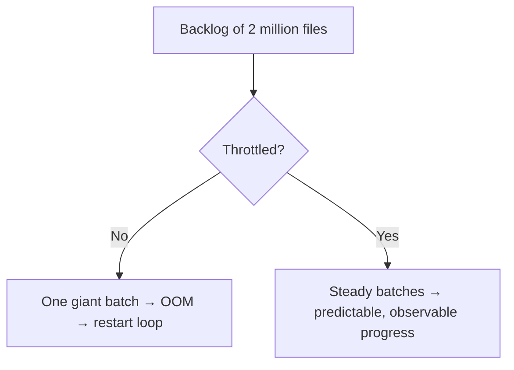
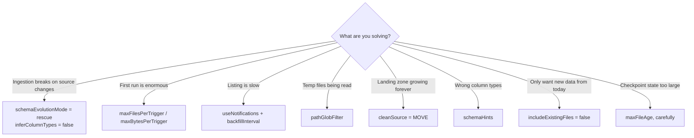

# Auto Loader Options Reference

A practical reference: the options that matter, grouped by what they control, and
what each one is actually for.

---

## The Minimum Viable Loader

```python
(spark.readStream.format("cloudFiles")
   .option("cloudFiles.format", "json")                 # required
   .option("cloudFiles.schemaLocation", schema_path)    # required (except parquet/avro)
   .load(source_path)
   .writeStream
   .option("checkpointLocation", ckpt_path)             # required
   .toTable("main.bronze.orders_raw"))
```

Everything else is tuning.

---

## Core Options

| Option | Default | What it does |
|--------|---------|--------------|
| `cloudFiles.format` | — | File type: `json`, `csv`, `parquet`, `avro`, `orc`, `text`, `binaryFile`, `xml` |
| `cloudFiles.schemaLocation` | — | Where the inferred schema is stored and versioned |
| `cloudFiles.useNotifications` | `false` | `true` switches from directory listing to cloud events |
| `cloudFiles.includeExistingFiles` | `true` | `false` skips files already present when the stream starts |

```python
# Start "from now on", ignoring the historical backlog
.option("cloudFiles.includeExistingFiles", "false")
```

```text
includeExistingFiles = false is evaluated only on the FIRST run of a
checkpoint. Setting it later has no effect — the checkpoint already decided.
```

---

## Schema Options

| Option | Default | What it does |
|--------|---------|--------------|
| `cloudFiles.inferColumnTypes` | `false` (json/csv) | Infer real types instead of strings |
| `cloudFiles.schemaEvolutionMode` | `addNewColumns` | `addNewColumns` / `rescue` / `failOnNewColumns` / `none` |
| `cloudFiles.schemaHints` | — | Pin specific column types |
| `cloudFiles.rescuedDataColumn` | `_rescued_data` | Name of the rescue column |
| `cloudFiles.schemaInferenceColumnTypeSampleSize` | 1000 | Rows sampled for inference |
| `cloudFiles.inferSchemaSampleSizeBytes` | — | Bytes sampled for inference |

```python
.option("cloudFiles.inferColumnTypes", "false")
.option("cloudFiles.schemaEvolutionMode", "rescue")
.option("cloudFiles.schemaHints", "order_id BIGINT, amount DECIMAL(18,2)")
```

See [schema_inference_and_evolution.md](schema_inference_and_evolution.md) for
the reasoning behind these.

---

## Throughput and Throttling



| Option | What it limits |
|--------|----------------|
| `cloudFiles.maxFilesPerTrigger` | Files per micro-batch (default 1000) |
| `cloudFiles.maxBytesPerTrigger` | Bytes per micro-batch |
| `cloudFiles.fetchParallelism` | Parallelism for queue fetches (notification mode) |
| `cloudFiles.maxFileAge` | Drops tracking of files older than this, to bound checkpoint state |

```python
.option("cloudFiles.maxFilesPerTrigger", 1000)
.option("cloudFiles.maxBytesPerTrigger", "10g")
```

```text
Set these based on what ONE batch can comfortably process on your cluster,
not on the normal arrival rate. They exist for the abnormal day.

If both are set, whichever limit is hit first applies.
```

### `maxFileAge` and checkpoint size

```python
.option("cloudFiles.maxFileAge", "90 days")
```

```text
Auto Loader remembers every processed file path. After years of ingestion
that state becomes large. maxFileAge lets it forget very old files.

⚠ Danger: if a file older than maxFileAge appears (a very late delivery,
or an archive restore), it will be ingested AGAIN because the loader
has forgotten it. Set this comfortably longer than any plausible late arrival.
```

---

## File Filtering

| Option | Purpose |
|--------|---------|
| `pathGlobFilter` | Only process files matching a glob |
| `cloudFiles.partitionColumns` | Parse Hive-style partition folders into columns |
| `recursiveFileLookup` | Ignore partition discovery, read all files recursively |
| `modifiedAfter` / `modifiedBefore` | Time-bounded selection |

```python
# Only JSON files, ignore vendor readme files and temp uploads
.option("pathGlobFilter", "*.json")

# /landing/orders/year=2026/month=09/ → columns year, month
.option("cloudFiles.partitionColumns", "year, month")

# Ignore anything written before the cutover date
.option("modifiedAfter", "2026-09-01T00:00:00")
```

```text
pathGlobFilter is the standard defence against partial uploads
named *.tmp or *.inprogress landing in the watched folder.
```

---

## Notification Mode Options

| Option | Purpose |
|--------|---------|
| `cloudFiles.useNotifications` | Enable the mode |
| `cloudFiles.backfillInterval` | Periodic listing as a safety net — **always set this** |
| `cloudFiles.queueName` / `queueUrl` | Use an existing queue |
| `cloudFiles.connectionString` | Azure queue credentials |
| `cloudFiles.region` | AWS region for SQS/SNS |
| `cloudFiles.subscriptionId`, `resourceGroup`, `tenantId`, `clientId`, `clientSecret` | Azure setup for auto-created resources |
| `cloudFiles.validateOptions` | Validate configuration at startup |

```python
.option("cloudFiles.useNotifications", "true")
.option("cloudFiles.backfillInterval", "1 day")
```

```text
Repeating because it matters: without backfillInterval, a lost cloud event
means a file is never ingested and no error is raised anywhere.
```

---

## Format-Specific Options

### CSV

```python
.option("cloudFiles.format", "csv")
.option("header", "true")
.option("sep", ",")
.option("quote", '"')
.option("escape", "\\")
.option("multiLine", "true")            # fields containing newlines
.option("mode", "PERMISSIVE")           # PERMISSIVE | DROPMALFORMED | FAILFAST
.option("columnNameOfCorruptRecord", "_corrupt_record")
.option("encoding", "UTF-8")
```

```text
For bronze: PERMISSIVE + a corrupt record column.
DROPMALFORMED silently loses rows, which violates the bronze contract.
```

### JSON

```python
.option("cloudFiles.format", "json")
.option("multiLine", "true")            # one object spanning multiple lines
.option("allowComments", "true")
.option("allowSingleQuotes", "true")
.option("primitivesAsString", "true")
```

### Parquet / Avro

```python
.option("cloudFiles.format", "parquet")
.option("mergeSchema", "true")          # tolerate differing schemas across files
```

```text
Parquet and Avro are self-describing, so schemaLocation is optional —
but still set it if you want evolution tracked and rescued data captured.
```

### binaryFile

```python
.option("cloudFiles.format", "binaryFile")
# columns: path, modificationTime, length, content
```

Used for images, PDFs, and any blob you want to land and process later.

---

## Cleanup Options

```python
.option("cloudFiles.cleanSource", "MOVE")
.option("cloudFiles.cleanSource.moveDestination", "/Volumes/main/archive/orders/")
.option("cloudFiles.cleanSource.retentionDuration", "7 days")
```

| Value | Effect |
|-------|--------|
| `OFF` *(default)* | Source files are never touched |
| `MOVE` | Processed files moved to the destination after retention |
| `DELETE` | Processed files deleted after retention |

```text
Prefer MOVE. DELETE is irreversible and the first incident will teach you why.
```

---

## Write-Side Options (Not Auto Loader, but Always Needed)

```python
.writeStream
.option("checkpointLocation", ckpt)
.option("mergeSchema", "true")
.trigger(availableNow=True)
.toTable("main.bronze.orders_raw")
```

Plus table properties on the target:

```sql
ALTER TABLE main.bronze.orders_raw SET TBLPROPERTIES (
  'delta.autoOptimize.optimizeWrite' = 'true',
  'delta.autoOptimize.autoCompact'   = 'true'
);
```

---

## A Production-Grade Configuration

```python
from pyspark.sql import functions as F

SOURCE = "/Volumes/main/landing/orders/"
SCHEMA = "/Volumes/main/bronze/_schema/orders"
CKPT   = "/Volumes/main/bronze/_ckpt/orders"

reader = (spark.readStream.format("cloudFiles")
    # format and schema
    .option("cloudFiles.format", "json")
    .option("cloudFiles.schemaLocation", SCHEMA)
    .option("cloudFiles.inferColumnTypes", "false")
    .option("cloudFiles.schemaEvolutionMode", "rescue")
    .option("cloudFiles.schemaHints", "order_id BIGINT, event_time TIMESTAMP")
    # what to pick up
    .option("pathGlobFilter", "*.json")
    .option("cloudFiles.partitionColumns", "ingest_date")
    # throughput protection
    .option("cloudFiles.maxFilesPerTrigger", 1000)
    .option("cloudFiles.maxBytesPerTrigger", "10g")
    # housekeeping
    .option("cloudFiles.cleanSource", "MOVE")
    .option("cloudFiles.cleanSource.moveDestination", "/Volumes/main/archive/orders/")
    .option("cloudFiles.cleanSource.retentionDuration", "30 days")
    .load(SOURCE))

bronze = (reader
    .withColumn("_ingested_at",   F.current_timestamp())
    .withColumn("_source_file",   F.col("_metadata.file_path"))
    .withColumn("_file_modified", F.col("_metadata.file_modification_time")))

(bronze.writeStream
    .option("checkpointLocation", CKPT)
    .option("mergeSchema", "true")
    .trigger(availableNow=True)
    .toTable("main.bronze.orders_raw"))
```

---

## Option Selection Cheat Sheet



---

## Common Interview Questions

### Which options are mandatory?

`cloudFiles.format`, `cloudFiles.schemaLocation` (except for self-describing
formats), the source path, and a `checkpointLocation` on the write side.

### How do you protect against a huge first batch?

`cloudFiles.maxFilesPerTrigger` and `cloudFiles.maxBytesPerTrigger`.

### What does `includeExistingFiles = false` do, and when is it evaluated?

It skips files already present when the stream first starts. It applies only on
the first run of a given checkpoint; changing it later has no effect.

### What is the risk of `cloudFiles.maxFileAge`?

The loader forgets files older than the age, so a very late delivery or an
archive restore would be ingested a second time.

### How do you stop partial uploads being read?

`pathGlobFilter` to match only completed extensions, and have producers write to
a temp path then rename atomically into the watched folder.

### Which CSV mode should bronze use and why?

`PERMISSIVE` with a corrupt record column. `DROPMALFORMED` silently discards
rows, which breaks the bronze guarantee of keeping everything.

### What does `cleanSource` do?

Moves or deletes processed source files after a retention period, so the landing
zone does not grow indefinitely. `MOVE` is preferred over `DELETE`.

---

## Quick Revision

```text
Required: cloudFiles.format | cloudFiles.schemaLocation | checkpointLocation

Schema:
inferColumnTypes=false | schemaEvolutionMode=rescue | schemaHints | rescuedDataColumn

Throughput:
maxFilesPerTrigger | maxBytesPerTrigger | maxFileAge (careful)

Selection:
pathGlobFilter | partitionColumns | includeExistingFiles | modifiedAfter

Notification:
useNotifications + backfillInterval (never omit the second)

Cleanup:
cleanSource = MOVE + moveDestination + retentionDuration

Write side:
mergeSchema + optimizeWrite + autoCompact on the target table
```
