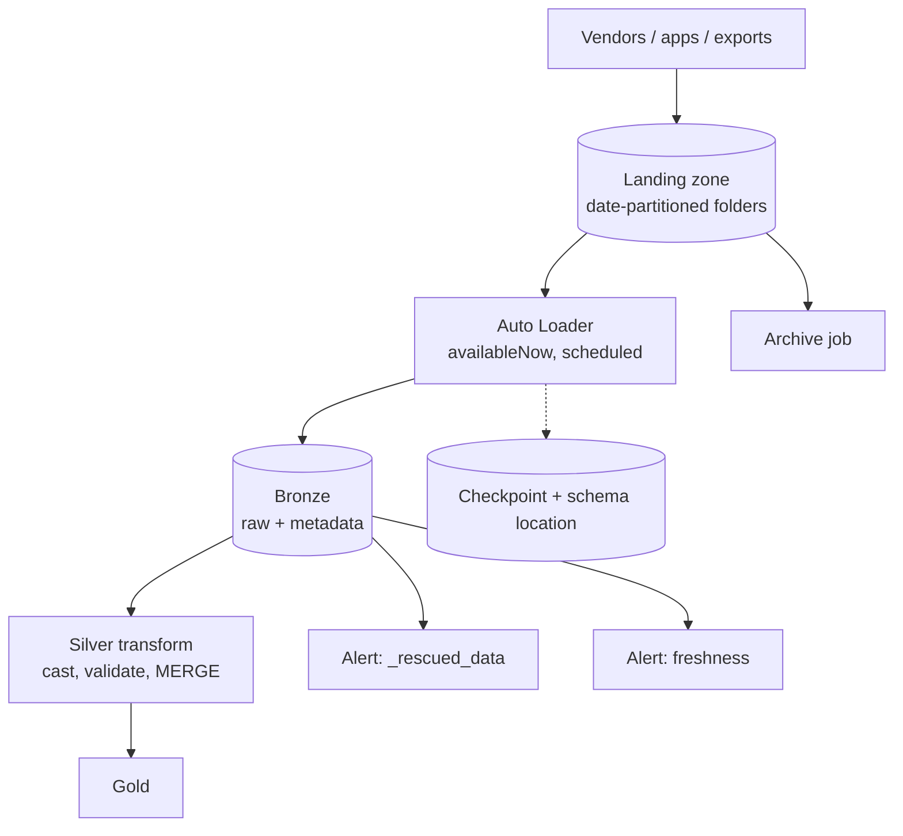
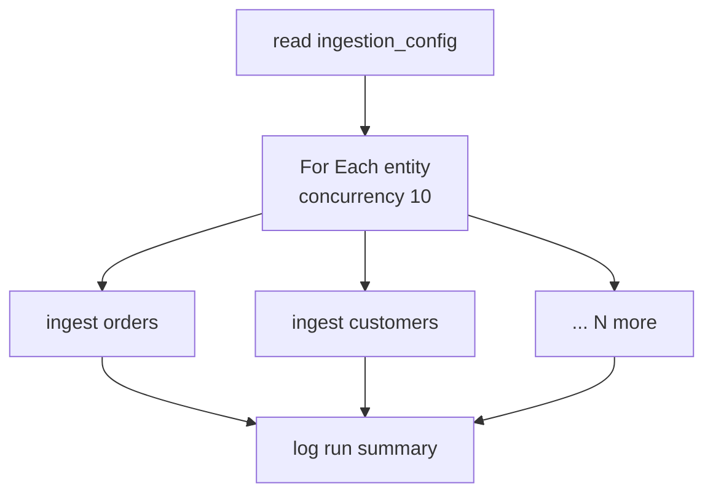
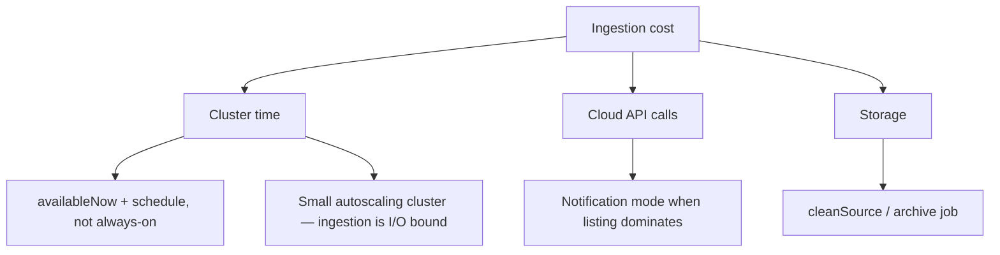

# Auto Loader in Production

## The Reference Architecture



Everything below is about making each arrow in that diagram reliable.

---

## Layout Conventions

Pick a convention on day one; retrofitting paths across 200 tables is miserable.

```text
Landing:
/Volumes/main/landing/<source_system>/<entity>/ingest_date=YYYY-MM-DD/

Schema:
/Volumes/main/bronze/_schema/<entity>/

Checkpoint:
/Volumes/main/bronze/_ckpt/<entity>/

Archive:
/Volumes/main/archive/<source_system>/<entity>/YYYY/MM/
```

```text
Rules:
✔ One schemaLocation and one checkpointLocation per target table
✔ Never share either between loaders
✔ Keep them in Unity Catalog Volumes, not DBFS root
✔ Version the path when making a breaking change: _ckpt/orders_v2
```

---

## Deployment: Scheduled Job, Not a Notebook

```yaml
resources:
  jobs:
    bronze_ingestion:
      name: bronze_ingestion
      max_concurrent_runs: 1
      schedule:
        quartz_cron_expression: "0 0/15 * * * ?"     # every 15 minutes
        timezone_id: "UTC"
      email_notifications:
        on_failure: [data-oncall@company.com]
        no_alert_for_skipped_runs: true
      job_clusters:
        - job_cluster_key: ingest
          new_cluster:
            spark_version: "14.3.x-scala2.12"
            node_type_id: "Standard_DS3_v2"
            autoscale: { min_workers: 1, max_workers: 4 }
      tasks:
        - task_key: ingest_orders
          job_cluster_key: ingest
          max_retries: 2
          timeout_seconds: 3600
          notebook_task:
            notebook_path: ./ingest/auto_loader_generic
            base_parameters:
              entity: "orders"
              source_format: "json"
```

```text
availableNow + a schedule beats an always-on stream for most ingestion:
✔ Cluster runs only while there is work
✔ Job retries, alerts, and run history come free
✔ Still exactly-once, still tracks new files automatically
```

For lower latency without an always-on cluster, use a **file arrival trigger**
instead of a cron schedule (topic 08).

---

## Metadata-Driven Ingestion

One notebook, one control table, N entities. This is how mature platforms avoid
200 near-identical notebooks.

```sql
CREATE TABLE main.control.ingestion_config (
    entity          STRING,
    source_path     STRING,
    file_format     STRING,
    schema_hints    STRING,
    target_table    STRING,
    glob_filter     STRING,
    max_files       INT,
    is_active       BOOLEAN,
    updated_at      TIMESTAMP
);

INSERT INTO main.control.ingestion_config VALUES
 ('orders',   '/Volumes/main/landing/erp/orders/',   'json', 'order_id BIGINT',  'main.bronze.orders_raw',   '*.json', 1000, true, current_timestamp()),
 ('customers','/Volumes/main/landing/crm/customers/','csv',  'customer_id BIGINT','main.bronze.customers_raw','*.csv',  500,  true, current_timestamp());
```

```python
# Generic loader notebook
from pyspark.sql import functions as F

entity = dbutils.widgets.get("entity")

cfg = (spark.table("main.control.ingestion_config")
       .filter(f"entity = '{entity}' AND is_active").collect()[0])

reader = (spark.readStream.format("cloudFiles")
    .option("cloudFiles.format", cfg.file_format)
    .option("cloudFiles.schemaLocation", f"/Volumes/main/bronze/_schema/{entity}")
    .option("cloudFiles.inferColumnTypes", "false")
    .option("cloudFiles.schemaEvolutionMode", "rescue")
    .option("cloudFiles.maxFilesPerTrigger", cfg.max_files)
    .option("pathGlobFilter", cfg.glob_filter))

if cfg.schema_hints:
    reader = reader.option("cloudFiles.schemaHints", cfg.schema_hints)
if cfg.file_format == "csv":
    reader = reader.option("header", "true").option("mode", "PERMISSIVE")

df = (reader.load(cfg.source_path)
    .withColumn("_ingested_at", F.current_timestamp())
    .withColumn("_source_file", F.col("_metadata.file_path"))
    .withColumn("_entity", F.lit(entity)))

(df.writeStream
   .option("checkpointLocation", f"/Volumes/main/bronze/_ckpt/{entity}")
   .option("mergeSchema", "true")
   .trigger(availableNow=True)
   .toTable(cfg.target_table))
```

Drive it with a **For Each** task over the active entities (topic 08):



```text
Adding the 201st source becomes an INSERT, not a deployment.
```

---

## Monitoring

Three alerts cover almost every real failure.

### 1. Freshness — did ingestion stop?

```sql
SELECT
    _entity,
    max(_ingested_at) AS last_load,
    datediff(minute, max(_ingested_at), current_timestamp()) AS minutes_stale
FROM main.bronze.orders_raw
GROUP BY _entity
HAVING datediff(minute, max(_ingested_at), current_timestamp()) > 120;
```

```text
Catches: paused job, deleted trigger, broken notification queue,
vendor stopped delivering. A job-failure alert catches none of these.
```

### 2. Rescued data — did the source change?

```sql
SELECT count(*) AS rescued_today
FROM main.bronze.orders_raw
WHERE _rescued_data IS NOT NULL
  AND date(_ingested_at) = current_date();
-- Alert when > 0
```

### 3. Volume anomaly — did we get the wrong amount?

```sql
WITH daily AS (
    SELECT date(_ingested_at) AS day, count(*) AS rows_loaded
    FROM main.bronze.orders_raw
    WHERE _ingested_at >= current_date() - INTERVAL 30 DAYS
    GROUP BY 1
),
baseline AS (
    SELECT avg(rows_loaded) AS avg_rows, stddev(rows_loaded) AS sd_rows
    FROM daily WHERE day < current_date()
)
SELECT d.day, d.rows_loaded, b.avg_rows,
       round(100.0 * (d.rows_loaded - b.avg_rows) / nullif(b.avg_rows, 0), 1) AS pct_dev
FROM daily d CROSS JOIN baseline b
WHERE d.day = current_date() - INTERVAL 1 DAY
  AND abs(d.rows_loaded - b.avg_rows) > 3 * b.sd_rows;
```

```text
Catches: a vendor sending a truncated file, a duplicate delivery,
a partial upload. None of these produce an error anywhere else.
```

### Logging each run

```python
summary = {
    "entity": entity,
    "run_date": run_date,
    "rows_loaded": spark.table(cfg.target_table)
                     .filter(f"date(_ingested_at) = '{run_date}'").count(),
    "files_loaded": spark.table(cfg.target_table)
                     .filter(f"date(_ingested_at) = '{run_date}'")
                     .select("_source_file").distinct().count(),
}
(spark.createDataFrame([summary])
   .withColumn("logged_at", F.current_timestamp())
   .write.format("delta").mode("append")
   .option("mergeSchema", "true")
   .saveAsTable("main.control.ingestion_runs"))
```

---

## Cost Control



```text
Typical wins:
✔ 15-minute schedule instead of always-on → ~80% less cluster time
✔ 2-worker cluster instead of 8 → ingestion rarely needs CPU
✔ One job with a For Each over 50 entities → one cluster startup, not 50
✔ Archiving processed files → cheaper storage tier
```

```text
Anti-pattern: a separate always-on cluster per source table.
Seen often, and it is usually the single largest line in an ingestion bill.
```

---

## Recovery Runbook

### Reprocess a specific set of files

```python
# Files exist but were processed with buggy logic.
# Auto Loader will not re-read them — the checkpoint says they are done.
# Option A: read them as a batch and MERGE into bronze
bad = (spark.read.format("json")
       .load("/Volumes/main/landing/orders/ingest_date=2026-09-17/"))
```

### Full re-ingestion

```python
# 1. Truncate or restore the target
spark.sql("TRUNCATE TABLE main.bronze.orders_raw")

# 2. NEW checkpoint and schema location — do not reuse the old paths
(spark.readStream.format("cloudFiles")
   .option("cloudFiles.format", "json")
   .option("cloudFiles.schemaLocation", "/Volumes/main/bronze/_schema/orders_v2")
   .load("/Volumes/main/landing/orders/")
   .writeStream
   .option("checkpointLocation", "/Volumes/main/bronze/_ckpt/orders_v2")
   .trigger(availableNow=True)
   .toTable("main.bronze.orders_raw"))
```

### Accidental duplicate ingestion

```sql
-- Identify the duplicate batch
SELECT _source_file, count(*)
FROM main.bronze.orders_raw
GROUP BY _source_file HAVING count(*) > 1;

-- Bronze stays append-only; silver MERGE deduplicates by business key.
-- If bronze must be cleaned, delete by the ingestion window:
DELETE FROM main.bronze.orders_raw
WHERE _ingested_at BETWEEN '2026-09-18T10:00:00' AND '2026-09-18T10:30:00';
```

```text
This is why _source_file and _ingested_at are non-negotiable columns.
Without them, surgical recovery is impossible.
```

---

## Checklist

```text
Setup
✔ One schemaLocation + one checkpointLocation per target, in a Volume
✔ Date-partitioned landing folders
✔ pathGlobFilter to exclude partial uploads
✔ Producers write to temp then rename atomically

Schema
✔ inferColumnTypes = false for bronze
✔ schemaEvolutionMode = rescue (or addNewColumns with auto-restart)
✔ schemaHints for IDs, money, timestamps
✔ mergeSchema on the write side

Throughput
✔ maxFilesPerTrigger / maxBytesPerTrigger set before the first run
✔ Notification mode + backfillInterval only when listing is slow
✔ optimizeWrite + autoCompact on the bronze table

Deployment
✔ availableNow on a schedule or a file arrival trigger
✔ Job cluster, service principal, Asset Bundles
✔ Metadata-driven with For Each for many sources

Monitoring
✔ Freshness alert (ingestion stopped)
✔ Rescued data alert (source changed)
✔ Volume anomaly alert (wrong amount of data)
✔ Run summary logged to a control table

Housekeeping
✔ cleanSource MOVE or a scheduled archive job
✔ Documented re-ingestion runbook
```

---

## Common Interview Questions

### How do you deploy Auto Loader in production?

As a scheduled job using `trigger(availableNow=True)` on a job cluster, defined
in Git via Asset Bundles, running as a service principal, with retries and
failure notifications.

### How do you ingest 200 source tables without 200 notebooks?

A control table describing each entity, one generic loader notebook parameterised
by entity, and a For Each task iterating over the active entities.

### Which alerts do you set up for ingestion?

Freshness (ingestion stopped), rescued data (schema changed), and volume anomaly
(wrong quantity of data). Job failure alerts alone miss all three.

### How do you re-ingest data that was already processed?

Auto Loader will not re-read files recorded in its checkpoint. Either read those
paths as a batch and merge them, or restart with a new checkpoint and schema
location after truncating or restoring the target.

### How do you control ingestion cost?

Scheduled `availableNow` instead of always-on, small autoscaling clusters,
consolidating many entities into one job run, notification mode only when listing
dominates, and archiving processed files.

### What makes surgical recovery possible?

Capturing `_source_file`, `_ingested_at`, and a batch identifier at ingestion, so
a specific bad delivery can be identified and removed.

---

## Quick Revision

```text
Deploy: availableNow on a schedule (or file arrival trigger) in a job
Scale:  metadata-driven config table + For Each task
Layout: one schemaLocation + one checkpoint per table, in Volumes

Three alerts that matter:
1. Freshness      → ingestion stopped silently
2. _rescued_data  → the source changed
3. Volume anomaly → truncated or duplicated delivery

Cost: schedule not always-on | small clusters | one job for many entities

Recovery needs: _source_file + _ingested_at + a new checkpoint path

Never share a checkpoint. Never reuse one after a breaking change.
```
