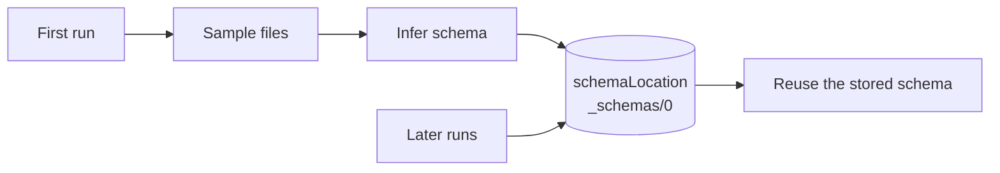
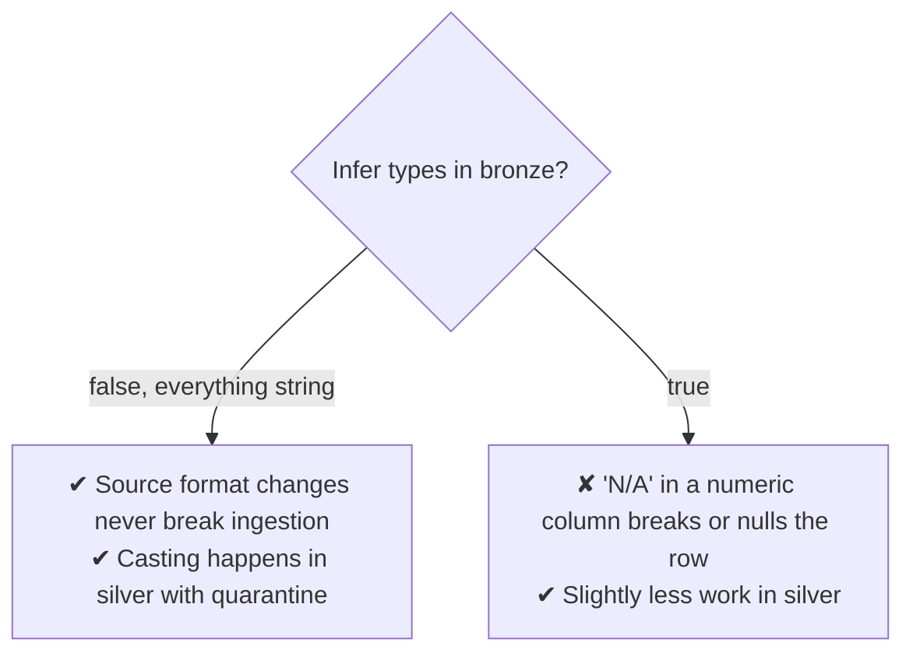
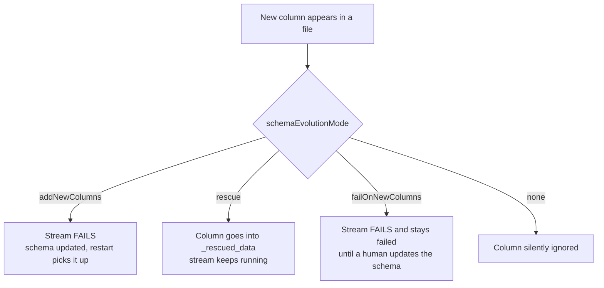
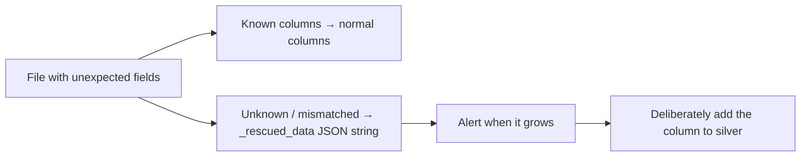
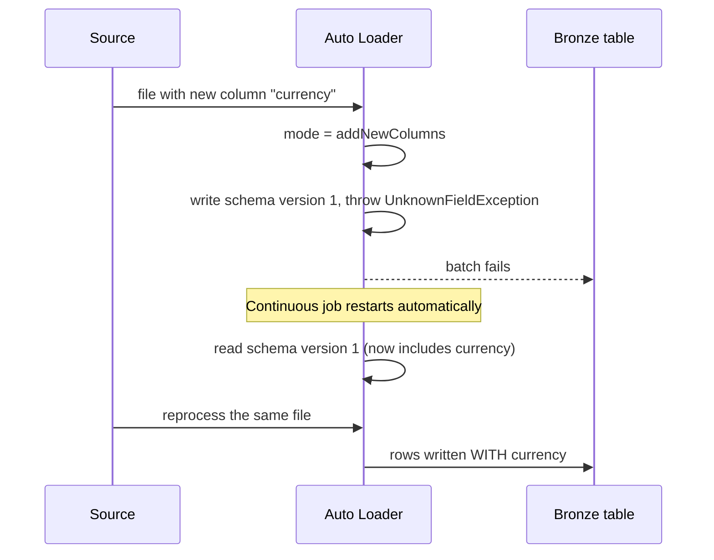

# Schema Inference and Evolution

## The Problem

Source systems change without telling you.

```text
Monday:   {"order_id": 1, "amount": 100}
Thursday: {"order_id": 2, "amount": 100, "currency": "USD"}
Sunday:   {"order_id": 3, "amount": "1,250.00", "currency": "USD"}
```

```text
A naive loader:
Thursday → silently drops "currency"
Sunday   → crashes, or writes null into amount

Either way, you find out weeks later from a wrong report.
```

Auto Loader's schema handling exists so neither happens silently.

---

## Schema Inference

On the first run, Auto Loader samples files to infer a schema, then stores it.



```python
.option("cloudFiles.schemaLocation", "/Volumes/main/bronze/_schema/orders")
.option("cloudFiles.schemaInferenceColumnTypeSampleSize", 50000)   # rows sampled
```

```text
The schemaLocation directory holds a versioned history:
_schemas/0  ← original
_schemas/1  ← after the first evolution
_schemas/2  ← after the second

You can read these files to see exactly when and how the source changed.
```

---

## String Types vs Inferred Types

```python
.option("cloudFiles.inferColumnTypes", "false")    # default for JSON/CSV: all strings
.option("cloudFiles.inferColumnTypes", "true")     # infer int, double, timestamp...
```



```text
Recommendation for bronze: inferColumnTypes = false.

Reasoning: bronze's job is to never lose data. A column that is numeric
for six months and then contains "1,250.00" must still land. Typing is
a silver concern, where a failed cast can be quarantined and alerted on.

Parquet and Avro are self-describing, so types come from the file itself.
```

---

## Schema Hints

Inference plus hints is often the best combination: let Auto Loader infer most of
it, but pin the columns you care about.

```python
.option("cloudFiles.schemaHints", "order_id BIGINT, amount DECIMAL(18,2), event_time TIMESTAMP")
```

```text
Use hints to:
✔ Stop a numeric ID being inferred as double (losing precision)
✔ Force a timestamp that would otherwise be a string
✔ Pin a decimal type for money, rather than float
✔ Define a nested struct that inference gets wrong
```

```python
# Nested hints
.option("cloudFiles.schemaHints", "customer.address.zip STRING, items ARRAY<STRUCT<sku: STRING, qty: INT>>")
```

---

## Schema Evolution Modes

This is the decision that determines what happens the day the source adds a
column.



| Mode | New column behaviour | Stream survives? | Data preserved? |
|------|---------------------|------------------|-----------------|
| `addNewColumns` *(default with schemaLocation)* | Added to the schema | Fails once, then continues | Yes |
| `rescue` | Captured in `_rescued_data` | Yes | Yes |
| `failOnNewColumns` | Error | No, blocks | Yes, once fixed |
| `none` | Ignored | Yes | **No** |

```text
Choosing:

addNewColumns    → good with a continuous job that auto-restarts;
                   the schema stays clean and explicit

rescue           → best for always-on streams that must never break at 3 AM,
                   and for sources you do not control

failOnNewColumns → for regulated pipelines where an unreviewed column
                   must never enter the platform

none             → almost never. It loses data silently.
```

```python
.option("cloudFiles.schemaEvolutionMode", "rescue")
```

---

## `_rescued_data`: the Safety Net

```python
.option("cloudFiles.schemaEvolutionMode", "rescue")
# or explicitly name the column
.option("cloudFiles.rescuedDataColumn", "_rescued_data")
```

What lands in it:

```text
✔ Columns not in the known schema
✔ Values that do not match the column type
✔ Columns whose case differs from the schema (when case-insensitive)
```

```json
{
  "currency": "USD",
  "discount_code": "SUMMER26",
  "_file_path": "/landing/orders/orders_2026-09-18_003.json"
}
```



### Monitoring it

```sql
-- Are we rescuing anything, and what?
SELECT
    date(_ingested_at) AS day,
    count(*)           AS rescued_rows,
    collect_set(get_json_object(_rescued_data, '$.currency')) AS sample_values
FROM main.bronze.orders_raw
WHERE _rescued_data IS NOT NULL
GROUP BY 1
ORDER BY 1 DESC;
```

```sql
-- Which unexpected keys are appearing?
SELECT DISTINCT explode(map_keys(from_json(_rescued_data, 'MAP<STRING,STRING>'))) AS unexpected_field
FROM main.bronze.orders_raw
WHERE _rescued_data IS NOT NULL;
```

```text
A rescued-data alert is the closest thing to a contract test between you
and an upstream team that never announces changes.
```

---

## How Evolution Actually Plays Out



```text
Key point: with addNewColumns the failure is EXPECTED and recoverable.
The file is not lost — it is reprocessed after the restart, because the
checkpoint never committed that batch.

This is why addNewColumns must be paired with automatic restart
(a continuous job, or job retries). Without it, ingestion stops.
```

---

## Writing to Delta: `mergeSchema`

Auto Loader's evolution handles the **read** side. The Delta **write** side needs
its own permission to add columns.

```python
.writeStream
.option("mergeSchema", "true")
.toTable("main.bronze.orders_raw")
```

```text
Without mergeSchema, the new column is read but rejected at write time
with a schema mismatch error.

Both sides must agree:
cloudFiles.schemaEvolutionMode  → read side
mergeSchema                     → write side
```

---

## Handling Type Changes

Evolution adds columns. It does **not** change an existing column's type.

```text
Schema says: amount STRING
File has:    amount 1250.00 (number)
Result:      fine — it reads as a string

Schema says: amount BIGINT   (because you used inferColumnTypes=true)
File has:    amount "1,250.00"
Result:      the value goes to _rescued_data, column is null
```

```text
This asymmetry is the strongest argument for string-typed bronze:
you never hit an unrecoverable type conflict at ingestion time.
```

If a type genuinely must change, treat it as a breaking change:

```text
1. Stop the loader
2. Create a new schemaLocation and checkpoint (v2)
3. Write to a new table or a new column
4. Backfill and reconcile
5. Switch consumers
```

---

## Case Sensitivity

```python
.option("cloudFiles.schemaEvolutionMode", "rescue")
spark.conf.set("spark.sql.caseSensitive", "false")     # default
```

```text
By default, OrderID and orderid are the same column.
With case sensitivity off, a source that changes casing does not
create a duplicate column — but the mismatched values may be rescued.
Check _rescued_data if columns appear unexpectedly empty.
```

---

## Full Example with All Schema Options

```python
from pyspark.sql import functions as F

df = (spark.readStream
    .format("cloudFiles")
    .option("cloudFiles.format", "json")
    .option("cloudFiles.schemaLocation", "/Volumes/main/bronze/_schema/orders")
    .option("cloudFiles.inferColumnTypes", "false")
    .option("cloudFiles.schemaEvolutionMode", "rescue")
    .option("cloudFiles.schemaHints", "order_id BIGINT, event_time TIMESTAMP")
    .option("cloudFiles.rescuedDataColumn", "_rescued_data")
    .load("/Volumes/main/landing/orders/"))

bronze = (df
    .withColumn("_ingested_at", F.current_timestamp())
    .withColumn("_source_file", F.col("_metadata.file_path")))

(bronze.writeStream
    .option("checkpointLocation", "/Volumes/main/bronze/_ckpt/orders")
    .option("mergeSchema", "true")
    .trigger(availableNow=True)
    .toTable("main.bronze.orders_raw"))
```

Then the alert that makes it all worthwhile:

```sql
-- Alert: unexpected source changes
SELECT count(*) AS rescued_today
FROM main.bronze.orders_raw
WHERE _rescued_data IS NOT NULL
  AND date(_ingested_at) = current_date();
-- Condition: > 0
```

---

## Common Interview Questions

### How does Auto Loader infer schema?

It samples files on the first run, infers a schema, and persists it in
`schemaLocation` as a versioned history reused by later runs.

### What are the schema evolution modes?

`addNewColumns` (fail once, add the column, continue on restart), `rescue`
(capture unexpected data in `_rescued_data`, never fail), `failOnNewColumns`
(block until a human acts), and `none` (silently ignore — loses data).

### What is `_rescued_data`?

A column capturing fields not in the schema or values that do not match their
column type, so unexpected source changes are preserved rather than dropped.

### Why does `addNewColumns` fail the stream?

Because the schema changed mid-query. The batch is not committed, the schema is
updated, and a restart reprocesses the file with the new column. It requires
automatic restart to be practical.

### What is the difference between `schemaEvolutionMode` and `mergeSchema`?

The first controls how the reader reacts to new fields; the second allows the
Delta writer to add columns to the target table. Both are needed.

### Why keep bronze columns as strings?

Because evolution can add columns but cannot change a column's type. String
typing means a format change never causes an unrecoverable ingestion error.

### What are schema hints for?

To pin specific columns to the correct type — decimals for money, timestamps,
big integers for IDs — while letting inference handle the rest.

---

## Quick Revision

```text
schemaLocation → stores versioned inferred schema (_schemas/0, /1, /2...)

inferColumnTypes:
false (recommended for bronze) → all strings, ingestion never breaks
true                           → typed, but format changes cause nulls/rescue

schemaHints → pin specific columns: "order_id BIGINT, amount DECIMAL(18,2)"

schemaEvolutionMode:
addNewColumns   → fail once, add column, resume (needs auto-restart)
rescue          → never fail, unexpected data to _rescued_data  ← safest
failOnNewColumns→ block until reviewed
none            → silently drops data, avoid

_rescued_data = unknown columns + type mismatches → ALERT on it

Write side also needs: .option("mergeSchema", "true")

Evolution adds columns; it never changes an existing column's type
```
