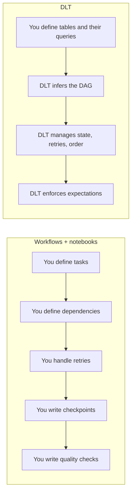
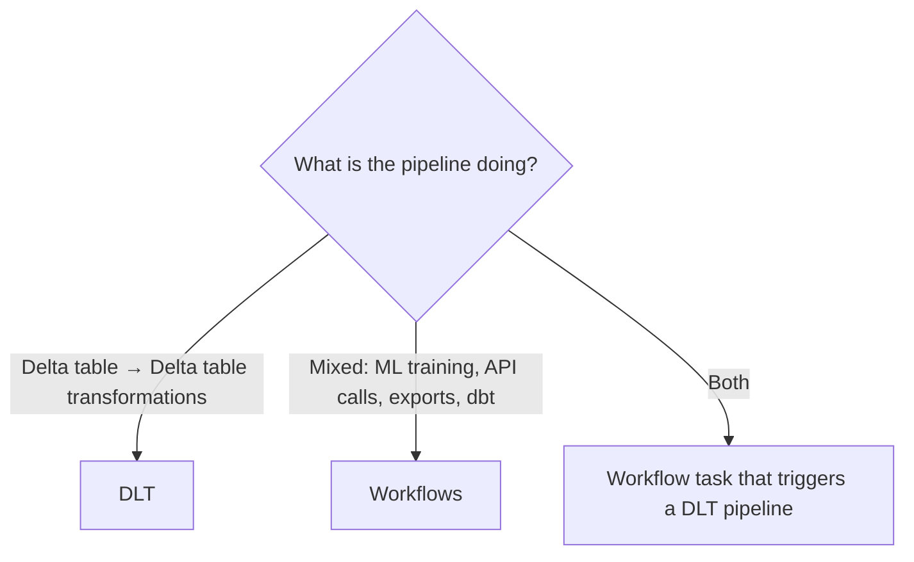

# 13 – Delta Live Tables (DLT)

> **Naming note:** Databricks has rebranded DLT as **Lakeflow Declarative
> Pipelines**. The concepts, decorators, and SQL syntax in this topic are the
> same; you will see both names in documentation, the UI, and job definitions.

---

## The Core Idea

In everything so far you wrote **how** to build a pipeline: read this, transform
that, write there, in this order, with these retries.

DLT flips it. You declare **what** each table should contain, and the framework
figures out the rest.



```text
Workflows orchestrate ANY task.
DLT specialises in building Delta tables from other Delta tables.
```

---

## Reading Order

| # | File | What you learn |
|---|------|----------------|
| 1 | [dlt_fundamentals.md](dlt_fundamentals.md) | Datasets, the inferred DAG, your first pipeline |
| 2 | [expectations_and_quality.md](expectations_and_quality.md) | Declarative data quality |
| 3 | [streaming_tables_and_cdc.md](streaming_tables_and_cdc.md) | Streaming tables, materialized views, APPLY CHANGES |
| 4 | [production_pipelines.md](production_pipelines.md) | Configuration, deployment, monitoring, cost |
| 5 | [interview_questions.md](interview_questions.md) | Questions asked in interviews |

---

## When to Use DLT vs Workflows



```text
DLT strengths:  declarative, built-in quality, automatic dependency and state
                management, incremental refresh, lineage out of the box
DLT limits:     it builds tables — it is not a general task orchestrator
```

---

## Quick Revision

```text
Streaming table    → incremental, append-oriented, reads a stream once
Materialized view  → declaratively recomputed (incrementally where possible)
View               → temporary, not persisted

@dlt.table / @dlt.view   → Python decorators
CREATE STREAMING TABLE / MATERIALIZED VIEW → SQL

Expectations: expect | expect_or_drop | expect_or_fail
APPLY CHANGES INTO → CDC and SCD1/SCD2 without hand-written MERGE

Modes: triggered (batch) vs continuous
Event log = the pipeline's observability backbone
```
