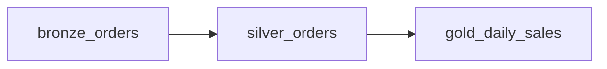
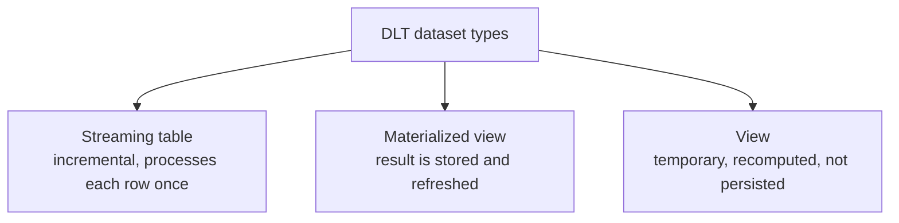
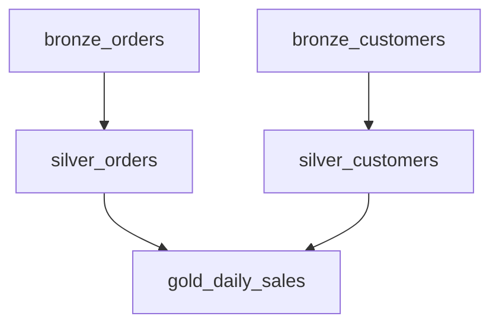
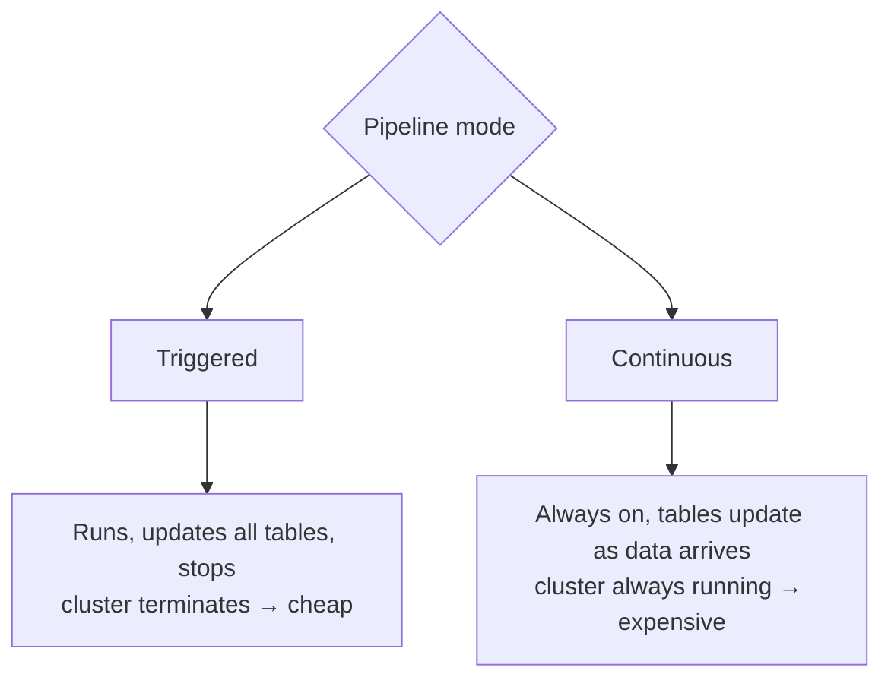
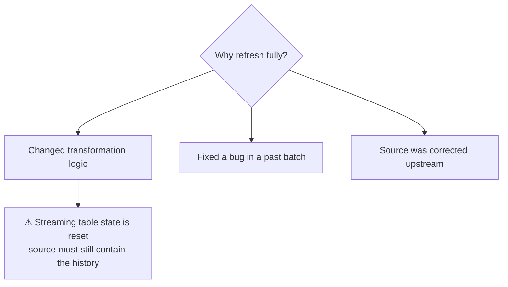

# DLT Fundamentals

## The Shift in Thinking

Here is the same silver table written both ways.

```python
# Imperative (Workflows + notebook): HOW
raw = spark.readStream.format("delta").table("main.bronze.orders_raw")
clean = raw.filter("order_id IS NOT NULL").withColumn("amount", F.col("amt").cast("decimal(18,2)"))
(clean.writeStream
    .option("checkpointLocation", "/Volumes/main/silver/_ckpt/orders")
    .trigger(availableNow=True)
    .toTable("main.silver.orders"))
```

```python
# Declarative (DLT): WHAT
import dlt
from pyspark.sql import functions as F

@dlt.table(name="silver_orders")
def silver_orders():
    return (dlt.read_stream("bronze_orders")
              .filter("order_id IS NOT NULL")
              .withColumn("amount", F.col("amt").cast("decimal(18,2)")))
```

```text
Gone from your code:
✘ checkpointLocation
✘ trigger configuration
✘ write mode and table creation
✘ dependency wiring
✘ retry handling

DLT owns all of it, because it knows the full graph.
```

---

## The Inferred DAG

You never declare dependencies. DLT reads your code, sees which datasets you
reference, and builds the graph itself.

```python
@dlt.table
def bronze_orders():
    return spark.readStream.format("cloudFiles")...

@dlt.table
def silver_orders():
    return dlt.read_stream("bronze_orders").filter(...)      # depends on bronze_orders

@dlt.table
def gold_daily_sales():
    return dlt.read("silver_orders").groupBy(...).agg(...)   # depends on silver_orders
```



```text
DLT then guarantees:
✔ Correct execution order
✔ Parallel execution where the graph allows
✔ Downstream tables are skipped if an upstream fails
✔ Full lineage in the UI and in Unity Catalog
```

Rename a table and every reference breaks at **validation time**, before any
compute runs — which is far better than discovering it at 3 AM.

---

## The Three Dataset Types



| Type | Persisted | Reads source | Use for |
|------|-----------|--------------|---------|
| **Streaming table** | Yes | Incrementally, once per row | Ingestion, append-only silver |
| **Materialized view** | Yes | Full or incremental recompute | Aggregations, joins, gold |
| **View** | No | Recomputed every reference | Intermediate logic, reuse within the pipeline |

### Streaming table

```python
@dlt.table(name="bronze_orders")
def bronze_orders():
    return (spark.readStream.format("cloudFiles")
        .option("cloudFiles.format", "json")
        .option("cloudFiles.schemaLocation", "/Volumes/main/_schema/orders")
        .load("/Volumes/main/landing/orders/"))
```

```sql
CREATE OR REFRESH STREAMING TABLE bronze_orders
AS SELECT * FROM STREAM read_files(
    '/Volumes/main/landing/orders/',
    format => 'json'
);
```

```text
Each source row is processed exactly once. Ideal when data only ever
arrives — ingestion and append-style silver tables.
```

### Materialized view

```python
@dlt.table(name="gold_daily_sales")
def gold_daily_sales():
    return (dlt.read("silver_orders")
        .groupBy("order_date", "country")
        .agg(F.sum("amount").alias("revenue")))
```

```sql
CREATE OR REFRESH MATERIALIZED VIEW gold_daily_sales AS
SELECT order_date, country, sum(amount) AS revenue
FROM LIVE.silver_orders
GROUP BY order_date, country;
```

```text
DLT recomputes the result, incrementally where it can determine that is
safe (enabled by Enzyme, the incremental refresh engine), fully otherwise.
You write the query; DLT decides the refresh strategy.
```

### View

```python
@dlt.view(name="valid_orders")
def valid_orders():
    return dlt.read("bronze_orders").filter("order_id IS NOT NULL")
```

```text
Not written to storage. Use it to break a long transformation into readable
steps without creating tables nobody queries.
```

---

## Reading Other Datasets

```python
dlt.read("table_name")          # batch read of a pipeline dataset
dlt.read_stream("table_name")   # streaming read of a pipeline dataset
spark.read.table("main.silver.x")       # a table OUTSIDE the pipeline
spark.readStream.table("main.silver.x") # streaming read outside the pipeline
```

```sql
-- SQL: LIVE. prefix refers to datasets in this pipeline
SELECT * FROM LIVE.silver_orders;
SELECT * FROM STREAM(LIVE.bronze_orders);   -- streaming read
```

```text
The LIVE. prefix (or dlt.read) is what creates the dependency edge.
Referencing the physical table name directly bypasses the DAG, and you
lose ordering guarantees. Use LIVE / dlt.read for in-pipeline datasets.
```

---

## A Complete Medallion Pipeline

```python
import dlt
from pyspark.sql import functions as F

# ---------- BRONZE ----------
@dlt.table(
    name="bronze_orders",
    comment="Raw orders exactly as delivered, plus ingestion metadata",
    table_properties={"quality": "bronze", "delta.autoOptimize.optimizeWrite": "true"},
)
def bronze_orders():
    return (spark.readStream.format("cloudFiles")
        .option("cloudFiles.format", "json")
        .option("cloudFiles.inferColumnTypes", "false")
        .option("cloudFiles.schemaEvolutionMode", "rescue")
        .load(spark.conf.get("source_path"))
        .withColumn("_ingested_at", F.current_timestamp())
        .withColumn("_source_file", F.col("_metadata.file_path")))

@dlt.table(name="bronze_customers")
def bronze_customers():
    return (spark.readStream.format("cloudFiles")
        .option("cloudFiles.format", "csv")
        .option("header", "true")
        .load(spark.conf.get("customer_path")))

# ---------- SILVER ----------
@dlt.table(name="silver_orders", comment="Typed, validated orders")
@dlt.expect_or_drop("valid_order_id", "order_id IS NOT NULL")
@dlt.expect_or_drop("non_negative_amount", "amount >= 0")
@dlt.expect("recent_date", "order_date >= '2020-01-01'")
def silver_orders():
    return (dlt.read_stream("bronze_orders").select(
        F.col("ord_id").cast("bigint").alias("order_id"),
        F.trim("cust").cast("int").alias("customer_id"),
        F.col("amt").cast("decimal(18,2)").alias("amount"),
        F.to_date("dt", "dd/MM/yyyy").alias("order_date"),
        F.upper(F.trim("status")).alias("status"),
        "_ingested_at", "_source_file"))

@dlt.table(name="silver_customers")
@dlt.expect_or_drop("valid_customer", "customer_id IS NOT NULL")
def silver_customers():
    return (dlt.read_stream("bronze_customers").select(
        F.col("customer_id").cast("int").alias("customer_id"),
        F.col("name"),
        F.upper("country").alias("country"),
        F.upper("segment").alias("segment")))

# ---------- GOLD ----------
@dlt.table(
    name="gold_daily_sales",
    comment="Daily completed-order revenue by country and segment",
    partition_cols=["order_date"],
)
def gold_daily_sales():
    orders = dlt.read("silver_orders").filter("status = 'COMPLETED'")
    customers = dlt.read("silver_customers")
    return (orders.join(customers, "customer_id")
        .groupBy("order_date", "country", "segment")
        .agg(F.count("*").alias("order_count"),
             F.sum("amount").alias("total_revenue"),
             F.avg("amount").alias("avg_order_value")))
```



That DAG is never declared anywhere. DLT derived it from the `dlt.read` calls.

---

## The Same Pipeline in SQL

```sql
CREATE OR REFRESH STREAMING TABLE bronze_orders
COMMENT 'Raw orders as delivered'
TBLPROPERTIES ('quality' = 'bronze')
AS SELECT *, current_timestamp() AS _ingested_at, _metadata.file_path AS _source_file
   FROM STREAM read_files('/Volumes/main/landing/orders/', format => 'json');

CREATE OR REFRESH STREAMING TABLE silver_orders (
    CONSTRAINT valid_order_id EXPECT (order_id IS NOT NULL) ON VIOLATION DROP ROW,
    CONSTRAINT non_negative EXPECT (amount >= 0) ON VIOLATION DROP ROW
)
AS SELECT
    CAST(ord_id AS BIGINT)            AS order_id,
    CAST(trim(cust) AS INT)           AS customer_id,
    CAST(amt AS DECIMAL(18,2))        AS amount,
    to_date(dt, 'dd/MM/yyyy')         AS order_date,
    upper(trim(status))               AS status,
    _ingested_at, _source_file
FROM STREAM(LIVE.bronze_orders);

CREATE OR REFRESH MATERIALIZED VIEW gold_daily_sales AS
SELECT o.order_date, c.country, c.segment,
       count(*) AS order_count, sum(o.amount) AS total_revenue
FROM LIVE.silver_orders o
JOIN LIVE.silver_customers c USING (customer_id)
WHERE o.status = 'COMPLETED'
GROUP BY o.order_date, c.country, c.segment;
```

```text
Python and SQL are equally capable for most pipelines.
Choose SQL when the team is SQL-first; choose Python when you need
loops, parameterisation, or metadata-driven table generation.
```

---

## Metadata-Driven Tables in Python

The strongest argument for the Python API: generate tables in a loop.

```python
import dlt

TABLES = [
    {"name": "orders",    "path": "/Volumes/main/landing/orders/",    "format": "json"},
    {"name": "customers", "path": "/Volumes/main/landing/customers/", "format": "csv"},
    {"name": "products",  "path": "/Volumes/main/landing/products/",  "format": "json"},
]

for cfg in TABLES:
    def make_table(cfg=cfg):        # bind cfg per iteration
        @dlt.table(name=f"bronze_{cfg['name']}")
        def _():
            return (spark.readStream.format("cloudFiles")
                .option("cloudFiles.format", cfg["format"])
                .option("cloudFiles.inferColumnTypes", "false")
                .load(cfg["path"]))
    make_table()
```

```text
Fifty source tables become a config list, not fifty near-identical files.
Note the cfg=cfg default argument — without it, every closure captures
the last loop value, a classic Python bug.
```

---

## Pipeline Settings That Matter

```json
{
  "name": "retail_medallion",
  "catalog": "main",
  "schema": "retail",
  "continuous": false,
  "development": true,
  "photon": true,
  "channel": "CURRENT",
  "libraries": [
    {"notebook": {"path": "/Repos/prod/dlt/bronze_silver"}},
    {"notebook": {"path": "/Repos/prod/dlt/gold"}}
  ],
  "configuration": {
    "source_path": "/Volumes/main/landing/orders/",
    "customer_path": "/Volumes/main/landing/customers/"
  },
  "clusters": [
    {"label": "default", "autoscale": {"min_workers": 1, "max_workers": 5, "mode": "ENHANCED"}}
  ]
}
```

```python
# read a configuration value inside the pipeline
source = spark.conf.get("source_path")
```

| Setting | Effect |
|---------|--------|
| `catalog` / `schema` | Where tables are published in Unity Catalog |
| `continuous` | `false` = triggered (batch), `true` = always-on |
| `development` | Keeps the cluster warm and skips full retries — dev only |
| `photon` | Vectorised engine |
| `channel` | `CURRENT` (stable) or `PREVIEW` |
| `configuration` | Key/value parameters read with `spark.conf.get` |

---

## Triggered vs Continuous



```text
Triggered + a schedule is the right default, exactly as with
availableNow in plain Structured Streaming.

Use continuous only when the latency requirement genuinely justifies
a 24/7 cluster.
```

---

## Full Refresh vs Incremental Update

```text
Update (default)      → process only new data; streaming tables keep their state
Full refresh          → clear state and reprocess everything from the source
Full refresh selection → do it for specific tables only
```



```text
Danger: a full refresh of a streaming table whose source files have been
archived will lose data. Keep bronze retention aligned with the possibility
of a full refresh — the same rule as topic 10.
```

---

## What DLT Gives You for Free

```text
✔ Dependency resolution and correct ordering
✔ Parallel execution of independent branches
✔ Checkpoint and state management
✔ Automatic table creation and schema handling
✔ Retries with backoff
✔ Data quality metrics per expectation
✔ Lineage in Unity Catalog
✔ An event log of every run, table, and expectation
✔ Incremental refresh of materialized views where provable
```

```text
What you still own:
✘ The correctness of your business logic
✘ Cost decisions (continuous vs triggered, cluster size)
✘ Source retention for full refreshes
✘ Deciding which expectations should drop, warn, or fail
```

---

## Common Interview Questions

### What is Delta Live Tables?

A declarative framework for building Delta pipelines: you define datasets and
their queries, and DLT infers the dependency graph, manages state and
checkpoints, enforces data quality expectations, and handles retries and
incremental refresh.

### How does DLT know the order to run tables in?

It parses the pipeline code, records every `dlt.read` / `LIVE.` reference, and
builds a DAG from those edges. Dependencies are never declared manually.

### Streaming table vs materialized view vs view?

A streaming table processes each source row exactly once and is ideal for
ingestion. A materialized view stores a query result and is refreshed
(incrementally where possible). A view is not persisted and is recomputed
wherever it is referenced.

### Triggered vs continuous mode?

Triggered runs the pipeline, updates all tables, and stops, so compute
terminates. Continuous keeps the pipeline and its cluster running so tables
update as data arrives.

### What does development mode do?

Keeps the cluster running between updates and disables full retry behaviour, to
make iteration fast. It must be off in production.

### When is a full refresh dangerous?

When a streaming table's source data has been archived or expired: clearing state
and reprocessing will not find the historical records.

### What does DLT not do?

It builds tables. It is not a general orchestrator — ML training, API calls,
exports, and multi-system flows belong in Workflows, which can trigger a DLT
pipeline as one task.

---

## Quick Revision

```text
Declarative: you define WHAT each table contains, DLT handles HOW

Dataset types:
@dlt.table + readStream  → streaming table (each row once)
@dlt.table + read        → materialized view (refreshed, incrementally if provable)
@dlt.view                → not persisted

References create the DAG:
dlt.read / dlt.read_stream  |  LIVE.table / STREAM(LIVE.table)

Settings: catalog, schema, continuous, development, photon, configuration

Modes:
triggered (default, cheap) | continuous (always on)
update (incremental) | full refresh (resets state — check source retention)

Free: ordering, parallelism, checkpoints, retries, quality metrics, lineage
Yours: business logic, cost choices, source retention, expectation severity
```
