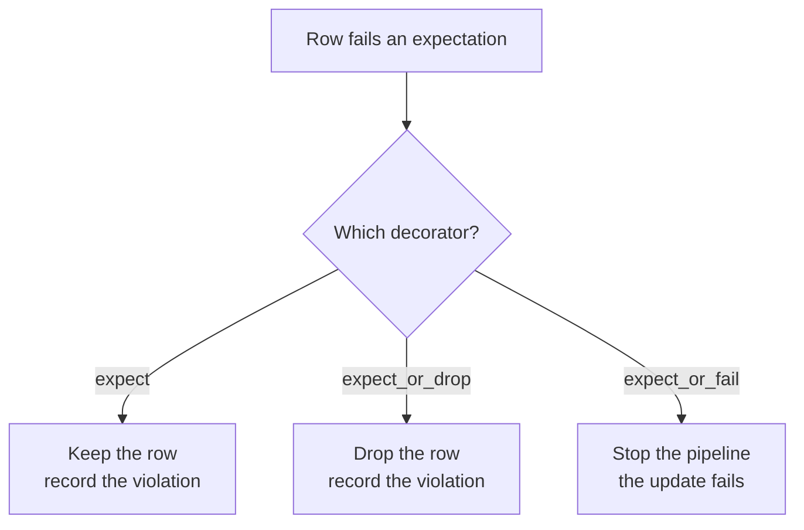
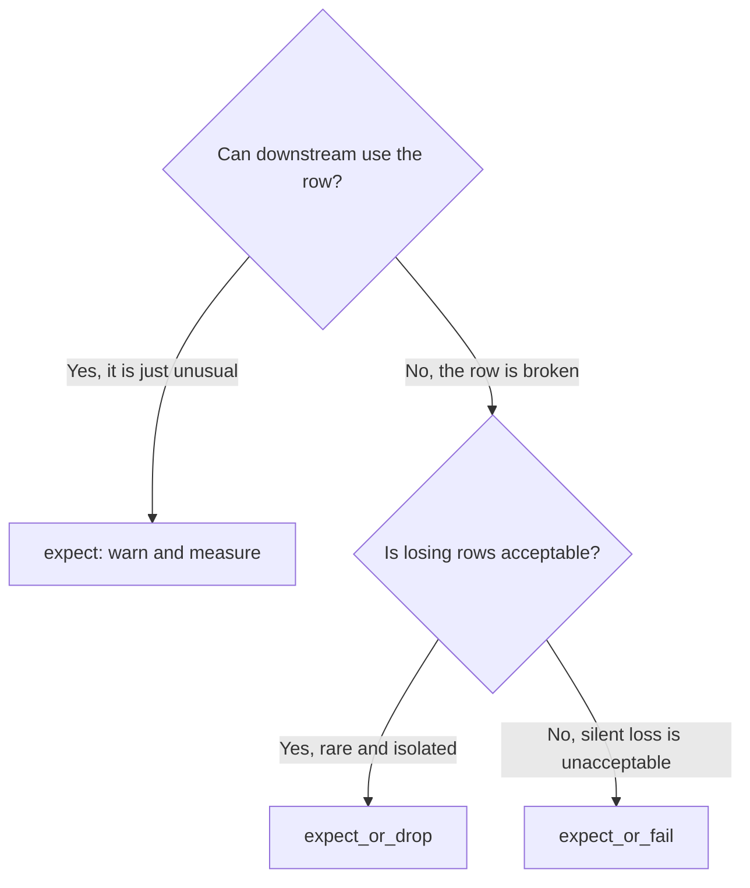
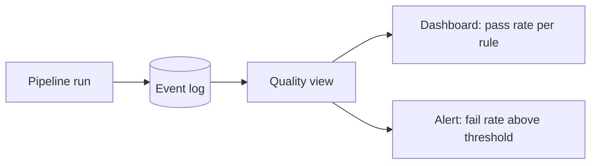
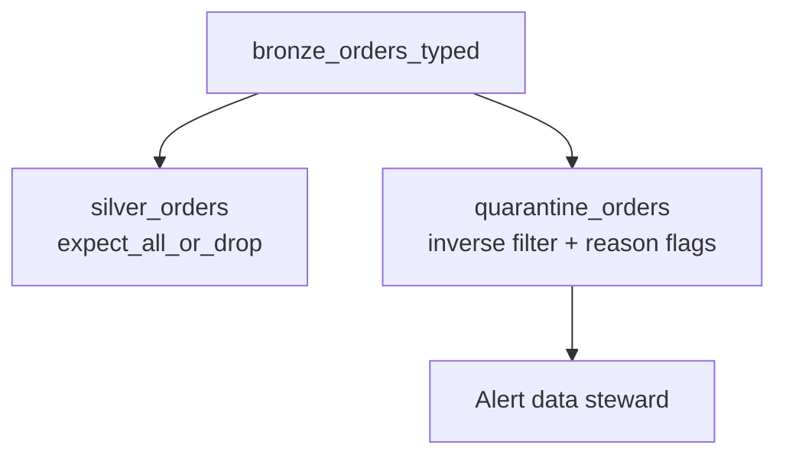

# Expectations and Data Quality

## The Idea

In topic 10 you wrote validation by hand: filter valid rows, tag invalid ones,
write them to quarantine, count the rejects, raise if the rate was too high.

DLT turns all of that into a declaration attached to the table.

```python
@dlt.table
@dlt.expect_or_drop("valid_order_id", "order_id IS NOT NULL")
def silver_orders():
    return dlt.read_stream("bronze_orders")
```

```text
The rule lives next to the table it protects, and DLT records
how many rows passed and failed on every single run.
```

---

## The Three Severities



| Decorator | Bad row | Pipeline | Use when |
|-----------|---------|----------|----------|
| `@dlt.expect` | Kept | Continues | You want visibility, not enforcement |
| `@dlt.expect_or_drop` | Dropped | Continues | The row is unusable but the rest is fine |
| `@dlt.expect_or_fail` | — | **Fails** | The violation means the data cannot be trusted at all |

```python
import dlt

@dlt.table(name="silver_orders")
# warn only — track how often it happens
@dlt.expect("reasonable_amount", "amount < 1000000")
# drop the row — it cannot be used downstream
@dlt.expect_or_drop("valid_order_id", "order_id IS NOT NULL")
@dlt.expect_or_drop("non_negative", "amount >= 0")
# fail the pipeline — something is badly wrong upstream
@dlt.expect_or_fail("has_currency", "currency IS NOT NULL")
def silver_orders():
    return dlt.read_stream("bronze_orders").select(...)
```

```sql
CREATE OR REFRESH STREAMING TABLE silver_orders (
    CONSTRAINT reasonable_amount EXPECT (amount < 1000000),
    CONSTRAINT valid_order_id    EXPECT (order_id IS NOT NULL) ON VIOLATION DROP ROW,
    CONSTRAINT has_currency      EXPECT (currency IS NOT NULL) ON VIOLATION FAIL UPDATE
)
AS SELECT ... FROM STREAM(LIVE.bronze_orders);
```

---

## Choosing the Right Severity



```text
Practical defaults:

expect          → business-plausibility checks (amount < 1M, date not in future)
expect_or_drop  → structural problems (null key, unparseable date)
expect_or_fail  → contract violations (a required column is entirely missing,
                  or a foreign key that must always resolve)
```

```text
Warning about expect_or_fail: it stops the whole pipeline.
Use it where a bad load is worse than no load — financial reporting,
regulatory feeds. Use it sparingly elsewhere, or a single malformed
vendor row halts everything at 3 AM.
```

---

## Multiple Expectations at Once

```python
@dlt.table
@dlt.expect_all({
    "valid_order_id":  "order_id IS NOT NULL",
    "valid_customer":  "customer_id IS NOT NULL",
    "valid_amount":    "amount >= 0",
    "valid_date":      "order_date <= current_date()",
})
def silver_orders():
    ...

# and the drop / fail variants
@dlt.expect_all_or_drop({...})
@dlt.expect_all_or_fail({...})
```

```text
expect_all_or_drop drops a row if ANY rule in the dictionary fails.
Name each rule meaningfully — the name is what appears in the metrics,
and "constraint_1" tells you nothing at 3 AM.
```

---

## Where the Metrics Go

Every expectation result is written to the **event log**, which is what turns
quality from a hope into a measurement.

```sql
-- Expectation results for the latest update
SELECT
    timestamp,
    details:flow_progress:data_quality:expectations
FROM event_log(TABLE(main.retail.gold_daily_sales))
WHERE event_type = 'flow_progress'
  AND details:flow_progress:data_quality IS NOT NULL
ORDER BY timestamp DESC;
```

A more usable shape:

```sql
CREATE OR REPLACE VIEW main.retail.v_dlt_quality AS
SELECT
    timestamp,
    details:flow_progress:status                        AS status,
    explode(from_json(
        details:flow_progress:data_quality:expectations,
        'ARRAY<STRUCT<name STRING, dataset STRING, passed_records BIGINT, failed_records BIGINT>>'
    )) AS e
FROM event_log(TABLE(main.retail.gold_daily_sales))
WHERE details:flow_progress:data_quality:expectations IS NOT NULL;

SELECT
    date(timestamp)                                    AS day,
    e.dataset,
    e.name                                             AS expectation,
    sum(e.passed_records)                              AS passed,
    sum(e.failed_records)                              AS failed,
    round(100.0 * sum(e.failed_records) /
          nullif(sum(e.passed_records) + sum(e.failed_records), 0), 3) AS fail_pct
FROM main.retail.v_dlt_quality
GROUP BY 1, 2, 3
ORDER BY fail_pct DESC;
```



That alert is the piece most hand-rolled quality frameworks never get around to
building.

---

## Quarantine with DLT

`expect_or_drop` discards rows. Often you want to keep them for investigation.
The pattern is two tables over the same source.

```python
import dlt
from pyspark.sql import functions as F

RULES = {
    "valid_order_id": "order_id IS NOT NULL",
    "non_negative":   "amount >= 0",
    "valid_date":     "order_date IS NOT NULL",
}
VALID = " AND ".join(f"({r})" for r in RULES.values())

@dlt.table(name="silver_orders", comment="Rows passing all quality rules")
@dlt.expect_all_or_drop(RULES)
def silver_orders():
    return dlt.read_stream("bronze_orders_typed")

@dlt.table(name="quarantine_orders", comment="Rows failing at least one rule")
def quarantine_orders():
    df = dlt.read_stream("bronze_orders_typed").filter(f"NOT ({VALID})")
    for name, rule in RULES.items():
        df = df.withColumn(f"_fail_{name}", F.expr(f"NOT ({rule})"))
    return df.withColumn("_quarantined_at", F.current_timestamp())
```



```text
✔ Good rows flow downstream immediately
✔ Bad rows are preserved with a reason per rule
✔ Nothing is silently lost
```

---

## Expectations as a Data Contract

Well-named expectations document what the table promises.

```python
@dlt.table(
    name="gold_daily_sales",
    comment="Daily revenue by country. One row per date/country/segment. "
            "Revenue excludes cancelled orders."
)
@dlt.expect_or_fail("unique_grain",
    "true")   # enforced by the aggregation itself
@dlt.expect("no_future_dates", "order_date <= current_date()")
@dlt.expect("revenue_non_negative", "total_revenue >= 0")
@dlt.expect("plausible_daily_volume", "order_count BETWEEN 1 AND 1000000")
def gold_daily_sales():
    ...
```

```text
Reading the decorators tells a new engineer what "correct" means for this
table — without reading the transformation code.
```

### Referential integrity check

```python
@dlt.table(name="silver_orders_enriched")
@dlt.expect_or_drop("customer_exists", "customer_id IS NOT NULL AND country IS NOT NULL")
def silver_orders_enriched():
    orders = dlt.read_stream("silver_orders")
    customers = dlt.read("silver_customers")
    return orders.join(customers, "customer_id", "left")
```

```text
A left join plus an expectation on the joined column is how you detect
orphans declaratively: the count of failures IS your orphan count,
tracked automatically on every run.
```

---

## Freshness and Volume Expectations

Row-level rules cannot express "we received far too little data today". Add a
metrics table.

```python
@dlt.table(name="gold_ingestion_metrics")
def gold_ingestion_metrics():
    return (dlt.read("silver_orders")
        .groupBy(F.to_date("_ingested_at").alias("ingest_date"))
        .agg(F.count("*").alias("row_count"),
             F.countDistinct("_source_file").alias("file_count"),
             F.max("_ingested_at").alias("last_ingested_at")))
```

Then alert on it with Databricks SQL (topic 09), comparing against a rolling
baseline. Expectations handle the row; SQL alerts handle the batch.

---

## Comparing Approaches

| | Hand-written (topic 10) | DLT expectations |
|---|------------------------|------------------|
| Where rules live | Scattered in notebook code | Declared on the table |
| Metrics | You build them | Automatic, in the event log |
| History | You store it | Retained per run |
| Drop / fail behaviour | Custom `if` statements | Built-in severities |
| Quarantine | You write it | Two-table pattern |
| Visibility | Whatever you logged | Pipeline UI per run |

```text
DLT does not make quality rules smarter. It makes them
declared, measured, and impossible to quietly skip.
```

---

## Common Mistakes

```text
❌ expect_or_fail on a noisy rule → pipeline halts on one bad vendor row
❌ Unnamed or numbered expectations → metrics that nobody can interpret
❌ Dropping rows with no quarantine → silent data loss, same as before
❌ Rules that reference another table → expectations evaluate per row, not per join
❌ Treating a rising fail rate as "expected" → the alert becomes noise
❌ No expectations at all on gold → the layer consumers actually trust
```

---

## Common Interview Questions

### What are DLT expectations?

Declarative data quality rules attached to a dataset, evaluated per row, with
automatic pass/fail metrics recorded in the event log.

### What are the three severities?

`expect` keeps violating rows and records the violation, `expect_or_drop` removes
them, `expect_or_fail` fails the pipeline update.

### How do you keep bad rows for investigation?

Define a second table with the inverse filter, adding a flag column per failed
rule — the quarantine pattern — because `expect_or_drop` discards them.

### Where do expectation metrics go?

The pipeline event log, queryable with `event_log(TABLE(...))`, which lets you
build quality dashboards and alerts on pass rates over time.

### When would you use `expect_or_fail`?

When publishing bad data is worse than publishing nothing — regulatory or
financial feeds, or a contract violation such as a required column disappearing.

### How do you detect orphan foreign keys declaratively?

Left join the dimension and set an expectation that the joined column is not
null; the failure count is the orphan count, tracked every run.

### Can an expectation check row counts or freshness?

Not directly — expectations are row-level. Build a metrics table and alert on it
with Databricks SQL.

---

## Quick Revision

```text
@dlt.expect          → keep the row, record the violation
@dlt.expect_or_drop  → drop the row, record the violation
@dlt.expect_or_fail  → fail the pipeline update

Bulk forms: expect_all | expect_all_or_drop | expect_all_or_fail

SQL: CONSTRAINT <name> EXPECT (<cond>) [ON VIOLATION DROP ROW | FAIL UPDATE]

Metrics: event_log(TABLE(<table>)) → pass/fail counts per rule per run
Build a quality view → dashboard + alert on fail rate

Quarantine pattern:
table A: expect_all_or_drop(RULES)
table B: filter NOT(all rules) + a _fail_<rule> flag column each

Severity guide:
plausibility → expect
structural   → expect_or_drop
contract     → expect_or_fail (sparingly)

Name every expectation meaningfully — the name is the metric
```
