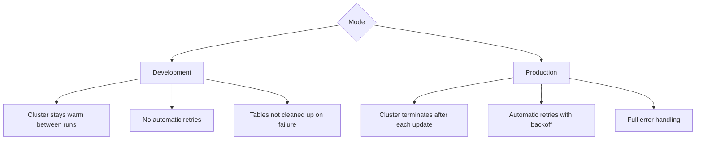
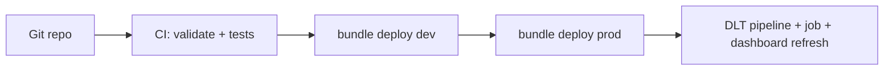
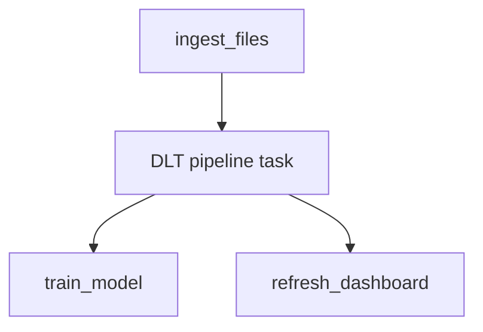
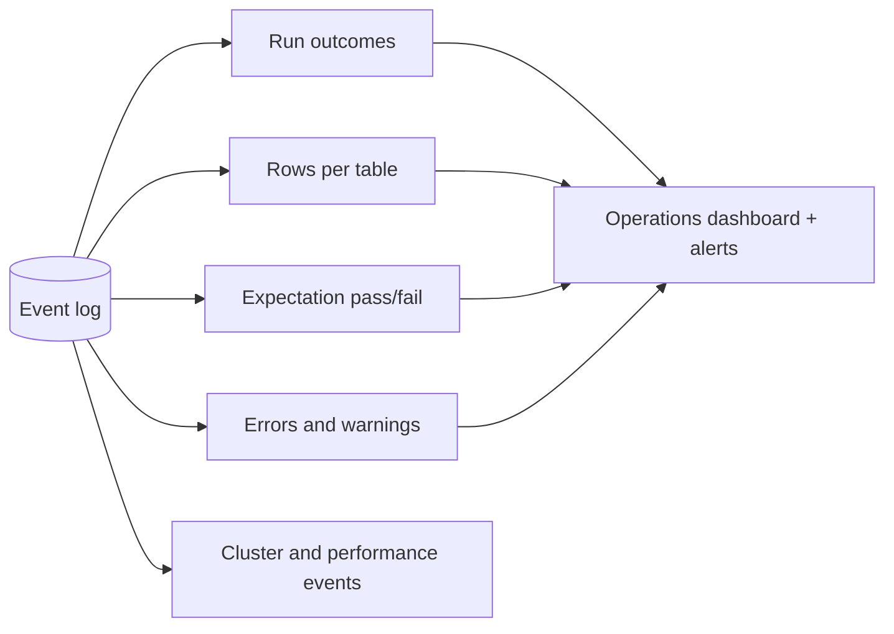
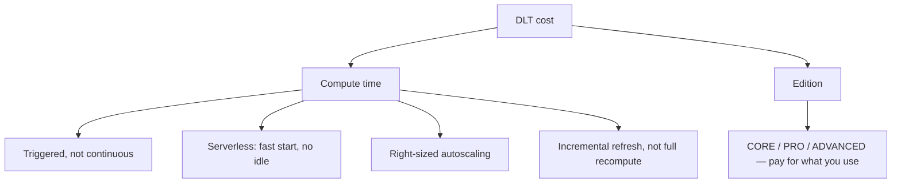
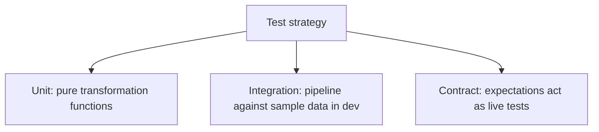
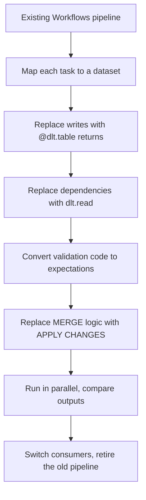

# DLT Pipelines in Production

## Pipeline Configuration

Everything DLT needs lives in the pipeline definition, not scattered across
notebooks.

```json
{
  "name": "retail_medallion_prod",
  "catalog": "main",
  "schema": "retail",
  "continuous": false,
  "development": false,
  "photon": true,
  "channel": "CURRENT",
  "edition": "ADVANCED",
  "serverless": true,
  "libraries": [
    {"notebook": {"path": "/Repos/prod/dlt/01_bronze"}},
    {"notebook": {"path": "/Repos/prod/dlt/02_silver"}},
    {"notebook": {"path": "/Repos/prod/dlt/03_gold"}}
  ],
  "configuration": {
    "env": "prod",
    "source_path": "/Volumes/main/landing/",
    "pipelines.trigger.interval": "10 minutes"
  },
  "notifications": [
    {
      "email_recipients": ["data-oncall@company.com"],
      "alerts": ["on-update-failure", "on-flow-failure", "on-update-fatal-failure"]
    }
  ]
}
```

| Setting | Why it matters |
|---------|----------------|
| `catalog` / `schema` | Where tables are published; drives Unity Catalog governance |
| `development` | **Must be false in prod** — dev mode skips retries and keeps clusters warm |
| `edition` | `CORE` / `PRO` / `ADVANCED` — ADVANCED includes expectations |
| `serverless` | No cluster configuration, fast startup |
| `channel` | `CURRENT` for stability, `PREVIEW` to test upcoming behaviour |
| `configuration` | Parameters read via `spark.conf.get` |
| `notifications` | Failure alerts, per event type |

---

## Development vs Production Mode



```text
Development mode makes iteration fast: you change code, re-run, and the
cluster is already there.

In production it is a serious problem — no retries means one transient
cloud error fails the whole update, and a warm cluster bills all night.
```

---

## Deployment with Asset Bundles

```yaml
# databricks.yml
bundle:
  name: retail_platform

resources:
  pipelines:
    retail_medallion:
      name: "retail_medallion_${bundle.target}"
      catalog: ${var.catalog}
      schema: retail
      photon: true
      serverless: true
      libraries:
        - notebook: { path: ./dlt/01_bronze.py }
        - notebook: { path: ./dlt/02_silver.py }
        - notebook: { path: ./dlt/03_gold.py }
      configuration:
        env: ${bundle.target}
        source_path: ${var.landing_path}

  jobs:
    retail_daily:
      name: "retail_daily_${bundle.target}"
      schedule:
        quartz_cron_expression: "0 0 6 * * ?"
        timezone_id: "UTC"
      tasks:
        - task_key: run_pipeline
          pipeline_task:
            pipeline_id: ${resources.pipelines.retail_medallion.id}
        - task_key: refresh_dashboard
          depends_on: [{ task_key: run_pipeline }]
          sql_task:
            warehouse_id: ${var.warehouse_id}
            dashboard: { dashboard_id: ${var.dashboard_id} }

targets:
  dev:
    default: true
    variables:
      catalog: dev_catalog
      landing_path: /Volumes/dev_catalog/landing/
    resources:
      pipelines:
        retail_medallion:
          development: true
      jobs:
        retail_daily:
          schedule: { pause_status: PAUSED }

  prod:
    variables:
      catalog: main
      landing_path: /Volumes/main/landing/
    run_as:
      service_principal_name: sp-data-platform
    resources:
      pipelines:
        retail_medallion:
          development: false
```

```bash
databricks bundle validate
databricks bundle deploy --target dev
databricks bundle deploy --target prod
```



---

## Orchestrating DLT from Workflows

DLT builds tables. Anything else — exports, ML, notifications, dbt — belongs in a
Workflow that calls the pipeline as one task.

```yaml
tasks:
  - task_key: ingest_files
    notebook_task: { notebook_path: ./prep/land_files }

  - task_key: dlt_medallion
    depends_on: [{ task_key: ingest_files }]
    pipeline_task:
      pipeline_id: "abc-123-def"
      full_refresh: false

  - task_key: train_model
    depends_on: [{ task_key: dlt_medallion }]
    notebook_task: { notebook_path: ./ml/train }

  - task_key: refresh_dashboard
    depends_on: [{ task_key: dlt_medallion }]
    sql_task:
      warehouse_id: "wh-456"
      dashboard: { dashboard_id: "dash-789" }
```



```text
This hybrid is the standard production shape:
DLT owns table building, Workflows owns everything around it.
```

---

## The Event Log: Your Observability Backbone

Every pipeline writes a structured event log. It is the single most useful thing
in DLT operations and the most underused.

```sql
-- Latest updates and their outcome
SELECT
    timestamp,
    details:update_progress:state AS state,
    details:update_progress:update_id AS update_id
FROM event_log(TABLE(main.retail.gold_daily_sales))
WHERE event_type = 'update_progress'
ORDER BY timestamp DESC
LIMIT 20;
```

```sql
-- Rows written per table per run
SELECT
    timestamp,
    details:flow_progress:metrics:num_output_rows AS rows_written,
    origin.flow_name                              AS table_name,
    details:flow_progress:status                  AS status
FROM event_log(TABLE(main.retail.gold_daily_sales))
WHERE event_type = 'flow_progress'
  AND details:flow_progress:metrics IS NOT NULL
ORDER BY timestamp DESC;
```

```sql
-- Expectation results (see expectations_and_quality.md for the full view)
SELECT timestamp, details:flow_progress:data_quality:expectations
FROM event_log(TABLE(main.retail.gold_daily_sales))
WHERE details:flow_progress:data_quality IS NOT NULL;
```

```sql
-- Errors, with the message
SELECT timestamp, message, details:flow_progress:status
FROM event_log(TABLE(main.retail.gold_daily_sales))
WHERE level = 'ERROR'
ORDER BY timestamp DESC;
```



Build a persistent view over it so alerts and dashboards do not depend on the UI:

```sql
CREATE OR REPLACE VIEW main.retail.v_pipeline_runs AS
SELECT
    date(timestamp)                                AS run_date,
    details:update_progress:update_id              AS update_id,
    details:update_progress:state                  AS state,
    timestamp
FROM event_log(TABLE(main.retail.gold_daily_sales))
WHERE event_type = 'update_progress';
```

---

## Monitoring Checklist

```text
✔ Pipeline failure notifications configured (on-update-failure, on-flow-failure)
✔ Expectation fail rate dashboarded and alerted
✔ Rows-written per table trended, with an anomaly alert
✔ Table freshness alert (topic 09) — catches a paused pipeline
✔ Event log queried into a persistent view for history
✔ Cost tracked via system.billing.usage, attributed to the pipeline
```

```sql
-- Freshness: catches a pipeline that quietly stopped running
SELECT max(_ingested_at) AS last_load,
       datediff(minute, max(_ingested_at), current_timestamp()) AS minutes_stale
FROM main.retail.bronze_orders;
```

---

## Cost Management



```text
Biggest wins, in order:

1. Continuous → triggered on a schedule
   An always-on pipeline that could run every 15 minutes is the
   single most common source of surprise DLT cost.

2. Avoid accidental full recomputes
   A current_timestamp() column in a materialized view can turn an
   incremental refresh into a full table rebuild every run.

3. Serverless
   No idle cluster time, fast startup, no configuration to get wrong.

4. Development mode left on in production
   Keeps clusters warm indefinitely.
```

```sql
SELECT usage_metadata.dlt_pipeline_id,
       round(sum(usage_quantity), 1) AS dbus
FROM system.billing.usage
WHERE usage_date >= current_date() - INTERVAL 30 DAYS
  AND usage_metadata.dlt_pipeline_id IS NOT NULL
GROUP BY 1 ORDER BY dbus DESC;
```

---

## Testing DLT Pipelines



```python
# Extract logic so it is testable outside DLT
def clean_orders(df):
    return (df.select(
        F.col("ord_id").cast("bigint").alias("order_id"),
        F.col("amt").cast("decimal(18,2)").alias("amount"))
      .filter("order_id IS NOT NULL"))

@dlt.table(name="silver_orders")
@dlt.expect_or_drop("valid_id", "order_id IS NOT NULL")
def silver_orders():
    return clean_orders(dlt.read_stream("bronze_orders"))
```

```python
# test_transforms.py — runs in CI without a DLT pipeline
def test_clean_orders_drops_nulls(spark):
    src = spark.createDataFrame([("1", "10.00"), (None, "5.00")], ["ord_id", "amt"])
    out = clean_orders(src)
    assert out.count() == 1
```

```text
The decorator is thin; the logic is a plain function. Keep it that way
and your pipeline becomes testable like ordinary code.
```

---

## Migrating an Existing Pipeline to DLT



```text
What disappears in migration:
✘ checkpointLocation management
✘ Explicit task dependencies
✘ Manual MERGE for CDC and SCD2
✘ Hand-rolled quality checks and quarantine counting
✘ Retry configuration

What needs attention:
⚠ Full refresh requires source history to still exist
⚠ Streaming tables need append-only sources
⚠ Not everything belongs in DLT — keep non-table work in Workflows
```

---

## Production Readiness Checklist

```text
Configuration
✔ development = false
✔ catalog and schema set, publishing to Unity Catalog
✔ Serverless or right-sized autoscaling
✔ Triggered mode unless latency truly demands continuous
✔ Configuration values parameterised per environment

Deployment
✔ Pipeline defined in Git via Asset Bundles
✔ Separate dev / staging / prod targets with different catalogs
✔ Runs as a service principal
✔ Orchestrated from a Workflow if other tasks are involved

Quality
✔ Expectations on every silver and gold table
✔ Quarantine tables for dropped rows
✔ Expectation metrics dashboarded and alerted

Observability
✔ Failure notifications configured
✔ Event log queried into persistent views
✔ Freshness and volume alerts
✔ Cost tracked per pipeline

Resilience
✔ Bronze retention long enough for a full refresh
✔ Documented full-refresh procedure and its blast radius
✔ Transformation logic extracted into testable functions
```

---

## Common Interview Questions

### How do you deploy a DLT pipeline to production?

Defined in Git as an Asset Bundle with per-target catalogs and settings, deployed
via `databricks bundle deploy`, running as a service principal with
`development: false`.

### What does development mode change?

It keeps clusters warm between updates and disables automatic retries, which
speeds up iteration but is unsafe and expensive in production.

### How do you orchestrate DLT alongside other work?

With a Workflow: a `pipeline_task` runs the DLT pipeline as one node, with
notebook, SQL, or ML tasks before and after it.

### What is the event log and what do you use it for?

A structured log of every pipeline event — update state, rows written per flow,
expectation results, errors — queryable with `event_log(TABLE(...))` and used to
build quality and operations dashboards and alerts.

### How do you monitor DLT data quality over time?

Query expectation results from the event log into a persistent view, then
dashboard pass rates per rule and alert when a fail rate crosses a threshold.

### What are the main DLT cost drivers?

Continuous mode instead of triggered, accidental full recomputes of materialized
views, oversized clusters, and development mode left enabled in production.

### How do you test DLT pipelines?

Extract transformations into plain functions unit-tested in CI, run the pipeline
against sample data in a dev catalog, and treat expectations as continuous
contract tests in production.

---

## Quick Revision

```text
Config: catalog | schema | development=false | serverless | triggered | notifications

Deployment: Asset Bundles, per-target catalogs, service principal
Orchestration: Workflow pipeline_task + surrounding notebook/SQL tasks

Event log = observability backbone
event_log(TABLE(<any pipeline table>))
→ update state | rows written | expectation results | errors

Monitor: failures | expectation fail rate | row-count anomaly | freshness | cost

Cost: triggered not continuous | avoid full recomputes | serverless |
      development=false

Testing: pure functions in CI + dev-catalog runs + expectations as live contracts
```
