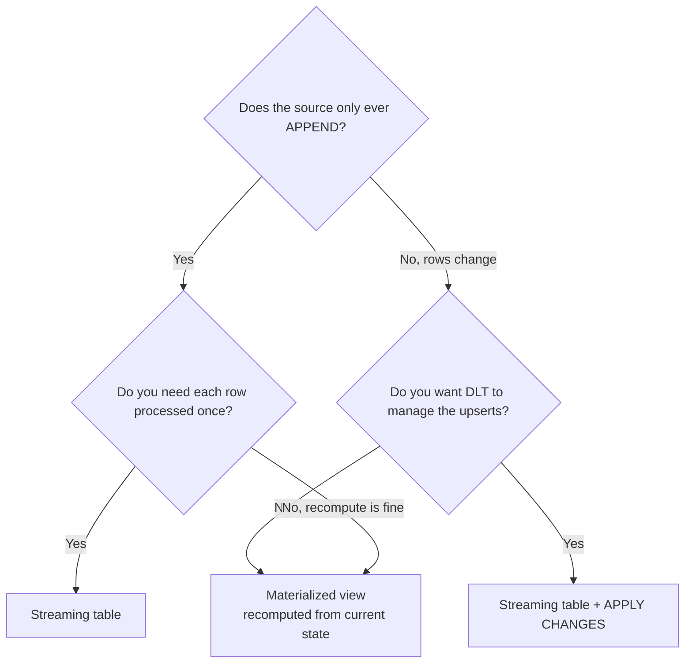
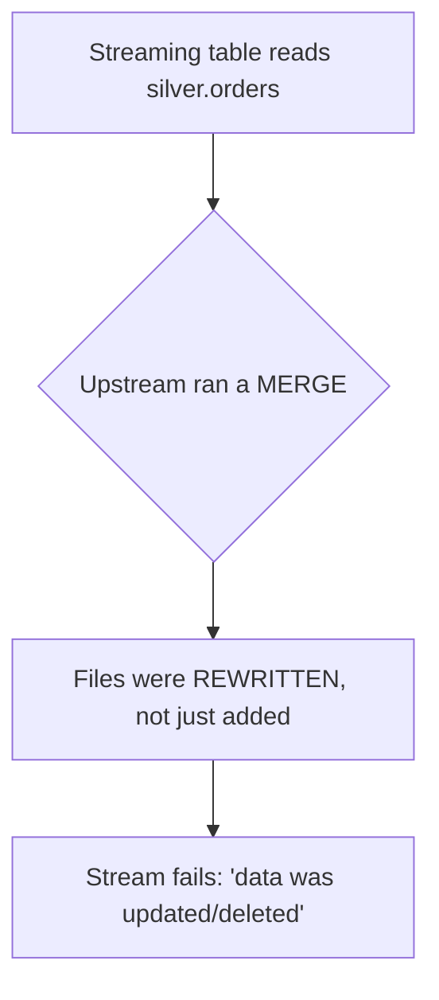
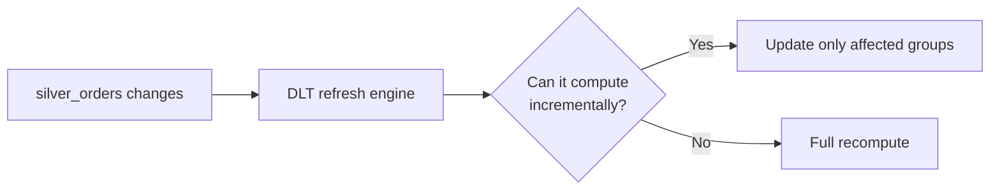
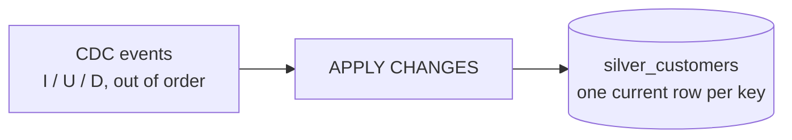
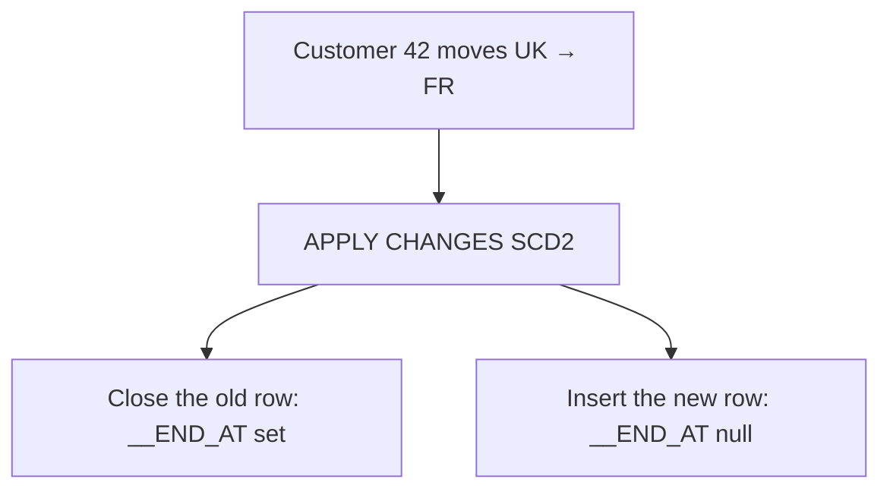
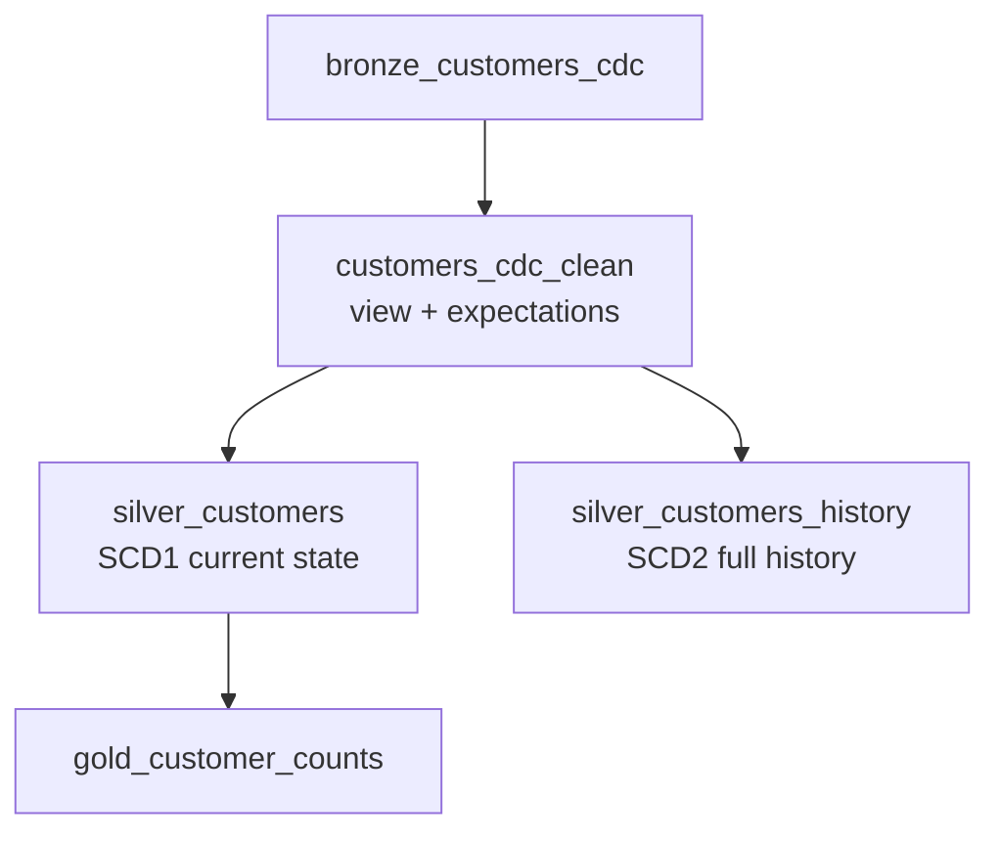

# Streaming Tables, Materialized Views, and CDC

## Choosing the Right Dataset Type

This is the decision that determines cost, correctness, and refresh behaviour.



| | Streaming table | Materialized view |
|---|-----------------|-------------------|
| Processes | New rows only, once | The whole query result |
| Source must be | Append-only (or use `skipChangeCommits`) | Anything |
| State | Checkpointed | Managed by the refresh engine |
| Handles updates in source | No (unless APPLY CHANGES) | Yes, naturally |
| Cost profile | Proportional to new data | Proportional to recompute scope |
| Typical layer | Bronze, append silver | Gold aggregates, joins |

---

## Streaming Tables

```python
import dlt
from pyspark.sql import functions as F

@dlt.table(name="bronze_events")
def bronze_events():
    return (spark.readStream.format("cloudFiles")
        .option("cloudFiles.format", "json")
        .option("cloudFiles.schemaEvolutionMode", "rescue")
        .load("/Volumes/main/landing/events/")
        .withColumn("_ingested_at", F.current_timestamp()))
```

```sql
CREATE OR REFRESH STREAMING TABLE bronze_events
AS SELECT *, current_timestamp() AS _ingested_at
   FROM STREAM read_files('/Volumes/main/landing/events/', format => 'json');
```

```text
Guarantees: each source row contributes to the table exactly once.
DLT owns the checkpoint — you never configure one.
```

### The append-only constraint



```python
# Tolerate upstream rewrites
@dlt.table
def downstream():
    return (spark.readStream
        .option("skipChangeCommits", "true")
        .table("main.silver.orders"))
```

```text
skipChangeCommits ignores commits that update or delete, processing only
appends. It is the right answer when the upstream MERGE only corrects rows
you do not need to reprocess — and the wrong answer when those corrections
matter, in which case use a materialized view or Change Data Feed.
```

---

## Materialized Views

```python
@dlt.table(name="gold_daily_sales")
def gold_daily_sales():
    return (dlt.read("silver_orders")
        .filter("status = 'COMPLETED'")
        .groupBy("order_date", "country")
        .agg(F.sum("amount").alias("revenue"),
             F.count("*").alias("order_count")))
```



```text
DLT decides automatically. You do not choose, and you cannot force
incremental refresh — you can only write queries that make it possible.
```

### What helps incremental refresh

```text
✔ Deterministic expressions (no current_timestamp() in the output)
✔ Standard aggregations: sum, count, min, max, avg
✔ Inner and left joins on stable keys
✘ Non-deterministic functions (rand, current_date in a filter)
✘ Python UDFs
✘ Window functions over the whole table
```

```python
# ❌ forces full recompute every time
.withColumn("computed_at", F.current_timestamp())

# ✔ deterministic
.withColumn("order_month", F.trunc("order_date", "MM"))
```

That one line is a surprisingly common cause of a gold table recomputing five
terabytes every night.

---

## APPLY CHANGES INTO: CDC Without Hand-Written MERGE

The feature that saves the most code. It turns a stream of change events into a
correctly upserted table.

```python
import dlt

dlt.create_streaming_table("silver_customers")

dlt.apply_changes(
    target="silver_customers",
    source="bronze_customers_cdc",
    keys=["customer_id"],
    sequence_by="updated_at",             # ordering column
    apply_as_deletes="operation = 'DELETE'",
    apply_as_truncates="operation = 'TRUNCATE'",
    except_column_list=["operation", "_ingested_at"],
    stored_as_scd_type=1,
)
```

```sql
CREATE OR REFRESH STREAMING TABLE silver_customers;

APPLY CHANGES INTO LIVE.silver_customers
FROM STREAM(LIVE.bronze_customers_cdc)
KEYS (customer_id)
APPLY AS DELETE WHEN operation = 'DELETE'
SEQUENCE BY updated_at
COLUMNS * EXCEPT (operation, _ingested_at)
STORED AS SCD TYPE 1;
```



What it handles for you:

```text
✔ Out-of-order events — sequence_by picks the winner
✔ Multiple events per key in one batch — collapsed automatically
✔ Deletes — applied as real deletes
✔ Inserts vs updates — decided per key
✔ Idempotent reprocessing

All of which you wrote by hand in topic 10.
```

---

## SCD Type 2 in One Declaration

```python
dlt.apply_changes(
    target="silver_customers_history",
    source="bronze_customers_cdc",
    keys=["customer_id"],
    sequence_by="updated_at",
    apply_as_deletes="operation = 'DELETE'",
    except_column_list=["operation"],
    stored_as_scd_type=2,
    track_history_column_list=["country", "segment", "email"],
)
```

```sql
APPLY CHANGES INTO LIVE.silver_customers_history
FROM STREAM(LIVE.bronze_customers_cdc)
KEYS (customer_id)
SEQUENCE BY updated_at
STORED AS SCD TYPE 2
TRACK HISTORY ON (country, segment, email);
```

Result:

```text
customer_id | country | segment  | __START_AT | __END_AT
42          | UK      | STANDARD | 2024-01-01 | 2026-09-17
42          | FR      | PREMIUM  | 2026-09-18 | null
```



```text
Compare with the hand-written SCD2 MERGE in topic 10 —
the union trick with a null merge key, the is_current flag management.
This replaces all of it with one declaration.

track_history_column_list: only these columns create a new version.
Use it so a meaningless column update does not create history noise.
```

### Point-in-time queries

```sql
SELECT o.order_id, o.amount, c.country
FROM main.retail.silver_orders o
JOIN main.retail.silver_customers_history c
  ON o.customer_id = c.customer_id
 AND o.order_date >= c.__START_AT
 AND (c.__END_AT IS NULL OR o.order_date < c.__END_AT);
```

---

## Full CDC Pipeline Example

```python
import dlt
from pyspark.sql import functions as F

# 1. Land raw CDC events
@dlt.table(name="bronze_customers_cdc", comment="Raw CDC events from Debezium")
def bronze_customers_cdc():
    return (spark.readStream.format("cloudFiles")
        .option("cloudFiles.format", "json")
        .option("cloudFiles.schemaLocation", "/Volumes/main/_schema/cust_cdc")
        .load("/Volumes/main/landing/cdc/customers/")
        .withColumn("_ingested_at", F.current_timestamp()))

# 2. Parse and validate
@dlt.view(name="customers_cdc_clean")
@dlt.expect_or_drop("has_key", "customer_id IS NOT NULL")
@dlt.expect_or_drop("has_sequence", "updated_at IS NOT NULL")
def customers_cdc_clean():
    return dlt.read_stream("bronze_customers_cdc").select(
        F.col("payload.customer_id").cast("int").alias("customer_id"),
        F.col("payload.name").alias("name"),
        F.upper("payload.country").alias("country"),
        F.upper("payload.segment").alias("segment"),
        F.col("payload.email").alias("email"),
        F.col("op").alias("operation"),
        F.col("ts_ms").cast("timestamp").alias("updated_at"),
    )

# 3. Current state (SCD1)
dlt.create_streaming_table("silver_customers")
dlt.apply_changes(
    target="silver_customers",
    source="customers_cdc_clean",
    keys=["customer_id"],
    sequence_by="updated_at",
    apply_as_deletes="operation = 'd'",
    except_column_list=["operation"],
    stored_as_scd_type=1,
)

# 4. Full history (SCD2)
dlt.create_streaming_table("silver_customers_history")
dlt.apply_changes(
    target="silver_customers_history",
    source="customers_cdc_clean",
    keys=["customer_id"],
    sequence_by="updated_at",
    apply_as_deletes="operation = 'd'",
    except_column_list=["operation"],
    stored_as_scd_type=2,
    track_history_column_list=["country", "segment"],
)

# 5. Gold on top of current state
@dlt.table(name="gold_customer_counts")
def gold_customer_counts():
    return (dlt.read("silver_customers")
        .groupBy("country", "segment")
        .agg(F.count("*").alias("customers")))
```



Both SCD1 and SCD2 tables are built from the same validated stream — a pattern
that is awkward to write by hand and trivial here.

---

## Auto CDC from Delta Change Data Feed

If the source is a Delta table inside Databricks, you do not need an external CDC
tool.

```sql
ALTER TABLE main.silver.orders SET TBLPROPERTIES (delta.enableChangeDataFeed = true);
```

```python
@dlt.view(name="orders_changes")
def orders_changes():
    return (spark.readStream
        .option("readChangeFeed", "true")
        .table("main.silver.orders")
        .filter("_change_type IN ('insert', 'update_postimage')"))

dlt.create_streaming_table("gold_orders_replica")
dlt.apply_changes(
    target="gold_orders_replica",
    source="orders_changes",
    keys=["order_id"],
    sequence_by="_commit_version",
    except_column_list=["_change_type", "_commit_version", "_commit_timestamp"],
)
```

---

## Limitations Worth Knowing

```text
APPLY CHANGES:
✘ The target cannot also be written by a normal @dlt.table definition
✘ sequence_by must be a single column (concatenate if you need a composite)
✘ Reading the target as a stream downstream requires care —
  it is not append-only, so use skipChangeCommits or read it as a batch

Streaming tables:
✘ Source must be append-only, or use skipChangeCommits
✘ Full refresh requires the source history to still exist

Materialized views:
✘ Incremental refresh is decided by DLT, not by you
✘ Non-deterministic expressions force full recompute
```

---

## Common Interview Questions

### Streaming table vs materialized view in DLT?

A streaming table processes each source row exactly once and requires an
append-only source. A materialized view stores the result of a query and is
refreshed — incrementally when DLT can prove it is safe, fully otherwise.

### What is APPLY CHANGES INTO?

A declarative CDC operation that upserts a change stream into a target table,
handling out-of-order events via `sequence_by`, collapsing multiple events per
key, applying deletes, and supporting SCD Type 1 and Type 2.

### How does it compare to writing a MERGE by hand?

It removes the need to deduplicate events per key, order them, handle deletes,
and manage SCD2 validity columns — all of which are easy to get subtly wrong.

### How do you implement SCD Type 2 in DLT?

`stored_as_scd_type=2`, optionally with `track_history_column_list` so only
meaningful column changes create a new version. DLT maintains `__START_AT` and
`__END_AT`.

### What does `sequence_by` do?

Defines the ordering of change events so the latest version of each key wins,
even when events arrive out of order or several arrive in one batch.

### Why might a materialized view recompute fully every run?

Non-deterministic expressions such as `current_timestamp()` in the output, Python
UDFs, or unsupported operations prevent DLT from proving an incremental refresh
is correct.

### What is `skipChangeCommits` for?

It lets a streaming read tolerate an upstream table that is updated or deleted
in place, by ignoring non-append commits.

---

## Quick Revision

```text
Streaming table    → append-only source, each row once, DLT owns the checkpoint
Materialized view  → stores a query result, refreshed (incrementally if provable)
View               → not persisted

Upstream MERGE breaks a streaming read → skipChangeCommits, or use an MV

APPLY CHANGES INTO / dlt.apply_changes:
keys | sequence_by | apply_as_deletes | except_column_list | stored_as_scd_type

SCD1 → current state only
SCD2 → __START_AT / __END_AT, plus track_history_column_list

Delta CDF + apply_changes → CDC without any external tool

Incremental refresh killers: current_timestamp() in output, Python UDFs
```
