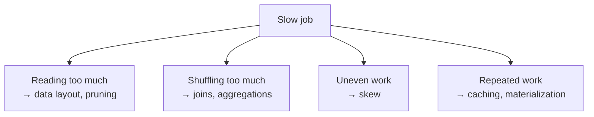

# 14 – Performance Optimization

Almost every Spark performance problem reduces to one of four things:

```text
1. Reading more data than necessary
2. Moving more data across the network than necessary
3. Distributing work unevenly across the cluster
4. Doing the same expensive work repeatedly
```



This topic teaches you to identify which one you have, rather than guessing.

---

## The Golden Rule

```text
Measure first. Read the Spark UI or the query profile.
Then change ONE thing and measure again.
```

The most expensive optimisation in practice is a bigger cluster applied to a
problem that a better filter would have solved.

---

## Reading Order

| # | File | What you learn |
|---|------|----------------|
| 1 | [spark_execution_model.md](spark_execution_model.md) | Partitions, stages, shuffles — the foundation |
| 2 | [data_layout.md](data_layout.md) | Partitioning, clustering, file sizes, OPTIMIZE, VACUUM |
| 3 | [joins_and_skew.md](joins_and_skew.md) | Join strategies, broadcast, skew handling |
| 4 | [caching_and_query_tuning.md](caching_and_query_tuning.md) | Caching, AQE, Photon, writing faster code |
| 5 | [cluster_and_cost_tuning.md](cluster_and_cost_tuning.md) | Sizing, autoscaling, spot, cost per job |
| 6 | [troubleshooting_guide.md](troubleshooting_guide.md) | Symptom → diagnosis → fix |
| 7 | [interview_questions.md](interview_questions.md) | Questions asked in interviews |

---

## Quick Revision

```text
Partition   = one chunk of data processed by one task
Shuffle     = data moving between executors — the expensive operation
Skew        = one partition far larger than the rest
Spill       = data written to disk because it did not fit in memory

Layout:  liquid clustering > Z-order > partitioning; OPTIMIZE; VACUUM
Joins:   broadcast the small side; AQE usually handles it
Skew:    AQE skew join, salting, better keys
Cache:   Delta disk cache is automatic; df.cache() is a deliberate choice
Engine:  Photon + AQE, both on by default in modern runtimes
```
