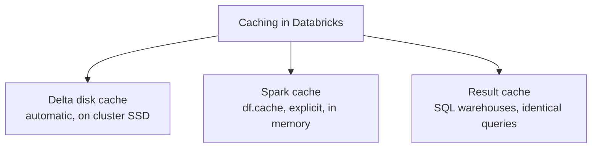
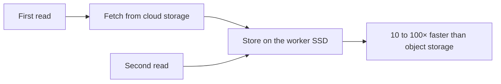
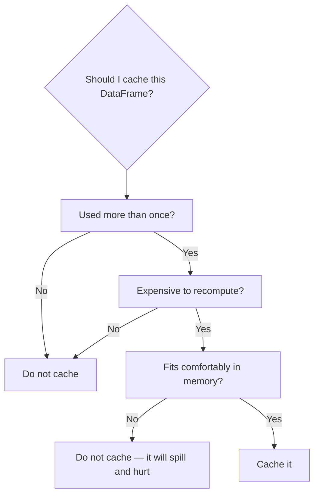
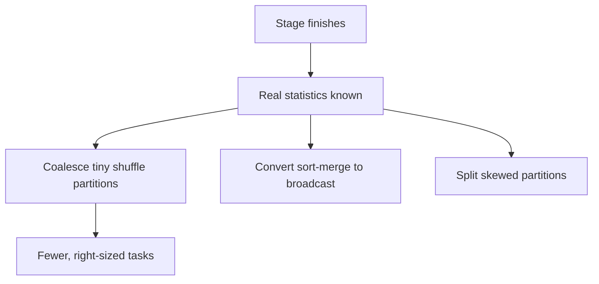
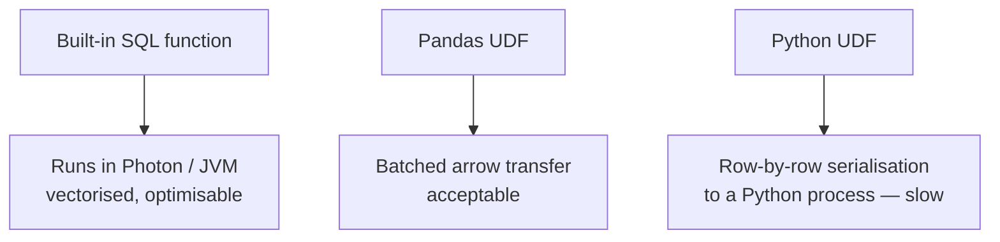

# Caching, AQE, Photon, and Writing Faster Code

## Three Different Caches

People say "cache" and mean three unrelated things. Knowing which one you mean
is half the battle.



| | Delta disk cache | Spark cache | Result cache |
|---|-----------------|-------------|--------------|
| Stores | Parquet data on local SSD | Computed DataFrame | Final query result |
| Triggered by | Automatic on read | `df.cache()` | Identical SQL, unchanged data |
| Scope | Cluster | Spark session | Warehouse |
| Invalidated by | Cluster restart | `unpersist()`, session end | Data change, 24h |
| You manage it | No | Yes | No |

---

## Delta Disk Cache (Automatic)



```text
Enabled by default on most Databricks node types.
Nothing to configure, nothing to manage.

It is why the second run of the same query is dramatically faster,
and why "my query got slower" often just means a cluster restart.
```

```python
# Pre-warm deliberately before a demo or a heavy dashboard hour
spark.sql("CACHE SELECT * FROM main.gold.daily_sales WHERE order_date >= current_date() - INTERVAL 30 DAYS")
```

---

## Spark Cache (Deliberate)

```python
df = spark.table("main.silver.orders").filter("status = 'COMPLETED'")
df.cache()
df.count()      # materialises the cache

# now reused
df.groupBy("country").count().show()
df.groupBy("segment").sum("amount").show()

df.unpersist()  # release it when done
```



```text
Storage levels:
MEMORY_AND_DISK      default — spills to disk when memory is short
MEMORY_ONLY          fastest, but recomputes anything evicted
DISK_ONLY            rarely useful given the Delta disk cache
```

```python
from pyspark import StorageLevel
df.persist(StorageLevel.MEMORY_AND_DISK)
```

### Why caching often makes things slower

```text
❌ Caching a DataFrame used once → pure overhead
❌ Caching something larger than available memory → constant eviction and spill
❌ Caching and never unpersisting → executor memory unavailable for shuffles
❌ Caching a cheap scan of a well-clustered Delta table → the disk cache
   already made it fast

The Delta disk cache removes most of the historical reasons to call .cache().
Reach for it only when the DataFrame is the result of expensive computation
(a big join or aggregation) that you then reuse several times.
```

---

## Materialize Instead of Cache

For genuinely expensive intermediate results reused across notebooks, jobs, or
days, write a table rather than caching.

```python
# Instead of caching a huge join result
enriched = orders.join(customers, "customer_id").join(products, "product_id")
enriched.write.format("delta").mode("overwrite").saveAsTable("main.silver.orders_enriched")
```

```text
✔ Survives cluster restarts and session boundaries
✔ Available to other users and to SQL warehouses
✔ Can be clustered and optimised
✔ Shows up in lineage

This is the difference between a notebook trick and a data platform.
```

---

## Adaptive Query Execution

```python
spark.conf.set("spark.sql.adaptive.enabled", "true")                          # default
spark.conf.set("spark.sql.adaptive.coalescePartitions.enabled", "true")
spark.conf.set("spark.sql.adaptive.skewJoin.enabled", "true")
spark.conf.set("spark.sql.adaptive.localShuffleReader.enabled", "true")
spark.conf.set("spark.sql.adaptive.advisoryPartitionSizeInBytes", "128MB")
```



```text
AQE removed the need for most manual tuning that older Spark guides describe.
If you read advice about carefully setting shuffle partitions per job,
check whether AQE already handles it before acting on it.
```

---

## Photon

```text
A vectorised C++ execution engine replacing parts of the JVM engine.
On by default for SQL warehouses and available on clusters.
```

| Accelerates well | Little or no benefit |
|------------------|----------------------|
| Scans and filters | Python UDFs |
| Joins and aggregations | RDD operations |
| Writes to Delta | Arbitrary Python code |
| `MERGE`, `UPDATE`, `DELETE` | Some complex nested types |

```text
Cost: a higher DBU rate, usually more than offset by shorter runtime.
Check the query profile for Photon coverage — operators that fell back
to Spark are shown explicitly, and are usually UDFs.
```

---

## UDFs: the Performance Cliff



```python
# ❌ Python UDF — serialises every row, blocks Photon
@udf("string")
def categorize(amount):
    return "HIGH" if amount > 1000 else "LOW"
df.withColumn("cat", categorize("amount"))

# ✔ Built-in expression — vectorised, optimisable
df.withColumn("cat", F.when(F.col("amount") > 1000, "HIGH").otherwise("LOW"))

# ✔ When custom logic is unavoidable, use a Pandas UDF
from pyspark.sql.functions import pandas_udf
import pandas as pd

@pandas_udf("string")
def categorize(amount: pd.Series) -> pd.Series:
    return pd.Series(["HIGH" if a > 1000 else "LOW" for a in amount])
```

```text
Order of preference:
1. Built-in SQL / DataFrame functions
2. Higher-order functions (transform, filter, aggregate on arrays)
3. Pandas UDF (vectorised)
4. Python UDF (last resort)
```

---

## Writing Faster Queries

### Filter early and specifically

```python
# ❌ read everything, filter after the join
orders.join(customers, "customer_id").filter("order_date >= '2026-09-01'")

# ✔ filter before the join — fewer rows shuffled
orders.filter("order_date >= '2026-09-01'").join(customers, "customer_id")
```

### Keep the filter column bare

```sql
-- ❌ defeats file pruning
WHERE year(order_date) = 2026

-- ✔ prunes files
WHERE order_date >= '2026-01-01' AND order_date < '2027-01-01'
```

### Select only what you need

```python
# Parquet is columnar — this genuinely reads less data
df.select("order_id", "amount", "order_date")
```

### Avoid unnecessary ordering

```python
# ❌ full cluster-wide sort for a preview
df.orderBy("amount").show(20)

# ✔
df.orderBy(F.desc("amount")).limit(20).show()
```

### Avoid repeated counts

```python
# ❌ three full scans
if df.count() > 0:
    print(df.count())
    df.write...

# ✔ one scan
n = df.count()
if n > 0:
    print(n)
    df.write...
```

### Use approximate functions when exactness is not required

```python
df.select(F.approx_count_distinct("customer_id"))   # much cheaper than countDistinct
df.stat.approxQuantile("amount", [0.5, 0.95], 0.01)
```

### Prefer `union` over repeated appends in a loop

```python
# ❌ N separate writes, N transactions, many small files
for d in dates:
    process(d).write.mode("append").saveAsTable("t")

# ✔ one write
from functools import reduce
reduce(lambda a, b: a.unionByName(b), [process(d) for d in dates]) \
    .write.mode("append").saveAsTable("t")
```

---

## Delta-Specific Wins

```sql
-- Deletion vectors: fast DELETE / UPDATE / MERGE
ALTER TABLE main.silver.orders SET TBLPROPERTIES ('delta.enableDeletionVectors' = 'true');

-- Optimized writes and auto compaction
ALTER TABLE main.silver.orders SET TBLPROPERTIES (
  'delta.autoOptimize.optimizeWrite' = 'true',
  'delta.autoOptimize.autoCompact'   = 'true'
);
```

```python
# MERGE performance: narrow the target with a predicate on the clustering key
spark.sql("""
MERGE INTO main.silver.orders t
USING updates s
ON t.order_id = s.order_id
   AND t.order_date >= current_date() - INTERVAL 7 DAYS   -- lets Delta skip files
WHEN MATCHED THEN UPDATE SET *
WHEN NOT MATCHED THEN INSERT *
""")
```

```text
That extra predicate is one of the highest-value MERGE optimisations:
without it, MERGE must consider the entire target table.
```

---

## Configuration Worth Knowing

```python
# Shuffle partitions — AQE coalesces, but a sensible base helps
spark.conf.set("spark.sql.shuffle.partitions", 400)

# Broadcast threshold
spark.conf.set("spark.sql.autoBroadcastJoinThreshold", 100 * 1024 * 1024)

# Advisory partition size for AQE
spark.conf.set("spark.sql.adaptive.advisoryPartitionSizeInBytes", "128MB")

# Delta file size target for OPTIMIZE
spark.conf.set("spark.databricks.delta.optimize.maxFileSize", 256 * 1024 * 1024)
```

```text
Resist the urge to copy a long list of Spark configs from a blog post.
Modern Databricks defaults plus AQE and Photon are well tuned; most
hand-set configs in old guides now make things worse, not better.
```

---

## Common Interview Questions

### What is the difference between the Delta disk cache and `df.cache()`?

The disk cache automatically stores Parquet data on worker SSDs on read, managed
by Databricks. `df.cache()` explicitly stores a computed DataFrame in executor
memory and must be managed and unpersisted by you.

### When should you not cache?

When the DataFrame is used once, when it does not fit comfortably in memory, or
when the underlying read is already fast thanks to the disk cache.

### What should you do instead of caching a large intermediate result?

Write it as a Delta table, so it survives restarts, is queryable by others,
appears in lineage, and can be clustered and optimised.

### What does AQE do?

Re-optimises at runtime: coalescing small shuffle partitions, converting joins to
broadcast, and splitting skewed partitions using real statistics.

### What is Photon and what does it not accelerate?

A vectorised C++ engine for scans, joins, aggregations, and Delta writes. It does
not accelerate Python UDFs or RDD operations, which fall back to the JVM engine.

### Why are Python UDFs slow?

Each row is serialised to a separate Python process and back, breaking
vectorisation and preventing Photon from executing that operator. Pandas UDFs
batch the transfer and are much faster.

### How do you speed up a slow MERGE?

Add a predicate on the clustering or partition column to the `ON` clause so Delta
can skip files, enable deletion vectors, and ensure the target is not fragmented
into small files.

---

## Quick Revision

```text
Three caches:
Delta disk cache → automatic, SSD, per cluster
df.cache()       → explicit, memory, you must unpersist
Result cache     → SQL warehouses, identical query + unchanged data

Cache only if: reused AND expensive AND fits in memory
Otherwise: materialize as a Delta table

AQE (default on): coalesce partitions | broadcast conversion | skew split
Photon (default on SQL): scans, joins, aggregations, Delta writes
  → falls back on Python UDFs

Code:
filter early | bare filter columns | select fewer columns
avoid full sorts and repeated counts | approx functions when acceptable
built-in functions > pandas UDF > python UDF

Delta:
deletion vectors | optimizeWrite + autoCompact
MERGE: add a date predicate to the ON clause so files can be skipped

Do not paste old Spark config lists — modern defaults are better
```
