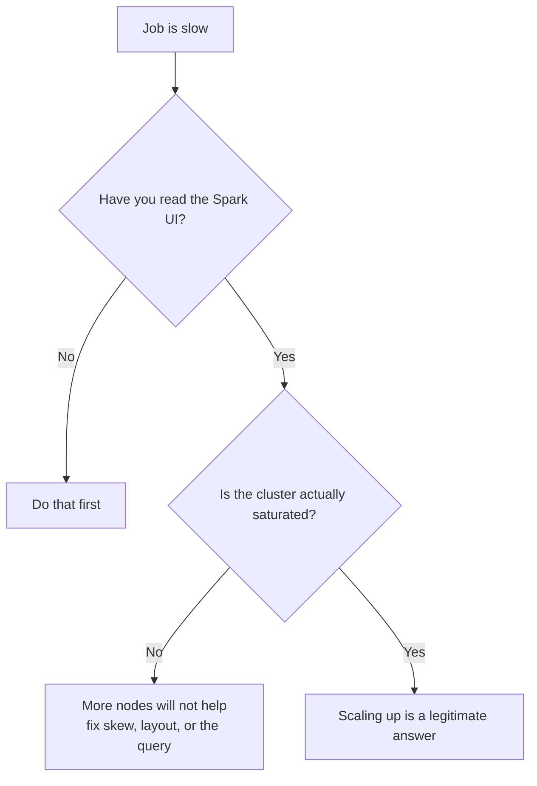
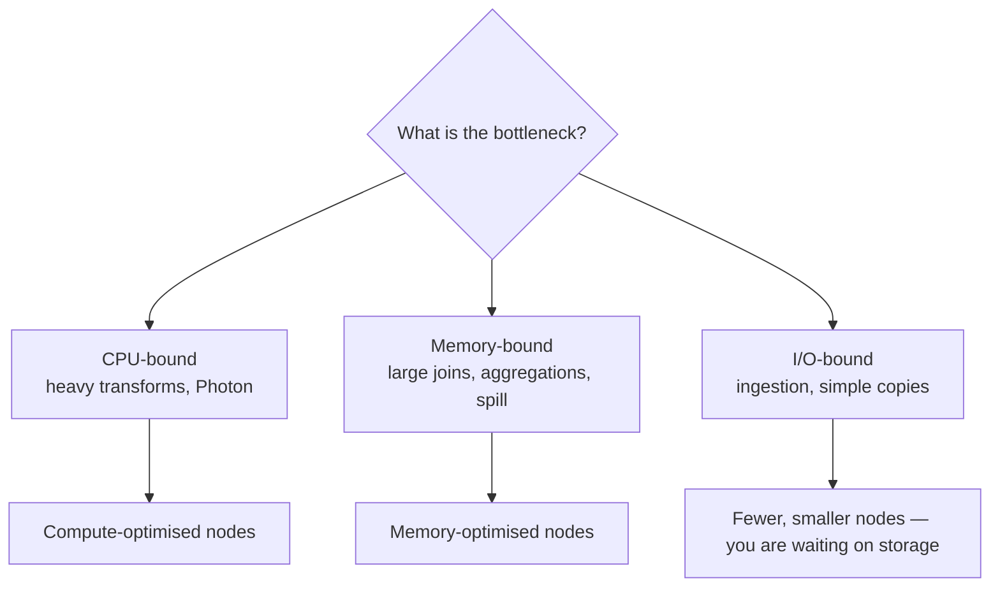
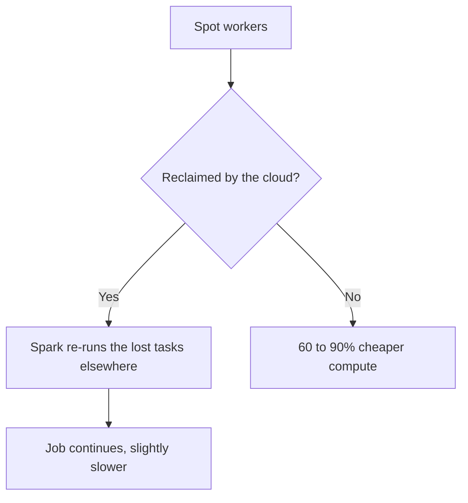
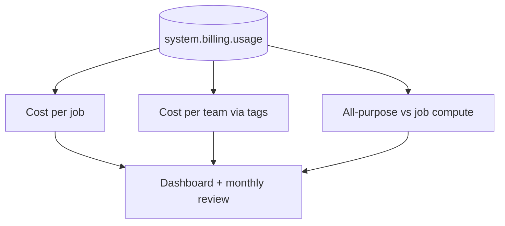
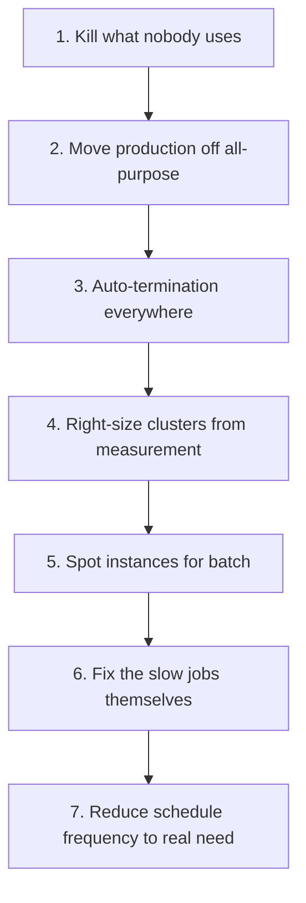
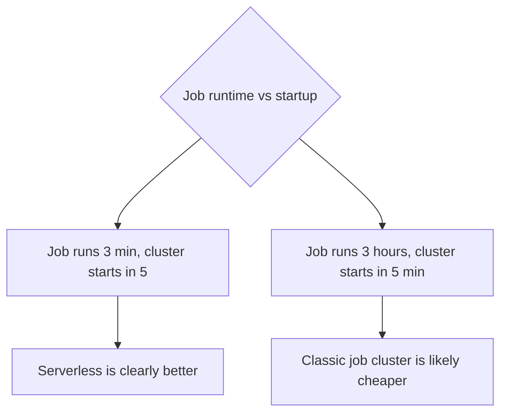

# Cluster Sizing and Cost Tuning

## The Uncomfortable Truth

```text
The most common "performance fix" is a bigger cluster.
It is also the most expensive, and it usually hides the real problem.
```



A cluster running at 20% CPU with one long task does not need more nodes. It
needs the skew fixed.

---

## Cluster Types Recap

| Type | Billing | Use |
|------|---------|-----|
| **Job cluster** | Cheapest DBU rate, per run | Scheduled production work |
| **Serverless** | Higher rate, no idle | Short or spiky workloads |
| **All-purpose** | Most expensive | Interactive development only |
| **SQL warehouse** | Per warehouse | SQL and BI |

```text
Rule: production pipelines never run on all-purpose clusters.
That single policy is often the largest cost saving available.
```

---

## Sizing: Workers



```text
Start from the data, not from a guess:

Data scanned per run:  100 GB
Target partition size: 128 MB
→ ~800 partitions

Cores needed for 2 waves: ~400 cores... which is too many.
Reality check: aim for 2 to 4 waves of tasks, not one.
→ ~100 to 200 cores → about 12 to 25 nodes with 8 cores each
```

```text
Practical approach:
1. Start small (2 to 4 workers)
2. Run and measure total runtime and CPU utilisation
3. Double the workers; if runtime does not roughly halve, you are not
   CPU-bound and adding nodes is wasted money
4. Stop at the point where the curve flattens
```

---

## Sizing: Node Type

```text
General purpose (e.g. Standard_DS4_v2, m5.xlarge)
  → default choice, balanced

Memory optimised (e.g. Standard_E8s_v3, r5.xlarge)
  → large joins, wide aggregations, heavy caching, spill problems

Compute optimised (c5.xlarge)
  → CPU-heavy transformations with small data

Storage optimised (i3.xlarge)
  → large shuffles benefit from fast local NVMe, and the Delta disk cache
```

```text
Fewer large nodes usually beat many small nodes for shuffle-heavy work:
less network transfer between executors, better cache locality.

Many small nodes suit embarrassingly parallel, I/O-bound work.
```

---

## Autoscaling

```python
{
  "autoscale": {"min_workers": 2, "max_workers": 12},
  "autotermination_minutes": 20
}
```


```text
✔ Set min_workers to what the steady state needs
✔ Set max_workers to what a spike needs, not to what looks impressive
✔ Enhanced autoscaling on DLT responds faster and scales down aggressively

✘ Autoscaling does not help a job with one giant skewed task
✘ Scaling down mid-job can lose cached data and shuffle files
```

---

## Spot and Preemptible Instances

```json
{
  "aws_attributes": {
    "availability": "SPOT_WITH_FALLBACK",
    "first_on_demand": 1,
    "spot_bid_price_percent": 100
  }
}
```



```text
✔ Keep the driver on-demand (first_on_demand: 1) — losing the driver kills the job
✔ Excellent for fault-tolerant batch ETL
✔ Streaming with checkpoints recovers automatically
✘ Avoid for time-critical jobs with a hard SLA
✘ Avoid when a long shuffle would be repeatedly recomputed
```

---

## Cluster Policies

Policies stop the cost problem at source.

```json
{
  "spark_version": {"type": "regex", "pattern": "1[4-9]\\..*"},
  "node_type_id": {"type": "allowlist", "values": ["Standard_DS3_v2", "Standard_DS4_v2"]},
  "autotermination_minutes": {"type": "fixed", "value": 20},
  "autoscale.max_workers": {"type": "range", "maxValue": 20},
  "custom_tags.team": {"type": "unlimited", "isOptional": false},
  "aws_attributes.availability": {"type": "fixed", "value": "SPOT_WITH_FALLBACK"}
}
```

```text
Policies enforce:
✔ Auto-termination always set
✔ A ceiling on cluster size
✔ Mandatory cost-allocation tags
✔ Approved runtimes and node types
✔ Spot by default

Without policies, someone will eventually leave a 4X-Large running over a
long weekend. With them, they cannot.
```

---

## Photon Economics

```text
Photon costs roughly 2× the DBU rate but frequently runs 2 to 4× faster
on scan, join, aggregate, and Delta write workloads.

Net effect: usually cheaper, sometimes neutral, occasionally worse.

Worse when: the workload is dominated by Python UDFs or non-SQL logic
            that falls back to the JVM engine anyway.
```

```text
Test it honestly: run the same job with and without Photon, and compare
DBUs consumed (not wall-clock time alone).
```

---

## Measuring Cost

```sql
-- Cost by job over 30 days
SELECT
    usage_metadata.job_id,
    round(sum(usage_quantity), 1) AS dbus
FROM system.billing.usage
WHERE usage_date >= current_date() - INTERVAL 30 DAYS
  AND usage_metadata.job_id IS NOT NULL
GROUP BY 1 ORDER BY dbus DESC LIMIT 20;
```

```sql
-- Cost by team, using cluster tags
SELECT
    custom_tags.team,
    round(sum(usage_quantity), 1) AS dbus
FROM system.billing.usage
WHERE usage_date >= current_date() - INTERVAL 30 DAYS
GROUP BY 1 ORDER BY dbus DESC;
```

```sql
-- All-purpose clusters used for scheduled work (an anti-pattern to hunt)
SELECT usage_metadata.cluster_id, sku_name, round(sum(usage_quantity), 1) AS dbus
FROM system.billing.usage
WHERE usage_date >= current_date() - INTERVAL 30 DAYS
  AND sku_name LIKE '%ALL_PURPOSE%'
GROUP BY 1, 2 ORDER BY dbus DESC;
```



---

## The Cost Optimisation Ladder



```text
Typical findings in a first cost review:

- A dev streaming job running since March that nobody owns
- Three production pipelines on an all-purpose cluster
- A cluster with autotermination disabled
- A 16-worker cluster processing 2 GB
- An hourly job that the business only looks at daily
- A dashboard warehouse at min_num_clusters = 3, always warm

Each is a bigger saving than any Spark config change.
```

---

## Right-Sizing Example

```text
Job: nightly silver transformation
Current: 16 workers, Standard_DS4_v2, 45 minutes

Investigation:
- Spark UI: median CPU utilisation 22%
- Input: 40 GB, output 12 GB
- Longest stage is a MERGE against a fragmented target table

Actions:
1. OPTIMIZE the target and enable optimizeWrite  → 45 min to 18 min
2. Reduce to 6 workers                            → 18 min to 22 min
3. Enable spot with on-demand driver              → ~70% cheaper compute

Result: similar runtime, roughly one quarter of the cost.
The layout fix did the real work; the sizing change banked it.
```

---

## Serverless Considerations

```text
Serverless job compute and SQL warehouses:
✔ No cluster configuration to get wrong
✔ Seconds to start, no idle time billed
✔ Automatic version management

✘ Higher per-DBU rate
✘ Less control over instance types and Spark configs
✘ Some workloads (custom libraries, specific JARs) may not fit

Best fit: short, frequent, or spiky workloads where cluster startup time
is a large fraction of total runtime.
```



---

## Common Interview Questions

### How do you decide cluster size?

Measure. Start small, check CPU utilisation and the task distribution in the
Spark UI, double the workers and see whether runtime roughly halves. When it
stops halving, you are no longer CPU-bound and more nodes waste money.

### When does adding workers not help?

When the job is skewed (one long task), I/O-bound, bottlenecked on a single
write, or limited by a small number of partitions.

### Fewer large nodes or many small nodes?

Fewer large nodes for shuffle-heavy work — less network transfer and better cache
locality. Many small nodes for embarrassingly parallel, I/O-bound work.

### How do spot instances affect reliability?

Workers can be reclaimed, and Spark re-runs the lost tasks. Keep the driver
on-demand, use them for fault-tolerant batch work, and avoid them for hard SLAs.

### What do cluster policies enforce?

Mandatory auto-termination, size ceilings, allowed node types and runtimes,
required cost-allocation tags, and defaults such as spot availability.

### Is Photon always cheaper?

No. It roughly doubles the DBU rate and usually more than doubles the speed for
SQL-style work, but offers little for Python UDF-heavy jobs. Compare DBUs
consumed, not just runtime.

### How do you attribute Databricks cost to a team?

`system.billing.usage` joined with cluster tags, with tags made mandatory by
cluster policy.

### What is the highest-value cost optimisation in most workspaces?

Moving scheduled production work off all-purpose clusters, and switching off
compute nobody owns.

---

## Quick Revision

```text
Diagnose before scaling: a 20%-utilised cluster does not need more nodes

Compute choice:
job cluster (cheapest) | serverless (short/spiky) | all-purpose (dev only)

Sizing:
start small → measure → double → stop when runtime stops halving
target 2 to 4 waves of tasks, partitions of ~128 MB to 1 GB
fewer large nodes for shuffles, many small for I/O-bound

Autoscaling: min = steady state, max = spike, autotermination always on
Spot: 60 to 90% cheaper, keep the driver on-demand, batch workloads only

Cluster policies: enforce termination, size caps, tags, node types

Cost visibility: system.billing.usage by job, by team tag, by SKU

Ladder:
kill unused → off all-purpose → auto-terminate → right-size →
spot → fix slow jobs → reduce frequency
```
