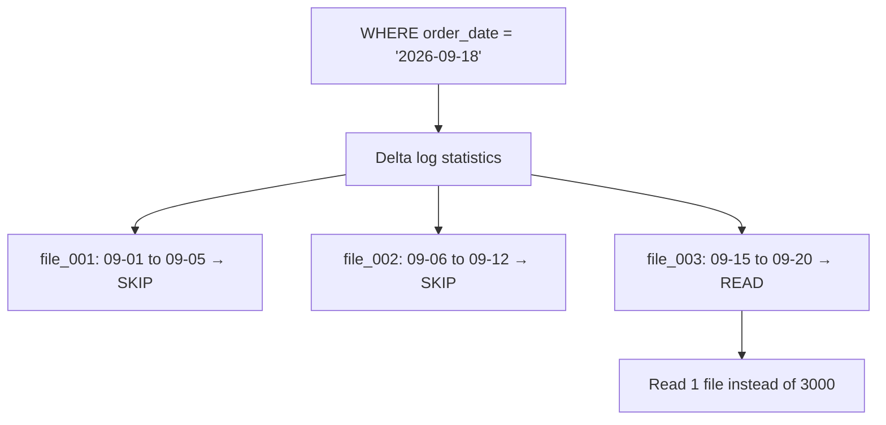
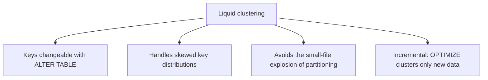
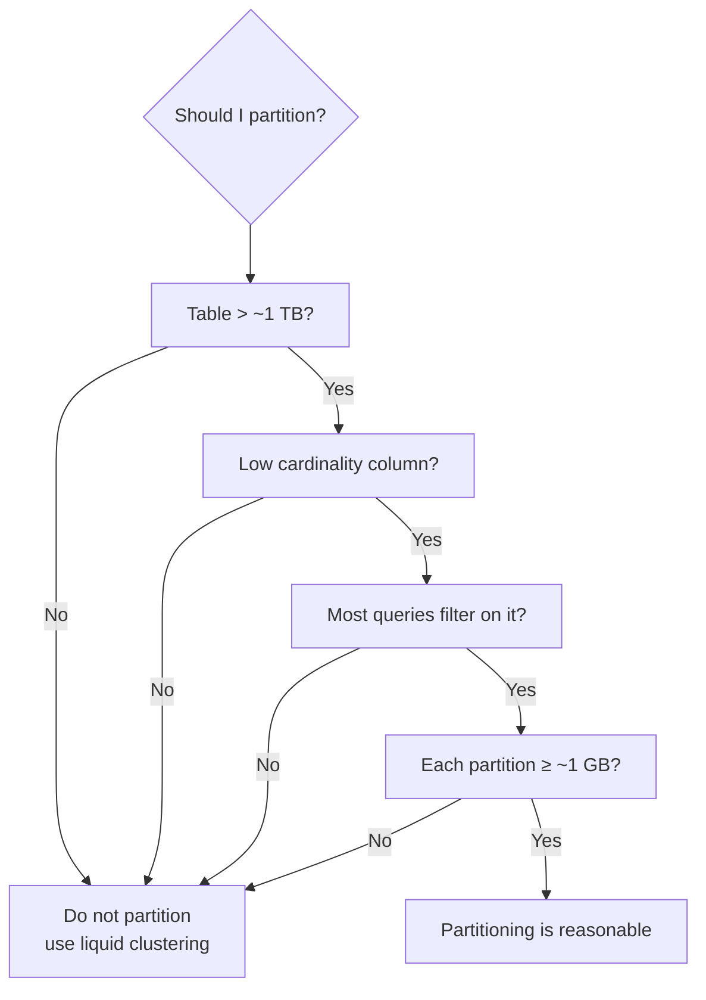
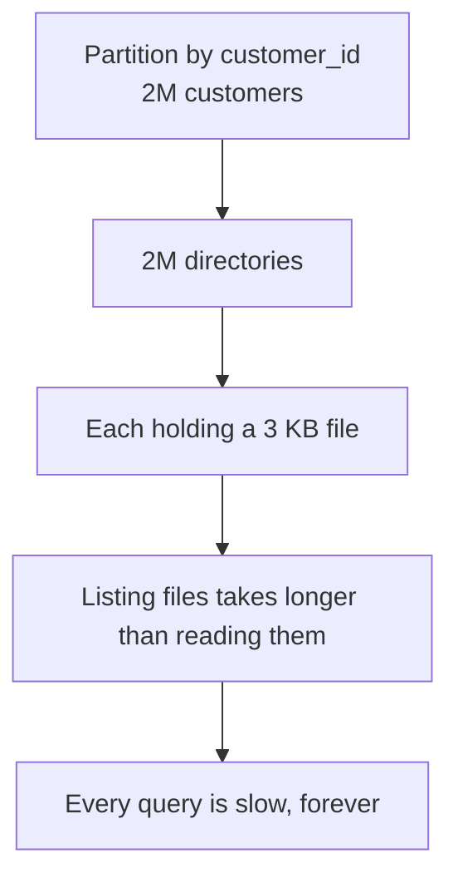
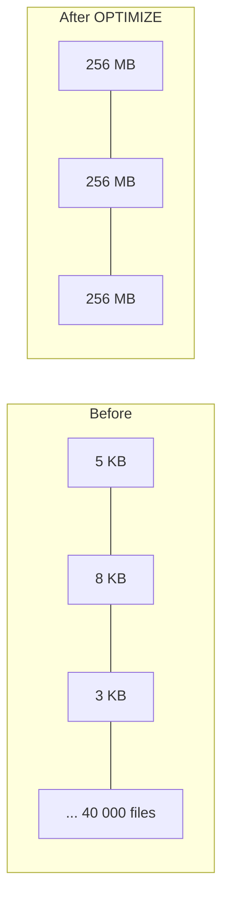
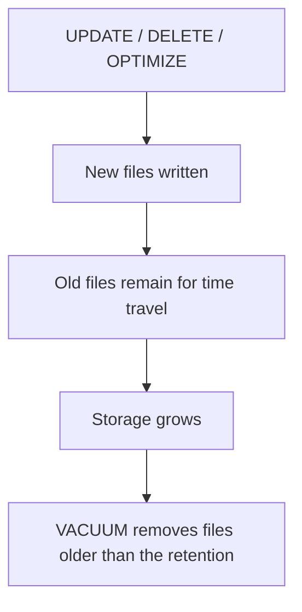
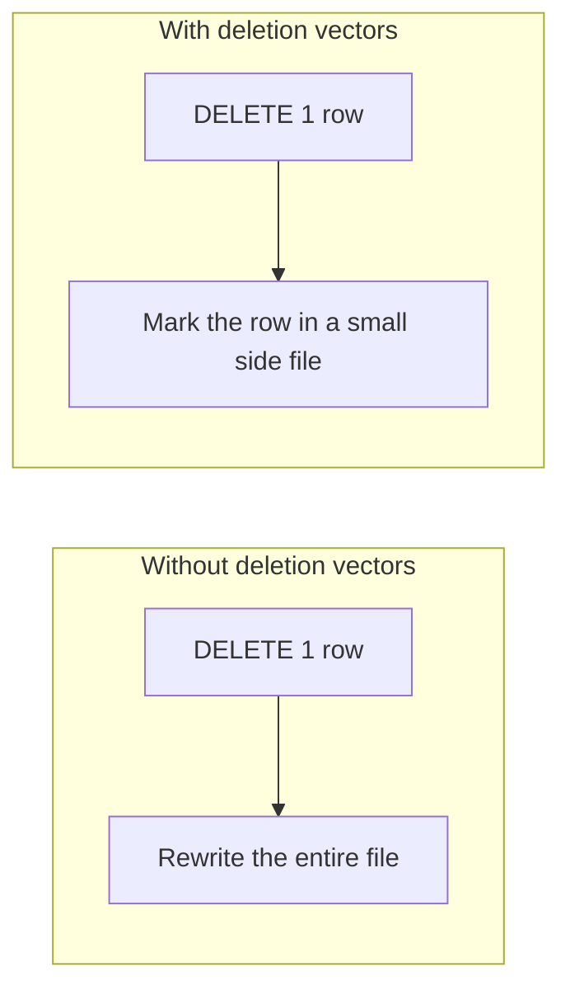
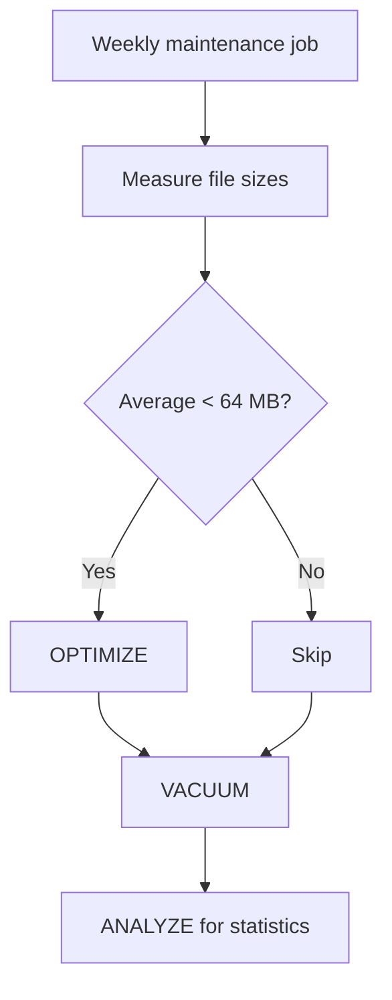
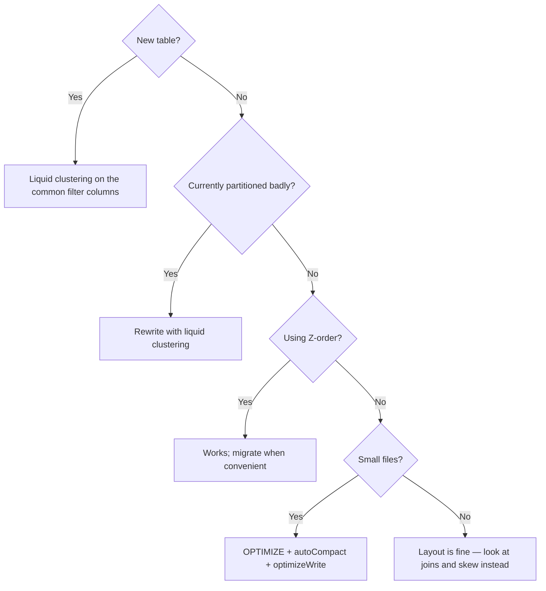

# Data Layout and File Management

## The Principle

```text
The fastest data to process is the data you never read.
```

Data layout determines how much of a table a query must touch. Get it right and
a 5-minute query becomes 5 seconds without changing a line of SQL.



---

## How Data Skipping Works

Delta stores min/max/null statistics for the first 32 columns of every file in
the transaction log. Queries use them to eliminate files before reading.

```sql
-- Which columns have statistics?
SHOW TBLPROPERTIES main.gold.sales;

-- Change how many columns get stats
ALTER TABLE main.gold.sales
SET TBLPROPERTIES ('delta.dataSkippingNumIndexedCols' = '10');
```

```text
Why limit it? Collecting statistics on 200 columns slows writes and bloats
the log. Put the columns you actually filter on FIRST in the schema,
or reduce the indexed column count and order deliberately.
```

```text
Statistics only help if the data is physically CLUSTERED by that column.
If every file contains dates from the whole year, min/max is 01-01 to 12-31
for every file, and nothing can be skipped.

That clustering is what the rest of this file is about.
```

---

## Liquid Clustering: the Modern Default

```sql
-- New table
CREATE TABLE main.gold.sales (
    order_id BIGINT,
    order_date DATE,
    country STRING,
    amount DECIMAL(18,2)
)
CLUSTER BY (order_date, country);

-- Existing table
ALTER TABLE main.gold.sales CLUSTER BY (order_date, country);
OPTIMIZE main.gold.sales;

-- Let Databricks choose keys from query history
ALTER TABLE main.gold.sales CLUSTER BY AUTO;
```



| | Partitioning | Z-order | Liquid clustering |
|---|-------------|---------|-------------------|
| Change keys later | Full rewrite | Re-run OPTIMIZE | `ALTER TABLE` |
| High-cardinality keys | Disastrous | Workable | Good |
| Skewed distributions | Poor | Moderate | Good |
| Small-file risk | High | Moderate | Low |
| Concurrent writes | Contention | Contention | Better |
| Recommendation | Legacy only | Legacy only | **Default for new tables** |

```text
Choosing clustering keys:
✔ Columns used in WHERE clauses most often
✔ Put the highest-selectivity filter first (usually a date)
✔ 1 to 4 keys — more dilutes the benefit
✘ Do not cluster on a column nobody filters by
```

---

## Partitioning: When It Still Makes Sense

```sql
CREATE TABLE main.bronze.events (...)
PARTITIONED BY (ingest_date);
```



```text
❌ PARTITIONED BY (customer_id)     → millions of directories
❌ PARTITIONED BY (event_timestamp) → one partition per second
✔ PARTITIONED BY (ingest_date)      → ~365 partitions per year
```

### The over-partitioning disaster



```text
Symptom: DESCRIBE DETAIL shows numFiles in the millions and
an average file size in kilobytes.

Recovery: rewrite the table without partitions, using liquid clustering.
It is a painful migration — which is why the decision matters up front.
```

---

## Z-Ordering (Legacy but Common)

```sql
OPTIMIZE main.gold.sales
ZORDER BY (customer_id, product_id);
```

```text
Z-ordering co-locates related values within the same files using a
space-filling curve, improving skipping on multiple columns at once.

Limitations:
✘ Must be re-run after every significant write
✘ Rewrites the data each time (expensive)
✘ Effectiveness drops beyond 3 to 4 columns
✘ Superseded by liquid clustering

You will still meet it in existing codebases, so know what it does.
```

```text
Migration note: a table cannot use both Z-order and liquid clustering.
Converting means ALTER TABLE ... CLUSTER BY, then a full OPTIMIZE.
```

---

## The Small File Problem



```text
Why small files are slow:
1. Metadata: the Delta log must track every file
2. Listing: cloud storage listing is slow at scale
3. Overhead: one task per file, each doing almost no work
4. Compression: small files compress poorly
```

### Diagnosing

```sql
DESCRIBE DETAIL main.gold.sales;
```

```text
numFiles: 42 000, sizeInBytes: 3.1 GB
→ average file 74 KB → severe small-file problem

Healthy target: 128 MB to 1 GB per file.
```

### Fixing

```sql
OPTIMIZE main.gold.sales;

-- Scope it to recent data to limit cost
OPTIMIZE main.gold.sales WHERE order_date >= current_date() - INTERVAL 7 DAYS;
```

### Preventing

```sql
ALTER TABLE main.gold.sales SET TBLPROPERTIES (
  'delta.autoOptimize.optimizeWrite' = 'true',
  'delta.autoOptimize.autoCompact'   = 'true'
);
```

| Property | Effect |
|----------|--------|
| `optimizeWrite` | Repartitions before writing, producing fewer, larger files |
| `autoCompact` | Compacts small files automatically after a write |

```text
Streaming and frequent micro-batches are the main producers of small files.
Enable both properties on every streaming target table.
```

### Predictive optimization

```sql
ALTER CATALOG main ENABLE PREDICTIVE OPTIMIZATION;
```

```text
Databricks runs OPTIMIZE, VACUUM, and statistics collection automatically
on Unity Catalog managed tables, based on observed query patterns.
Enable it and stop maintaining a maintenance job.
```

---

## VACUUM: Removing Obsolete Files



```sql
-- Preview what would be removed
VACUUM main.gold.sales RETAIN 168 HOURS DRY RUN;

-- Actually remove
VACUUM main.gold.sales RETAIN 168 HOURS;   -- 7 days
```

```text
⚠ VACUUM destroys time travel beyond the retention window.
After VACUUM with 7-day retention, you cannot query versions older than 7 days.

Default retention is 7 days. Databricks blocks shorter retentions
unless you explicitly override a safety check — for good reason:
a shorter window can delete files a concurrent long-running query is reading.
```

```sql
ALTER TABLE main.gold.sales SET TBLPROPERTIES (
  'delta.deletedFileRetentionDuration' = 'interval 30 days',
  'delta.logRetentionDuration'         = 'interval 30 days'
);
```

```text
Set retention from your actual recovery requirement:
"how far back might we need to RESTORE this table?"
```

---

## Column Order and Statistics

```sql
-- Columns you filter on should be within the first 32
CREATE TABLE main.gold.sales (
    order_date DATE,          -- filtered constantly
    country STRING,           -- filtered often
    customer_id BIGINT,       -- joined on
    amount DECIMAL(18,2),
    ... 200 other columns     -- rarely filtered
);
```

```text
Delta indexes the first 32 columns by default. A filter column sitting
at position 150 gets no statistics and therefore no file skipping.

This is a free optimisation that nobody thinks about until it bites.
```

---

## Deletion Vectors

```sql
ALTER TABLE main.gold.sales SET TBLPROPERTIES ('delta.enableDeletionVectors' = 'true');
```



```text
Massively faster DELETE, UPDATE, and MERGE on large tables, because
files are not rewritten immediately. A later OPTIMIZE applies the
vectors physically.

Default on for new tables in recent runtimes. Enable it on older ones.
```

---

## Maintenance Job Pattern

If predictive optimization is not enabled, run maintenance as a scheduled job.

```python
TABLES = ["main.silver.orders", "main.gold.daily_sales", "main.bronze.events"]

for t in TABLES:
    detail = spark.sql(f"DESCRIBE DETAIL {t}").collect()[0]
    avg_mb = (detail.sizeInBytes / max(detail.numFiles, 1)) / 1024 / 1024
    print(f"{t}: {detail.numFiles} files, avg {avg_mb:.1f} MB")

    if avg_mb < 64:
        spark.sql(f"OPTIMIZE {t}")

    spark.sql(f"VACUUM {t} RETAIN 168 HOURS")
    spark.sql(f"ANALYZE TABLE {t} COMPUTE STATISTICS FOR ALL COLUMNS")
```



```text
Measure before optimising. Running OPTIMIZE on an already-healthy table
rewrites data for no benefit and costs real money.
```

---

## Table Statistics

```sql
ANALYZE TABLE main.silver.orders COMPUTE STATISTICS FOR ALL COLUMNS;
```

```text
The optimiser uses column statistics for:
✔ Choosing join strategies (is this side small enough to broadcast?)
✔ Estimating filter selectivity
✔ Ordering joins in a multi-table query

Stale statistics are a common cause of a query that "suddenly got slow"
after a large load.
```

---

## Layout Decision Guide



---

## Common Interview Questions

### How does Delta skip data?

It stores min/max/null statistics per file in the transaction log for the first
32 columns, and eliminates files that cannot match the filter.

### Liquid clustering vs Z-ordering vs partitioning?

Partitioning creates physical directories and requires a rewrite to change.
Z-ordering co-locates data within files via `OPTIMIZE` and must be re-run.
Liquid clustering supersedes both, allows changing keys with `ALTER TABLE`, and
handles skew and small files better.

### When is partitioning still appropriate?

Very large tables (roughly 1 TB or more) with a low-cardinality column that most
queries filter on, where each partition holds at least about 1 GB.

### What is the small file problem and how do you fix it?

Many tiny files make metadata and listing dominate the read. Fix with `OPTIMIZE`,
prevent with optimized writes and auto compaction, or enable predictive
optimization.

### What does VACUUM do and what is the risk?

It deletes files no longer referenced by the current table version, reclaiming
storage. The risk is losing time travel beyond the retention window, and
potentially breaking concurrent long-running readers if retention is too short.

### Why might a filter column get no data skipping?

It sits beyond the first 32 columns, so Delta collects no statistics for it, or
the data is not physically clustered by it so every file has an overlapping
range.

### What are deletion vectors?

A mechanism that marks deleted rows in a side file instead of rewriting data
files, making DELETE, UPDATE, and MERGE much faster on large tables.

---

## Quick Revision

```text
Data skipping = per-file min/max stats on the first 32 columns
Only works if the data is physically clustered by that column

Layout:
liquid clustering (default) → CLUSTER BY, changeable, handles skew
Z-order (legacy)            → OPTIMIZE ZORDER BY, must re-run
partitioning                → only for >1 TB, low cardinality, ≥1 GB partitions

Small files:
diagnose with DESCRIBE DETAIL (numFiles vs sizeInBytes)
fix with OPTIMIZE
prevent with optimizeWrite + autoCompact
or enable predictive optimization

VACUUM: reclaims storage, destroys time travel beyond retention (default 7 days)

Free wins:
✔ Put filter columns within the first 32
✔ Enable deletion vectors
✔ Keep statistics fresh with ANALYZE
✔ Measure before running OPTIMIZE
```
