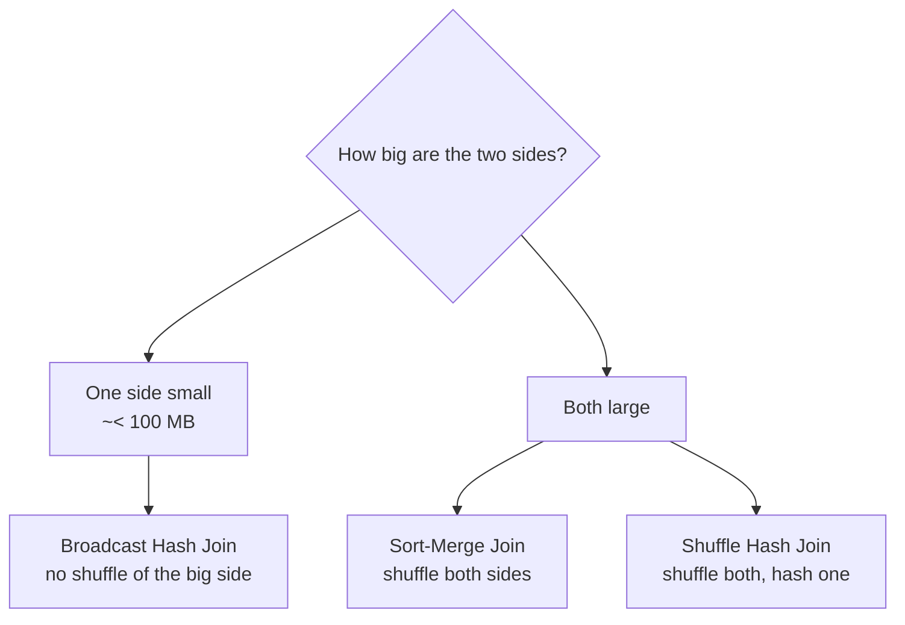
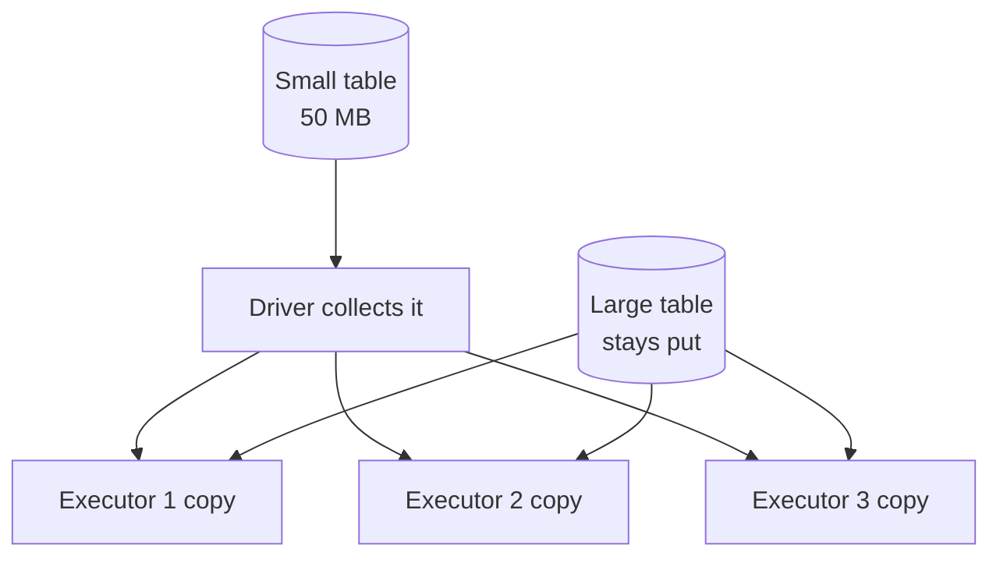
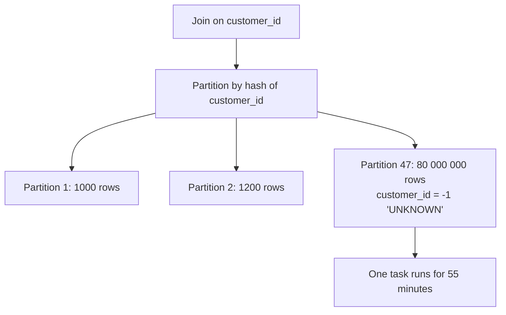
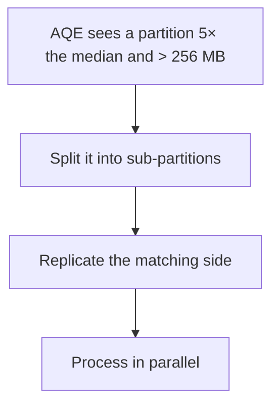
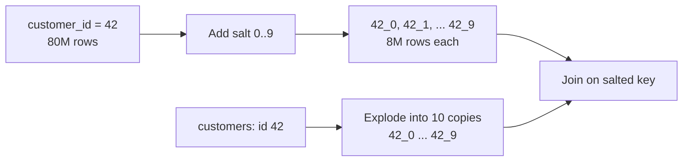
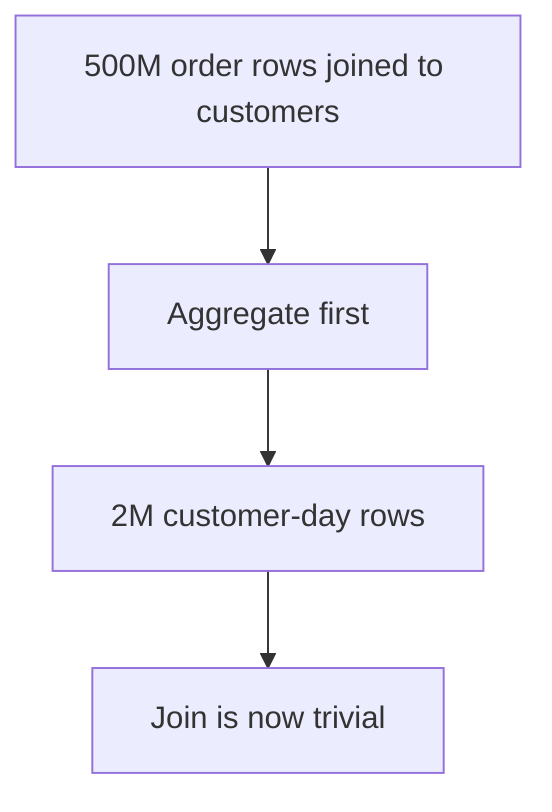
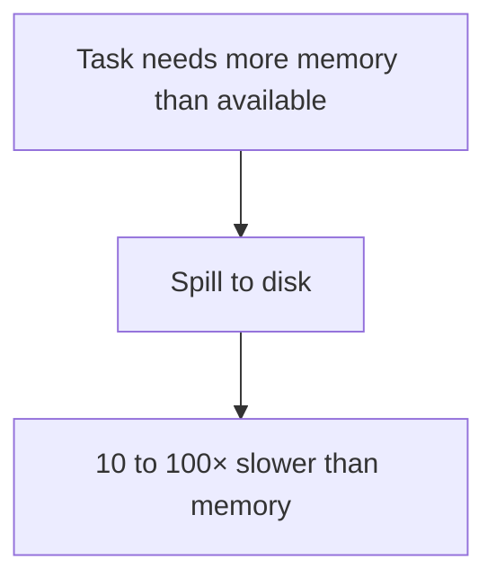

# Joins and Data Skew

Joins are where most Spark jobs spend their time, and skew is where most of them
go badly wrong.

---

## Join Strategies



| Strategy | How it works | Cost |
|----------|-------------|------|
| **Broadcast hash** | Small side copied to every executor | Cheapest — no shuffle of the large side |
| **Sort-merge** | Both sides shuffled by key and sorted | Expensive but reliable at any size |
| **Shuffle hash** | Both shuffled, one built into a hash table | Between the two |
| **Broadcast nested loop** | Cartesian-ish fallback | Catastrophic — usually a missing join condition |

```text
If you see "BroadcastNestedLoopJoin" in a plan, check your join condition.
It almost always means there is no equality predicate.
```

---

## Broadcast Join



```python
from pyspark.sql import functions as F

result = large_df.join(F.broadcast(small_df), "country_code")
```

```sql
SELECT /*+ BROADCAST(c) */ o.*, c.country_name
FROM orders o JOIN countries c ON o.country_code = c.code;
```

```python
# Automatic threshold (default 10 MB in open-source Spark; higher in Databricks)
spark.conf.get("spark.sql.autoBroadcastJoinThreshold")
spark.conf.set("spark.sql.autoBroadcastJoinThreshold", 100 * 1024 * 1024)   # 100 MB
```

```text
✔ Use for dimension and lookup tables
✔ AQE can convert a sort-merge join to broadcast at runtime when the
  actual size turns out small — so explicit hints are a last resort

✘ Broadcasting something large causes driver OOM, or executor OOM
  when every executor holds a copy
✘ Disable with spark.sql.autoBroadcastJoinThreshold = -1 only when
  debugging a broadcast-related failure
```

---

## What Skew Looks Like

```text
Data skew: one partition holds far more rows than the others,
so one task runs for an hour while 199 finish in seconds.
```



### Diagnosing skew

```text
Spark UI → the slow stage → Tasks summary:
  min 2 s | 25th 3 s | median 4 s | 75th 5 s | max 3200 s
                                                   ↑ skew
```

```sql
-- Find the dominant keys
SELECT customer_id, count(*) AS rows
FROM main.silver.orders
GROUP BY customer_id
ORDER BY rows DESC
LIMIT 20;
```

```text
Typical culprits:
- A sentinel value: -1, 0, 'UNKNOWN', 'N/A'
- NULL keys (all nulls hash to the same partition)
- One genuinely enormous customer or region
- A default date like 1900-01-01
```

---

## Fix 1: AQE Skew Join (Try This First)

```python
spark.conf.set("spark.sql.adaptive.enabled", "true")
spark.conf.set("spark.sql.adaptive.skewJoin.enabled", "true")
spark.conf.set("spark.sql.adaptive.skewJoin.skewedPartitionFactor", 5)
spark.conf.set("spark.sql.adaptive.skewJoin.skewedPartitionThresholdInBytes", "256MB")
```



```text
AQE handles moderate skew automatically and is enabled by default.
Tune the factor and threshold before writing manual salting code.
```

---

## Fix 2: Filter Out the Junk Key

Often the skewed key is not real data.

```python
# NULL keys never match in an inner join — remove them first
orders_clean = orders.filter("customer_id IS NOT NULL")

# Sentinel values handled separately
real = orders.filter("customer_id != -1")
unknown = orders.filter("customer_id = -1")

joined = real.join(customers, "customer_id")
result = joined.unionByName(
    unknown.withColumn("country", F.lit("UNKNOWN")), allowMissingColumns=True)
```

```text
This is the cheapest fix and the most commonly overlooked one.
Eighty percent of production skew is a sentinel or null key that
should never have entered the join.
```

---

## Fix 3: Salting

When a genuine key dominates, spread it artificially.



```python
from pyspark.sql import functions as F

SALT = 10

# Salt the skewed (large) side
orders_salted = orders.withColumn(
    "salt", (F.rand() * SALT).cast("int")
).withColumn("join_key", F.concat_ws("_", "customer_id", "salt"))

# Replicate the small side once per salt value
customers_salted = (customers
    .withColumn("salt", F.explode(F.array([F.lit(i) for i in range(SALT)])))
    .withColumn("join_key", F.concat_ws("_", "customer_id", "salt")))

result = (orders_salted.join(customers_salted, "join_key")
    .drop("salt", "join_key"))
```

```text
Cost: the small side is replicated SALT times.
Only worth it when the skew is severe and AQE has not solved it.

Refinement: salt only the known hot keys, leaving the rest untouched,
so you do not multiply the whole dimension table.
```

```python
HOT = [42, 1001, 7777]

orders_salted = orders.withColumn(
    "salt",
    F.when(F.col("customer_id").isin(HOT), (F.rand() * SALT).cast("int")).otherwise(F.lit(0)))

customers_salted = (customers
    .withColumn("salt_array",
        F.when(F.col("customer_id").isin(HOT), F.array([F.lit(i) for i in range(SALT)]))
         .otherwise(F.array(F.lit(0))))
    .withColumn("salt", F.explode("salt_array")).drop("salt_array"))
```

---

## Fix 4: Change the Join Strategy

```python
# If the "large" dimension is actually only 200 MB, raise the threshold
spark.conf.set("spark.sql.autoBroadcastJoinThreshold", 300 * 1024 * 1024)

# Pre-aggregate before joining — join fewer rows
daily = orders.groupBy("customer_id", "order_date").agg(F.sum("amount").alias("amount"))
result = daily.join(customers, "customer_id")
```



```text
Reordering the pipeline so aggregation happens before the join is
frequently a bigger win than any join hint.
```

---

## Fix 5: Bucketing (Occasionally Useful)

```python
(df.write.format("delta")
   .bucketBy(200, "customer_id")
   .sortBy("customer_id")
   .saveAsTable("main.silver.orders_bucketed"))
```

```text
Pre-shuffles the data at write time so repeated joins on the same key
skip the shuffle.

✔ Useful when the same two tables are joined on the same key constantly
✘ Rigid: the bucket count is fixed, and both sides must match
✘ Liquid clustering is usually the better modern answer
```

---

## Join Order and Multi-Table Joins

```python
# ❌ joins the two largest tables first
result = orders.join(order_items, "order_id").join(customers, "customer_id")

# ✔ filter and reduce before the expensive join
result = (orders.filter("order_date >= '2026-09-01'")
    .join(F.broadcast(customers), "customer_id")
    .join(order_items, "order_id"))
```

```text
Principles:
✔ Filter as early as possible — fewer rows into every downstream stage
✔ Join small tables first to reduce the intermediate result
✔ Broadcast dimensions
✔ Aggregate before joining when the grain allows

The cost-based optimiser reorders joins when statistics are fresh —
another reason to run ANALYZE TABLE.
```

---

## Spill: the Other Symptom



```text
Spark UI → Stage → "Spill (Memory)" and "Spill (Disk)" columns.

Causes:
- Partitions too large  → increase shuffle partitions
- Skew                  → one task holds far too much
- Aggregation with very high cardinality
- Too little executor memory per core

Fixes, in order:
1. Reduce partition size (more shuffle partitions)
2. Fix the skew
3. Use fewer cores per executor (more memory each)
4. Only then, a bigger cluster
```

---

## Worked Diagnosis

```text
Symptom: a nightly join job takes 3 hours; it used to take 20 minutes.

1. Spark UI → Stage 4 dominates (2h 50m)
2. Task summary: median 12 s, max 9800 s → severe skew
3. Query the join key distribution:
     customer_id = -1 → 340 million rows
4. Investigate: a recent upstream change now emits -1 for guest checkouts
5. Fix:
     - Route customer_id = -1 around the join and label it 'GUEST'
     - Add an expectation / quality check so this is caught next time
6. Result: 18 minutes

Notice the fix was a data understanding problem, not a Spark setting.
```

---

## Common Interview Questions

### What join strategies does Spark use?

Broadcast hash join, sort-merge join, shuffle hash join, and broadcast nested
loop join as a fallback when there is no equality condition.

### When is a broadcast join chosen?

When one side is below `spark.sql.autoBroadcastJoinThreshold`, or when AQE
detects at runtime that the actual size is small enough, or when hinted.

### What is data skew and how do you detect it?

One partition holding far more data than the others. Detect it from the task
duration or shuffle read distribution in the Spark UI — a maximum far above the
median — and confirm by counting rows per join key.

### How do you fix skew?

In order: enable AQE skew join, remove null and sentinel keys, pre-aggregate
before joining, salt the hot keys, or change the join strategy.

### What is salting?

Appending a random suffix to a hot key to split it across partitions, with the
other side replicated once per salt value so matches still occur.

### Why are NULL join keys a problem?

All nulls hash to the same partition, creating a massive skewed task — and in an
inner join they cannot match anything anyway, so they should be filtered first.

### What causes spill and how do you address it?

Tasks needing more memory than available. Address it by reducing partition size,
fixing skew, giving executors more memory per core, and only then scaling the
cluster.

### Why might a query slow down after a big data load without any code change?

Stale statistics can lead the optimiser to pick a sort-merge join instead of a
broadcast, or a newly introduced sentinel key can create skew.

---

## Quick Revision

```text
Strategies:
broadcast hash (small side) | sort-merge (both large) | shuffle hash
broadcast nested loop = missing join condition, investigate

Broadcast:
F.broadcast(df) or /*+ BROADCAST(t) */
threshold: spark.sql.autoBroadcastJoinThreshold
AQE can broadcast at runtime — prefer that over hints

Skew detection:
task max >> median in the Spark UI; confirm with a GROUP BY key count

Skew fixes, in order:
1. AQE skew join (on by default — tune factor and threshold)
2. Filter nulls and sentinel keys (-1, 'UNKNOWN') — usually the real fix
3. Pre-aggregate before joining
4. Salt the hot keys only
5. Change strategy / raise the broadcast threshold

Spill = memory exceeded → more shuffle partitions, fix skew,
        more memory per core, then a bigger cluster

Always: filter early, join small first, keep statistics fresh
```
