# The Spark Execution Model

You cannot tune what you do not understand. This file is the foundation for
everything else in the topic.

---

## The Hierarchy

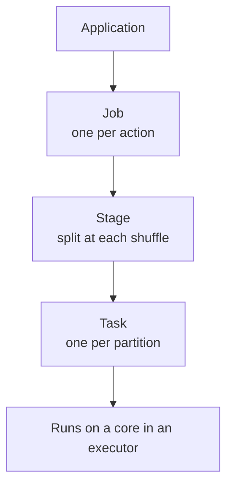

```text
Action    → triggers a Job          (count, write, collect, show)
Shuffle   → splits a Job into Stages
Partition → becomes one Task
Task      → occupies one CPU core
```

```text
Concrete: a 10-node cluster with 4 cores per node runs 40 tasks at once.
If your data has 12 partitions, 28 cores sit idle.
If it has 40 000 partitions, you get 1000 waves of scheduling overhead.
```

---

## Transformations vs Actions

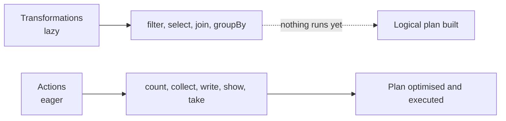

```python
df = spark.table("orders")          # nothing happens
df2 = df.filter("amount > 100")     # nothing happens
df3 = df2.groupBy("country").count()# nothing happens
df3.show()                          # NOW everything runs
```

```text
Consequence: a "slow line" is almost never the line you think.
The action is where all the accumulated work appears.
```

### Narrow vs wide transformations

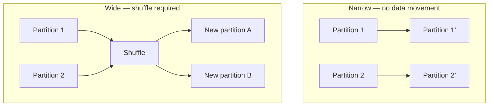

| Narrow | Wide (shuffle) |
|--------|----------------|
| `filter`, `select`, `withColumn` | `groupBy`, `join`, `distinct` |
| `union`, `map` | `orderBy`, `repartition` |
| Fast, parallel, no network | Network transfer, disk writes, the main cost |

```text
Optimisation instinct: count the shuffles in your query.
Each one is a stage boundary and a chance for skew and spill.
```

---

## The Shuffle: Why It Is Expensive

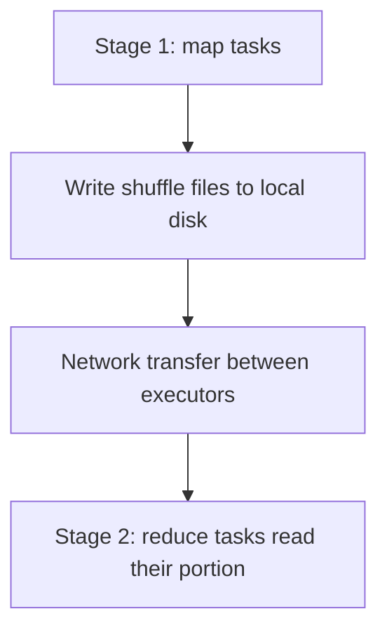

```text
A shuffle involves:
1. Serialising data
2. Writing it to local disk
3. Sending it over the network
4. Reading and deserialising it

That is why one avoidable join or a needless orderBy can dominate a job.
```

```python
# ❌ Sorts the ENTIRE dataset across the cluster
df.orderBy("amount").show(10)

# ✔ Same answer, no full sort
df.orderBy("amount").limit(10).show()     # Spark optimises limit + sort
# or, if approximate ordering is fine
df.sortWithinPartitions("amount")
```

---

## Partitions: the Unit of Parallelism

```text
Too few  → cores idle, individual tasks huge, memory pressure, spill
Too many → scheduling overhead dominates, tiny wasteful tasks
```

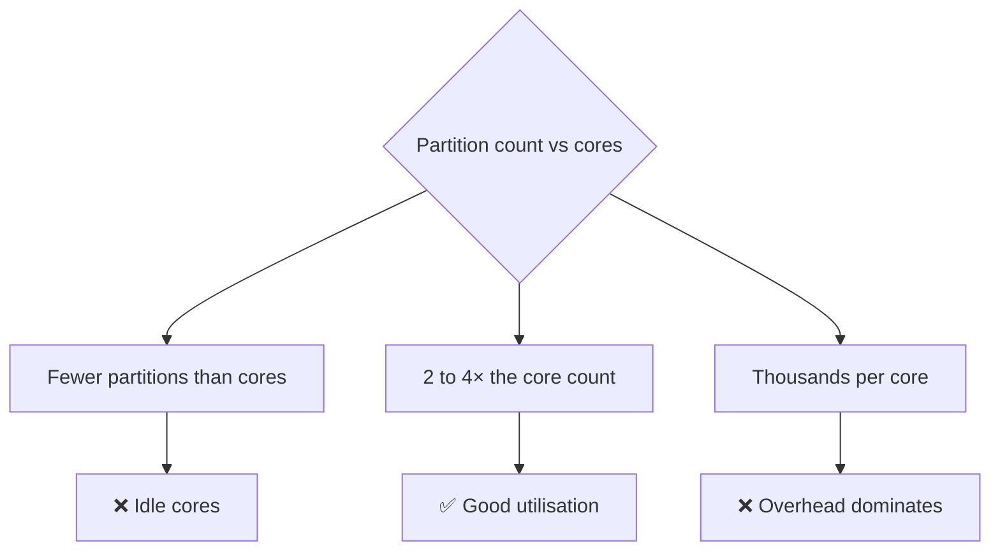

```python
df.rdd.getNumPartitions()                 # how many now?
spark.conf.get("spark.sql.shuffle.partitions")   # default 200
```

### Target partition size

```text
Aim for roughly 128 MB to 1 GB per partition of input data.

10 GB dataset / 200 MB ≈ 50 partitions
1 TB dataset  / 500 MB ≈ 2000 partitions
```

```python
# Setting shuffle partitions for a job
spark.conf.set("spark.sql.shuffle.partitions", 400)
```

```text
The default of 200 is right for almost nothing. With AQE enabled Spark
coalesces small shuffle partitions automatically, which removes most of
the pain — but a sensible starting value still helps.
```

---

## repartition vs coalesce

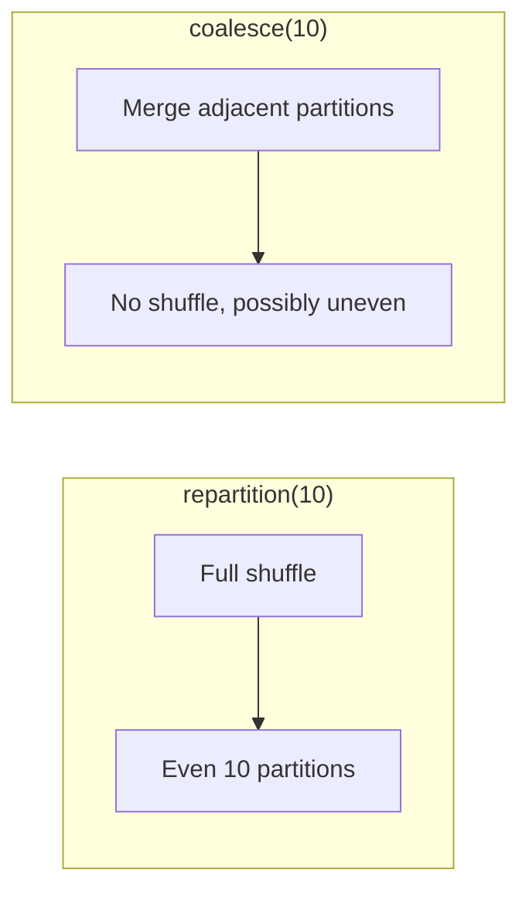

| | `repartition(n)` | `coalesce(n)` |
|---|-----------------|---------------|
| Shuffle | Yes, full | No |
| Result | Evenly sized | Possibly uneven |
| Can increase count | Yes | No (only decrease) |
| Cost | Expensive | Cheap |

```python
# Reducing file count before a write — coalesce is usually right
df.coalesce(8).write.format("delta").save(path)

# Redistributing skewed data — repartition is needed
df.repartition(200, "customer_id").write...
```

```text
Trap: coalesce(1) before a large write does not just merge partitions —
it forces the ENTIRE dataset through a single task. On big data this
turns a 5-minute job into an hour, or an OOM.
```

---

## Executors, Cores, and Memory

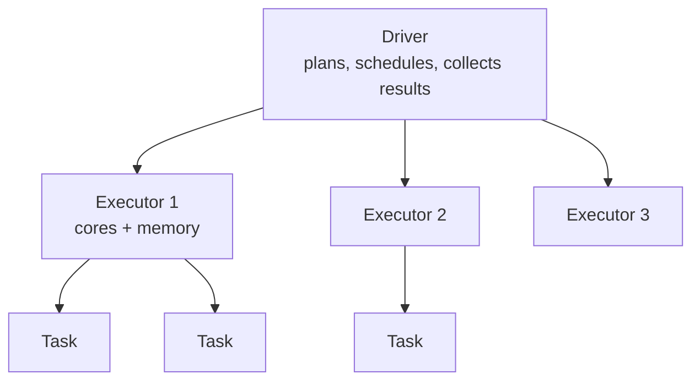

```text
Driver:   builds the plan, schedules tasks, holds collected results
Executor: runs tasks, holds cached data and shuffle files
Core:     runs one task at a time
```

```text
Driver OOM   → usually .collect() or .toPandas() on something large
Executor OOM → a partition too big, heavy skew, or a huge broadcast
```

```python
# ❌ pulls everything to the driver
rows = df.collect()

# ✔ keep work distributed, or limit explicitly
df.write.format("delta").saveAsTable("...")
sample = df.limit(1000).toPandas()
```

---

## Reading the Spark UI

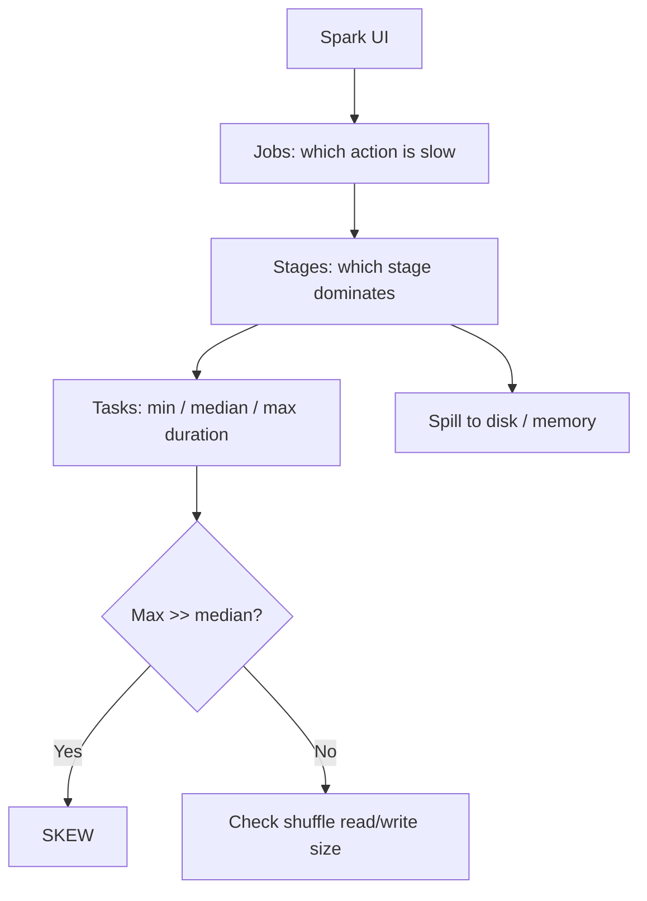

The task duration distribution is the single most informative number:

```text
Tasks: min 2s, median 3s, max 4s      → healthy
Tasks: min 1s, median 2s, max 900s    → severe skew, one partition is huge
```

Other key columns:

```text
Shuffle Read / Write  → how much data crossed the network
Spill (Memory / Disk) → data did not fit; the cluster or partitions are too small
Input Size            → how much was actually read (pruning effectiveness)
GC Time               → high values mean memory pressure
```

### In Databricks SQL: the query profile

The same information in a friendlier form: time per operator, rows in versus
rows out, bytes scanned, spill, and Photon coverage.

```text
Always start here. Guessing without the profile is how teams spend a week
tuning the wrong stage.
```

---

## Adaptive Query Execution (AQE)

AQE re-optimises the plan **at runtime**, using actual statistics rather than
estimates.

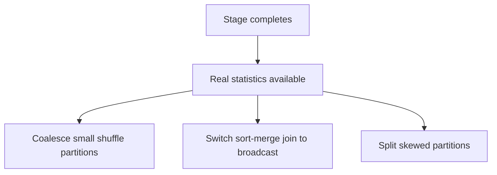

```python
spark.conf.get("spark.sql.adaptive.enabled")                    # true by default
spark.conf.get("spark.sql.adaptive.coalescePartitions.enabled")
spark.conf.get("spark.sql.adaptive.skewJoin.enabled")
```

```text
What AQE fixed, historically:
- The 200-shuffle-partition default producing thousands of tiny files
- Bad join strategy choices from stale or missing statistics
- Manual salting for moderate skew

What it does not fix:
- Reading far too much data (that is layout, not runtime)
- Extreme skew from a single dominant key
- A genuinely undersized cluster
```

---

## Lazy Evaluation and Repeated Work

```python
df = spark.table("orders").filter("amount > 100")

df.count()                    # reads and filters
df.groupBy("country").count().show()   # reads and filters AGAIN
df.write.saveAsTable("x")     # reads and filters a THIRD time
```

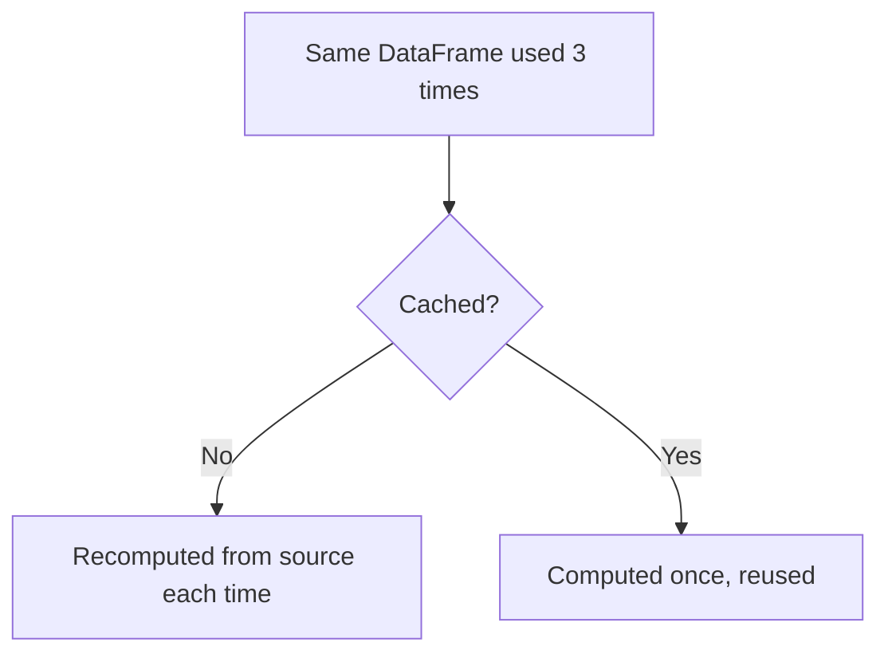

```python
df.cache()
df.count()        # materialises the cache
# subsequent actions reuse it
```

```text
But: caching is not free. It consumes executor memory that would
otherwise hold shuffle data. Cache only when a DataFrame is used
several times AND is expensive to recompute. See caching_and_query_tuning.md.
```

---

## Putting It Together: Reading a Slow Job

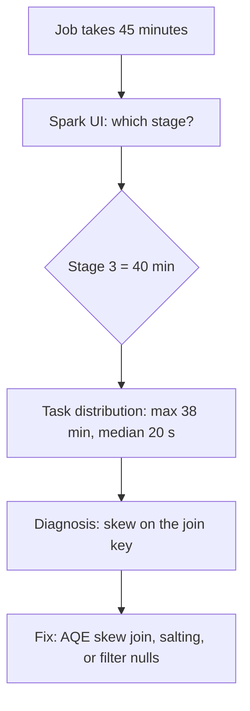

```text
The discipline:
1. Find the slowest STAGE, not the slowest line of code
2. Look at task min / median / max
3. Check shuffle size and spill
4. Check input size vs output rows (pruning)
5. Change one thing, re-measure
```

---

## Common Interview Questions

### What is a partition in Spark?

A chunk of data processed by a single task on a single core. Partition count
determines parallelism.

### Narrow vs wide transformation?

Narrow transformations operate within a partition with no data movement
(`filter`, `select`). Wide transformations require a shuffle (`groupBy`, `join`,
`distinct`, `orderBy`).

### Why is a shuffle expensive?

Data must be serialised, written to local disk, transferred over the network, and
read back. It also creates a stage boundary where skew and spill appear.

### repartition vs coalesce?

`repartition` performs a full shuffle and produces evenly sized partitions and
can increase the count. `coalesce` merges adjacent partitions without a shuffle,
can only reduce the count, and may leave uneven sizes.

### Why is `coalesce(1)` dangerous?

It funnels the entire dataset through a single task, removing all parallelism and
frequently causing OOM or extreme runtimes on large data.

### How do you spot skew in the Spark UI?

The maximum task duration (or shuffle read size) is far larger than the median
within the same stage.

### What does AQE do?

Re-optimises at runtime: coalescing small shuffle partitions, converting joins to
broadcast joins, and splitting skewed partitions.

### What causes driver OOM versus executor OOM?

Driver OOM usually comes from `collect()` or `toPandas()` on large data. Executor
OOM comes from oversized partitions, severe skew, or an oversized broadcast.

---

## Quick Revision

```text
Action → Job → Stages (split at shuffles) → Tasks (one per partition)

Narrow: filter, select, withColumn      → no shuffle
Wide:   groupBy, join, distinct, orderBy → shuffle

Partition size target: ~128 MB to 1 GB
spark.sql.shuffle.partitions default 200 — usually wrong, AQE mitigates it

repartition → full shuffle, even sizes, can increase count
coalesce    → no shuffle, can only reduce, may be uneven
coalesce(1) on big data → single task, disaster

Spark UI:
slowest stage → task min/median/max → skew
shuffle read/write → network cost
spill → undersized memory or partitions

AQE fixes: partition coalescing, join strategy, moderate skew
AQE does NOT fix: bad data layout, extreme skew, undersized clusters

Diagnose before tuning. Change one thing at a time.
```
