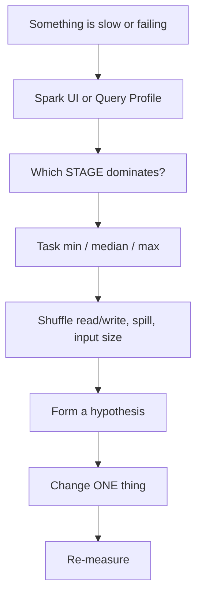
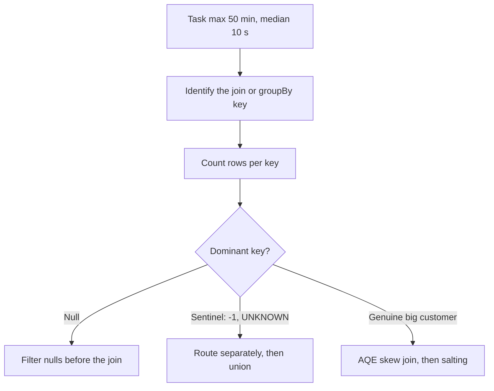
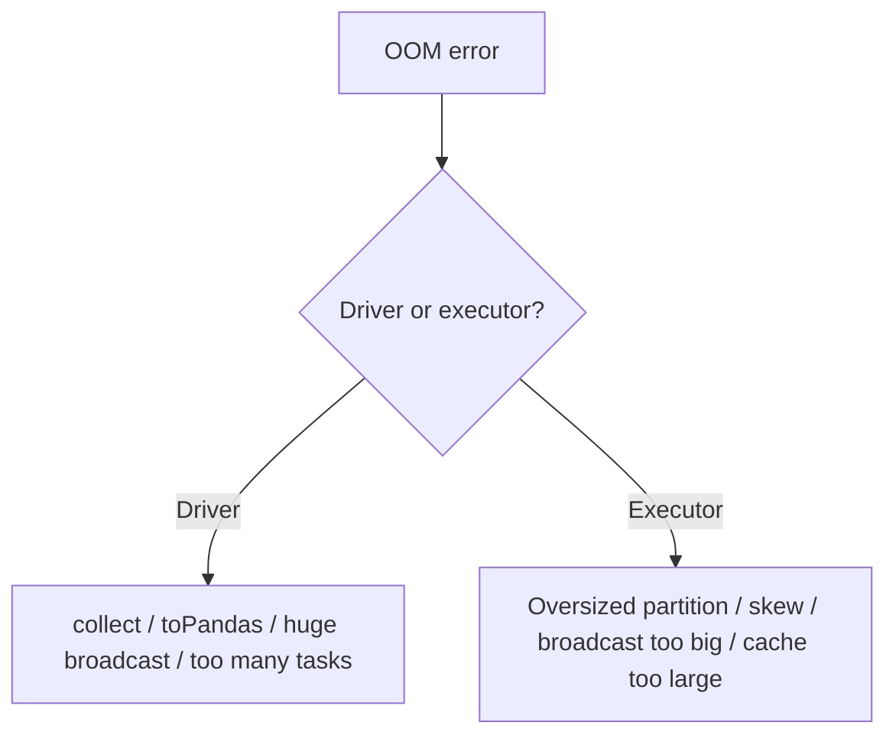
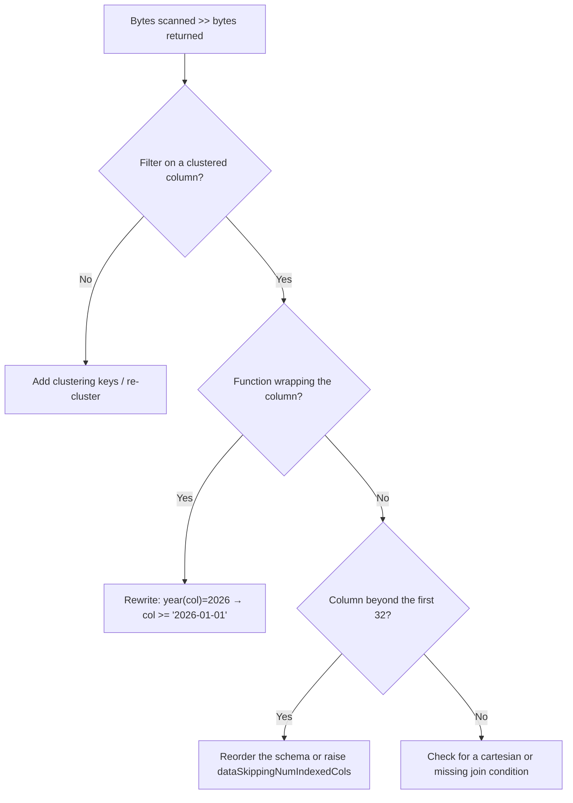
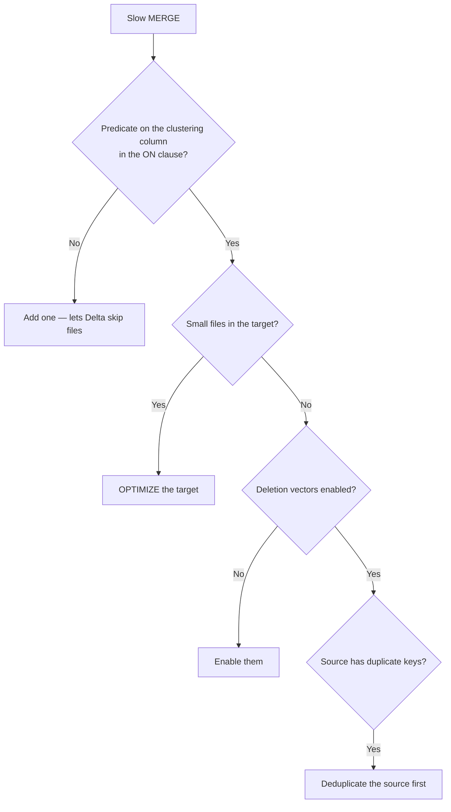
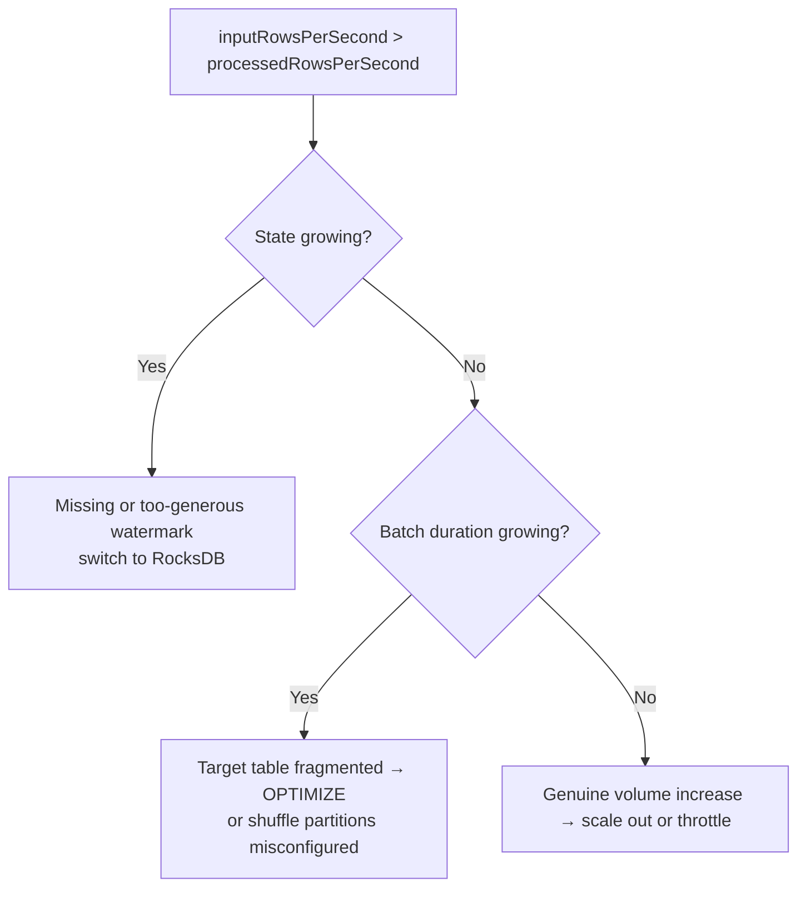
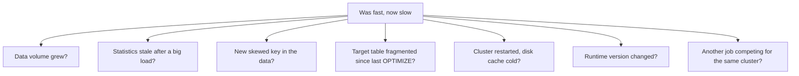
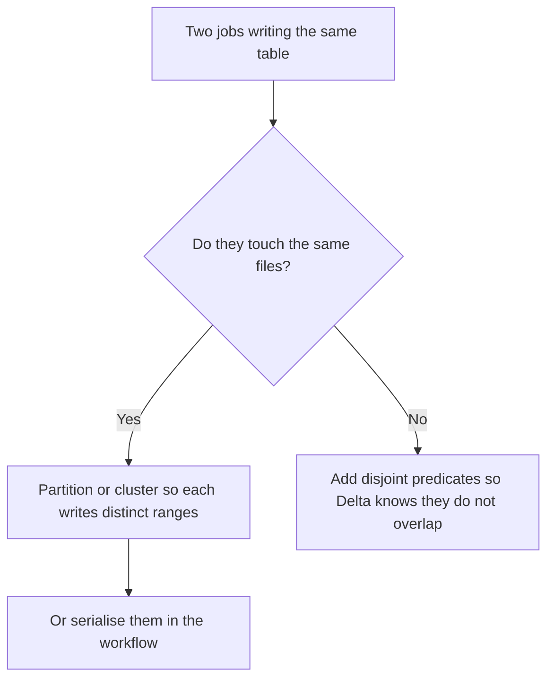
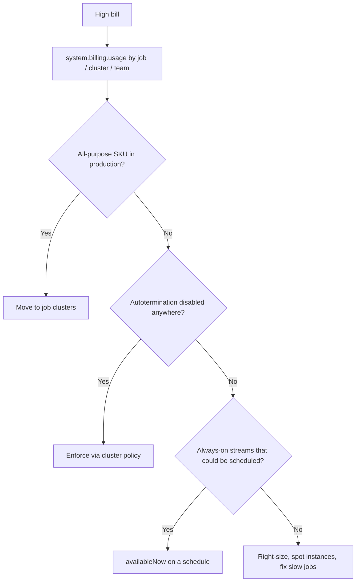

# Troubleshooting Guide: Symptom → Diagnosis → Fix

A lookup table for when something is slow or broken. Start at the symptom.

---

## The Universal First Steps



```text
Never skip to a fix. The same symptom has five different causes,
and four of the fixes will make things worse.
```

---

## Symptom: The Job Is Slow Overall

| Check | If true | Fix |
|-------|---------|-----|
| Input size >> output rows | Reading too much | Clustering keys, filter form, column pruning |
| One stage dominates | Localised problem | Drill into that stage |
| Task max >> median | Skew | See skew section below |
| Large spill | Memory pressure | More shuffle partitions, fix skew, more memory per core |
| CPU utilisation low | Not compute-bound | Do not add nodes — find the real bottleneck |
| Many tiny tasks | Too many partitions | Coalesce, raise advisory partition size |
| Long "scheduler delay" | Cluster starting or contention | Serverless, or check for competing jobs |

---

## Symptom: One Task Runs Forever (Skew)



```sql
SELECT customer_id, count(*) AS n
FROM main.silver.orders
GROUP BY customer_id ORDER BY n DESC LIMIT 20;
```

```python
spark.conf.set("spark.sql.adaptive.skewJoin.enabled", "true")
spark.conf.set("spark.sql.adaptive.skewJoin.skewedPartitionFactor", 5)
```

See [joins_and_skew.md](joins_and_skew.md) for salting.

---

## Symptom: Out of Memory



### Driver OOM

```python
# ❌ common causes
rows = df.collect()
pdf = df.toPandas()
spark.conf.set("spark.sql.autoBroadcastJoinThreshold", 2 * 1024**3)   # 2 GB broadcast

# ✔ fixes
df.write.format("delta").saveAsTable("...")     # keep it distributed
df.limit(1000).toPandas()                        # bound what you pull back
spark.conf.set("spark.driver.maxResultSize", "8g")   # only if genuinely needed
```

### Executor OOM

```text
1. Increase shuffle partitions → smaller partitions per task
2. Fix skew → one task is holding everything
3. Reduce broadcast threshold → a broadcast that is too large
4. Unpersist unused cached DataFrames
5. Use fewer cores per executor → more memory per task
6. Only then, memory-optimised nodes
```

---

## Symptom: Query Scans Far More Data Than Expected



```sql
DESCRIBE DETAIL main.gold.sales;          -- file count and size
DESCRIBE HISTORY main.gold.sales;         -- was it recently rewritten?
```

---

## Symptom: Many Small Files

```text
DESCRIBE DETAIL → numFiles 82 000, sizeInBytes 4 GB → avg 51 KB
```

```sql
OPTIMIZE main.silver.orders;

ALTER TABLE main.silver.orders SET TBLPROPERTIES (
  'delta.autoOptimize.optimizeWrite' = 'true',
  'delta.autoOptimize.autoCompact'   = 'true'
);
```

```text
Root causes:
- Streaming with a short trigger interval
- Over-partitioning (a directory per customer)
- Many small appends in a loop
- coalesce/repartition set too high before writing
```

---

## Symptom: MERGE Is Very Slow



```sql
MERGE INTO main.silver.orders t
USING updates s
ON t.order_id = s.order_id
   AND t.order_date >= current_date() - INTERVAL 7 DAYS   -- ← the key line
WHEN MATCHED THEN UPDATE SET *
WHEN NOT MATCHED THEN INSERT *;
```

```text
Error "multiple source rows matched a target row"
→ deduplicate the source by key first (row_number by a sequence column).
```

---

## Symptom: The Stream Is Falling Behind



```python
p = query.lastProgress
print(p["inputRowsPerSecond"], p["processedRowsPerSecond"], p["batchDuration"])
print([op["numRowsTotal"] for op in p.get("stateOperators", [])])
```

See [topic 11](../11_streaming/production_streaming.md).

---

## Symptom: The Job Suddenly Got Slower With No Code Change



```sql
ANALYZE TABLE main.silver.orders COMPUTE STATISTICS FOR ALL COLUMNS;
DESCRIBE DETAIL main.silver.orders;
DESCRIBE HISTORY main.silver.orders LIMIT 20;
```

```text
The most common answer in practice: an upstream change introduced a new
sentinel value, creating skew that did not exist last week.
```

---

## Symptom: Dashboard or SQL Query Is Slow

| Check | Fix |
|-------|-----|
| Querying silver, not gold | Pre-aggregate into gold |
| No date filter | Push a date parameter into the SQL |
| Warehouse cold starting | Serverless warehouse |
| Queries queued, not slow | Increase max clusters, not size |
| Small files on the gold table | OPTIMIZE + auto compaction |
| Same heavy aggregate in many tiles | Materialized view or shared dataset |

---

## Symptom: Concurrent Write Conflicts

```text
ConcurrentAppendException / ConcurrentDeleteReadException
```



```python
# Give Delta the information that writes are disjoint
(df.write.format("delta").mode("overwrite")
   .option("replaceWhere", f"order_date = '{run_date}'")
   .saveAsTable("main.silver.orders"))
```

```text
Also: set max_concurrent_runs = 1 on jobs that write the same table.
```

---

## Symptom: Cluster Takes Forever to Start

```text
Causes:
- Large init scripts or many libraries installed at startup
- Custom Docker images
- Cloud capacity shortage for the requested instance type
- Spot instances unavailable

Fixes:
✔ Serverless compute (seconds)
✔ Instance pools (pre-warmed VMs)
✔ Move library installs into a container image or use cluster libraries sparingly
✔ SPOT_WITH_FALLBACK so unavailability does not block
```

---

## Symptom: Costs Are Too High



---

## Diagnostic Command Reference

```sql
-- Table health
DESCRIBE DETAIL main.silver.orders;
DESCRIBE HISTORY main.silver.orders LIMIT 20;
SHOW TBLPROPERTIES main.silver.orders;

-- Key distribution (skew)
SELECT key_col, count(*) n FROM t GROUP BY key_col ORDER BY n DESC LIMIT 20;

-- Slowest recent queries
SELECT statement_text, total_duration_ms/1000 s, read_bytes/1e9 gb
FROM system.query.history
WHERE start_time >= current_date() - INTERVAL 1 DAY
ORDER BY total_duration_ms DESC LIMIT 20;

-- Job run durations over time
SELECT job_id, date(period_start_time) d,
       avg((unix_timestamp(period_end_time)-unix_timestamp(period_start_time))/60) avg_min
FROM system.lakeflow.job_run_timeline
WHERE period_start_time >= current_date() - INTERVAL 30 DAYS
GROUP BY 1,2 ORDER BY 1,2;
```

```python
# Plan inspection
df.explain(True)                 # parsed, analysed, optimised, physical plans
df.explain("formatted")          # readable operator tree
df.rdd.getNumPartitions()
spark.conf.get("spark.sql.shuffle.partitions")
```

---

## Fix Priority Order

```text
When you have limited time, work in this order — cheapest and
highest-impact first:

1. Fix the data layout      (clustering, OPTIMIZE, file sizes)
2. Fix the query            (filters, projections, join order, no UDFs)
3. Fix skew                 (nulls, sentinels, AQE, salting)
4. Fix memory               (shuffle partitions, spill, caching discipline)
5. Change the cluster       (size, node type, Photon)
6. Change the architecture  (pre-aggregate, materialize, incremental)

Most teams start at step 5. That is why their bill is large and their
job is still slow.
```

---

## Quick Revision

```text
Always: Spark UI / query profile → slowest stage → task min/median/max

Slow overall      → check bytes scanned vs returned first
One long task     → skew: null or sentinel key, then AQE, then salting
OOM driver        → collect/toPandas/oversized broadcast
OOM executor      → partition too big, skew, cache, broadcast
Over-scanning     → clustering, bare filter columns, first-32-columns rule
Small files       → OPTIMIZE + optimizeWrite + autoCompact
Slow MERGE        → add a clustering-column predicate to ON; dedupe source
Stream behind     → state growth, target fragmentation, throttle, scale
Suddenly slower   → stale stats, new skewed key, fragmentation, cold cache
Write conflicts   → replaceWhere, disjoint ranges, max_concurrent_runs = 1
High cost         → all-purpose in prod, no autotermination, always-on streams

Fix order: layout → query → skew → memory → cluster → architecture
```
