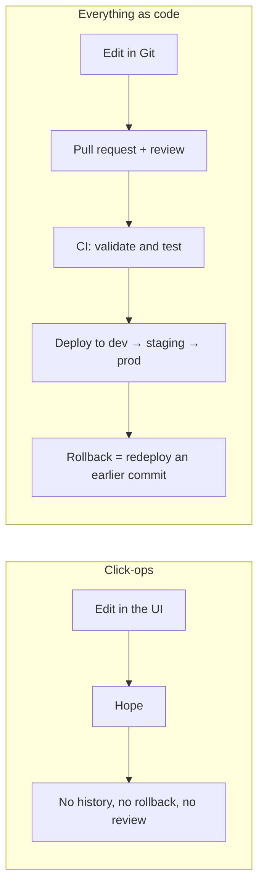
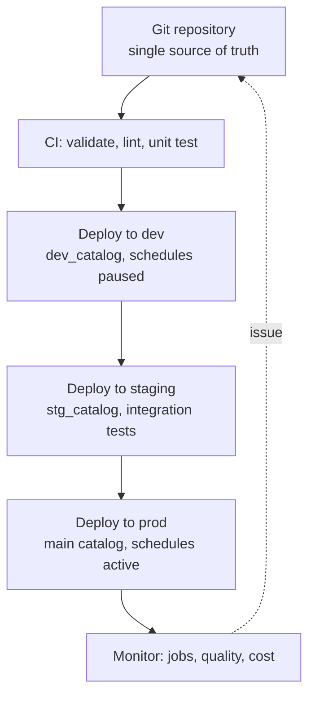

# 15 – DevOps and CI/CD

Everything so far was about building pipelines. This topic is about making them
**reproducible, reviewable, and deployable** — the difference between a clever
notebook and a data platform.

---

## The Problem

```text
Someone edited a production job in the UI on Friday.
Nobody knows what changed, there is no way to roll back,
and the dev workspace is now three months out of date.
```



---

## Reading Order

| # | File | What you learn |
|---|------|----------------|
| 1 | [databricks_cli.md](databricks_cli.md) | The CLI: your interface to everything |
| 2 | [asset_bundles.md](asset_bundles.md) | Defining jobs, pipelines, and clusters as code |
| 3 | [git_workflow.md](git_workflow.md) | Repos, branching, and environment strategy |
| 4 | [testing_strategies.md](testing_strategies.md) | Unit, integration, and data tests |
| 5 | [cicd_pipelines.md](cicd_pipelines.md) | GitHub Actions and Azure DevOps end to end |
| 6 | [terraform_and_iac.md](terraform_and_iac.md) | Provisioning workspaces and governance |
| 7 | [interview_questions.md](interview_questions.md) | Questions asked in interviews |

---

## The Deployment Model



```text
Three environments, one definition, different variables.
Nothing is ever created by hand in production.
```

---

## Quick Revision

```text
Databricks CLI          → the interface to workspace, jobs, bundles, UC
Asset Bundles (DABs)    → declarative YAML for jobs, pipelines, clusters
Git folders / Repos     → notebooks and code versioned in the workspace
Terraform               → workspaces, metastores, permissions, infrastructure
CI/CD                   → validate → test → deploy per environment
Service principals      → production identity; never a personal account
```
