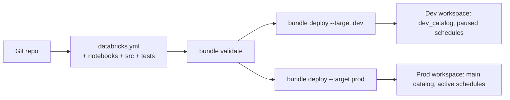
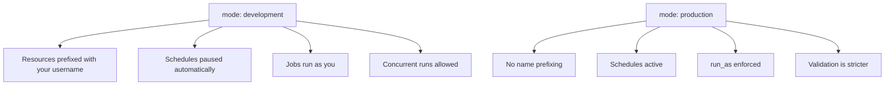
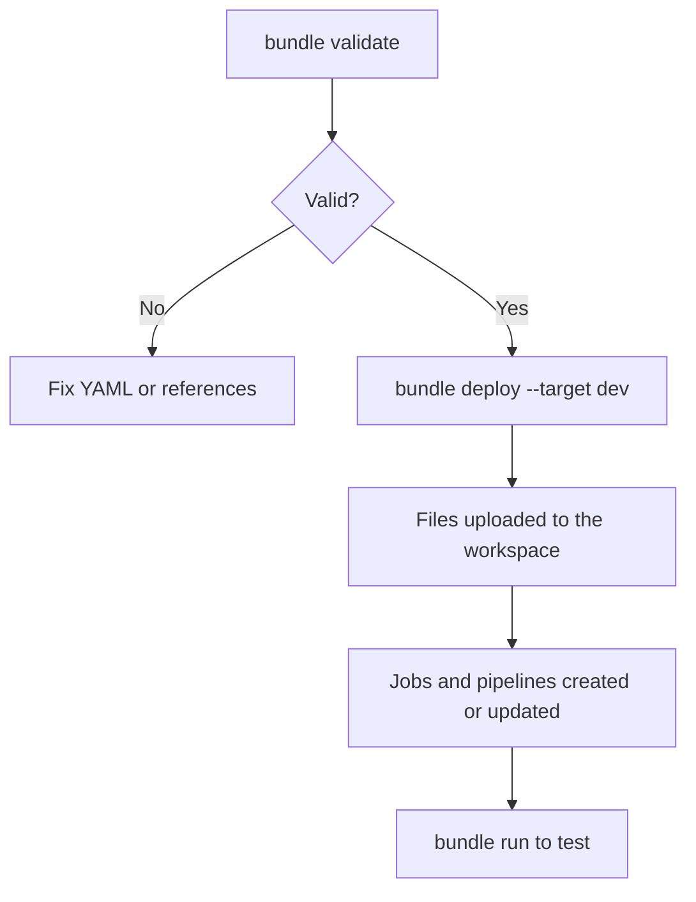
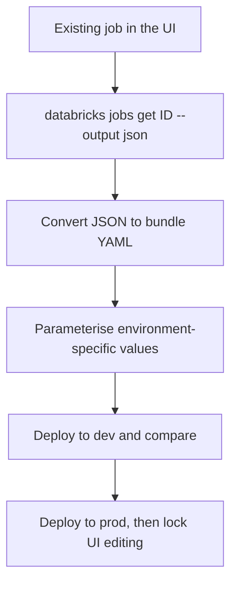

# Databricks Asset Bundles (DABs)

## What They Are

A bundle is a folder containing your code plus a YAML description of the
Databricks resources it needs: jobs, DLT pipelines, clusters, experiments, and
their per-environment settings.

```text
Asset Bundles are to Databricks what Terraform is to cloud infrastructure,
scoped to workspace resources and designed for the developer workflow.
```



---

## Project Layout

```text
retail-platform/
├── databricks.yml              # bundle definition
├── resources/
│   ├── jobs.yml                # job definitions
│   └── pipelines.yml           # DLT pipeline definitions
├── src/
│   ├── ingest/
│   │   └── auto_loader.py
│   ├── transform/
│   │   ├── silver_orders.py
│   │   └── gold_sales.py
│   └── common/
│       └── transforms.py       # pure functions, unit tested
├── tests/
│   ├── test_transforms.py
│   └── conftest.py
├── requirements.txt
└── .github/workflows/deploy.yml
```

```bash
databricks bundle init            # scaffold from a template
databricks bundle init default-python
```

---

## The Bundle File

```yaml
# databricks.yml
bundle:
  name: retail_platform

include:
  - resources/*.yml

variables:
  catalog:
    description: Unity Catalog to publish to
    default: dev_catalog
  landing_path:
    default: /Volumes/dev_catalog/landing
  warehouse_id:
    default: "abc123"
  node_type:
    default: Standard_DS3_v2

targets:
  dev:
    mode: development
    default: true
    workspace:
      host: https://adb-111.11.azuredatabricks.net
    variables:
      catalog: dev_catalog
      landing_path: /Volumes/dev_catalog/landing

  staging:
    mode: production
    workspace:
      host: https://adb-555.55.azuredatabricks.net
      root_path: /Shared/.bundle/${bundle.name}/${bundle.target}
    variables:
      catalog: stg_catalog
      landing_path: /Volumes/stg_catalog/landing
    run_as:
      service_principal_name: sp-data-platform-stg

  prod:
    mode: production
    workspace:
      host: https://adb-999.99.azuredatabricks.net
      root_path: /Shared/.bundle/${bundle.name}/${bundle.target}
    variables:
      catalog: main
      landing_path: /Volumes/main/landing
      node_type: Standard_DS4_v2
    run_as:
      service_principal_name: sp-data-platform-prod
    permissions:
      - level: CAN_VIEW
        group_name: data-analysts
      - level: CAN_MANAGE
        group_name: data-engineers
```

### What `mode` changes



```text
Development mode means two engineers can deploy the same bundle to the
same workspace without colliding: each gets [dev yourname] prefixed
resources. This single feature removes most "who broke the dev job" pain.
```

---

## Defining a Job

```yaml
# resources/jobs.yml
resources:
  jobs:
    retail_daily_pipeline:
      name: retail_daily_pipeline
      max_concurrent_runs: 1

      schedule:
        quartz_cron_expression: "0 0 6 * * ?"
        timezone_id: UTC

      email_notifications:
        on_failure:
          - data-oncall@company.com
        no_alert_for_skipped_runs: true

      health:
        rules:
          - metric: RUN_DURATION_SECONDS
            op: GREATER_THAN
            value: 3600

      parameters:
        - name: catalog
          default: ${var.catalog}
        - name: run_date
          default: "{{job.start_time.[iso_date]}}"

      job_clusters:
        - job_cluster_key: main
          new_cluster:
            spark_version: "14.3.x-scala2.12"
            node_type_id: ${var.node_type}
            autoscale:
              min_workers: 2
              max_workers: 8
            data_security_mode: SINGLE_USER
            custom_tags:
              team: data-platform
              env: ${bundle.target}

      tasks:
        - task_key: ingest_bronze
          job_cluster_key: main
          max_retries: 2
          notebook_task:
            notebook_path: ../src/ingest/auto_loader.py
            base_parameters:
              landing_path: ${var.landing_path}

        - task_key: build_silver
          depends_on: [{ task_key: ingest_bronze }]
          job_cluster_key: main
          notebook_task:
            notebook_path: ../src/transform/silver_orders.py

        - task_key: build_gold
          depends_on: [{ task_key: build_silver }]
          job_cluster_key: main
          notebook_task:
            notebook_path: ../src/transform/gold_sales.py

        - task_key: refresh_dashboard
          depends_on: [{ task_key: build_gold }]
          sql_task:
            warehouse_id: ${var.warehouse_id}
            dashboard:
              dashboard_id: "dash-789"
```

---

## Defining a DLT Pipeline

```yaml
# resources/pipelines.yml
resources:
  pipelines:
    retail_medallion:
      name: "retail_medallion_${bundle.target}"
      catalog: ${var.catalog}
      schema: retail
      serverless: true
      photon: true
      development: false
      libraries:
        - notebook: { path: ../src/dlt/01_bronze.py }
        - notebook: { path: ../src/dlt/02_silver.py }
        - notebook: { path: ../src/dlt/03_gold.py }
      configuration:
        env: ${bundle.target}
        source_path: ${var.landing_path}
      notifications:
        - email_recipients: [data-oncall@company.com]
          alerts: [on-update-failure, on-flow-failure]
```

Reference it from a job:

```yaml
- task_key: run_dlt
  pipeline_task:
    pipeline_id: ${resources.pipelines.retail_medallion.id}
```

```text
That ${resources....id} reference is resolved at deploy time.
You never hard-code a pipeline id, which is what breaks most
hand-maintained job JSON.
```

---

## Variables and Substitution

```yaml
variables:
  catalog:
    default: dev_catalog
  warehouse_id:
    lookup:
      warehouse: "analytics_serverless"     # resolve by name at deploy time
```

```text
Built-in substitutions:
${bundle.name}          retail_platform
${bundle.target}        dev | staging | prod
${workspace.host}       the target workspace URL
${workspace.current_user.userName}
${var.<name>}           your own variables
${resources.jobs.<key>.id}
${resources.pipelines.<key>.id}
```

```bash
# Override at deploy time
databricks bundle deploy --target prod --var="catalog=main"
```

---

## The Deployment Workflow

```bash
databricks bundle validate                 # syntax + resolution check
databricks bundle validate --target prod   # validate a specific target

databricks bundle deploy --target dev
databricks bundle run retail_daily_pipeline
databricks bundle summary                  # what is deployed and where

databricks bundle destroy --target dev     # tear down dev resources
```



```text
Deploy is idempotent: it converges the workspace to match the bundle.
Resources removed from the YAML are deleted on the next deploy —
which is exactly what you want, and worth knowing before it surprises you.
```

---

## Python Wheels in a Bundle

Notebooks are convenient; packaged code is testable.

```yaml
artifacts:
  retail_lib:
    type: whl
    build: python -m build --wheel
    path: .

resources:
  jobs:
    retail_daily_pipeline:
      tasks:
        - task_key: transform
          python_wheel_task:
            package_name: retail_lib
            entry_point: run_silver
          libraries:
            - whl: ../dist/*.whl
```

```python
# src/retail_lib/transforms.py — a pure, testable function
def clean_orders(df):
    return (df.filter("order_id IS NOT NULL")
              .withColumn("amount", col("amt").cast("decimal(18,2)")))
```

```text
Bundle builds the wheel, uploads it, and attaches it to the task.
The same function is unit tested in CI without a Databricks cluster.
```

---

## Permissions as Code

```yaml
targets:
  prod:
    permissions:
      - level: CAN_MANAGE
        group_name: data-engineers
      - level: CAN_VIEW
        group_name: data-analysts
      - level: CAN_MANAGE_RUN
        service_principal_name: sp-orchestrator
```

```text
Applied to every resource in the bundle. Access changes go through
pull request review like any other change.
```

---

## Migrating an Existing Workspace to Bundles



```bash
# Export the current definition as a starting point
databricks jobs get 620745 --output json > existing_job.json
```

```text
Practical order:
1. Start with new jobs — do not migrate everything at once
2. Migrate the most business-critical job next
3. Remove UI edit permissions once a job is bundle-managed,
   otherwise the next manual edit is silently overwritten
```

---

## Common Mistakes

```text
❌ Hard-coded catalogs, paths, or warehouse ids instead of variables
❌ mode: development left on a production target
❌ Editing a bundle-managed job in the UI → overwritten on next deploy
❌ Schedules unpaused in dev → dev jobs running every morning
❌ Secrets in the YAML → use secret scopes and reference them
❌ No run_as service principal in prod → jobs break when someone leaves
❌ Deploying prod from a laptop instead of CI
```

---

## Common Interview Questions

### What are Databricks Asset Bundles?

A declarative, YAML-based way to define Databricks resources — jobs, DLT
pipelines, clusters, permissions — alongside code in Git, deployed per
environment with `databricks bundle deploy`.

### How do bundles handle multiple environments?

Targets, each with its own workspace host, variables, `run_as` identity, and
mode. One definition deploys to dev, staging, and prod with different values.

### What does `mode: development` do?

Prefixes resource names with the developer's username, pauses schedules, and runs
jobs as the deploying user — so multiple engineers can deploy to the same
workspace without collisions.

### How do you reference one resource from another?

Substitutions such as `${resources.pipelines.my_pipeline.id}`, resolved at deploy
time, so ids are never hard-coded.

### What happens if you remove a job from the bundle?

The next deploy deletes it from the workspace, because deploy converges the
workspace to the bundle definition.

### Why should bundle-managed jobs not be edited in the UI?

The next deployment overwrites the manual change, so the edit is lost and the
behaviour is confusing. Remove edit permissions once a job is bundle-managed.

### How do you include packaged Python code?

Define an `artifacts` entry to build a wheel, and attach it to tasks with
`python_wheel_task` and a `libraries` reference — which also makes the logic unit
testable in CI.

---

## Quick Revision

```text
Bundle = code + databricks.yml describing jobs, pipelines, clusters, permissions

Structure:
databricks.yml | resources/*.yml | src/ | tests/

Targets: dev (mode: development) | staging | prod (mode: production + run_as SP)
Variables: ${var.catalog}, ${bundle.target}, ${resources.jobs.x.id}

Commands:
bundle init | validate | deploy --target X | run <job> | summary | destroy

Key behaviours:
development mode → username-prefixed resources, paused schedules
deploy is idempotent and REMOVES resources deleted from the YAML

Best practice:
✔ Everything parameterised per target
✔ run_as service principal in prod
✔ Permissions as code
✔ Wheels for testable logic
✘ Never edit a bundle-managed job in the UI
```
