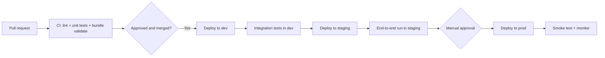
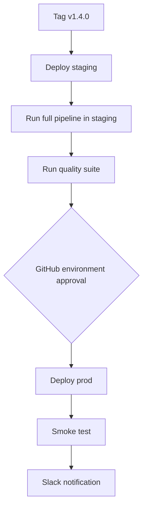
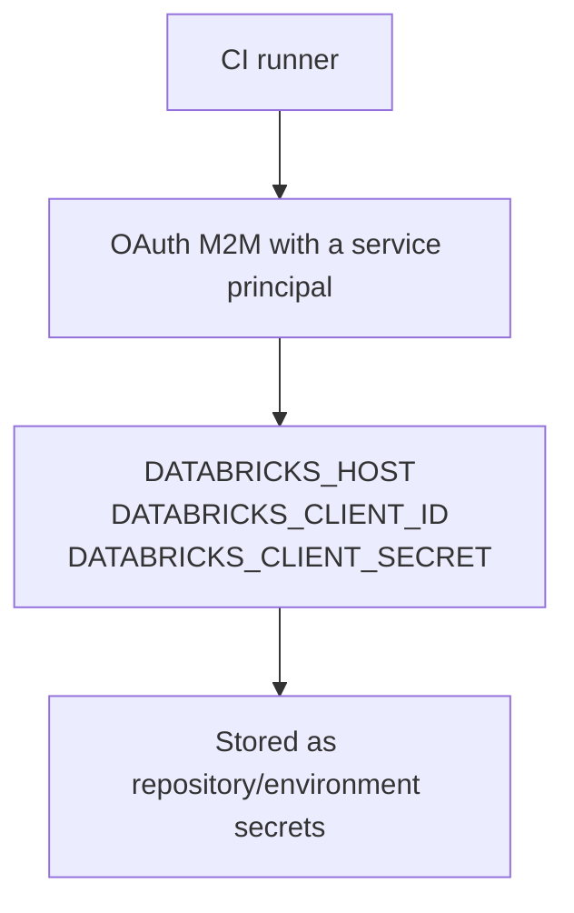
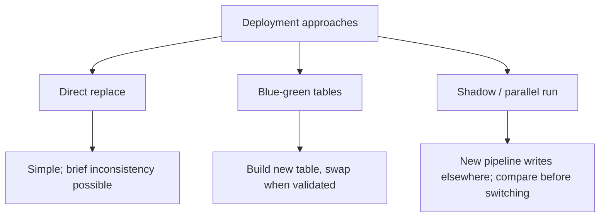
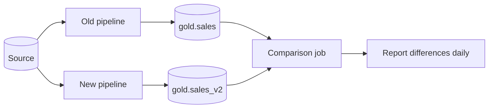
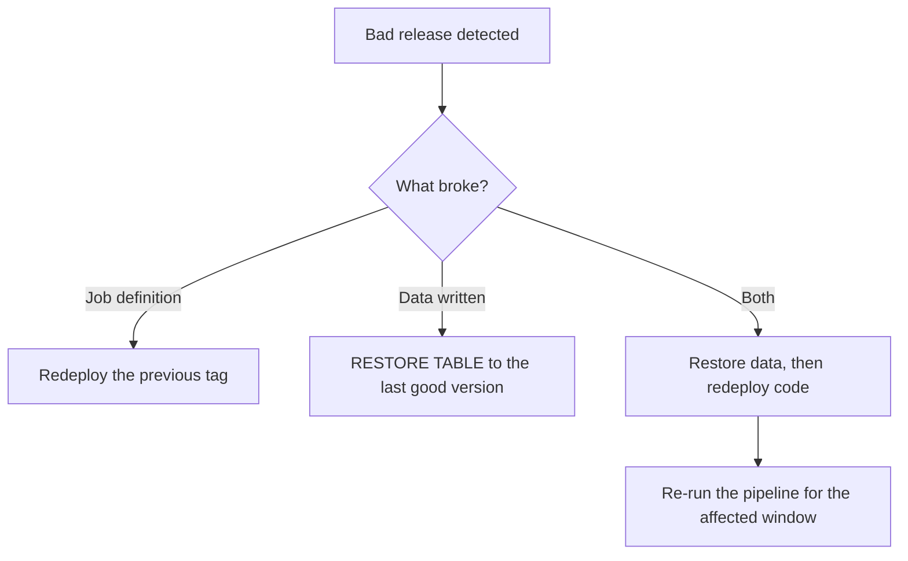

# CI/CD Pipelines

## The Shape of a Data Platform Pipeline



```text
The principle: nothing reaches production that has not been
validated, tested, and deployed the same way twice already.
```

---

## GitHub Actions: Pull Request Validation

```yaml
# .github/workflows/pr.yml
name: PR Validation

on:
  pull_request:
    branches: [main]

jobs:
  validate:
    runs-on: ubuntu-latest
    steps:
      - uses: actions/checkout@v4

      - uses: actions/setup-python@v5
        with:
          python-version: "3.11"

      - name: Install dependencies
        run: |
          pip install -r requirements.txt
          pip install pytest ruff

      - name: Lint
        run: ruff check src/ tests/

      - name: Unit tests
        run: pytest tests/unit -v --junitxml=results.xml

      - name: Install Databricks CLI
        uses: databricks/setup-cli@main

      - name: Validate bundle for every target
        env:
          DATABRICKS_HOST: ${{ secrets.DATABRICKS_HOST_DEV }}
          DATABRICKS_CLIENT_ID: ${{ secrets.DATABRICKS_CLIENT_ID }}
          DATABRICKS_CLIENT_SECRET: ${{ secrets.DATABRICKS_CLIENT_SECRET }}
        run: |
          databricks bundle validate --target dev
          databricks bundle validate --target staging
          databricks bundle validate --target prod

      - name: Publish test results
        if: always()
        uses: actions/upload-artifact@v4
        with:
          name: test-results
          path: results.xml
```

```text
Validating ALL targets on every PR catches the classic failure:
a change that works in dev but references a variable that only
exists in the dev target.
```

---

## Deploy to Dev on Merge

```yaml
# .github/workflows/deploy-dev.yml
name: Deploy to Dev

on:
  push:
    branches: [main]

jobs:
  deploy-dev:
    runs-on: ubuntu-latest
    environment: dev
    steps:
      - uses: actions/checkout@v4
      - uses: databricks/setup-cli@main

      - name: Deploy bundle
        env:
          DATABRICKS_HOST: ${{ secrets.DATABRICKS_HOST_DEV }}
          DATABRICKS_CLIENT_ID: ${{ secrets.DATABRICKS_CLIENT_ID_DEV }}
          DATABRICKS_CLIENT_SECRET: ${{ secrets.DATABRICKS_CLIENT_SECRET_DEV }}
        run: databricks bundle deploy --target dev

      - name: Run integration tests
        env:
          DATABRICKS_HOST: ${{ secrets.DATABRICKS_HOST_DEV }}
          DATABRICKS_CLIENT_ID: ${{ secrets.DATABRICKS_CLIENT_ID_DEV }}
          DATABRICKS_CLIENT_SECRET: ${{ secrets.DATABRICKS_CLIENT_SECRET_DEV }}
        run: databricks bundle run integration_tests --target dev
```

```yaml
# resources/jobs.yml — the integration test job lives in the bundle
resources:
  jobs:
    integration_tests:
      name: "integration_tests_${bundle.target}"
      tasks:
        - task_key: run_tests
          new_cluster:
            spark_version: "14.3.x-scala2.12"
            node_type_id: Standard_DS3_v2
            num_workers: 1
          notebook_task:
            notebook_path: ../tests/integration/run_all.py
            base_parameters:
              catalog: ${var.catalog}
```

```text
Integration tests that need a real cluster run AS a Databricks job,
triggered from CI. `bundle run` blocks until completion and returns
a non-zero exit code on failure, so CI fails correctly.
```

---

## Promote to Production

```yaml
# .github/workflows/deploy-prod.yml
name: Deploy to Production

on:
  push:
    tags: ["v*"]
  workflow_dispatch:

jobs:
  deploy-staging:
    runs-on: ubuntu-latest
    environment: staging
    steps:
      - uses: actions/checkout@v4
      - uses: databricks/setup-cli@main
      - name: Deploy and test in staging
        env:
          DATABRICKS_HOST: ${{ secrets.DATABRICKS_HOST_STG }}
          DATABRICKS_CLIENT_ID: ${{ secrets.DATABRICKS_CLIENT_ID_STG }}
          DATABRICKS_CLIENT_SECRET: ${{ secrets.DATABRICKS_CLIENT_SECRET_STG }}
        run: |
          databricks bundle deploy --target staging
          databricks bundle run retail_daily_pipeline --target staging
          databricks bundle run data_quality_suite --target staging

  deploy-prod:
    needs: deploy-staging
    runs-on: ubuntu-latest
    environment: production        # ← requires manual approval in GitHub
    steps:
      - uses: actions/checkout@v4
      - uses: databricks/setup-cli@main

      - name: Deploy to production
        env:
          DATABRICKS_HOST: ${{ secrets.DATABRICKS_HOST_PROD }}
          DATABRICKS_CLIENT_ID: ${{ secrets.DATABRICKS_CLIENT_ID_PROD }}
          DATABRICKS_CLIENT_SECRET: ${{ secrets.DATABRICKS_CLIENT_SECRET_PROD }}
        run: databricks bundle deploy --target prod

      - name: Smoke test
        env:
          DATABRICKS_HOST: ${{ secrets.DATABRICKS_HOST_PROD }}
          DATABRICKS_CLIENT_ID: ${{ secrets.DATABRICKS_CLIENT_ID_PROD }}
          DATABRICKS_CLIENT_SECRET: ${{ secrets.DATABRICKS_CLIENT_SECRET_PROD }}
        run: databricks bundle run smoke_test --target prod

      - name: Notify
        if: always()
        run: |
          curl -X POST -H 'Content-type: application/json' \
            --data "{\"text\":\"Prod deploy ${{ job.status }}: ${{ github.ref_name }}\"}" \
            ${{ secrets.SLACK_WEBHOOK }}
```



```text
The GitHub "environment" with required reviewers is what turns a
push into a controlled release, without needing a separate change
management tool.
```

---

## Azure DevOps Equivalent

```yaml
# azure-pipelines.yml
trigger:
  branches: { include: [main] }

variables:
  - group: databricks-credentials

stages:
  - stage: Validate
    jobs:
      - job: Test
        pool: { vmImage: ubuntu-latest }
        steps:
          - task: UsePythonVersion@0
            inputs: { versionSpec: "3.11" }
          - script: |
              pip install -r requirements.txt pytest ruff
              ruff check src/
              pytest tests/unit -v
            displayName: Lint and unit test
          - script: |
              curl -fsSL https://raw.githubusercontent.com/databricks/setup-cli/main/install.sh | sh
              databricks bundle validate --target dev
            env:
              DATABRICKS_HOST: $(DATABRICKS_HOST_DEV)
              DATABRICKS_CLIENT_ID: $(DATABRICKS_CLIENT_ID)
              DATABRICKS_CLIENT_SECRET: $(DATABRICKS_CLIENT_SECRET)
            displayName: Validate bundle

  - stage: DeployDev
    dependsOn: Validate
    jobs:
      - deployment: Dev
        environment: databricks-dev
        strategy:
          runOnce:
            deploy:
              steps:
                - script: databricks bundle deploy --target dev
                  env:
                    DATABRICKS_HOST: $(DATABRICKS_HOST_DEV)
                    DATABRICKS_CLIENT_ID: $(DATABRICKS_CLIENT_ID)
                    DATABRICKS_CLIENT_SECRET: $(DATABRICKS_CLIENT_SECRET)

  - stage: DeployProd
    dependsOn: DeployDev
    condition: and(succeeded(), eq(variables['Build.SourceBranch'], 'refs/heads/main'))
    jobs:
      - deployment: Prod
        environment: databricks-prod     # approval gate configured here
        strategy:
          runOnce:
            deploy:
              steps:
                - script: databricks bundle deploy --target prod
                  env:
                    DATABRICKS_HOST: $(DATABRICKS_HOST_PROD)
                    DATABRICKS_CLIENT_ID: $(DATABRICKS_CLIENT_ID_PROD)
                    DATABRICKS_CLIENT_SECRET: $(DATABRICKS_CLIENT_SECRET_PROD)
```

---

## Authentication in CI



```text
Setup:
1. Create a service principal per environment in the account console
2. Grant it workspace access and the permissions it needs
3. Generate an OAuth secret
4. Store host, client id, and secret as CI secrets
5. Grant the SP CAN_MANAGE on the bundle's resources

Separate service principals per environment. A single SP with prod
access used by dev CI is how dev mistakes reach production.
```

```text
✘ Never a personal access token
✘ Never a human's identity
✘ Never the same SP across environments
✔ Rotate secrets on a schedule
✔ Least privilege: staging SP cannot touch prod
```

---

## Deployment Strategies



### Blue-green for a gold table

```sql
-- Build the new version alongside the old
CREATE OR REPLACE TABLE main.gold.daily_sales_new AS SELECT ...;

-- Validate
SELECT count(*), sum(total_revenue) FROM main.gold.daily_sales_new;
SELECT count(*), sum(total_revenue) FROM main.gold.daily_sales;

-- Swap atomically via a view consumers read
CREATE OR REPLACE VIEW main.gold.daily_sales_current AS
SELECT * FROM main.gold.daily_sales_new;
```

```text
Consumers always read the view. Swapping the view is instantaneous and
reversible, which makes a bad release a 10-second rollback.
```

### Shadow run for a rewritten pipeline



```python
old = spark.table("main.gold.daily_sales")
new = spark.table("main.gold.daily_sales_v2")

only_in_old = old.exceptAll(new).count()
only_in_new = new.exceptAll(old).count()
print(f"Differences: {only_in_old} old-only, {only_in_new} new-only")
```

```text
Run both for a week. Zero differences for seven days is the evidence
that justifies switching consumers.
```

---

## Rollback

```text
Code rollback:
  git revert <commit> → CI redeploys the previous definition
  or: databricks bundle deploy from an earlier tag

Data rollback:
  DESCRIBE HISTORY main.gold.daily_sales;
  RESTORE TABLE main.gold.daily_sales TO VERSION AS OF 118;

Job rollback:
  Redeploying the bundle restores the previous job definition exactly.
```



```text
This is why bundles and Delta matter together: code and data both
have version history, so "roll back" is a real operation rather
than an incident postmortem action item.
```

---

## Database Migrations (DDL)

Schema changes need the same discipline as code.

```text
sql/migrations/
├── V001__create_silver_orders.sql
├── V002__add_currency_column.sql
├── V003__create_gold_daily_sales.sql
└── V004__grant_analysts_gold.sql
```

```sql
-- V002__add_currency_column.sql
ALTER TABLE main.silver.orders ADD COLUMN IF NOT EXISTS currency STRING;
COMMENT ON COLUMN main.silver.orders.currency IS 'ISO 4217 currency code';
```

```python
# Applied by a bundle job, tracked in a control table
applied = {r.version for r in spark.table("main.control.schema_migrations").collect()}

for f in sorted(Path("sql/migrations").glob("*.sql")):
    version = f.name.split("__")[0]
    if version in applied:
        continue
    for stmt in f.read_text().split(";"):
        if stmt.strip():
            spark.sql(stmt)
    spark.sql(f"""INSERT INTO main.control.schema_migrations
                  VALUES ('{version}', '{f.name}', current_timestamp())""")
```

```text
Rules:
✔ Migrations are additive and idempotent (IF NOT EXISTS)
✔ Never drop a column in the same release that stops writing it —
  give consumers a deprecation window
✔ Grants are migrations too
```

---

## Common Mistakes

```text
❌ Deploying to prod from a laptop
❌ One service principal with prod access shared by all environments
❌ Validating only the dev target in CI
❌ No approval gate on production
❌ No smoke test after deployment — you find out from a user
❌ Schema changes applied manually in the UI
❌ No rollback plan rehearsed before the release
❌ Tests that need a cluster running in the unit test stage (slow, flaky CI)
```

---

## Common Interview Questions

### What does a CI/CD pipeline for Databricks look like?

PR validation (lint, unit tests, bundle validate for every target), deploy to dev
on merge with integration tests, deploy to staging, manual approval, deploy to
prod with a smoke test and notification.

### How does CI authenticate to Databricks?

OAuth machine-to-machine credentials for a per-environment service principal,
stored as CI secrets — never a personal access token.

### Why validate all bundle targets on every PR?

To catch changes that resolve in dev but break staging or prod, such as a
variable defined only in one target.

### How do you run integration tests that need a cluster?

Define them as a job inside the bundle and trigger it with `databricks bundle
run`, which blocks and returns a failure exit code that fails the CI step.

### What is a blue-green deployment for a table?

Build the new version as a separate table, validate it, then repoint the view
that consumers read — making the switch instantaneous and reversible.

### How do you roll back a bad release?

Redeploy the bundle from the previous tag to restore job definitions, and
`RESTORE TABLE ... TO VERSION AS OF` to restore data, then reprocess the affected
window.

### How do you manage schema changes?

Versioned, additive, idempotent migration SQL files applied by a job and recorded
in a control table, with a deprecation window before removing anything.

---

## Quick Revision

```text
Pipeline:
PR → lint + unit tests + validate ALL targets
merge → deploy dev + integration tests
tag → deploy staging + e2e → approval → deploy prod + smoke test

Auth: OAuth service principal per environment, as CI secrets

Integration tests that need a cluster → run as a bundle job via bundle run

Deployment strategies:
direct | blue-green tables behind a view | shadow run and compare

Rollback:
code → redeploy the previous tag
data → RESTORE TABLE ... TO VERSION AS OF

Migrations: versioned, additive, idempotent, tracked in a control table

Never: deploy prod from a laptop, share one SP across environments,
skip the approval gate, or change schemas by hand in the UI
```
