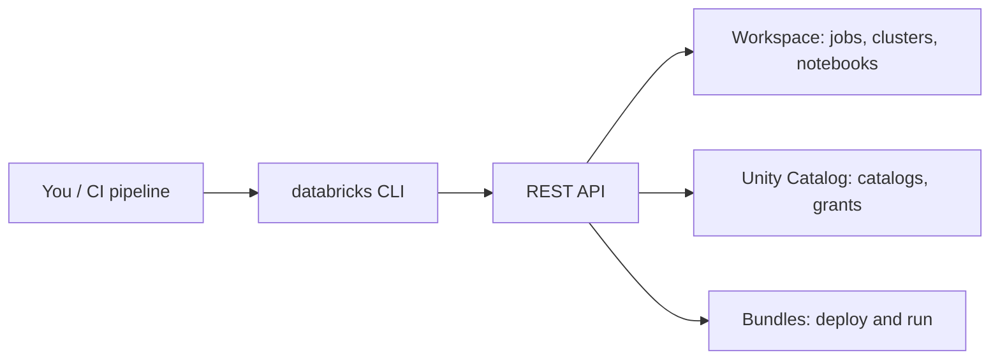
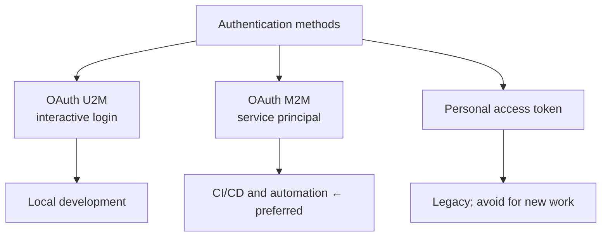

# Databricks CLI

## What It Is

The CLI is the command-line interface to the Databricks REST API. Everything the
UI can do, the CLI can do — and the CLI can be scripted, versioned, and run in
CI.



> **Version note:** the current CLI (v0.2xx+, written in Go) replaced the older
> Python CLI. Commands differ — old guides showing `databricks fs ls` style
> syntax may not match. Check `databricks version`.

---

## Installation

```bash
# macOS / Linux
brew tap databricks/tap && brew install databricks

# Windows
winget install Databricks.DatabricksCLI

# Any platform
curl -fsSL https://raw.githubusercontent.com/databricks/setup-cli/main/install.sh | sh

databricks version
```

---

## Authentication



### Interactive login (local development)

```bash
databricks auth login --host https://adb-1234567890.11.azuredatabricks.net
databricks auth profiles
```

### Service principal (CI/CD)

```bash
export DATABRICKS_HOST="https://adb-1234567890.11.azuredatabricks.net"
export DATABRICKS_CLIENT_ID="$SP_CLIENT_ID"
export DATABRICKS_CLIENT_SECRET="$SP_SECRET"

databricks current-user me
```

### Profiles for multiple workspaces

```ini
# ~/.databrickscfg
[DEFAULT]
host = https://adb-111.11.azuredatabricks.net

[dev]
host = https://adb-111.11.azuredatabricks.net

[prod]
host = https://adb-999.99.azuredatabricks.net
```

```bash
databricks jobs list --profile prod
```

```text
✔ Service principals for anything automated
✔ OAuth over personal access tokens
✘ Never commit a token or secret to Git
✘ Never run production deployments as a named human
```

---

## Everyday Commands

### Workspace

```bash
databricks workspace list /Users/me
databricks workspace import ./notebook.py /Users/me/notebook --format SOURCE
databricks workspace export /Users/me/notebook ./notebook.py --format SOURCE
databricks workspace import-dir ./src /Repos/prod/etl --overwrite
databricks workspace delete /Users/me/old_notebook
```

### Jobs

```bash
databricks jobs list
databricks jobs get 620745
databricks jobs create --json @job.json
databricks jobs reset --json @job.json           # update an existing job
databricks jobs run-now 620745
databricks jobs run-now 620745 --json '{"job_parameters":{"run_date":"2026-09-18"}}'
databricks jobs list-runs --job-id 620745 --limit 10
databricks jobs cancel-run 987654
databricks jobs repair-run --json '{"run_id":987654,"rerun_failed_tasks":true}'
databricks jobs delete 620745
```

### Clusters

```bash
databricks clusters list
databricks clusters get 0918-123456-abc123
databricks clusters create --json @cluster.json
databricks clusters start 0918-123456-abc123
databricks clusters delete 0918-123456-abc123     # terminate
databricks clusters permanent-delete 0918-123456-abc123
databricks cluster-policies list
```

### Unity Catalog

```bash
databricks catalogs list
databricks schemas list main
databricks tables list main gold
databricks grants get catalog main
databricks grants update catalog main --json '{
  "changes":[{"principal":"analysts","add":["USE CATALOG"]}]
}'
databricks external-locations list
databricks volumes list main bronze
```

### Files and Volumes

```bash
databricks fs ls dbfs:/mnt/data
databricks fs cp ./local.csv dbfs:/tmp/local.csv
databricks fs cp -r ./data dbfs:/tmp/data

# Unity Catalog volumes
databricks fs ls dbfs:/Volumes/main/landing/orders
```

### Secrets

```bash
databricks secrets create-scope production
databricks secrets put-secret production db_password --string-value "..."
databricks secrets list-scopes
databricks secrets list-secrets production
databricks secrets delete-secret production db_password
```

```text
Never echo a secret value into a shell history or a CI log.
Prefer --string-value from an environment variable, or Azure Key Vault
backed scopes.
```

### SQL

```bash
databricks warehouses list
databricks warehouses start abc123
databricks warehouses stop abc123
databricks queries list
databricks alerts list
```

### DLT pipelines

```bash
databricks pipelines list-pipelines
databricks pipelines get abc-123-def
databricks pipelines start-update abc-123-def
databricks pipelines start-update abc-123-def --full-refresh
databricks pipelines stop abc-123-def
databricks pipelines list-pipeline-events abc-123-def
```

---

## Bundles (Covered Fully in the Next File)

```bash
databricks bundle init                        # scaffold from a template
databricks bundle validate
databricks bundle deploy --target dev
databricks bundle run my_job
databricks bundle summary
databricks bundle destroy --target dev
```

---

## Output Formatting and Scripting

```bash
# JSON output for scripting
databricks jobs list --output json | jq '.[] | {id: .job_id, name: .settings.name}'

# Find jobs without failure notifications
databricks jobs list --output json \
  | jq '.[] | select(.settings.email_notifications.on_failure == null) | .settings.name'

# Find clusters with autotermination disabled
databricks clusters list --output json \
  | jq '.[] | select(.autotermination_minutes == 0) | {name: .cluster_name, id: .cluster_id}'
```

```bash
# Trigger a job and wait for the result
RUN_ID=$(databricks jobs run-now 620745 --output json | jq -r '.run_id')
databricks jobs get-run $RUN_ID --output json | jq -r '.state.result_state'
```

```text
These one-liners are how platform teams audit a workspace.
Governance checks that would take an afternoon of clicking become a
script that runs nightly.
```

---

## Useful Audit Scripts

```bash
#!/usr/bin/env bash
# Jobs running on all-purpose clusters (a cost anti-pattern)
databricks jobs list --output json \
  | jq -r '.[] | select(.settings.tasks[]?.existing_cluster_id != null)
           | .settings.name'
```

```bash
#!/usr/bin/env bash
# Jobs owned by individuals rather than service principals
databricks jobs list --output json \
  | jq -r '.[] | select(.settings.run_as.service_principal_name == null)
           | "\(.settings.name) -> \(.creator_user_name)"'
```

```bash
#!/usr/bin/env bash
# Export every job definition for backup or migration
mkdir -p job_backups
for id in $(databricks jobs list --output json | jq -r '.[].job_id'); do
  databricks jobs get "$id" --output json > "job_backups/job_${id}.json"
done
```

---

## The Python SDK Alternative

For anything beyond a few commands, the SDK is more maintainable than shell
scripting.

```python
from databricks.sdk import WorkspaceClient

w = WorkspaceClient()          # picks up env vars or the default profile

for job in w.jobs.list():
    if not job.settings.email_notifications:
        print(f"No alerts configured: {job.settings.name}")

run = w.jobs.run_now(job_id=620745, job_parameters={"run_date": "2026-09-18"})
print(run.run_id)

for cluster in w.clusters.list():
    if cluster.autotermination_minutes == 0:
        print(f"No autotermination: {cluster.cluster_name}")
```

```text
CLI  → interactive use, CI steps, quick checks
SDK  → complex automation, custom tooling, anything with logic
Terraform → infrastructure and permissions that must converge to a state
Bundles   → the standard way to deploy jobs and pipelines
```

---

## Common Mistakes

```text
❌ Personal access tokens in CI → use OAuth service principal credentials
❌ Tokens committed to Git or printed in logs
❌ Running production deploys under a personal identity
❌ Using the CLI to create jobs imperatively instead of bundles
❌ Mixing CLI versions — old Python CLI syntax in new documentation
❌ No --profile in scripts, so the wrong workspace gets the change
```

---

## Common Interview Questions

### What is the Databricks CLI used for?

Scripted access to the Databricks REST API: managing workspaces, jobs, clusters,
Unity Catalog, secrets, pipelines, and deploying asset bundles from CI.

### How should CI authenticate to Databricks?

OAuth machine-to-machine credentials for a service principal, supplied as
environment variables — never a personal access token belonging to a human.

### CLI, SDK, Terraform, or Bundles — when do you use each?

```text
CLI       → interactive tasks and simple CI steps
SDK       → automation with logic, custom tooling
Bundles   → deploying jobs, pipelines, and their clusters
Terraform → workspaces, metastores, permissions, cloud infrastructure
```

### How do you manage multiple workspaces from one machine?

Named profiles in `~/.databrickscfg` combined with `--profile`, or environment
variables per shell session.

### How would you audit every job for missing failure alerts?

List jobs with JSON output and filter with `jq`, or iterate with the Python SDK
checking `email_notifications`.

### Why avoid creating jobs imperatively with the CLI?

Imperative creation has no source of truth, no review, and no rollback. Asset
bundles keep the definition in Git and make deployment reproducible.

---

## Quick Revision

```text
Install → databricks version (Go CLI, not the legacy Python one)

Auth:
local  → databricks auth login (OAuth U2M)
CI     → DATABRICKS_HOST + CLIENT_ID + CLIENT_SECRET (service principal)
profiles → ~/.databrickscfg + --profile

Core commands:
workspace import/export | jobs create/run-now/list-runs/repair-run
clusters list/create/start | catalogs/schemas/tables/grants
secrets create-scope/put-secret | pipelines start-update
bundle validate/deploy/run

Scripting: --output json | jq  → workspace audits in a few lines
SDK for anything with real logic

Never: tokens in Git, human identities in production, click-ops
```
